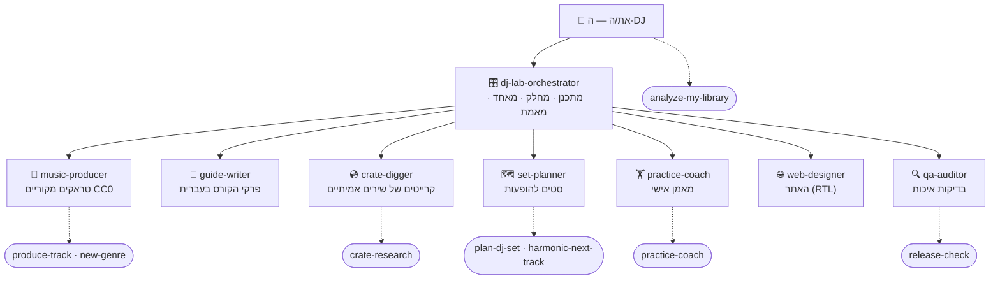

# 🤖 צוות ה-AI של DJ Lab · The DJ Lab agent team

הרפו הזה מנוהל ע"י צוות של סוכני AI עם מנהל אחד (Orchestrator). כשפותחים את Claude Code בתיקייה של הרפו,
הצוות כבר מוכן: פשוט כותבים בעברית מה רוצים, ו-Claude מעביר את המשימה לסוכן המתאים — או מפעיל את המנהל
שמחלק את העבודה בין כמה סוכנים, בודק את התוצאה ומדווח.

This repo is run by a team of Claude Code **subagents** (`.claude/agents/`) and **skills** (`.claude/skills/`)
with one orchestrator on top. Open Claude Code in the repo root and just ask — Claude delegates automatically
based on each agent's `description`, or you can name an agent/skill explicitly.

## מבנה הצוות · Org chart



## הסוכנים · Agents (`.claude/agents/`)

| סוכן | מה הוא עושה | What it owns |
|---|---|---|
| `dj-lab-orchestrator` | מקבל בקשה גדולה, מפרק לתוכנית, מחלק לסוכנים (במקביל כשאפשר), מאחד, מריץ בדיקות ומדווח בעברית. שומר על הכלל: **אין אודיו מוגן בזכויות יוצרים**. | plans, `music/SCHEMA.md` changes, integration |
| `music-producer` | כותב "מתכונים" לז'אנרים במנוע הסינתזה, מרנדר טראקים מקוריים ובודק BPM/Key/LUFS/מבנה. | `engine/djlab/genres/*.py`, plan entries, `music/tracks/` |
| `guide-writer` | כותב ומשפר את פרקי הקורס בעברית (Rekordbox, ביטמאצ'ינג, EQ, הרמוניה, בניית סט) עם תרגילים. | `guide/` |
| `crate-digger` | חוקר שירים אמיתיים (קלאסיקות + חדשים) עם BPM ו-Key מאומתים — מטא-דאטה וקישורי קנייה חוקיים בלבד. | `crates/` |
| `set-planner` | בונה סט להופעה ספציפית (חתונה, בר, מועדון…) עם עקומת אנרגיה ומעבר מומלץ לכל זוג. | `sets/` |
| `practice-coach` | מאמן אישי: תרגיל יומי, יומן התקדמות, סיכום שבועי. | `progress/` |
| `web-designer` | האתר הסטטי בעברית (RTL) ב-GitHub Pages: נגן, קרייטים, סטים, המדריך. | `docs/`, `tools/build_site.py` |
| `qa-auditor` | בודק בלתי תלוי (קריאה בלבד): טסטים, איכות אודיו, סכמה, האתר ב-Playwright, הגהה בעברית, קישורים. | — (reports only) |

## הסקילים · Skills (`.claude/skills/`, הפעלה עם `/<name>` או אוטומטית)

| סקיל | מה קורה | Helper |
|---|---|---|
| `/produce-track` | טראק מקורי חדש מקצה לקצה: רשומה בתוכנית → מתכון → רינדור → בדיקה → קטלוג/XML/אתר | `scripts/plan_helper.py` |
| `/new-genre` | ז'אנר חדש למנוע לפי ה-cookbook ב-`engine/djlab/genres/README.md` + טראק ראשון | — |
| `/plan-dj-set` | שואל משך/קהל/מקום/ז'אנרים → קובץ סט ב-`sets/` עם סדר, BPM/Key/אנרגיה וטכניקת מעבר | `tools/set_planner.py` |
| `/analyze-my-library` | מנתח תיקייה של שירים **שקנית** → CSV עם BPM/Key/Camelot/LUFS/אורך + המלצות | `tools/analyze_library.py` |
| `/harmonic-next-track` | "מה לנגן אחרי…?" — הצעות מהקטלוג, מהקרייטים ומהספרייה שלך | `scripts/next_track.py` |
| `/practice-coach` | התרגיל של היום + רישום אימון + סטטיסטיקה | `scripts/coach.py` |
| `/crate-research` | מחקר קרייט חדש/הרחבה עם אימות BPM/Key | `scripts/validate_crate.py` |
| `/release-check` | כל הבדיקות: pytest, אודיו, קרייטים, קטלוג, Rekordbox XML, אתר + Playwright | `scripts/release_check.sh`, `scripts/site_smoke.cjs` |

## דוגמאות למה אפשר לכתוב · Example prompts

```text
תכין לי סט של שעה לחתונה — קהל מעורב, הרבה ים תיכוני ולהיטים, לסיים בהאוס
תנתח לי את התיקייה של השירים שקניתי: ~/Music/DJ
תוסיף 5 טראקים של אפרו האוס
מה התרגיל של היום? יש לי 20 דקות
סיימתי חצי שעה של Bass Swap, הלך בינוני — תרשום
מה לנגן אחרי Groove Machine? אני רוצה להרים אנרגיה
תמצא לי 20 טראקים של מלודיק טכנו מהשנתיים האחרונות עם BPM ו-Key
תוסיף ז'אנר חדש: Organic House
תכתוב פרק על Hot Cues ו-Memory Cues ב-Rekordbox
תבדוק שהכל עובד לפני שאני מעלה לגיטהאב
```

English works too: *"plan a 90-minute melodic techno rooftop set"*, *"what's my drill today?"*.

## איך זה עובד · How to use

- **אוטומטי:** כותבים בקשה רגילה — Claude בוחר סוכן/סקיל לפי התיאור שלהם.
- **במפורש:** `/plan-dj-set 60 חתונה`, `/analyze-my-library ~/Music/DJ`, או "תשתמש ב-set-planner …".
- **המנהל כסשן הראשי:** `claude --agent dj-lab-orchestrator` — כל הסשן מתנהל כמנהל הצוות.
- **כלים בלי AI** (עובדים גם לבד):
  ```bash
  python tools/set_planner.py --minutes 60 --start-energy 4 --peak-energy 9 --genres house,tech_house,afro_house --include-crates --out sets/my-set.md
  python tools/analyze_library.py ~/Music/DJ --jobs 4 --sample 60      # -> library/my_library.csv
  python tools/camelot.py 8A 124                                      # what mixes with 8A @ 124?
  python .claude/skills/practice-coach/scripts/coach.py today --minutes 20
  bash .claude/skills/release-check/scripts/release_check.sh
  ```
- **בענן (Claude Code on the web):** hook של `SessionStart` (`.claude/hooks/session-start.sh`) מתקין את
  `engine/requirements.txt` אוטומטית — מהר, אידמפוטנטי, ולא עוצר את הסשן אם נכשל. ב-`.claude/settings.json`
  יש רשימת פקודות בטוחות שרצות בלי לשאול (render, pytest, הכלים ב-`tools/`, ffmpeg, git status/diff/log),
  והורדות מיוטיוב/ספוטיפיי (`yt-dlp`, `spotdl`) תמיד מבקשות אישור.

## כללי הברזל · Ground rules every agent follows

1. **אין אודיו מוגן בזכויות יוצרים** — רק אודיו שהמנוע `engine/djlab` יצר (מקורי, CC0). הקרייטים = מטא-דאטה
   וקישורים חוקיים בלבד. הספרייה שלך נשארת אצלך — רק CSV של מספרים נכתב לרפו.
2. `music/SCHEMA.md` הוא החוזה בין המנוע, הכלים, האתר והסוכנים. רק המנהל משנה אותו.
3. רינדורים דטרמיניסטיים: משנים מתכון/seed ומרנדרים מחדש — לא עורכים קבצים שנוצרו.
4. כל מה שהמשתמש קורא — בעברית (מונחי DJ באנגלית). קוד והנחיות לסוכנים — באנגלית.
5. לא אומרים "גמרנו" בלי `release-check` / `qa-auditor`.
