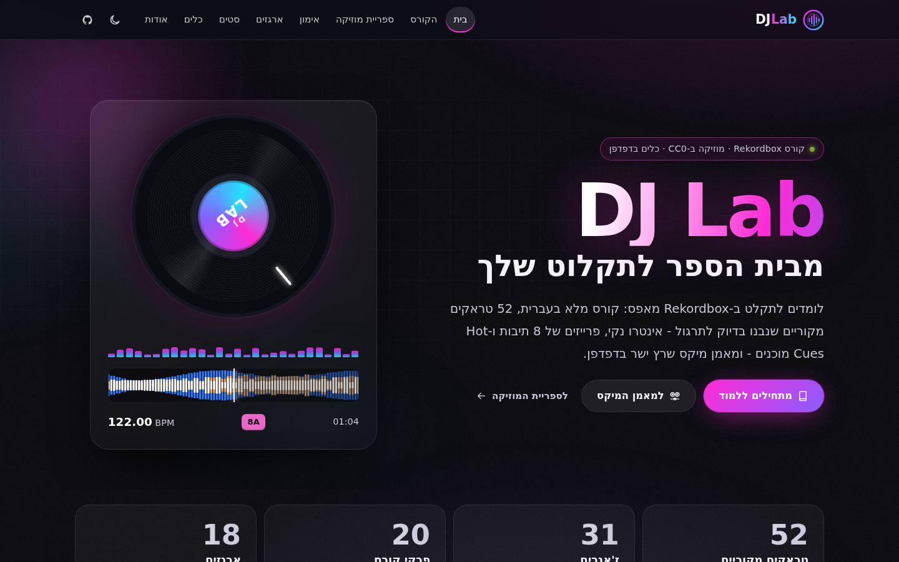
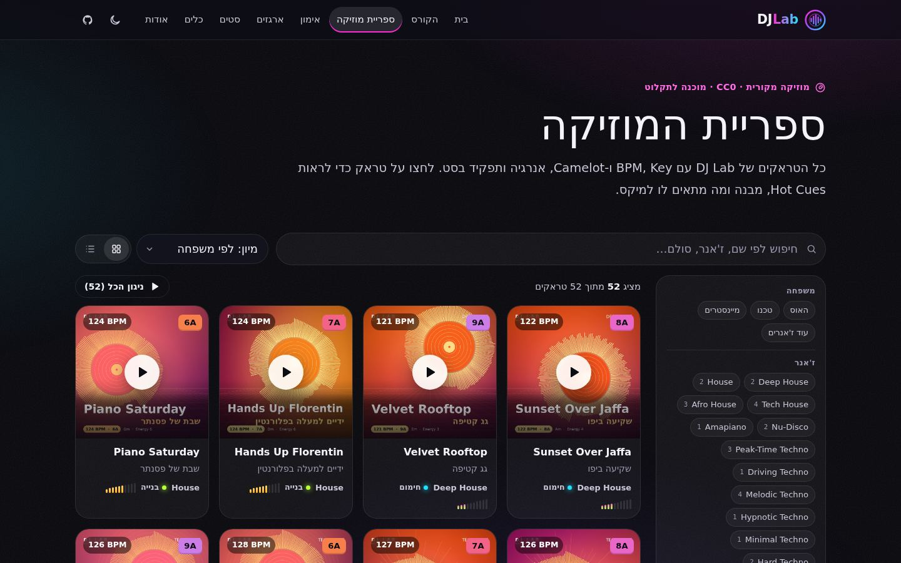
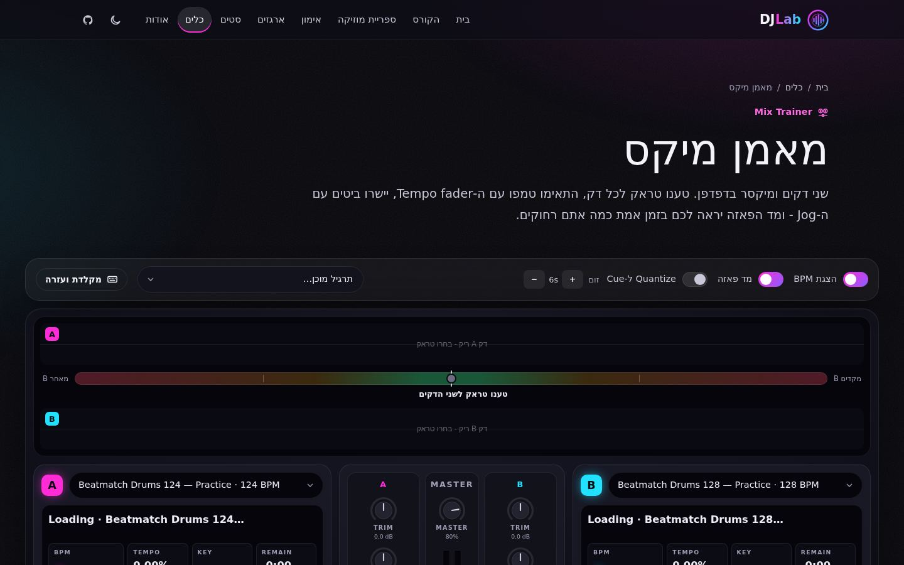
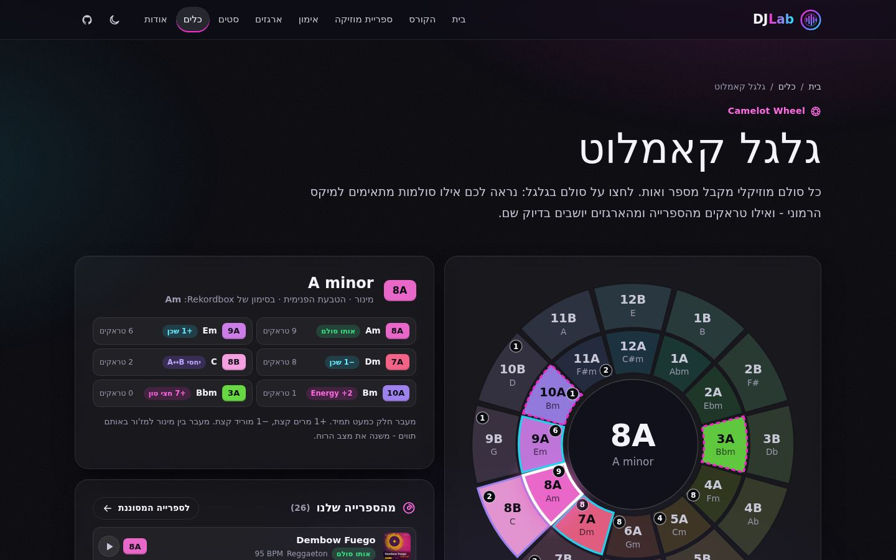

<div dir="rtl">

# 🎧 DJ Lab — בית הספר שלך לתקלוט

**קורס תקלוט מלא בעברית ל-Rekordbox, עם 52 טראקים מקוריים שמוכנים לתקלוט, תרגולים, דמואים של מעברים, 725 שירים אמיתיים מסודרים בארגזים, ואתר אינטראקטיבי עם מאמן מיקס בדפדפן.**

### 👉 [פתחו את האתר: lidorbashari.github.io/try](https://lidorbashari.github.io/try/)



| 🎵 טראקים מקוריים | 🎚️ דמואי מעברים | 🏋️ קבצי תרגול | 📖 פרקי קורס | 📦 שירים אמיתיים בארגזים | 🗂️ סטים לדוגמה |
|:-:|:-:|:-:|:-:|:-:|:-:|
| **52** (217 דקות, 24 סגנונות) | **10** | **15** | **22** | **725** ב-18 ארגזים | **8** |

---

## 🚀 מתחילים כאן — 3 צעדים

1. **קוראים את [פרק 00 — ברוכים הבאים](guide/00-intro.md)**, או את אותו פרק [באתר](https://lidorbashari.github.io/try/docs/guide/00-intro.html). הוא מסביר איך להשתמש בכל הרפו.
2. **מורידים את המוזיקה:** כפתור `Code` ← `Download ZIP` למעלה, או `git clone`. כדאי לחלץ את הקבצים ל-`C:\DJ-Lab` (ב-Windows) או ל-`/Users/Shared/DJ-Lab` (ב-Mac).
3. **מייבאים ל-Rekordbox** את [`music/rekordbox/rekordbox-windows.xml`](music/rekordbox/) או את `rekordbox-mac.xml`. כל הטראקים נכנסים עם Beatgrid מדויק, Hot Cues צבעוניים ופלייליסטים מסודרים. חילצתם לתיקייה אחרת? [כלי ה-XML באתר](https://lidorbashari.github.io/try/docs/tools/rekordbox.html) מייצר קובץ לנתיב שלכם. ההוראות המלאות ב[פרק 2](guide/02-rekordbox-basics.md).

אחר כך עוקבים אחרי [תוכנית האימון של 30 יום](guide/19-30-day-plan.md).

---

## 🎵 ספריית המוזיקה — 52 טראקים מקוריים

כל הטראקים הופקו מאפס ע"י מנוע הסינתזה שברפו, בלי שום סמפל של שיר קיים. מותר לנגן אותם בהופעות ולהעלות מיקסים בלי בעיות זכויות יוצרים (CC0).

כל טראק בנוי לתקלוט:
- בטראקי הקלאב: אינטרו ואאוטרו של 16–32 תיבות תופים נקיים (בהיפ-הופ, רגאטון ולו-פיי: 8–16)
- פרייזים של 8 תיבות
- הביט הראשון בדיוק בשנייה 0
- BPM וסולם (כולל Camelot) מסומנים בתגיות
- עטיפה מעוצבת
- Hot Cues מוכנים: A אינטרו · B כניסת באס · C ברייקדאון · D דרופ · G אאוטרו



| משפחה | סגנונות (BPM) | טראקים |
|---|---|:-:|
| 🏠 [האוס](music/tracks/) | Deep House (121–122) · House (124) · Tech House (126–128) · Afro House (120–122) · Nu-Disco (116–118) · Amapiano (113) | 14 |
| ⚙️ [טכנו](music/tracks/) | Peak-Time / Driving (129–132) · Melodic Techno (122–124) · Hypnotic / Minimal (127–128) · Hard Techno (148–150) | 12 |
| 🎤 [מיינסטרים וים-תיכוני](music/tracks/) | Big Room/EDM (128) · Pop Dance (122–124) · Hip-Hop/Trap (92–95, 140) · Reggaeton (92–95) · Moombahton (108) · Afrobeats (104–106) · **ים-תיכוני** (100–104 + Mediterranean House 124–125) | 16 |
| 🌍 עוד סגנונות | Psytrance (138–142) · Trance (134–138) · Drum & Bass (172–174) · Dubstep (140) · UK Garage (132) · Breaks (130) · Lo-Fi (84) | 10 |

- **[🏋️ קבצי תרגול](music/practice/):** ספירת פרייזים, תופים לביטמאצ'ינג ב-120/124/128/132, טמפו "עקום" (125.5, 122.7) לאימון אוזן, זוג קבצים ל-Bass Swap, זוגות סולמות תואמים ומתנגשים, ציד Hot Cues, אימון אוזן ל-EQ, וגשר טמפו מ-100 ל-124.
- **[🎚️ דמואי מעברים](music/transitions/):** בלנד, Bass Swap, פילטר, Echo Out, קאט, לופ רול, קפיצת אנרגיה הרמונית, מעבר טמפו 95→124, החלפת דרופים, כניסה בברייקדאון. ליד כל דמו יש קובץ JSON עם השלבים המדויקים בשניות ובתיבות.

---

## 📖 הקורס — 20 פרקים ועוד 2 נספחים בעברית

| | | |
|---|---|---|
| [00 ברוכים הבאים](guide/00-intro.md) | [07 Hot Cues, לופים ו-Beat Jump](guide/07-hot-cues-loops.md) | [14 אירועים וחתונות](guide/14-events-weddings.md) |
| [01 ציוד לפי תקציב](guide/01-equipment.md) | [08 אוזניות וקיואינג](guide/08-headphones-cueing.md) | [15 מעברי טמפו וז'אנר](guide/15-tempo-genre-switching.md) |
| [02 יסודות Rekordbox](guide/02-rekordbox-basics.md) | [09 הכנת ספרייה](guide/09-library-prep.md) | [16 הקלטה ושיתוף](guide/16-recording-sharing.md) |
| [03 ביט, תיבה ופרייז](guide/03-music-structure.md) | [10 מיקס הרמוני](guide/10-harmonic-mixing.md) | [17 בריאות האוזניים והופעה](guide/17-ear-health-performance.md) |
| [04 BPM וביטמאצ'ינג](guide/04-bpm-beatmatching.md) | [11 אפקטים](guide/11-effects.md) | [18 קריירה והופעות](guide/18-career-gigs.md) |
| [05 Gain, EQ ופילטר](guide/05-mixer-gain-eq.md) | [12 בניית סט](guide/12-set-building.md) | [19 תוכנית 30 יום](guide/19-30-day-plan.md) |
| [06 המעברים הראשונים](guide/06-first-transitions.md) | [13 תנ"ך הסגנונות](guide/13-genre-bible.md) | [מילון מונחים](guide/glossary.md) · [שאלות נפוצות](guide/faq.md) |

כל פרק כולל הסברים צעד-אחר-צעד, דיאגרמות, טיפים ספציפיים ל-Rekordbox, ותרגילים על הקבצים שברפו.

---

## 🛠️ כלים באתר

| כלי | מה הוא עושה |
|---|---|
| [🎛️ מאמן מיקס](https://lidorbashari.github.io/try/docs/tools/mix-trainer.html) | שני דקים בדפדפן עם Tempo Fader, Pitch Bend, EQ של 3 ערוצים, פילטר, קרוספיידר, ומד פאזה שמראה כמה הביטים רחוקים זה מזה |
| [🎡 גלגל Camelot](https://lidorbashari.github.io/try/docs/tools/camelot.html) | לוחצים על סולם ורואים אילו סולמות מתאימים לו, ואילו טראקים וארגזים יושבים בכל סולם |
| [🥁 BPM Tapper](https://lidorbashari.github.io/try/docs/tools/bpm.html) | מקישים לקצב ומקבלים BPM, ויש גם מחשבון אחוזי פיץ' |
| [🧱 בונה סטים](https://lidorbashari.github.io/try/docs/tools/set-builder.html) | בונים סט, מקבלים בדיקת תאימות לכל מעבר ועקומת אנרגיה, ומייצאים ל-M3U |
| [💿 מחולל XML ל-Rekordbox](https://lidorbashari.github.io/try/docs/tools/rekordbox.html) | קובץ ייבוא מוכן לנתיב שבו שמרתם את המוזיקה במחשב שלכם |

<p>


</p>

---

## 📦 ארגזים: 725 שירים אמיתיים לקנייה חוקית

רשימות של שירים מסחריים (מטא-דאטה וקישורים בלבד, בלי קבצי שמע). לכל שיר רשומים BPM, סולם, Camelot, רמת אנרגיה ותפקיד בסט. ל-604 מהם ה-BPM והסולם אומתו מול מקור.

[להיטי מסיבות ישראליים](crates/israeli-party.md) · [ים-תיכוני ומזרחי](crates/mediterranean.md) · [חתונה ישראלית](crates/wedding-essentials.md) · [טק-האוס](crates/tech-house.md) · [האוס](crates/house.md) · [דיפ-האוס](crates/deep-house.md) · [אפרו-האוס ואמפיאנו](crates/afro-house.md) · [מלודיק טכנו](crates/melodic-techno.md) · [טכנו](crates/techno.md) · [EDM ופסטיבלים](crates/edm-festival.md) · [פופ-דאנס](crates/pop-dance.md) · [היפ-הופ ו-R&B](crates/hip-hop-rnb.md) · [לטיני ורגאטון](crates/latin-reggaeton.md) · [אפרוביטס](crates/afrobeats.md) · [ת'רובקים](crates/throwbacks.md) · [סאי-טראנס](crates/psytrance.md) · [טראנס](crates/trance.md) · [מוזיקת בס](crates/bass-music.md)

## 🗂️ סטים לדוגמה

[הסט הראשון שלי, 30 דק'](sets/08-first-practice-set-30.md) · [וורם-אפ האוס](sets/01-house-warmup-60.md) · [שיא טק-האוס](sets/02-tech-house-peak-60.md) · [מסע מלודיק טכנו](sets/03-melodic-techno-journey-75.md) · [שיא טכנו](sets/04-techno-peak-60.md) · [חתונה ישראלית, 120 דק'](sets/05-israeli-wedding-120.md) · [מסיבה ים-תיכונית](sets/06-mediterranean-party-60.md) · [ערב בר Open Format](sets/07-hiphop-reggaeton-bar-60.md)

---

## 🤖 צוות הסוכנים

הרפו בנוי לעבודה עם Claude Code: יש בו 8 סוכנים ו-8 סקילים שממשיכים לבנות אותו בשבילכם. פותחים את Claude Code בתיקייה וכותבים בעברית, למשל:

> "תכין לי סט של שעה לחתונה" · "מה התרגיל של היום?" · "תנתח לי את התיקייה של השירים שקניתי" · "תוסיף 5 טראקים של אפרו האוס" · "מה לנגן אחרי Groove Machine?"

הפירוט המלא ב-[AGENTS.md](AGENTS.md).

## 🧪 למפתחים

```bash
pip install -r engine/requirements.txt
cd engine && python -m djlab render --id house-05            # רינדור טראק מהתוכנית
python -m djlab.practice --all && python -m djlab.djmix --all  # תרגולים ודמואים
python tools/verify_audio.py music/tracks music/practice music/transitions
python tools/build_catalog.py && python tools/build_rekordbox_xml.py && python tools/build_site.py
python tools/analyze_library.py ~/Music/MyDJ                 # BPM, סולם ו-Camelot לספרייה שלכם
```
מבנה הרפו וכללי העבודה מתוארים ב-[CLAUDE.md](CLAUDE.md). חוזה הנתונים (מטא-דאטה, Cues, ארגזים) נמצא ב-[music/SCHEMA.md](music/SCHEMA.md).

## 📜 רישוי

- **מוזיקה מקורית:** [CC0 1.0](music/LICENSE.md). חופשי לכל שימוש, כולל הופעות והעלאת מיקסים.
- **קוד:** [MIT](LICENSE).
- **ארגזים:** מכילים מטא-דאטה בלבד. את השירים עצמם קונים או מזרימים ממקורות חוקיים.

</div>
