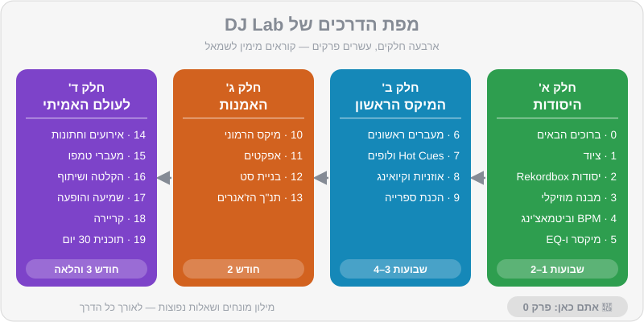

# ברוכים הבאים ל-DJ Lab 🎧

התחלתם קורס DJ, יש לכם Rekordbox על המחשב, ואולי כבר קונטרולר על השולחן. עכשיו מגיע החלק הכי כיפי — וגם הכי מבלבל: כפתורים, מספרים, מונחים באנגלית, ותחושה שכולם סביבכם כבר "מבינים". המדריך הזה נכתב בדיוק בשביל הרגע הזה. הוא לא מחליף את המורה שלכם בקורס — הוא החבר שיושב לידכם בבית, בין שיעור לשיעור, ומסביר שוב, לאט, עם תרגילים אמיתיים ומוזיקה שאתם יכולים להשתמש בה בלי לשלם שקל.

> 💡 טיפ: אל תקראו את המדריך כמו ספר. קראו פרק, תרגלו אותו כמה ימים, ורק אז תמשיכו. מיקס לומדים בידיים ובאוזניים, לא בעיניים.

## מה תלמדו בפרק

- מה DJ עושה באמת (רמז: הרבה יותר מללחוץ Play)
- איך המדריך בנוי ובאיזה סדר כדאי ללמוד
- מה יש ברפו של DJ Lab: טראקים מקוריים, קבצי תרגול, דמואים של מעברים, אתר וקרייטים
- איך לתרגל נכון — כמה זמן, באיזו תדירות ואיך למדוד התקדמות
- המוסכמות של המדריך: סימני הקופסאות, ספירת התיבות והמונחים

## מה בעצם עושה DJ?

מבחוץ זה נראה פשוט: מישהו עומד מאחורי עמדה, מזיז כמה כפתורים, והקהל רוקד. מבפנים, DJ עושה ארבעה דברים בבת אחת:

1. **בוחר מוזיקה (Selection).** זו המיומנות החשובה ביותר, והיא לא קשורה לציוד בכלל. השיר הנכון ברגע הנכון שווה יותר מכל מעבר טכני מושלם.
2. **מחבר בין שירים (Mixing).** מעבר חלק, בלי "חור" ובלי בלגן קצבי, שמשאיר את הרחבה בתנועה. כאן נכנסים Beatmatching, ספירת פרייזים, EQ ואפקטים.
3. **מנהל אנרגיה (Energy Management).** סט טוב הוא סיפור: התחלה רגועה, בנייה, שיא, נשימה, שיא נוסף, סיום. DJ שמנגן רק "בנגרים" מעייף את הקהל תוך חצי שעה.
4. **קורא את הקהל (Reading the Room).** מי על הרחבה? הם רוקדים או רק מנענעים את הראש? הבר מלא? אנשים מצלמים? DJ טוב מגיב למה שקורה מולו ולא מנגן פלייליסט מוכן מראש.

> ⚠️ זהירות: המיתוס הכי נפוץ הוא ש"היום יש Sync אז לא צריך כישרון". ה-Sync פותר בעיה אחת קטנה (התאמת מהירות), ולא פותר אף אחת מארבע הבעיות שלמעלה. נלמד להשתמש בו בחוכמה בפרק 4.

הסגנונות שאתם אוהבים — האוס, טק-האוס, אפרו-האוס, טכנו ומלודיק טכנו, וגם מיינסטרים, היפ-הופ ומוזיקה ים-תיכונית לאירועים — דורשים קצת כישורים שונים. ברחבת טכנו המעברים ארוכים ועדינים ונמשכים דקה ויותר; בחתונה ישראלית מעבר טוב יכול להיות "קאט" חד של שנייה אחת בדיוק בזמן. המדריך מכסה את שני העולמות.

## איך המדריך בנוי

המדריך מחולק לעשרים פרקים בארבעה חלקים, ועוד מילון מונחים ושאלות נפוצות. כל פרק בנוי באותה צורה: פתיח קצר, "מה תלמדו", תוכן מפורט עם תרשימים, תרגילים מעשיים עם קבצים מהרפו, וסיכום.



### חלק א' — היסודות (פרקים 0–5)

| פרק | נושא | למה זה חשוב |
|---|---|---|
| [0](00-intro.md) | ברוכים הבאים | אתם כאן |
| [1](01-equipment.md) | ציוד לפי תקציב | מה לקנות, ומה לא צריך עדיין |
| [2](02-rekordbox-basics.md) | יסודות Rekordbox | התוכנה שתלווה אתכם בכל סט |
| [3](03-music-structure.md) | מבנה מוזיקלי | ביט, תיבה, פרייז — השפה של DJ |
| [4](04-bpm-beatmatching.md) | BPM וביטמאצ'ינג | המיומנות הטכנית הבסיסית |
| [5](05-mixer-gain-eq.md) | מיקסר, Gain ו-EQ | איך שני שירים לא הופכים לבוץ |

### חלק ב' — המיקס הראשון (פרקים 6–9)

| פרק | נושא | למה זה חשוב |
|---|---|---|
| [6](06-first-transitions.md) | המעברים הראשונים | שישה מתכונים עם ספירת תיבות מדויקת |
| [7](07-hot-cues-loops.md) | Hot Cues ולופים | הכנה מוקדמת = שקט בזמן אמת |
| [8](08-headphones-cueing.md) | אוזניות וקיואינג | לשמוע את השיר הבא לפני כולם |
| [9](09-library-prep.md) | הכנת ספרייה | הסוד של DJs מקצועיים |

### חלק ג' — האמנות (פרקים 10–13)

| פרק | נושא |
|---|---|
| [10](10-harmonic-mixing.md) | מיקס הרמוני וגלגל Camelot |
| [11](11-effects.md) | אפקטים |
| [12](12-set-building.md) | בניית סט |
| [13](13-genre-bible.md) | תנ"ך הז'אנרים |

### חלק ד' — לעולם האמיתי (פרקים 14–19)

| פרק | נושא |
|---|---|
| [14](14-events-weddings.md) | אירועים וחתונות |
| [15](15-tempo-genre-switching.md) | מעברי טמפו וז'אנר |
| [16](16-recording-sharing.md) | הקלטה ושיתוף |
| [17](17-ear-health-performance.md) | בריאות האוזניים והופעה |
| [18](18-career-gigs.md) | קריירה והופעות |
| [19](19-30-day-plan.md) | תוכנית 30 יום |

ולצד כל אלה: [מילון מונחים](glossary.md) ו[שאלות נפוצות](faq.md). נתקלתם במילה לא מוכרת? כנראה שהיא מחכה לכם במילון.

> 💡 טיפ: אם אתם באמצע קורס, התאימו את קצב הקריאה לשיעורים. למדתם בשיעור על EQ? קראו את פרק 5 באותו ערב ועשו את התרגילים — זה יקבע את החומר.

## מה יש ברפו — ואיך להשתמש בו

הרפו של DJ Lab הוא לא רק מדריך. זו מעבדה שלמה, וכל מה שבה נועד לעבוד ביחד.

| תיקייה | מה יש בה | איך תשתמשו בזה |
|---|---|---|
| `guide/` | המדריך שאתם קוראים | פרק אחרי פרק |
| `music/tracks/` | כ-52 טראקים מקוריים ב-24 סגנונות | לתרגל מעברים, להקליט סטים, להעלות לרשת |
| `music/practice/` | 15 קבצי תרגול ייעודיים | תרגילי ספירה, ביטמאצ'ינג, EQ ו-Hot Cues |
| `music/transitions/` | 10 דמואים של מעברים | לשמוע איך מעבר "אמור" להישמע, ואז לשחזר |
| `music/rekordbox/` | קבצי `rekordbox-windows.xml` / `rekordbox-mac.xml` | ייבוא כל הספרייה ל-Rekordbox עם Cues מוכנים |
| `crates/` | רשימות של טראקים אמיתיים (מסחריים) עם BPM וסולם | רעיונות לקנייה חוקית ובניית ספרייה |
| `sets/` | סטים לדוגמה עם הערות מעבר | לראות איך בונים סט שלם |
| `docs/` | האתר של DJ Lab | נגן, קטלוג וכלים בדפדפן |

### הטראקים של DJ Lab

כל טראק ברפו נוצר במיוחד עבור DJ Lab, והוא ברישיון `CC0` — כלומר, שלכם לחלוטין. מותר לנגן אותם, להקליט איתם סטים, להעלות מיקסים ליוטיוב או לסאונדקלאוד, ואף אחד לא יחסום אתכם על זכויות יוצרים.

הם גם בנויים כמו "טראקים של DJ" מקצועיים, וזה היתרון הגדול שלהם ללמידה:

- **הקצב קבוע לחלוטין** והביט הראשון מתחיל בדיוק בשנייה 0.0 — ה-Beatgrid תמיד מושלם.
- **אינטרו ואאוטרו נקיים** של 16–32 תיבות, בדרך כלל רק תופים — מושלם למעברים.
- **כל שינוי מוזיקלי קורה על גבול של 8 תיבות** — אידיאלי ללמוד לספור.
- **לכל טראק יש קובץ `.json`** עם כל הנתונים: BPM, סולם (Key) ומספר Camelot, אנרגיה (1–10), חלוקה לקטעים (`sections`) ומיקומי Hot Cues.

לדוגמה, הטראק `house-05` ("מכונת גרוב", טק-האוס, 126 BPM, סולם 8A) נמצא כאן:

```
music/tracks/tech_house/house-05-groove-machine.mp3   ← הקובץ לנגינה
music/tracks/tech_house/house-05-groove-machine.json  ← כל הנתונים
music/tracks/tech_house/house-05-groove-machine.jpg   ← העטיפה
```

> 🎚️ ב-Rekordbox: את כל הטראקים אפשר לייבא בבת אחת, כולל Hot Cues צבעוניים בשמונה הסלוטים A–H, דרך קובץ ה-XML של DJ Lab. ההוראות המלאות בפרק 2.

### מוסכמת ה-Hot Cues של DJ Lab

בכל טראק של DJ Lab, ה-Hot Cues מסומנים לפי אותה שיטה, כך שאחרי שבוע כבר תדעו בעיניים עצומות מה יש מאחורי כל כפתור:

| סלוט | שם | צבע | איפה |
|---|---|---|---|
| A | Intro | ירוק | הביט הראשון |
| B | Mix-In / Groove | תכלת | כשהבאס או הגרוב המלא נכנסים |
| C | Breakdown | כתום | הברייקדאון הראשון |
| D | Drop | אדום | הדרופ הראשון |
| E | Breakdown 2 | צהוב | ברייקדאון שני (אם יש) |
| F | Drop 2 | ורוד | דרופ שני (אם יש) |
| G | Outro | כחול | תחילת האאוטרו |
| H | Last 16 | סגול | 16 תיבות לפני הסוף |

נעמיק בזה בפרק 7, ונמליץ לאמץ את אותה שיטה גם לטראקים שתקנו בעצמכם.

## איך לתרגל נכון

הנה האמת שאף אחד לא אוהב לשמוע: **20 דקות כל יום שוות יותר משלוש שעות פעם בשבוע.** המוח והידיים לומדים מחזרה מרווחת, לא ממרתון.

תוכנית מומלצת לכל מפגש תרגול של 30 דקות:

1. **5 דקות חימום** — ספירת תיבות עם קובץ התרגול `practice-01`, או ביטמאצ'ינג מהיר אחד.
2. **15 דקות נושא היום** — התרגילים של הפרק שאתם קוראים.
3. **10 דקות "סתם לנגן"** — לבחור כמה טראקים שאתם אוהבים ולערבב בלי לחץ. זה החלק שמזכיר לכם למה התחלתם.

> 🎧 תרגיל: פתחו מחברת (או קובץ פתקים בטלפון) וקראו לה "יומן DJ". אחרי כל תרגול כתבו שורה אחת: מה תרגלתם, מה הצליח, מה לא. בעוד חודש תקראו את השורות הראשונות ותופתעו כמה התקדמתם.

ועוד שלושה הרגלים שעושים הבדל עצום:

- **הקליטו את עצמכם.** כבר מהשבוע הראשון. ב-Rekordbox יש כפתור הקלטה, ושמיעה חוזרת של מיקס חושפת דברים שלא שומעים בזמן אמת (פרק 16).
- **הקשיבו לסטים של אחרים באופן פעיל.** כשאתם שומעים מעבר יפה בסט ביוטיוב, נסו לזהות: כמה זמן הוא נמשך? מתי הבאס התחלף?
- **תרגלו גם בלי ציוד.** ספירת תיבות אפשר לעשות באוטובוס, עם כל שיר ברדיו.

## המוסכמות של המדריך

כדי שיהיה קל לסרוק את הפרקים, השתמשנו בארבעה סוגי קופסאות:

> 💡 טיפ: עצה מעשית שתחסוך לכם זמן או תסכול.

> ⚠️ זהירות: טעות נפוצה, או משהו שיכול להזיק לציוד, לאוזניים או לסט.

> 🎧 תרגיל: משהו לעשות עכשיו, עם הציוד והקבצים.

> 🎚️ ב-Rekordbox: איך עושים את זה בתוכנה עצמה.

ועוד כמה כללים:

- **מונחים מקצועיים נשארים באנגלית** — Beatmatching, Hot Cue, Tempo Fader — כי ככה תשמעו אותם בקורס, בפורומים ובמועדון. בפעם הראשונה שמונח מופיע נסביר אותו, והכול מרוכז ב[מילון](glossary.md).
- **ספירת תיבות מתחילה מ-1.** "תיבה 17" בטקסט היא התיבה ה-17 של השיר. בקבצי ה-JSON הספירה מתחילה מ-0 (כמו אצל מתכנתים), ולכן `"bar": 16` ב-JSON היא תיבה 17 אצלנו.
- **מחירים מוערכים** בשקלים, נכון ל-2026, ומשתנים מחנות לחנות.
- **הממשק משתנה:** Rekordbox מתעדכן כל כמה חודשים. כתבנו את המדריך על בסיס גרסה 7.2.x. אם תפריט נראה אחרת אצלכם — העיקרון נשאר זהה, ובדרך כלל מספיק לחפש את שם האפשרות בהגדרות.

## מה צריך כדי להתחיל — היום

- מחשב (Windows או Mac) עם Rekordbox מותקן — פרק 2.
- אוזניות כלשהן לשלב הראשון (אוזניות DJ מומלצות — פרק 1).
- את הרפו הזה על המחשב, או לפחות את תיקיית `music/`.
- סקרנות וסבלנות. הפעם הראשונה שבה שני תופים "יינעלו" אחד על השני באוזניים שלכם היא רגע קסום — והוא יגיע מהר יותר ממה שנדמה לכם.

## תרגילים

> 🎧 תרגיל 1 — היכרות עם המוזיקה: האזינו מההתחלה ועד הסוף לשלושה טראקים מהסגנונות שאתם הכי אוהבים. למשל `music/tracks/afro_house/house-09-desert-drums.mp3`, `music/tracks/melodic_techno/techno-07-event-horizon.mp3` ו-`music/tracks/mediterranean/mainstream-16-oud-club.mp3`. שימו לב: מתי נכנס הבאס? מתי יש "נשימה" (ברייקדאון)? אל תנסו עדיין לספור — רק להרגיש.

> 🎧 תרגיל 2 — לקרוא קובץ JSON: פתחו את `music/tracks/tech_house/house-05-groove-machine.json` בכל עורך טקסט (או באתר של DJ Lab). מצאו את השדות `bpm`, `camelot`, `energy` ו-`sections`. כמה קטעים יש בטראק? באיזו שנייה מתחיל הברייקדאון?

> 🎧 תרגיל 3 — רשימת השראה: כתבו ביומן ה-DJ חמישה DJs או סטים שאתם אוהבים, ולצד כל אחד משפט: מה אתם אוהבים בו? הבחירה? האנרגיה? המעברים? חזרו לרשימה הזו בסוף פרק 12.

## סיכום

- תפקיד ה-DJ הוא קודם כול לבחור מוזיקה ולנהל אנרגיה; הטכניקה משרתת את זה.
- המדריך בנוי בארבעה חלקים — יסודות, מיקס ראשון, אמנות ועולם אמיתי — ומתאים לקצב של קורס.
- הרפו כולל טראקים מקוריים ברישיון `CC0` עם נתונים מלאים, קבצי תרגול ודמואים של מעברים.
- תרגול יומי קצר עדיף על מרתון שבועי. הקליטו את עצמכם וכתבו יומן.

## בפרק הבא

לפני שמנגנים, צריך לדעת על מה. נעבור על כל סוגי הציוד — מקונטרולר ראשון ועד עמדת מועדון — עם מחירים מוערכים בשקלים והמלצה ברורה מה לקנות קודם.

👉 [פרק 1 — ציוד לפי תקציב](01-equipment.md)
