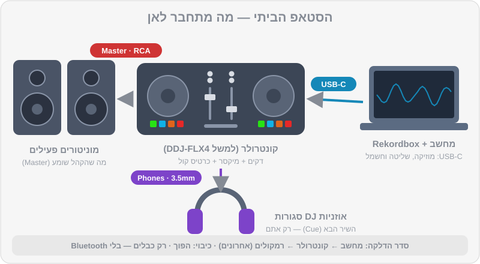

# ציוד לפי תקציב

נכנסים לחנות ציוד, או גוללים בזאפ, ופתאום יש עשרים קונטרולרים, עשרות אוזניות, ומוכר שמסביר בהתלהבות למה אתם "חייבים" ארבעה ערוצים. הנה החדשות הטובות: למתחילים, ההחלטה הרבה יותר פשוטה ממה שנראה. בפרק הזה נבין מה כל רכיב עושה, נשווה בין האפשרויות, וניתן המלצה ברורה — כולל מה **לא** לקנות עדיין.

> ⚠️ זהירות: כל המחירים בפרק הם **הערכה בלבד** נכון ל-2026, בשקלים, לפי טווחים שראינו בחנויות ובאתרי השוואת מחירים בישראל. מחירים משתנים כל הזמן — בדקו לפני קנייה, והעדיפו חנות עם אחריות יבואן.

## מה תלמדו בפרק

- איך בנויה כל עמדת DJ: מקור → דקים → מיקסר → רמקולים, ואוזניות בצד
- ההבדל בין קונטרולר, מערכת All-in-One ועמדת CDJ + מיקסר
- אילו קונטרולרים עובדים עם Rekordbox, ומה זה Hardware Unlock
- איך לבחור אוזניות DJ ורמקולי מוניטור לבית
- אילו כבלים צריך ואיך מחברים בלי רעשים ובלי נזק
- מה המחשב צריך, ואיך מכינים אותו להופעה
- סדר קנייה מומלץ לפי תקציב

## איך בנויה עמדת DJ

כל עמדת DJ, מהקונטרולר הכי זול ועד הבמה הראשית בפסטיבל, בנויה מאותם חלקים:

1. **מקור מוזיקה** — קבצים במחשב, בדיסק-און-קי (USB), או שירות סטרימינג.
2. **דקים (נגנים)** — שניים לפחות. כל דק מנגן שיר אחד, ויש לו Jog Wheel, כפתורי Play/Cue, ו-Tempo Fader לשינוי מהירות.
3. **מיקסר** — מקבל את הצליל משני הדקים (או יותר), ומאפשר לשלוט בעוצמה של כל אחד, ב-EQ, בפילטרים ובאפקטים. מהמיקסר יוצאים שני "ערוצי שמע" חשובים: ה-**Master** (מה שהקהל שומע) וה-**Cue** (מה ששומעים באוזניות).
4. **מערכת הגברה** — רמקולים פעילים (Active), או מגבר ורמקולים.
5. **אוזניות** — כדי להכין את השיר הבא בלי שהקהל ישמע.

בקונטרולר, הדקים והמיקסר יושבים בתוך קופסה אחת, והמחשב עושה את העבודה הקשה. בעמדת מועדון, כל אחד מהם הוא מכשיר נפרד. אבל ההיגיון זהה — ולכן מה שתלמדו על קונטרולר בבית יעבור איתכם למועדון.

## שלוש משפחות של ציוד

### 1. קונטרולר (Controller)

קופסה עם דקים ומיקסר שמתחברת למחשב ב-USB. התוכנה (Rekordbox) מנגנת את המוזיקה, והקונטרולר הוא ה"ידיים". ברוב הקונטרולרים יש גם כרטיס קול מובנה, כך שהרמקולים והאוזניות מתחברים ישירות לקונטרולר.

- **יתרונות:** הכי זול, קל לנשיאה, גישה לכל הפיצ'רים של התוכנה (אפקטים, Stems, סמפלר).
- **חסרונות:** תלוי במחשב. אם המחשב נתקע — המוזיקה נעצרת.

### 2. מערכת All-in-One (Standalone)

דקים ומיקסר עם מסך ומעבד מובנים — מנגנים ישירות מ-USB בלי מחשב. דוגמאות של AlphaTheta / Pioneer DJ: `XDJ-RX3` (שני ערוצים) ו-`XDJ-AZ` (ארבעה ערוצים, עם פריסה שמזכירה עמדת מועדון).

- **יתרונות:** אמין, נראה ומרגיש כמו ציוד מועדון, לא צריך לסחוב מחשב לאירוע.
- **חסרונות:** יקר משמעותית.

### 3. עמדת מועדון: CDJ + מיקסר

הסטנדרט במועדונים ברוב העולם, וגם בישראל: שני נגנים או יותר (כמו `CDJ-3000` או הדגם החדש `CDJ-3000X`) ומיקסר נפרד (כמו `DJM-900NXS2` הוותיק והנפוץ, או `DJM-A9` החדש יותר). מביאים USB מוכן מ-Rekordbox, מכניסים לנגן — ומנגנים.

- **יתרונות:** זה מה שתפגשו בהופעות. ציוד עמיד במיוחד.
- **חסרונות:** סט מלא עולה כמו רכב משומש. כמעט אף אחד לא מתחיל ככה בבית.

> 💡 טיפ: הסיבה שלומדים על Rekordbox היא בדיוק הגשר הזה: מכינים את הספרייה בבית (Cues, פלייליסטים), מייצאים ל-USB, ומנגנים על כל עמדת Pioneer/AlphaTheta בעולם. גם אם הבית שלכם מצויד בקונטרולר בלבד — הידע עובר.

### טבלת השוואה

| סוג | דוגמאות | מחיר מוערך (₪, 2026) | מתאים ל... |
|---|---|---|---|
| קונטרולר בסיסי | `DDJ-FLX2` | ~800–1,100 | ניסיון ראשון, תקציב מינימלי |
| קונטרולר מתחילים מומלץ | `DDJ-FLX4` | ~1,650–1,950 | רוב המתחילים — ההמלצה שלנו |
| קונטרולר 4 ערוצים | `DDJ-GRV6` | ~4,400–4,700 | מי שרוצה לגדול בלי להחליף מהר |
| קונטרולר מקצועי | `DDJ-FLX10`, `DDJ-REV7` | ~7,500–11,000 | מתקדמים, סקרץ' (REV7), אירועים |
| All-in-One | `XDJ-RX3` | ~9,700–11,000 | אירועים בלי מחשב, תרגול "מועדוני" |
| All-in-One 4 ערוצים | `XDJ-AZ` | ~18,000–19,000 | מקצוענים, אירועים גדולים |
| עמדת מועדון | 2× `CDJ-3000X` + `DJM-A9` | ~35,000–45,000 לסט | מועדונים, מקצוענים |

## קונטרולרים ל-Rekordbox — מה כדאי לדעת

### Hardware Unlock

חלק מהקונטרולרים של Pioneer DJ / AlphaTheta "פותחים" את מצב Performance ב-Rekordbox בלי מנוי בתשלום. זה נקרא **Hardware Unlock**. ה-`DDJ-FLX4` הוא הדוגמה המוכרת: מחברים אותו למחשב, ו-Rekordbox מאפשר לנגן ולערבב איתו במלואו.

> ⚠️ זהירות: Hardware Unlock **לא** הופך את החשבון שלכם לתוכנית בתשלום. ב-Rekordbox עדיין יופיע Free Plan, ופיצ'רים כמו סנכרון ספרייה מלא בענן נשארים מוגבלים. כדי לנגן ולערבב — זה מספיק לגמרי.

### DDJ-FLX4 — ההמלצה שלנו למתחילים

- שני ערוצים עם EQ של שלושה תחומים (High/Mid/Low) ו-Trim לכל ערוץ — בדיוק כמו במיקסר מועדון.
- Jog Wheels בגודל סביר, 8 פדים לכל דק (Hot Cue, Pad FX, Beat Jump, Sampler ועוד, כולל מצבים נוספים עם Shift).
- Beat FX, ו-Smart CFX / פילטר על כל ערוץ.
- יציאת Master בחיבור RCA, יציאת אוזניות 3.5 מ"מ, כניסת מיקרופון 6.3 מ"מ.
- מוזן מחשמל ה-USB (Bus Powered), עם USB-C נוסף לחשמל בעבודה מול טלפון/טאבלט.
- עובד עם Rekordbox (Hardware Unlock) וגם עם Serato DJ Lite.
- פיצ'ר Smart Fader שעושה מעבר "אוטומטי" — נחמד לניסוי, אבל **כבו אותו כשאתם לומדים**. אתם רוצים שהידיים שלכם יעשו את העבודה.

### DDJ-FLX2 — אם התקציב ממש צפוף

קטן וקל, עם EQ של שלושה תחומים. אבל אין בו Trim (Gain) ייעודי, אין מטרים של עוצמה ואין כניסת מיקרופון, וה-Jogs וה-Tempo Fader קצרים יותר. מתאים לטעימה ראשונה; אם אתם רציניים לגבי הקורס, ה-FLX4 משתלם יותר לאורך זמן — דווקא בגלל שהוא מלמד אתכם Gain staging (פרק 5) עם מטרים אמיתיים.

### DDJ-GRV6 — הצעד הבא

ארבעה ערוצים, פריסה בהשראת ציוד מועדון, ותכונות Stems. ארבעה ערוצים זה לא משהו שמתחילים צריכים ביום הראשון — אבל מי שיודע שהוא ממשיך, ורוצה קונטרולר לשנים, ייהנה ממנו.

### ומה עם XDJ ו-CDJ?

אם הקורס שלכם מלמד על CDJs, אל תרוצו לקנות. תרגלו בבית על קונטרולר, הכינו USB ב-Rekordbox, והשתמשו בשעות התרגול בקורס או בחדר חזרות כדי להתרגל לנגנים. מערכת `XDJ-RX3` היא פשרה מצוינת לאירועים, אבל זו השקעה שכדאי לעשות אחרי שיש עבודות.

> 💡 טיפ: יד שנייה היא אפשרות מעולה. קונטרולר `DDJ-400` (הקודם של ה-FLX4) עדיין נתמך ב-Rekordbox ונמכר משומש במחיר נמוך. לפני קנייה: בדקו שכל הפדים מגיבים, שה-Jogs מסתובבים חלק, שהפיידרים לא "מגרדים" או קופצים בצליל, ושחיבור ה-USB יציב.

## אוזניות — ההשקעה הכי חשובה אחרי הקונטרולר

אוזניות DJ הן לא אוזניות רגילות. מה שאתם מחפשים:

1. **סגורות (Closed-back)** — חוסמות את רעש החדר, כדי שתשמעו את השיר הבא גם כשהמוזיקה בחוץ חזקה.
2. **כרית שמסתובבת (Swivel)** — כדי להחזיק אוזנייה אחת על האוזן והשנייה פתוחה (פרק 8).
3. **חוטיות!** אוזניות Bluetooth יוצרות השהיה (Latency) של עשרות עד מאות אלפיות שנייה — וזה הורס Beatmatching לגמרי.
4. **כבל מתולתל (Coiled)** ומתאם 3.5 → 6.3 מ"מ (בהברגה, לא כזה שנשלף).
5. **נוחות** — תענדו אותן שעות. משקל וכריות חשובים.
6. **עמידות וחלקי חילוף** — כבל, כריות וכרית ראש שאפשר להחליף.

| דגם | מחיר מוערך (₪) | בשורה אחת |
|---|---|---|
| `Pioneer DJ HDJ-CUE1` | ~250–350 | בחירת תקציב טובה למתחילים |
| `Pioneer DJ HDJ-X5` | ~450–650 | שדרוג בנוחות ובבידוד |
| `Sennheiser HD 25` | ~550–800 | קלאסיקה של עשרות שנים בעמדות DJ, עמידה ותיקנה |
| `Audio-Technica ATH-M50x` | ~550–800 | מעולה אם תפיקו מוזיקה גם בבית |
| `Pioneer DJ HDJ-X10` | ~1,100–1,400 | פרימיום, למי שמופיע הרבה |

> ⚠️ זהירות: האוזניות הן גם הכלי שהכי מהר יכול להזיק לשמיעה שלכם. עבדו בעוצמה הנמוכה ביותר שבה אתם עדיין שומעים בבירור את התוף. נרחיב בפרק 8 ובפרק 17.

## רמקולים לבית (מוניטורים)

אפשר להתחיל באוזניות בלבד, אבל לערבב רק באוזניות לאורך זמן מעייף, ולא מלמד איך מעבר נשמע "בחדר". מוניטורים פעילים קטנים (4–5 אינץ') הם הבחירה הנכונה לבית:

| דגם (דוגמאות) | מחיר מוערך לזוג (₪) | הערות |
|---|---|---|
| `Pioneer DJ DM-40D` | ~600–850 | קומפקטי, כניסות RCA ו-3.5 מ"מ, מושלם לשולחן |
| `Pioneer DJ DM-50D` | ~1,000–1,400 | יותר באס ועוצמה |
| `KRK Rokit 5` | ~1,400–1,900 | פופולרי מאוד אצל DJs ומפיקים |
| `Yamaha HS5` | ~1,700–2,200 | מוניטור אולפני מדויק (באס פחות "מחמיא") |

### מיקום נכון

1. הרמקולים והראש שלכם יוצרים משולש שווה צלעות.
2. הטוויטרים (הרמקול הקטן) בגובה האוזניים בערך.
3. לפחות 20–30 ס"מ מהקיר האחורי, ולא בפינות — אחרת הבאס "מתנפח".
4. עדיף על משטחים מבודדים (ספוגים או מעמדים), לא ישירות על שולחן עץ שמהדהד.

> ⚠️ זהירות: **רמקול Bluetooth הוא לא פתרון ל-Master.** ההשהיה שלו גורמת לכך שמה שאתם שומעים ברמקול מאחר אחרי מה שאתם שומעים באוזניות — ואז אי אפשר לעשות Beatmatching. הרמקולים חייבים להיות מחוברים בכבל.

## כבלים — מה מחבר למה

| חיבור | כבל | הערות |
|---|---|---|
| מחשב ↔ קונטרולר | USB (ב-FLX4: USB-C) | עדיף הכבל המקורי, קצר ואיכותי. לא דרך מפצל USB זול |
| קונטרולר (RCA) ↔ מוניטורים עם כניסת RCA | RCA ↔ RCA | הכי פשוט |
| קונטרולר (RCA) ↔ מוניטורים עם כניסת 6.3 (TRS/TS) | RCA ↔ 6.3 מ"מ | נפוץ מאוד במוניטורים אולפניים |
| קונטרולר (RCA) ↔ מוניטורים/מערכת עם XLR | RCA ↔ XLR (זכר) | למערכות הגברה מקצועיות |
| מיקסר מועדון ↔ מערכת | XLR (מאוזן) | בדרך כלל כבר מחובר במקום |
| אוזניות ↔ קונטרולר | מתאם 3.5 ↔ 6.3 לפי הצורך | עדיף מתאם בהברגה |

### סדר הדלקה וכיבוי

1. **הדלקה:** מחשב → קונטרולר / מיקסר → **ואז** רמקולים (אחרונים).
2. **כיבוי:** רמקולים (ראשונים) → קונטרולר → מחשב.
3. לפני הדלקת הרמקולים, ודאו שה-Master בקונטרולר בעוצמה נמוכה.

ככה נמנעים מ"פוק" חזק שעלול לפגוע ברמקולים (ובאוזניים).

> 💡 טיפ: שומעים זמזום (Hum) ברמקולים כשהמחשב מחובר לחשמל? זו לרוב "לולאת הארקה". נסו לחבר את כל הציוד לאותו מפצל חשמל, ואם זה לא עוזר — חפשו מבודד הארקה (Ground Loop Isolator) לכבל השמע. אל תנתקו את ההארקה מתקע החשמל.

## המחשב

Rekordbox 7 עובד על Windows 10/11 ועל גרסאות macOS עדכניות. דרישת הזיכרון המינימלית היא 8GB RAM, ול-STEMS (הפרדת ערוצים בזמן אמת) מומלץ 16GB. מחשבי Mac עם מעבדי Apple Silicon (M1 ומעלה) עובדים מצוין. בדקו את רשימת הדרישות העדכנית באתר של Rekordbox לפני שאתם קונים מחשב חדש.

מה חשוב בפועל:

- **כונן SSD** — טעינת שירים וניתוח מהירים בהרבה.
- **מקום פנוי** — ספריית DJ גדלה מהר. קבצי MP3 ב-320kbps תופסים בערך 2.4MB לדקה; קבצי WAV/AIFF בערך פי ארבעה וחצי.
- **סוללה ומטען** — בהופעה, תמיד מחוברים לחשמל.

### הכנת המחשב לסט

1. כבו התראות (מצב "נא לא להפריע" / Focus).
2. סגרו כל תוכנה אחרת — דפדפן, ווטסאפ, סנכרון ענן.
3. ב-Windows: בחרו תוכנית צריכת חשמל של ביצועים גבוהים, והתקינו את דרייבר השמע של הקונטרולר (ASIO) מהאתר הרשמי.
4. השביתו עדכונים אוטומטיים בזמן ההופעה.
5. אם אתם לא משתמשים בסטרימינג — כבו Wi-Fi. פחות הפתעות.

## דיסק-און-קי (USB) לנגני מועדון

כשתתחילו לנגן על CDJ או XDJ, תצטרכו USB מוכן מ-Rekordbox:

- נפח 32–128GB, USB 3.0 ממותג (לא זול מהקופה).
- **פורמט:** FAT32 עובד כמעט בכל נגן. exFAT נתמך רק בנגנים החדשים יותר (למשל `CDJ-3000`, `CDJ-3000X`, `XDJ-AZ`, `XDJ-RX3`). אם אינכם בטוחים מה מחכה לכם במועדון — FAT32 בטוח יותר.
- **תמיד שניים**, עם אותו תוכן. אחד נשאר בכיס.

נרחיב על ייצוא ל-USB בפרק 9.

## מה לקנות קודם — לפי תקציב

| תקציב (מוערך) | מה לקנות | הערות |
|---|---|---|
| ~0 ₪ | מחשב קיים + Rekordbox (חינם) + אוזניות שיש לכם | אפשר להתחיל ללמוד ספרייה, ספירה וסידור — ואפילו לערבב עם עכבר ומקלדת |
| ~2,000 ₪ | `DDJ-FLX4` + אוזניות `HDJ-CUE1` | ערכת המתחילים הקלאסית |
| ~3,000–3,500 ₪ | `DDJ-FLX4` + `HD 25` או `HDJ-X5` + מוניטורים `DM-40D` | הסטאפ הביתי המומלץ שלנו |
| ~6,000–7,000 ₪ | `DDJ-GRV6` + אוזניות טובות + מוניטורים 5 אינץ' | למי שבטוח שהוא ממשיך |
| ~10,000 ₪ ומעלה | `XDJ-RX3` (או `XDJ-AZ` בתקציב גבוה בהרבה) | כשמתחילים לעבוד באירועים |

סדר העדיפויות שלנו:

1. **קונטרולר** — בלי ידיים על הציוד אין למידה אמיתית.
2. **אוזניות DJ חוטיות** — חובה לביטמאצ'ינג.
3. **מוניטורים** — כדי לשמוע מיקס "בחדר".
4. **מוזיקה טובה** (פרק 9) — עדיף להשקיע 200 ₪ בטראקים שאתם אוהבים מאשר באביזר נוצץ.
5. **אטמי אוזניים למוזיקאים** (~100–250 ₪) — ברגע שאתם מתחילים לצאת למועדונים ולהופיע.

> ⚠️ זהירות: אל תקנו עדיין: תאורה, מכונת עשן, מיקרופון אלחוטי, מארזים יקרים או קונטרולר של ארבעה ערוצים "כי אולי יום אחד". כל שקל כזה עדיף שיילך לטראקים, לשיעורים נוספים או לאוזניות טובות.

## תרגילים

> 🎧 תרגיל 1 — מיפוי הסטאפ: ציירו (על דף, ממש) את הסטאפ שלכם או את הסטאפ שאתם מתכננים: מאיפה המוזיקה מגיעה, איפה המיקסר, לאן יוצא ה-Master ולאן ה-Cue. השוו לתרשים בתחילת הפרק.

> 🎧 תרגיל 2 — חיבור ובדיקה: חברו את הקונטרולר, פתחו Rekordbox במצב Performance, וטענו את `music/practice/practice-03-drums-124.mp3` לדק 1. העלו את הפיידר והאזינו ברמקולים. אחר כך לחצו על כפתור ה-CUE של ערוץ 1 ובדקו שאתם שומעים את התופים גם באוזניות. אם לא — בדקו את הגדרות האודיו (Preferences > Audio).

> 🎧 תרגיל 3 — מבחן השהיה: עם `practice-03` מתנגן, הורידו את האוזניות לצוואר ותופפו עם האצבע על השולחן יחד עם התוף ברמקולים. אחר כך הרכיבו אוזניות ותופפו יחד איתן. האם הקצב מרגיש זהה? אם האוזניות או הרמקולים "מאחרים" — כנראה יש חיבור אלחוטי או Buffer גבוה מדי (פרק 8).

> 🎧 תרגיל 4 — תוכנית קנייה: מלאו טבלה קטנה ביומן ה-DJ: תקציב, מה כבר יש לכם, ומה שלושת הדברים הבאים לפי סדר העדיפויות למעלה. השוו מחירים בשתי חנויות לפחות.

## סיכום

- כל עמדת DJ בנויה ממקור, דקים, מיקסר, הגברה ואוזניות — בקונטרולר הכול בקופסה אחת.
- למתחילים עם Rekordbox, `DDJ-FLX4` הוא נקודת פתיחה מצוינת: מחיר סביר, Hardware Unlock ופריסה שמלמדת הרגלים של מועדון.
- אוזניות DJ חייבות להיות סגורות וחוטיות. רמקולים — בכבל, לא ב-Bluetooth.
- מדליקים רמקולים אחרונים ומכבים אותם ראשונים.
- קונים לפי סדר: קונטרולר → אוזניות → מוניטורים → מוזיקה → אטמי אוזניים.

## בפרק הבא

יש ציוד — עכשיו לתוכנה. נתקין את Rekordbox, נבין את ההבדל בין מצב Export למצב Performance, ננתח את הטראקים, נבדוק Beatgrid, ונייבא את כל הספרייה של DJ Lab עם Hot Cues מוכנים.

👉 [פרק 2 — יסודות Rekordbox](02-rekordbox-basics.md)
