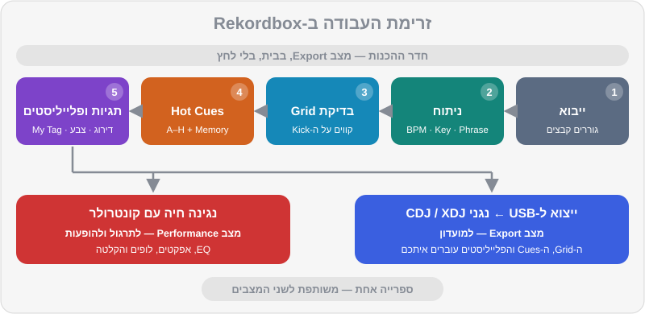

# יסודות Rekordbox

ה-Rekordbox הוא הרבה יותר מ"תוכנת DJ". הוא הספרייה שלכם, חדר ההכנות שלכם, הגשר לנגני המועדון, וגם — כשמחברים קונטרולר — הכלי שאיתו מנגנים. רוב ה-DJs המקצועיים מבלים בו יותר זמן בהכנה מאשר בנגינה. בפרק הזה נבנה בסיס יציב: נתקין, נבין את המצבים, נלמד לסמוך (ולא לסמוך) על הניתוח האוטומטי, ונייבא את כל 52 הטראקים של DJ Lab עם Hot Cues מוכנים — כך שמחר בבוקר אתם כבר מתרגלים.

> 💡 טיפ: המדריך נכתב על בסיס Rekordbox 7 (קו הגרסאות 7.2.x, נכון לסתיו 2026). הממשק משתנה מעט בכל עדכון. אם כפתור נמצא אצלכם במקום אחר — חפשו את אותו שם בהגדרות; העקרונות לא משתנים.

## מה תלמדו בפרק

- איך מתקינים, איזו תוכנית מנוי צריך (אם בכלל), ומה זה Hardware Unlock
- ההבדל בין מצב Export למצב Performance ומתי משתמשים בכל אחד
- איך נראה המסך: דקים, ווייבפורמים, מיקסר ודפדפן הספרייה
- ניתוח טראקים: BPM, Beatgrid, סולם (Key), פרייזים ווקאלים
- איך בודקים ומתקנים Beatgrid — הכישור שמפריד בין מתחילים למקצוענים
- ספרייה, פלייליסטים ותיקיות
- הגדרות מומלצות למתחילים
- ייבוא קובץ `rekordbox.xml` של DJ Lab, צעד אחר צעד

## התקנה ותוכניות

### התקנה

1. הורידו את Rekordbox **רק מהאתר הרשמי** (`rekordbox.com`). גרסאות "פרוצות" מאתרים אחרים הן דרך מצוינת לקבל וירוס ולאבד את הספרייה.
2. התקינו והפעילו. תתבקשו ליצור חשבון AlphaTheta (או להתחבר לחשבון קיים).
3. ב-Windows: אם יש לקונטרולר שלכם דרייבר ייעודי (ASIO), הורידו אותו מאתר היצרן והתקינו **לפני** שמחברים את הקונטרולר. ב-Mac רוב הקונטרולרים עובדים בלי דרייבר.
4. חברו את הקונטרולר. אם הוא תומך ב-Hardware Unlock, Rekordbox יזהה אותו ויפתח את מצב Performance.

### התוכניות — בקצרה

ל-Rekordbox יש תוכנית חינמית ושלוש תוכניות בתשלום. המחירים בדולרים, כי כך הם מתומחרים; הסכומים משוערים (חישוב חודשי בתשלום שנתי) ועשויים להשתנות:

| תוכנית | מחיר משוער | מה מקבלים בעיקר |
|---|---|---|
| Free | חינם | ניהול ספרייה מלא, ייצוא ל-USB, מצב Performance עם המחשב או עם קונטרולר שעושה Hardware Unlock, סנכרון ענן מוגבל למספר קטן של טראקים |
| Core | ~10$ לחודש | שימוש בכל ציוד Pioneer DJ / AlphaTheta תואם בלי צורך ב-Hardware Unlock, ופיצ'רים נוספים |
| Creative | ~15$ לחודש | מעל Core: סנכרון ספרייה מלא בענן (Cloud Library Sync), אפקטים מתקדמים, וידאו ועוד |
| Professional | ~30$ לחודש | הכול, כולל אחסון ענן מורחב והפיצ'רים המתקדמים ביותר |

> ⚠️ זהירות: אל תמהרו לקנות מנוי. למתחילים עם `DDJ-FLX4` או קונטרולר דומה, התוכנית החינמית + Hardware Unlock מספיקים לכל מה שבחלקים א' ו-ב' של המדריך. יש תקופות ניסיון — נצלו אותן כשתרצו לבדוק פיצ'ר ספציפי, כמו STEMS.

## שני המצבים: Export ו-Performance

בפינה העליונה של המסך יש בורר מצבים. שני המצבים החשובים הם:

| | מצב Export | מצב Performance |
|---|---|---|
| **התפקיד** | חדר ההכנות: ניהול ספרייה והכנה לנגני מועדון | הבמה: נגינה ומיקס חי עם קונטרולר |
| **מה עושים בו** | ייבוא, ניתוח, עריכת Beatgrid, Hot Cues ו-Memory Cues, פלייליסטים, ייצוא ל-USB | מיקס בזמן אמת: EQ, אפקטים, לופים, Sampler, הקלטה |
| **צריך קונטרולר?** | לא | מומלץ (אפשר גם עם מקלדת ועכבר) |
| **מתי** | בבית, לפני הופעה על CDJ/XDJ | תרגול והופעות עם קונטרולר |

יש גם מצבים נוספים, כמו Lighting (תאורה) ו-Edit (עריכת טראקים) — לא נזדקק להם בשלב הזה.

> 💡 טיפ: כל מה שאתם עושים באחד המצבים — Hot Cues, פלייליסטים, תיקוני Grid, דירוגים — נשמר באותה ספרייה ומופיע גם במצב השני. אין "שתי ספריות". ההבדל הוא בכלים שמוצגים על המסך.



## אנטומיה של המסך

ברוב הפריסות תמצאו מלמעלה למטה:

1. **הדקים** — לכל דק יש ווייבפורם מוגדל (הקטע שמתנגן עכשיו; הוא זורם מימין לשמאל, וקו קבוע באמצע מסמן את הרגע הנוכחי) וווייבפורם כללי (Overview) של כל הטראק, עם סימני Cues. ליד: BPM, אחוז Tempo, סולם, זמן שעבר/נשאר, ופדים של Hot Cues.
2. **המיקסר** (במצב Performance) — Trim, EQ, פיידרים, Crossfader ואפקטים, בדומה לקונטרולר.
3. **הדפדפן** — מימין או משמאל ה-Tree View (העץ): Collection, פלייליסטים, היסטוריה, מקורות כמו Explorer, rekordbox xml, שירותי סטרימינג והתקנים (Devices). במרכז — רשימת הטראקים עם עמודות.

> 🎚️ ב-Rekordbox: לחיצה ימנית על שורת הכותרות של רשימת הטראקים מאפשרת לבחור אילו עמודות להציג. מומלץ להציג לפחות: Track Title, Artist, BPM, Key, Rating, Color, Genre, Comments, Time ו-Date Added. נשתמש בכולן בפרק 9.

## ייבוא וניתוח (Analysis)

### ייבוא מוזיקה

הדרך הפשוטה ביותר: גוררים תיקייה או קבצים מסייר הקבצים (Finder / Explorer) אל ה-Collection. Rekordbox לא מעתיק את הקבצים — הוא רק "זוכר" איפה הם נמצאים. לכן:

> ⚠️ זהירות: **אל תזיזו ואל תשנו שמות של קבצים אחרי שייבאתם אותם.** אחרת Rekordbox יאבד אותם (סימן קריאה ליד הטראק). בחרו מראש תיקיית מוזיקה ראשית אחת וקבועה — על זה בפרק 9.

### מה הניתוח עושה

בזמן הייבוא Rekordbox מנתח כל טראק ומוצא:

- **קצב (BPM) ו-Beatgrid** — הקצב, ורשת הקווים שמסמנת כל ביט וכל תחילת תיבה. כל ה-Sync, ה-Quantize, הלופים וה-Beat Jump נשענים על הרשת הזו.
- **סולם (Key)** — לצורך מיקס הרמוני (פרק 10).
- **פרייזים (Phrase)** — חלוקה לקטעים (אינטרו, בנייה, שיא, אאוטרו וכו'), מוצגת כפסים צבעוניים מעל הווייבפורם.
- **ווקאל (Vocal)** — איפה יש שירה, כדי לא לערבב שני ווקאלים יחד.
- **ווייבפורם** — התצוגה הגרפית של השיר.

> 🎚️ ב-Rekordbox: את הגדרות הניתוח מוצאים ב-Preferences > Analysis > Track Analysis. שם בוחרים מה לנתח (BPM / Grid, KEY, Phrase, Vocal) ואת מצב הניתוח.

### שלושה מצבי ניתוח: Normal, Dynamic ו-Auto

- מצב **Normal** — לטראקים בקצב קבוע. זה רוב המוזיקה האלקטרונית, וכל הטראקים של DJ Lab. במצב הזה בוחרים גם **BPM Range** — טווח הקצבים שבו Rekordbox "מחפש" את ה-BPM.
- מצב **Dynamic** — לטראקים עם קצב משתנה: מוזיקה שהוקלטה עם מתופף חי, דיסקו ופאנק ישנים, הרבה מוזיקה ים-תיכונית וישראלית שהוקלטה "חי". הרשת תעקוב אחרי השינויים.
- מצב **Auto** — זמין כשמופעל ניתוח ה-Beatgrid ברמת הדיוק הגבוהה, ונותן לתוכנה להחליט.

> 💡 טיפ: הסיבה הנפוצה ביותר ל-BPM "כפול" או "חצי" (למשל היפ-הופ ב-92 שמזוהה כ-184, או דראם אנד בייס ב-174 שמזוהה כ-87) היא טווח BPM שלא מתאים למוזיקה. בחרו טווח שמכסה את רוב מה שאתם מנגנים, ותקנו ידנית את היוצאים מן הכלל. שימו לב גם לטראק הלו-פיי `breadth-10` (84 BPM): בטווח צר מדי הוא עלול להיות מזוהה כ-168.

## ה-Beatgrid — לבדוק, לא לסמוך בעיוורון

ה-Beatgrid הוא הנכס החשוב ביותר בספרייה. רשת לא נכונה גורמת ל-Sync לסנכרן לא נכון, ל-Hot Cues "לקפוץ" מחוץ לקצב, וללופים לצאת עקומים. ב-DJ Lab הרשת תמיד מושלמת: הקצב קבוע לחלוטין והביט הראשון מתחיל בדיוק בשנייה 0.0. בטראקים מסחריים — כדאי לבדוק כל טראק לפני שהוא נכנס לסט.

### איך בודקים רשת ב-30 שניות

1. טוענים את הטראק לדק ומגדילים את הווייבפורם (זום).
2. בודקים ש**כל קו של ביט יושב על תחילת מכת הבס-דראם** (ה-Kick) — בהתחלה, באמצע ובסוף השיר.
3. בודקים שסימן **תחילת התיבה** (הקו המודגש) יושב על ה-"1" האמיתי — המקום שבו השיר מרגיש שהוא "מתחיל משפט". טעות נפוצה: הרשת נכונה, אבל ה-1 נמצא על הביט השני או השלישי.
4. מאזינים עם המטרונום של Rekordbox (בפאנל ה-Grid): הקליק צריך להיות "בתוך" ה-Kick, לא לפניו ולא אחריו.

### איך מתקנים

> 🎚️ ב-Rekordbox: במצב Export טוענים טראק ופותחים את לשונית GRID בפאנל שמתחת לדק. במצב Performance אותם כלים נמצאים בפאנל GRID EDIT (דרך התפריט הקטן של הדק). הכלים העיקריים:
> - **קביעת הביט הראשון** — מציבים את סמן הנגינה על ה-Kick הנכון ולוחצים על כפתור קביעת תחילת התיבה.
> - **הזזת הרשת שמאלה / ימינה** — כשכל הקווים "מקדימים" או "מאחרים" באותה מידה.
> - **הכפלה / חציה של ה-BPM** — כשהזיהוי יצא כפול או חצי.
> - **מטרונום** — לבדיקה באוזן.
> - **נעילת ניתוח (Analysis Lock)** — כדי שניתוח חוזר לא ימחק את התיקון.

תהליך התיקון המלא:

1. **ה-BPM לא נכון?** קודם כל תקנו אותו (כפול/חצי, או הקלדה של ערך ידוע מהחנות).
2. **הקווים זזים בהדרגה** (בהתחלה מדויקים, בסוף מאחרים)? ה-BPM עדיין קצת לא מדויק, או שהטראק בקצב משתנה — נסו ניתוח Dynamic.
3. **הקווים מוזזים באופן קבוע?** הזיזו את הרשת כולה.
4. **ה-1 לא במקום?** קבעו מחדש את הביט הראשון על ה-Kick של תחילת הפרייז.
5. **נעלו** את הניתוח.

> ⚠️ זהירות: אל "תתקנו" רשת של טראק שנשמע מעולה ונראה מעולה. זה בזבוז זמן. עברו טראק-טראק רק על החדשים, וקודם כל על אלה שאתם עומדים לנגן.

## הספרייה: Collection, פלייליסטים ותיקיות

- ה-**Collection** — כל הטראקים שייבאתם. זה המאגר, לא המקום לנגן ממנו בהופעה.
- ה-**Playlists** — רשימות שאתם יוצרים. טראק יכול להופיע בכמה פלייליסטים בלי לשכפל את הקובץ.
- ה-**Folders** — תיקיות שמכילות פלייליסטים, לסדר: "ז'אנרים", "אירועים", "תרגול".
- ה-**Intelligent Playlists** — פלייליסטים שמתמלאים לבד לפי כללים (למשל: BPM בין 122 ל-126 ודירוג 4 ומעלה). נלמד בפרק 9.
- ה-**Histories** — רשימה אוטומטית של מה שניגנתם בכל סשן. מעולה לשחזר סט טוב.

> 🎚️ ב-Rekordbox: לחיצה ימנית על Playlists בעץ → יצירת פלייליסט או תיקייה חדשה. גוררים טראקים מה-Collection לפלייליסט. כדי לשנות סדר בפלייליסט, ממיינים לפי עמודת המספור (#) וגוררים.

שמות מומלצים (ממוספרים, כדי שיופיעו בסדר הגיוני):

```
00 תרגול
   01 שבוע 1 — ספירה
   02 שבוע 2 — ביטמאצ'ינג
10 ז'אנרים
   11 House & Tech House
   12 Afro House
   13 Melodic Techno
   14 Techno
   15 Mainstream & Hip-Hop
   16 ים-תיכוני
20 סטים
   2026-10-15 מסיבת בית
90 לבדיקה (Inbox)
```

## הגדרות מומלצות למתחילים

אלה ההגדרות שאנחנו ממליצים לשנות כבר עכשיו. השמות יכולים להשתנות מעט בין גרסאות; אם לא מוצאים — חפשו את המילה המרכזית בחלון ה-Preferences.

| תחום | הגדרה | המלצה | למה |
|---|---|---|---|
| ניתוח | מצב ניתוח | Normal (ו-Dynamic לטראקים "חיים") | רשת יציבה |
| ניתוח | BPM Range | טווח שמכסה את רוב הספרייה שלכם | פחות BPM כפול/חצי |
| ניתוח | מה לנתח | BPM / Grid, KEY, Phrase, Vocal — הכול | מידע מלא |
| תצוגה | תצוגת סולם | אלפא-נומרית (8A, 9A...) אם קיימת אצלכם | מיקס הרמוני קל (פרק 10) |
| תצוגה | צבע ווייבפורם | 3Band | רואים בעיניים איפה הבאס, המיד והגבוהים |
| דק | Quantize | פועל | Cues ולופים "נצמדים" לרשת |
| דק | Master Tempo | פועל | שינוי מהירות בלי שינוי גובה הצליל |
| דק | טווח Tempo | ±10% (או ±6% לדיוק) | שליטה עדינה (פרק 4) |
| דק | Sync | BEAT SYNC | מסנכרן גם קצב וגם מיקום ביט |
| מיקסר | EQ / Isolator | EQ בהתחלה | מעברים רכים יותר (פרק 5) |
| אודיו | Buffer Size | נמוך ככל שעדיין יציב (בערך 5–10ms) | פחות השהיה בלי "קליקים" |

> 💡 טיפ: הגדרות "דק" כמו Quantize ו-Master Tempo מופיעות גם ככפתורים קטנים על המסך ליד כל דק, ועל חלק מהקונטרולרים. לפני כל סשן העיפו מבט ובדקו שהם דולקים.

## ייבוא הספרייה של DJ Lab (rekordbox.xml)

זה הרגע שבו כל הרפו "נדלק". קובץ ה-XML של DJ Lab מכיל את כל הטראקים, קבצי התרגול והדמואים, עם BPM, סולם, Beatgrid מדויק, Hot Cues צבעוניים בסלוטים A–H ו-Memory Cues — לפי המוסכמה של DJ Lab — וגם פלייליסטים מסודרים.

### לפני שמתחילים: איפה הקובץ?

- **בתוך הרפו, שני קבצים מוכנים** בתיקייה `music/rekordbox/`:
  - `rekordbox-windows.xml` — מניח שהרפו נמצא בדיוק בתיקייה `C:\DJ-Lab` (כלומר הטראקים ב-`C:\DJ-Lab\music\tracks\...`).
  - `rekordbox-mac.xml` — מניח שהרפו נמצא בדיוק בתיקייה `/Users/Shared/DJ-Lab`.
- **לכל מיקום אחר:** הריצו `python tools/build_rekordbox_xml.py --root "<הנתיב שלכם>"`.
- **באתר של DJ Lab:** יש כלי שמייצר את קובץ ה-XML עם הנתיב של התיקייה במחשב שלכם.

> ⚠️ זהירות: קובץ XML של Rekordbox שומר **נתיב מלא** לכל קובץ שמע. אם שמרתם את הרפו במקום אחר ממה שהקובץ מצפה, הטראקים יופיעו כ"חסרים". הפתרון הקל: לייצר את הקובץ דרך הכלי באתר עם הנתיב שלכם. פתרון חלופי: לייבא בכל זאת, ואז לאתר מחדש את הקבצים (ראו "פתרון בעיות" בהמשך).

### צעד אחר צעד

1. **שמרו את הרפו במקום קבוע.** למשל תיקייה בשם `DJ Lab` בתוך תיקיית המוזיקה. אל תזיזו אותה אחר כך.
2. **הציגו את rekordbox xml בעץ.** פתחו Preferences > View > Layout, וסמנו את `rekordbox xml` ברשימת הפריטים שמוצגים בדפדפן.
3. **הגדירו את הקובץ.** פתחו Preferences > Advanced > Database. באזור `rekordbox xml`, לצד Imported Library, לחצו Browse ובחרו את קובץ ה-XML.
4. **סגרו את ההגדרות.** בעץ (Tree View) יופיע פריט חדש בשם `rekordbox xml`. אם הוא לא מתעדכן — לחצו על כפתור הרענון שלידו.
5. **ייבוא כל הטראקים:** פתחו את `rekordbox xml`, לחצו על All Tracks, סמנו הכול (`Ctrl+A` או `Cmd+A`), לחצו ימני ובחרו **Import to Collection**.
6. **ייבוא הפלייליסטים:** פתחו את Playlists שתחת `rekordbox xml`, לחצו ימני על פלייליסט (או תיקייה) ובחרו **Import Playlist**. אפשר גם לגרור פלייליסט אל Playlists שבספרייה הראשית.
7. **בדקו:** טענו את `house-05` לדק. אתם אמורים לראות BPM של 126, סולם 8A (או Am), ו-Hot Cues צבעוניים: A ירוק בהתחלה, B תכלת, C כתום, D אדום, G כחול ו-H סגול (לא בכל טראק יש את כל שמונת הסלוטים — E ו-F מופיעים רק בטראקים עם ברייקדאון ודרופ שניים).

> 🎚️ ב-Rekordbox: אחרי הייבוא, Rekordbox עשוי לנתח את הטראקים (בשביל הווייבפורם). זה תקין. אחרי שהניתוח מסתיים, פתחו טראק אחד וודאו שהרשת עדיין מתחילה בדיוק בתחילת השיר, ושה-Hot Cues במקום. אם הכול תקין — נעלו את הניתוח לטראקים של DJ Lab, כדי שלא ישתנו בטעות.

### פתרון בעיות

| הבעיה | מה עושים |
|---|---|
| `rekordbox xml` לא מופיע בעץ | חזרו לשלב 2 וודאו שסימנתם אותו ב-Layout |
| הטראקים מופיעים עם סימן קריאה / אפורים | הנתיב בקובץ לא תואם. ייצרו XML חדש באתר עם הנתיב שלכם, או השתמשו באפשרות של Rekordbox להציג את כל הקבצים החסרים ולאתר אותם מחדש (Relocate) בתפריט File |
| אין Hot Cues | ודאו שבחרתם Import to Collection (ולא רק גררתם לדק). אם הטראק כבר היה בספרייה, Rekordbox עשוי לשאול אם לדרוס את המידע — אשרו |
| הצבעים של ה-Hot Cues אחרים | בדקו את הגדרת צבעי ה-Hot Cues בתצוגה; הצבעים מהקובץ נשמרים לכל Cue בנפרד |
| ייבאתם גרסה חדשה של הקובץ | הגדירו שוב את הקובץ (שלב 3), רעננו, וייבאו שוב רק את מה שהשתנה |

## גיבוי — עכשיו, לא אחרי האסון

הספרייה שלכם (Cues, Grids, פלייליסטים, דירוגים) שווה עשרות שעות עבודה. היא נשמרת בנפרד מקבצי המוזיקה.

> 🎚️ ב-Rekordbox: בתפריט File יש אפשרות לגבות את הספרייה (Library > Backup Library) ולשחזר ממנה. גבו לפחות פעם בשבוע, ותמיד לפני עדכון גרסה. שמרו את הגיבוי גם על כונן חיצוני או בענן. נרחיב על אסטרטגיית גיבוי בפרק 9.

## תרגילים

> 🎧 תרגיל 1 — התקנה והגדרות: התקינו את Rekordbox, עברו על טבלת ההגדרות המומלצות ושנו כל הגדרה אחת-אחת. צלמו מסך של ה-Preferences אחרי השינויים — כדי שתוכלו לשחזר אחרי התקנה מחדש.

> 🎧 תרגיל 2 — ייבוא DJ Lab: ייבאו את קובץ ה-XML שמתאים לכם (`rekordbox-windows.xml` / `rekordbox-mac.xml`, או קובץ מכלי ה-XML באתר) לפי השלבים. בדקו שלושה טראקים מסגנונות שונים: `house-05` (טק-האוס), `techno-07` (מלודיק טכנו) ו-`mainstream-13` (ים-תיכוני, 100 BPM). השוו את ה-BPM והסולם שמופיעים ב-Rekordbox לערכים שבקובץ ה-JSON של כל טראק.

> 🎧 תרגיל 3 — שני המצבים: עברו למצב Export, טענו את `music/tracks/house/house-03-hands-up-florentin.mp3` ופתחו את לשונית ה-GRID. הפעילו את המטרונום ושמעו שהקליק יושב על ה-Kick. עברו למצב Performance וודאו שאותו טראק נטען עם אותם Hot Cues.

> 🎧 תרגיל 4 — ציד רשתות (למתקדמים קצת): בחרו שלושה טראקים מסחריים שיש לכם — עדיף אחד ים-תיכוני או ישראלי שהוקלט עם מתופף חי. בדקו את הרשת בהתחלה, באמצע ובסוף. מצאתם רשת שזזה? נסו ניתוח Dynamic, ורשמו ביומן מה עבד.

> 🎧 תרגיל 5 — פלייליסט ראשון: צרו תיקייה בשם "00 תרגול" ובתוכה פלייליסט "שבוע 1". גררו אליו את `music/practice/practice-01-phrase-counter-124.mp3`, `music/practice/practice-03-drums-124.mp3`, ושלושה טראקים של DJ Lab באותו טווח קצב: `house-03`, `house-04` (שניהם 124) ו-`mainstream-04` (124).

> 🎧 תרגיל 6 — גיבוי: בצעו גיבוי ספרייה ראשון, ושמרו אותו מחוץ למחשב.

## סיכום

- מצב Export הוא חדר ההכנות (ספרייה, Grid, Cues, USB); מצב Performance הוא הבמה. הספרייה משותפת.
- התוכנית החינמית + קונטרולר עם Hardware Unlock מספיקים לגמרי למתחילים.
- הניתוח האוטומטי טוב, אבל Beatgrid צריך לבדוק — במיוחד בטראקים עם מתופף חי. בדיקה: הקווים על ה-Kick, וה-1 על תחילת הפרייז.
- הגדירו Quantize, Master Tempo, תצוגת סולם נוחה וטווח BPM מתאים.
- ייבוא ה-XML של DJ Lab: Preferences > View > Layout (להציג rekordbox xml) → Preferences > Advanced > Database (Imported Library) → Import to Collection.
- גבו את הספרייה. באמת.

## בפרק הבא

יש לנו תוכנה מוכנה וספרייה מלאה. עכשיו נלמד את השפה שבה מדברת המוזיקה שאנחנו מנגנים: ביטים, תיבות ופרייזים — ואיך לספור אותם באוזניים.

👉 [פרק 3 — מבנה מוזיקלי](03-music-structure.md)
