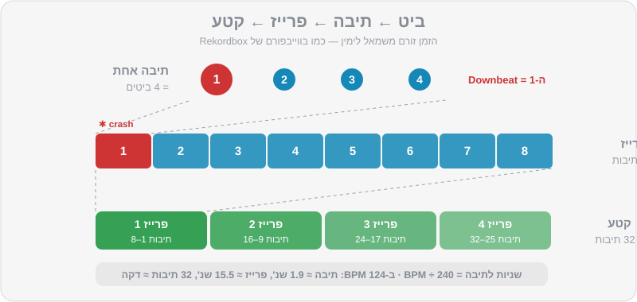
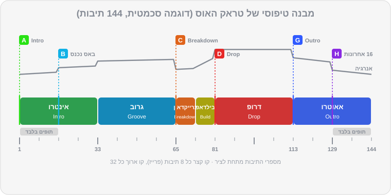

# מבנה מוזיקלי: ביט, תיבה ופרייז

שמתם לב פעם שבמסיבה טובה כל הרחבה "יודעת" מתי הדרופ מגיע? אנשים מרימים ידיים שנייה לפני, מישהו צועק, והבאס נוחת בדיוק כשציפו לו. זה לא קסם — זה מבנה. מוזיקה לריקודים בנויה כמו לגו: בלוקים קבועים של 8, 16 ו-32 תיבות. ברגע שתלמדו לשמוע את הבלוקים האלה, תדעו תמיד איפה אתם נמצאים בשיר, מה עומד לקרות, ומתי בדיוק להכניס את השיר הבא. זה הפרק הכי חשוב בחלק הראשון של המדריך — יותר אפילו מביטמאצ'ינג.

## מה תלמדו בפרק

- מה זה ביט (Beat), תיבה (Bar) ופרייז (Phrase), ואיך הם בנויים אחד על השני
- כמה זמן נמשכים 8, 16 ו-32 תיבות בקצבים שונים
- הקטעים של טראק אלקטרוני: אינטרו, גרוב, ברייקדאון, בילדאפ, דרופ, אאוטרו
- איך נראה טראק של DJ Lab מבפנים, ואיך לקרוא את קובץ ה-JSON שלו
- איך בנויים שירי מיינסטרים, היפ-הופ ומוזיקה ים-תיכונית — ולמה הם מסובכים יותר
- שיטת ספירה שעובדת, ואיך מוצאים את ה-"1" גם מאמצע שיר
- למה מעבר שמתחיל באמצע פרייז נשמע "לא נכון", ואיך מחשבים נקודת כניסה

## ביט, תיבה, פרייז

### ביט (Beat)

הדופק של השיר — מה שהרגל שלכם רוקעת עליו. בהאוס, טכנו ורוב המוזיקה האלקטרונית, יש מכת בס-דראם (Kick) על **כל** ביט. לזה קוראים Four-on-the-floor ("ארבע על הרצפה"). מעל ה-Kick יש בדרך כלל:

- **קלאפ או סנר** על ביטים 2 ו-4,
- **היי-האט פתוח** בין הביטים (ה-"אנד" — Off-beat), זה ה"צ'ה" שגורם להאוס להרגיש שהוא קופץ.

### תיבה (Bar)

ארבעה ביטים יוצרים תיבה אחת (במשקל 4/4, שהוא המשקל של כמעט כל מוזיקת הריקודים). הביט הראשון בתיבה — **ה-"1"** או ה-Downbeat — הוא החזק ביותר. שם קורים השינויים.

### פרייז (Phrase)

קבוצה של תיבות שיוצרת "משפט" מוזיקלי. במוזיקה אלקטרונית הפרייז הבסיסי הוא **8 תיבות**, ופרייזים מתחברים לבלוקים גדולים יותר של **16** ו-**32** תיבות. כמעט כל שינוי משמעותי — כניסת באס, כניסת ווקאל, ברייקדאון, דרופ — קורה בתחילת בלוק כזה.



### כמה זמן זה לוקח?

הנוסחה שכדאי לזכור: **שניות לתיבה = 240 ÷ BPM**. (60 שניות לדקה, כפול 4 ביטים בתיבה.)

| BPM | תיבה אחת | 8 תיבות | 16 תיבות | 32 תיבות |
|---|---|---|---|---|
| 95 (רגאטון / היפ-הופ) | 2.5 שנ' | 20.2 שנ' | 40.4 שנ' | 1:21 דק' |
| 100 (ים-תיכוני) | 2.4 שנ' | 19.2 שנ' | 38.4 שנ' | 1:17 דק' |
| 120 | 2.0 שנ' | 16.0 שנ' | 32.0 שנ' | 1:04 דק' |
| 124 (האוס) | 1.94 שנ' | 15.5 שנ' | 31.0 שנ' | 1:02 דק' |
| 128 (טק-האוס / ביג רום) | 1.88 שנ' | 15.0 שנ' | 30.0 שנ' | 1:00 דק' |
| 132 (טכנו) | 1.82 שנ' | 14.5 שנ' | 29.1 שנ' | 58 שנ' |

> 💡 טיפ: כלל אצבע להאוס וטק-האוס: **32 תיבות ≈ דקה אחת.** מעבר "ארוך" של 32 תיבות לוקח בערך דקה; ברייקדאון של 16 תיבות הוא חצי דקה. זה עוזר לתכנן זמנים בלי מחשבון.

## איך סופרים

השיטה הקלאסית: סופרים את הביטים, אבל במקום להגיד "1" בכל תיבה, אומרים את **מספר התיבה**:

```
1-2-3-4, 2-2-3-4, 3-2-3-4, 4-2-3-4, 5-2-3-4, 6-2-3-4, 7-2-3-4, 8-2-3-4
```

וכך אחרי 8 תיבות יודעים שנגמר פרייז, ומתחילים שוב מ-1. כדי לא לאבד את הספירה של הבלוק הגדול, אפשר לסמן על האצבעות: כל פרייז של 8 — אצבע אחת. ארבע אצבעות = 32 תיבות.

איך לא לאבד את ה-1:

1. **תקשיבו לסימני פרייז.** בסוף כמעט כל פרייז יש "סימן": מצילת קראש בתחילת הפרייז הבא, תיפוף קצר (Fill), רעש לבן שעולה, אלמנט שנכנס או נעלם.
2. **הזיזו את הגוף.** נענוע ראש על כל ביט, רקיעה חזקה יותר על ה-1. הספירה עוברת לגוף מהר יותר ממה שנדמה.
3. **השתמשו בעיניים — אבל רק כעזר.** בווייבפורם של Rekordbox רואים את הקווים של תחילת התיבות ושינויים בצבע ובגובה כשהבאס נכנס או יוצא. ה-Phrase analysis מוסיף מעל הווייבפורם פסים צבעוניים לפי קטעים. אבל המטרה היא לשמוע את זה, כי באמצע סט אין זמן לבהות במסך.

> ⚠️ זהירות: טעות המתחילים מספר 1 — לספור מה-Kick הראשון ששומעים, ולא מה-1 האמיתי. אם התחלתם לנגן שיר מאמצע, או שהשיר מתחיל ב-Fill קצר (מה שנקרא Pickup), אתם עלולים לספור "1" על הביט השלישי. הבדיקה: האם השינוי הבא בשיר נופל על ה-1 שלכם? אם הוא נופל על ה-3 — טעיתם, ותזיזו את הספירה.

## הקטעים של טראק אלקטרוני

| קטע | מה קורה | אורך טיפוסי | למה זה חשוב ל-DJ |
|---|---|---|---|
| **Intro** — אינטרו | תופים בלבד או כמעט בלבד, אלמנטים נכנסים בהדרגה | 16–32 תיבות | המקום להכניס את השיר החדש מתחת לשיר הקודם |
| **Groove / Verse** — גרוב | הבאס נכנס, הגרוב המלא, לפעמים ווקאל | 16–32 | הלב של הטראק — כאן הרחבה רוקדת |
| **Breakdown** — ברייקדאון | הבס-דראם והבאס יוצאים, נשארים מלודיה, פדים, ווקאל | 8–32 | "נשימה". רגע רגשי, המתח עולה |
| **Build-up** — בילדאפ | תיפוף מתגבר, רעש עולה, פילטר נפתח | 4–16 | מבטיח לרחבה שמשהו גדול מגיע |
| **Drop** — דרופ | הכול חוזר במלוא העוצמה | 16–32 | שיא האנרגיה |
| **Outro** — אאוטרו | אלמנטים יוצאים בהדרגה, בסוף תופים בלבד | 16–32 | המקום לצאת מהשיר לטובת הבא |

לא לכל טראק יש את כל הקטעים, ולא תמיד באותו סדר. בטכנו היפנוטי, למשל, אין דרופ "קלאסי" — הטראק משתנה באיטיות, אלמנט נכנס ואלמנט יוצא כל 8 או 16 תיבות. במלודיק טכנו יש בדרך כלל ברייקדאון ארוך ודרמטי באמצע. בביג רום יש בילדאפ קצר וחזק ודרופ מתפוצץ.

## איך נראה טראק של DJ Lab מבפנים

כל הטראקים של DJ Lab בנויים לפי כללים קבועים שמתאימים ל-DJs:

- הביט הראשון בשנייה 0.0 — ה-1 הראשון הוא תחילת הקובץ.
- **אינטרו של לפחות 16 תיבות (בדרך כלל 32)** של תופים וכלי הקשה, **בלי באס ובלי מלודיה ב-16 התיבות הראשונות.**
- **אאוטרו של לפחות 16 תיבות (בדרך כלל 32)** שהוא תמונת מראה של האינטרו: הבאס יוצא, ובסוף נשארים רק תופים.
- כל גבול בין קטעים נופל על כפולה של 8 תיבות.
- סימן פרייז עדין (קראש או תיפוף) כל 8 או 16 תיבות.

כך נראה טראק טיפוסי בסגנון האוס / טק-האוס (הדוגמה סכמטית — לכל טראק החלוקה המדויקת שלו):



### לקרוא את ה-JSON

בקובץ ה-JSON של כל טראק יש שדה `sections` — רשימת הקטעים:

```json
"sections": [
  {"name": "Intro",     "start_bar": 0,  "bars": 32, "start_sec": 0.0,   "energy": 4},
  {"name": "Groove",    "start_bar": 32, "bars": 32, "start_sec": 61.0,  "energy": 6},
  {"name": "Breakdown", "start_bar": 64, "bars": 16, "start_sec": 121.9, "energy": 5}
]
```

(זו דוגמה. את הערכים האמיתיים תמצאו בקובץ של כל טראק.)

שימו לב: ב-JSON הספירה מתחילה מ-0. `"start_bar": 64` אומר שהברייקדאון מתחיל ב**תיבה 65** בספירה הרגילה. ולמה 121.9 שניות? כי ב-126 BPM כל תיבה היא 240÷126 = 1.905 שניות, ו-64 תיבות שלמות עברו לפני כן: 64 × 1.905 ≈ 121.9.

## ומה עם מיינסטרים, היפ-הופ ומוזיקה ים-תיכונית?

כאן החיים פחות מסודרים, וחשוב להכיר את זה כבר עכשיו, כי באירועים ישראליים תנגנו הרבה מזה.

### פופ ודאנס-פופ

מבנה של בית–פזמון (Verse–Chorus): אינטרו קצר, בית (8 או 16 תיבות), Pre-Chorus (לפעמים 4 תיבות!), פזמון, וחוזר חלילה. גרסאות הרדיו (Radio Edit) מתחילות כמעט מיד בשירה — אינטרו של 4 או 8 תיבות בלבד. לכן DJs מחפשים **Extended Mix** או גרסאות DJ עם אינטרו ואאוטרו ארוכים, או משתמשים בלופים (פרק 7).

### היפ-הופ ו-R&B

הפרייזים הם לרוב של **4 תיבות** (שורה של ראפ = תיבה אחת, ארבע שורות = "בית קטן"). בית קלאסי בהיפ-הופ הוא 16 תיבות — מכאן הביטוי "16 Bars". הפזמון (Hook) בדרך כלל 8 תיבות. האינטרו קצר, ולפעמים מתחיל ישר בראפ. אין בס-דראם על כל ביט, ולכן "לשמוע את ה-1" דורש להקשיב ל-Kick החזק ולסנר על 2 ו-4.

### רגאטון ואפרוביטס

הקצב בנוי על דפוס חוזר (בדמבו של הרגאטון: "בום — צ'יק — בום-צ'יק") שחוזר כל תיבה. פרייזים של 8 תיבות, קטעים קצרים, שינויים מהירים. כאן "ה-1" נשמע ב-Kick הראשון של הדפוס.

### ים-תיכוני ומזרחית

שלושה דברים מיוחדים:

1. **פתיחה חופשית (תקסים).** הרבה שירים נפתחים בסולו של עוד, כינור או קול — בלי קצב קבוע. אי אפשר לעשות ביטמאצ'ינג לקטע כזה. או שמתחילים את השיר אחרי הפתיחה, או שעושים מעבר "קאט" ומשאירים את הפתיחה לרגע של "וואו" (פרק 6).
2. **הקלטות "חיות".** מתופף או דרבוקאי אמיתי = קצב שזז מעט. ה-Beatgrid צריך ניתוח Dynamic, ו-Sync עלול לא לעבוד טוב (פרק 2, פרק 4).
3. **פרייזים של 8 תיבות, אבל עם מילוי של דרבוקה** שמסמן מעבר — אוזן מאומנת שומעת אותו מרחוק.

בטראקים של DJ Lab בסגנונות האלה (`mainstream-05` עד `mainstream-16`) האינטרו והאאוטרו קצרים יותר (8–16 תיבות) — כמו במוזיקה האמיתית — אבל עדיין מיושרים לפרייזים. זה מקום מצוין להתאמן על הסגנונות האלה בלי הכאב של הקלטות חיות.

## למה זה חשוב: Phrase Mixing

אם תכניסו שיר חדש בדיוק על ה-1 של פרייז בשיר הנוכחי, השינויים בשני השירים יקרו **באותו רגע**: כשבשיר הישן נכנס קראש, גם בחדש מתחיל פרייז. האוזן של הרחבה שומעת יצירה אחת שזורמת. אם תכניסו אותו 4 תיבות "מאוחר", השינויים ייפלו באמצע משפט של השיר השני — וגם אם התופים מסונכרנים בצורה מושלמת, המעבר ירגיש מבולבל. זו הסיבה שמתחילים רבים עושים Sync מושלם ועדיין נשמעים "לא נכון".

### נקודת הכניסה הקלאסית

הטראקים של DJ Lab בנויים כך שהשיטה הפשוטה ביותר עובדת מושלם:

1. בשיר היוצא (A) מגיעים לתחילת האאוטרו — **Hot Cue G**.
2. על ה-1 של אותה תיבה מתחילים את השיר הנכנס (B) מתחילתו — **Hot Cue A**.
3. 32 תיבות האאוטרו של A חופפות ל-32 תיבות האינטרו של B. גבולות הפרייזים נופלים יחד.
4. בבונוס: ברוב הטראקים, בדיוק באמצע (תיבה 17 של המעבר) הבאס של A יוצא והבאס של B נכנס. זה כמעט Bass Swap אוטומטי — נלמד לעשות אותו כמו שצריך בפרק 6.

### נקודת כניסה מחושבת

לפעמים רוצים שמשהו מסוים בשיר החדש — נניח הדרופ — ינחת ברגע מסוים בשיר הישן. החישוב:

> **תיבת ההתחלה של B (בתוך A) = התיבה ב-A שבה הדרופ צריך לנחות − (תיבת הדרופ ב-B − 1)**

דוגמה: אתם רוצים שהדרופ של B, שנמצא בתיבה 65 של B, ינחת בדיוק כשהאאוטרו של A מתחיל בתיבה 113 של A. אז מתחילים את B כש-A נמצא בתיבה 113 − 64 = **49**. כלומר: מתחילים את B על ה-1 של תיבה 49 ב-A, ונותנים לשניהם לרוץ יחד (עם הרבה עבודת EQ, פרק 5–6).

> 💡 טיפ: לא צריך לחשב בזמן הסט. בדיוק בשביל זה יש Hot Cues ו-Memory Cues על גבולות הקטעים (פרק 7) — סופרים מהם, לא מתחילת השיר.

## תרגילים

> 🎧 תרגיל 1 — הספירה הראשונה (10 דקות): נגנו את `music/practice/practice-01-phrase-counter-124.mp3`. יש בו מצילת קראש כל 8 תיבות וצליל "פעמון" כל 32 תיבות. ספרו בקול "1-2-3-4, 2-2-3-4…" עד 8, ובדקו שהקראש נופל בדיוק כשאתם חוזרים ל-1. אחרי שזה עובד, ספרו גם את הפרייזים על האצבעות, ובדקו שהפעמון מגיע אחרי ארבע אצבעות.

> 🎧 תרגיל 2 — בעיניים עצומות: אותו קובץ, אבל הפעם עצמו עיניים ונסו **לחזות** את הקראש: הרימו יד חצי שנייה לפני שהוא מגיע. כשתצליחו 8 פעמים ברצף — המוח שלכם כבר סופר לבד.

> 🎧 תרגיל 3 — מיפוי טראק: נגנו את `music/tracks/house/house-03-hands-up-florentin.mp3` מההתחלה וספרו. רשמו ביומן: באיזו תיבה נכנס הבאס? מתי הברייקדאון? מתי הדרופ? מתי האאוטרו? אחר כך פתחו את `house-03-hands-up-florentin.json` והשוו לשדה `sections`. כמה פגעתם?

> 🎧 תרגיל 4 — מלודיק טכנו: עשו את אותו מיפוי ל-`music/tracks/melodic_techno/techno-05-neon-cathedral.mp3`. שימו לב כמה הברייקדאון ארוך יותר, ואיך הבילדאפ "מבטיח" את הדרופ.

> 🎧 תרגיל 5 — למצוא את ה-1 מהאמצע: טענו את `music/tracks/afro_house/house-09-desert-drums.mp3`, קפצו לנקודה אקראית באמצע (לחיצה על הווייבפורם הכללי) ונגנו. תוך 16 תיבות לכל היותר, מצאו את תחילת הפרייז הבא — על פי קראש, תיפוף או כניסה של כלי. לחצו CUE כשאתם בטוחים, והשוו לקווים של תחילת התיבות ב-Rekordbox. חזרו על זה 10 פעמים בנקודות שונות.

> 🎧 תרגיל 6 — פרייזים של היפ-הופ: נגנו את `music/tracks/hip_hop/mainstream-05-boom-bap-avenue.mp3` (92 BPM). ספרו פרייזים של 4 תיבות. האם אתם שומעים איפה מתחיל ונגמר "בית" של 16 תיבות? שימו לב: אין Kick על כל ביט — הקשיבו לסנר על 2 ו-4.

> 🎧 תרגיל 7 — לשמוע פרייז נכון ולא נכון (מותר להשתמש ב-Sync!): טענו את `practice-01` לדק 1 ואת `music/tracks/house/house-04-piano-saturday.mp3` לדק 2, והפעילו Sync בדק 2 (ביטמאצ'ינג ידני נלמד רק בפרק הבא). נגנו את `practice-01`, ובדיוק על הפעמון (תחילת תיבה 33) הפעילו את `house-04` מ-Hot Cue A. העלו את שני הפיידרים ושימו לב איך הקראשים והשינויים נופלים יחד. עכשיו חזרו על זה, אבל הפעילו את `house-04` ארבע תיבות אחרי הפעמון. שמעתם את ההבדל? זה ההבדל בין מעבר שזורם למעבר ש"מתנגש".

## סיכום

- 4 ביטים = תיבה. 8 תיבות = פרייז. 16 ו-32 תיבות = קטעים. כמעט כל שינוי קורה על ה-1 של פרייז.
- הנוסחה: שניות לתיבה = 240 ÷ BPM. בהאוס, 32 תיבות ≈ דקה.
- טראק אלקטרוני: אינטרו → גרוב → ברייקדאון → בילדאפ → דרופ → אאוטרו. מיינסטרים, היפ-הופ ומזרחית בנויים אחרת, עם אינטרו קצר יותר.
- טראקים של DJ Lab: אינטרו ואאוטרו נקיים של 16–32 תיבות, גבולות על כפולות של 8, וה-JSON מפרט את כל הקטעים (ספירה מ-0).
- מעבר טוב מיישר פרייזים: Hot Cue G של השיר היוצא ↔ Hot Cue A של השיר הנכנס.
- ספרו בקול, הזיזו את הגוף, והשתמשו במסך רק כעזר.

## בפרק הבא

יודעים לספור? מעולה. עכשיו נגרום לשני שירים לרוץ באותה מהירות בדיוק — באוזניים, בלי Sync: BPM, Tempo Fader, Jog Wheel, ושיטת הביטמאצ'ינג צעד אחר צעד.

👉 [פרק 4 — BPM וביטמאצ'ינג](04-bpm-beatmatching.md)
