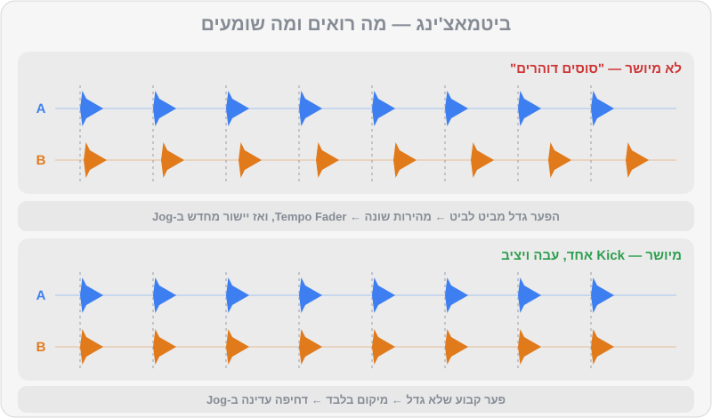

# BPM וביטמאצ'ינג

יש רגע שכל DJ זוכר: אחרי דקות של "סוסים דוהרים" באוזניות — שני תופים שמתנגשים, מקדימים, מאחרים — פתאום הכול נועל. שני ה-Kicks הופכים למכה אחת, עבה ושלמה, וזה פשוט נשאר שם. זה Beatmatching. נכון, ל-Rekordbox יש כפתור Sync שעושה את זה בשבריר שנייה. אז למה ללמוד את זה ביד? כי Sync סומך על ה-Beatgrid, וה-Beatgrid לא תמיד צודק; כי ציוד במועדון לא תמיד מחובר כמו שצריך; וכי האוזן שתתאמנו כאן היא אותה אוזן שתשמע בהמשך מתי מעבר "יושב" ומתי לא. בפרק הזה נבנה את המיומנות הזו בהדרגה, עם קבצי תרגול שנבנו בדיוק בשביל זה.

## מה תלמדו בפרק

- מה זה BPM, אילו קצבים מאפיינים כל ז'אנר, ומה זה "חצי קצב" ו"קצב כפול"
- איך עובד ה-Tempo Fader, מה זה טווח Tempo, ואיך מחשבים אחוזים
- למה Master Tempo (Key Lock) חייב להיות דולק כמעט תמיד
- ההבדל בין **מהירות** (Tempo) ל**מיקום** (Phase), ולמה צריך לתקן את שניהם
- איך משתמשים ב-Jog Wheel לדחיפה עדינה (Pitch Bend)
- שיטת ביטמאצ'ינג באוזן, צעד אחר צעד, וטבלת אבחון "מה אני שומע ומה לעשות"
- Sync: איך הוא עובד, מתי כן ומתי לא
- סדרת תרגילים הדרגתית עם `practice-02` עד `practice-07`

## מה זה BPM

הקיצור BPM (Beats Per Minute) פירושו מספר הביטים בדקה. 124 BPM אומר 124 מכות Kick בדקה. ככל שהמספר גבוה יותר, השיר מהיר יותר. כל ז'אנר חי בטווח קצבים אופייני:

| ז'אנר | טווח טיפוסי | דוגמאות מ-DJ Lab |
|---|---|---|
| לו-פיי / דאונטמפו | 70–90 | `breadth-10` (84) |
| היפ-הופ | 85–100 | `mainstream-05` (92), `mainstream-07` (95) |
| רגאטון | 88–100 | `mainstream-09` (92), `mainstream-08` (95) |
| ים-תיכוני / מזרחית למסיבות | 95–130 (רחב מאוד) | `mainstream-13` (100), `mainstream-14` (104), `mainstream-15` (124) |
| אפרוביטס | 100–115 | `mainstream-11` (104), `mainstream-12` (106) |
| אמאפיאנו | 110–115 | `house-14` (113) |
| נו-דיסקו | 110–122 | `house-13` (116), `house-12` (118) |
| דיפ-האוס / אפרו-האוס | 118–124 | `house-02` (121), `house-01` (122), `house-09` (122) |
| האוס | 120–126 | `house-03`, `house-04` (124) |
| מלודיק טכנו | 120–126 | `techno-05` (122), `techno-07` (124) |
| טק-האוס | 124–128 | `house-05` (126), `house-06` (127), `house-07` (128) |
| ביג רום | 126–130 | `mainstream-01`, `mainstream-02` (128) |
| טכנו | 128–140 | `techno-04` (129), `techno-01` (130), `techno-03` (132) |
| טראנס / פסיי-טראנס | 132–148 | `breadth-04` (134), `breadth-03` (138), `breadth-01` (142) |
| הארד טכנו | 145–160 | `techno-11` (148), `techno-12` (150) |
| דראם אנד בייס | 170–176 | `breadth-06` (172), `breadth-05` (174) |

### חצי קצב וקצב כפול

שיר ב-140 BPM יכול להרגיש איטי — כמו טראפ או דאבסטפ, שבהם הסנר מגיע רק פעם בתיבה ("Half-time"). ושיר היפ-הופ ב-87 "מתאים" לדראם אנד בייס ב-174, כי 87 × 2 = 174. זה חשוב לשני דברים: Rekordbox לפעמים מזהה BPM כפול או חצי (פרק 2), ובהמשך, במעברי ז'אנר, אפשר לנצל את היחס הזה (פרק 15).

## ה-Tempo Fader

הפיידר הארוך בצד של כל דק משנה את מהירות השיר. הוא מראה **אחוזים** מהמהירות המקורית:

> **BPM חדש = BPM מקורי × (1 + אחוז ÷ 100)**
>
> **האחוז הדרוש = (BPM היעד ÷ BPM המקורי − 1) × 100**

| מ... | ל... | שינוי |
|---|---|---|
| 124 | 126 | ‎+1.61%‎ |
| 128 | 124 | ‎−3.13%‎ |
| 120 | 124 | ‎+3.33%‎ |
| 125.5 | 124 | ‎−1.20%‎ |
| 122.7 | 124 | ‎+1.06%‎ |
| 95 | 124 | ‎+30.5%‎ — יותר מדי! כאן צריך טכניקת מעבר אחרת (פרק 15) |

> ⚠️ זהירות: בציוד של Pioneer DJ / AlphaTheta, **הזזת הפיידר לכיוונכם (למטה) מאיצה (+)**, והזזה הרחק מכם (למעלה) מאטה (−). זה הפוך ממה שרוב האנשים מצפים בהתחלה. הסתכלו על הסימונים ליד הפיידר.

### טווח ה-Tempo

אורך הפיידר קבוע, אבל אפשר לקבוע כמה אחוזים הוא מכסה: ±6%, ±10%, ±16% או WIDE (טווח רחב מאוד). ככל שהטווח צר יותר, כל מילימטר של תזוזה משנה פחות — כלומר **שליטה עדינה ומדויקת יותר**.

| טווח | לשיר של 124 BPM | מתי |
|---|---|---|
| ±6% | 116.6–131.4 | תרגול דיוק, סטים בתוך ז'אנר אחד |
| ±10% | 111.6–136.4 | ברירת מחדל טובה לרוב הסטים |
| ±16% | 104.2–143.8 | מעברי ז'אנר גדולים |
| WIDE | כמעט כל דבר | אפקטים ותעלולים, לא לביטמאצ'ינג |

> 🎚️ ב-Rekordbox: את טווח ה-Tempo רואים ליד ה-BPM בכל דק, ואפשר ללחוץ עליו כדי לשנות. ב-`DDJ-FLX4`, לחיצה על BEAT SYNC בזמן החזקת SHIFT מחליפה בין הטווחים ±6% → ±10% → ±16% → WIDE.

### Master Tempo (Key Lock)

כשמאיצים תקליט ויניל, הקול גם עולה בגובה — כמו "צ'יפמאנקס". שינוי של כ-6% במהירות מזיז את הצליל בערך בחצי טון (Semitone). Master Tempo (נקרא גם Key Lock) שומר על הגובה המקורי גם כשמשנים מהירות.

- **השאירו אותו דולק** כמעט תמיד. אחרת הסולם משתנה, ומיקס הרמוני (פרק 10) מפסיק לעבוד.
- בשינויים גדולים (מעל 6–8%), Master Tempo מתחיל לייצר "ארטיפקטים" — צליל קצת מתכתי או מרוח. זה סימן שהשירים רחוקים מדי בקצב.

## שתי בעיות: מהירות ומיקום

זה הרעיון הכי חשוב בפרק. כשמנסים ליישר שני שירים, יש **שתי בעיות נפרדות**:

1. **מהירות (Tempo)** — האם שני השירים רצים באותו BPM? אם לא, הם יתרחקו אחד מהשני עם הזמן. **מתקנים עם ה-Tempo Fader.**
2. **מיקום (Phase)** — גם אם המהירות זהה, האם ה-Kicks נופלים באותו רגע? אולי B מתחיל רבע ביט מוקדם מדי. **מתקנים עם ה-Jog Wheel.**

המשל: שני רצים על מסלול. ה-Tempo Fader קובע את המהירות של כל אחד. ה-Jog Wheel הוא "דחיפה קטנה בגב" או "משיכה בחולצה" — שינוי זמני, שמזיז את הרץ קדימה או אחורה בלי לשנות את המהירות הקבועה שלו.

### כמה מדויק צריך להיות?

כאן מגיעה הפתעה: הפרש של **1 BPM בלבד** גורם לשירים להתרחק **בביט שלם כל דקה**. ב-124 BPM ביט אחד הוא כמעט חצי שנייה (484 אלפיות). אפילו הפרש של 0.1 BPM יוצר סטייה של כ-48 אלפיות שנייה בדקה — והאוזן מתחילה לשמוע "כפל" ב-Kick כבר בסביבות 15–20 אלפיות. לכן ביטמאצ'ינג ידני הוא לא "פעם אחת וסיימנו": גם אחרי שהמהירות כמעט מושלמת, נוגעים ב-Jog מדי פעם כדי להחזיק את הנעילה.

## ה-Jog Wheel

לגלגל הגדול יש שני אזורים:

- **המשטח העליון** — כשמצב Vinyl פועל, נגיעה בו "תופסת" את התקליט: עוצרת אותו או מאפשרת סקרץ'. **לא נוגעים בו בזמן ביטמאצ'ינג** של שיר שמתנגן.
- **הטבעת בצד** — סיבוב בכיוון השעון מאיץ לרגע (דוחף קדימה), נגד כיוון השעון מאט לרגע (מושך אחורה). זה ה-Pitch Bend, הכלי לתיקון מיקום.

> 💡 טיפ: דחיפה עדינה עדיפה על דחיפה חזקה. סיבוב קצר וקל של הטבעת — כמו ללטף — ואז מקשיבים. עוד נגיעה קטנה, ושוב מקשיבים. מתחילים נוטים "לנער" את הגלגל ואז לפספס לצד השני.

## שיטת הביטמאצ'ינג — צעד אחר צעד

הסטאפ: בדק 1 (A) מתנגן שיר דרך ה-Master. בדק 2 (B) טעון השיר החדש. האוזניות על הראש, כפתור ה-CUE של ערוץ 2 דולק, והפיידר של B למטה (הקהל לא שומע אותו).

1. **כסו את מסך ה-BPM של B** (פתק דביק על המסך, ממש). אנחנו מאמנים אוזניים.
2. **מצאו את ה-1 של B.** ב-DJ Lab זה פשוט — Hot Cue A. בשירים אחרים: ה-Kick הראשון של פרייז.
3. **ספרו את A** בקול או בראש: "1-2-3-4, 2-2-3-4…".
4. **שחררו את B על ה-1** של פרייז ב-A (לחיצה על PLAY בדיוק על ה-Kick).
5. **הקשיבו לשניהם יחד.** אפשרות אחת: אוזנייה אחת על B, אוזן שנייה פתוחה ל-A ברמקולים. אפשרות שנייה: ידית ה-Headphones Mix באמצע, ושני השירים באוזניות (פרק 8).
6. **תקנו מיקום.** אם ה-Kicks לא נופלים יחד — דחיפה קטנה ב-Jog של B. לא בטוחים לאיזה כיוון? ראו "דחיפת בדיקה" בהמשך.
7. **בדקו סחיפה.** אחרי שיישרתם, אל תיגעו כמה שניות. B מתחיל "לברוח קדימה"? הוא מהיר מדי — הזיזו את ה-Tempo Fader של B מעט לכיוון האטה (−). B "נגרר אחורה"? איטי מדי — הזיזו מעט לכיוון האצה (+).
8. **אחרי כל הזזת פיידר — ישרו שוב עם ה-Jog.** הפיידר תיקן מהירות, אבל בינתיים המיקום כבר זז.
9. **חזרו על 7–8** בתנועות שהולכות וקטנות, עד ש-B נשאר נעול 16 תיבות בלי לגעת.
10. **עכשיו הציצו.** הורידו את הפתק. B אמור להראות BPM קרוב מאוד ל-A (למשל 124.0 מול 124.0 או 124.1).
11. **סבב שני:** חזרו ל-Hot Cue A של B ושחררו אותו שוב על ה-1 הבא של פרייז. המהירות כבר נכונה — רק מיקום. כך מתרגלים את ה"שחרור על ה-1".

### דחיפת בדיקה — הטריק למי שלא שומע מי מקדים

בהתחלה קשה לשמוע מי מהשניים "ראשון". הפתרון: דחפו את B קצת **קדימה**.

- נהיה **יותר גרוע**? B כבר היה לפני A. דחפו אותו פעמיים אחורה.
- נהיה **יותר טוב**? B היה מאחור. המשיכו בדחיפות קטנות קדימה.

זה לוקח שנייה, ותוך שבוע תתחילו לשמוע את הכיוון בלי לבדוק.

### מה אני שומע — ומה לעשות

| מה שומעים | מה זה אומר | מה עושים |
|---|---|---|
| "כפל" קבוע ב-Kick (פלאם) שלא משתנה | המהירות נכונה, המיקום לא | Jog בלבד |
| "כפל" שהולך וגדל לאט | מהירות כמעט נכונה | תזוזה זעירה ב-Fader, ואז Jog |
| "סוסים דוהרים" — בלגן שמשתנה מהר | פער מהירות גדול | תזוזה משמעותית ב-Fader לכיוון הנכון |
| הקלאפים "נמרחים", ה-Kicks נשמעים כמעט יחד | מיקום כמעט נכון | נגיעה קטנטנה ב-Jog |
| Kick אחד, עבה ויציב, שנשאר כך 16 תיבות | נעול! 🎉 | להנות, ולהקשיב כל כמה שניות |
| הכול נשמע נכון, אבל השינויים בשירים לא נופלים יחד | ביטים מיושרים, פרייזים לא | התחילו את B מחדש על ה-1 של פרייז (פרק 3) |

> 💡 טיפ: כשה-Kicks מתערבבים ולא ברור מה קורה, הקשיבו לצלילים הגבוהים — הקלאפ, הסנר, ההיי-האט הפתוח. הם קצרים וחדים, ולכן קל יותר לשמוע מי מהם מקדים.

## עזרים חזותיים — בזהירות

התוכנה מציגה את שני הווייבפורמים אחד מעל השני, ואפשר לראות אם ה-Kicks (הפסים הגבוהים) מיושרים. יש גם תצוגות כמו Phase Meter (אם היא מופעלת אצלכם בתצוגה) שמראות אם ה-1 של שני הדקים מיושר. זה עוזר — אבל:

- **העיניים משקרות כשה-Beatgrid לא נכון.** בטראק עם מתופף חי, הווייבפורם יכול להיראות מיושר כשהאוזן שומעת אחרת.
- **במועדון, המסך רחוק והאור חלש.** האוזן תמיד איתכם.

השתמשו בעיניים כדי לבדוק את עצמכם אחרי שהאוזן החליטה, לא במקומה.

## Sync — מתי כן ומתי לא

### איך הוא עובד

> 🎚️ ב-Rekordbox: דק אחד מוגדר כ-MASTER (בדרך כלל זה שמתנגן לקהל). לחיצה על SYNC בדק השני מתאימה אותו ל-Master. יש שני סוגים:
> - **BEAT SYNC** — מתאים גם את ה-BPM וגם את מיקום הביטים לפי ה-Beatgrid.
> - **BPM SYNC** — מתאים רק את ה-BPM. את המיקום תצטרכו ליישר בעצמכם עם ה-Jog.

ה-Sync עובד יחד עם **Quantize**: כש-Quantize דולק, Hot Cues, לופים ו-Beat Jump "נצמדים" לקווי הרשת, כך שקפיצה באמצע שיר לא תוציא אותו מהקצב.

### מתי Sync הוא חבר

- כשה-Beatgrid בדוק ונכון (כמו בכל הטראקים של DJ Lab, ובספרייה שהכנתם כמו בפרק 2).
- כשאתם רוצים לפנות קשב ליצירתיות: אפקטים, לופים, Hot Cues, ארבעה דקים.
- בתרגילי פרייזים וספירה (כמו בפרק 3), כשהמטרה היא לא הביטמאצ'ינג.
- בהופעה לחוצה, כגיבוי — אחרי שאתם **יודעים** לעשות את זה ביד.

### מתי Sync הוא אויב

- **Beatgrid שגוי** — Sync יסנכרן "בביטחון מלא" לרשת הלא נכונה, והתוצאה תהיה התנגשות.
- **הקלטות עם קצב משתנה** — הרבה מזרחית, פופ ישראלי ישן, פאנק, דיסקו. גם עם ניתוח Dynamic, צריך אוזן ששומרת.
- **כשאתם עדיין לומדים** — אם תתחילו עם Sync, לא תפתחו את האוזן. התחייבו לשבועיים-שלושה בלי Sync בכלל.

> ⚠️ זהירות: גם עם Sync דולק, **ספירת פרייזים היא באחריותכם.** Sync מיישר ביטים, לא משפטים מוזיקליים. מעבר עם Sync שמתחיל באמצע פרייז נשמע גרוע בדיוק כמו בלי Sync.

## תרגילים

סדר התרגילים כאן חשוב: כל אחד מוסיף רק קושי אחד. אל תדלגו.

> 🎧 תרגיל 1 — מיקום בלבד: טענו את `music/practice/practice-03-drums-124.mp3` **לשני הדקים**. נגנו את דק 1. התחילו את דק 2 בכוונה "לא בזמן" (לחצו PLAY סתם, באמצע ביט). עכשיו, רק עם ה-Jog של דק 2, ישרו את ה-Kicks. המהירות זהה, אז ברגע שמיישרים — זה נשאר. חזרו על זה 20 פעמים, ונסו להשתמש בדחיפת בדיקה עד שאתם שומעים את הכיוון בלי לנסות.

> 🎧 תרגיל 2 — המהירות הראשונה: דק 1: `practice-03` (124). דק 2: `music/practice/practice-04-drums-128.mp3` (128). כסו את מסך ה-BPM של דק 2 ועברו על שיטת 11 השלבים. היעד: לנעול את דק 2 על 124 (כלומר בערך ‎−3.1%‎). אחר כך הציצו — כמה קרוב הייתם?

> 🎧 תרגיל 3 — הכיוון ההפוך: עכשיו `practice-04` (128) בדק 1, ו-`practice-03` (124) בדק 2. הפעם צריך להאיץ את דק 2 (בערך ‎+3.2%‎). שימו לב איך "בורח קדימה" ו"נגרר אחורה" מתהפכים.

> 🎧 תרגיל 4 — פערים גדולים יותר: `music/practice/practice-02-drums-120.mp3` מול `music/practice/practice-05-drums-132.mp3`. פער של 10% — תצטרכו טווח Tempo של ±10% לפחות, ואולי ±16%. שימו לב כמה הפיידר רגיש בטווח הרחב.

> 🎧 תרגיל 5 — טמפו עקום: `practice-03` (124) בדק 1, ו-`music/practice/practice-06-odd-tempo-125_5.mp3` (125.5) בדק 2. מספר לא עגול מכריח אתכם להקשיב ולא "לכוון למספר". אחר כך אותו דבר עם `music/practice/practice-07-odd-tempo-122_7.mp3` (122.7) — כאן ההבדל קטן מאוד, ותצטרכו תזוזות פיידר זעירות ועבודת Jog עדינה.

> 🎧 תרגיל 6 — מוזיקה אמיתית: עכשיו עם טראקים שלמים, ולכל זוג שחררו את השיר השני על ה-1 של פרייז:
> - `music/tracks/house/house-03-hands-up-florentin.mp3` ו-`music/tracks/house/house-04-piano-saturday.mp3` (124 / 124 — מיקום בלבד).
> - `music/tracks/tech_house/house-05-groove-machine.mp3` ו-`music/tracks/tech_house/house-06-bassline-bandit.mp3` (126 / 127).
> - `music/tracks/afro_house/house-09-desert-drums.mp3` ו-`music/tracks/afro_house/house-11-spirit-dance.mp3` (122 / 122 — שימו לב, בכלי הקשה אפריקאיים קשה יותר לשמוע את ה-Kick!).
> - `music/tracks/techno/techno-01-concrete-pulse.mp3` ו-`music/tracks/techno/techno-04-night-shift.mp3` (130 / 129).

> 🎧 תרגיל 7 — שעון עצר: בכל סשן, מדדו כמה זמן לוקח לכם מלחיצת PLAY על B עד נעילה שמחזיקה 8 תיבות בלי לגעת. רשמו ביומן. יעד סביר: פחות מ-30 שניות בסוף השבוע השני, פחות מ-15 שניות אחרי חודש.

> 🎧 תרגיל 8 — לשמוע את Master Tempo: טענו את `house-04` והזיזו את ה-Tempo ל-‎+8%‎. כבו והדליקו את Master Tempo והקשיבו לפסנתר: מה קורה לגובה הצליל? ומה קורה לאיכות הצליל כשהוא דולק בשינוי כזה גדול? החזירו ל-0 בסיום.

> 💡 טיפ: עשרים דקות ביום של תרגילים 1–5 במשך שבועיים יעשו יותר מכל סרטון ביוטיוב. ביום שבו תשמעו את הנעילה בלי לחשוב — תדעו.

## סיכום

- BPM = ביטים לדקה. לכל ז'אנר טווח משלו; שימו לב לחצי קצב וקצב כפול.
- ה-Tempo Fader משנה מהירות באחוזים. טווח צר = דיוק. בציוד Pioneer, למטה = מהר יותר.
- Master Tempo דולק כמעט תמיד, כדי שהסולם לא ישתנה.
- ביטמאצ'ינג = שתי בעיות: **מהירות** (Fader) ו**מיקום** (Jog). אחרי כל תיקון מהירות — מיישרים מיקום מחדש.
- לא בטוחים מי מקדים? דחיפת בדיקה קדימה: גרוע יותר = B היה לפני.
- Sync מצוין כשה-Grid נכון, מסוכן כשהוא לא. ספירת פרייזים תמיד עליכם.

## בפרק הבא

שני שירים רצים יחד — אבל אם פשוט נעלה את שני הפיידרים, נקבל בוץ: שני באסים, עוצמה שעולה לאדום, ומערכת שצועקת. בפרק הבא נלמד לשלוט במיקסר: Gain, מטרים, EQ ופילטר.

👉 [פרק 5 — מיקסר, Gain ו-EQ](05-mixer-gain-eq.md)
