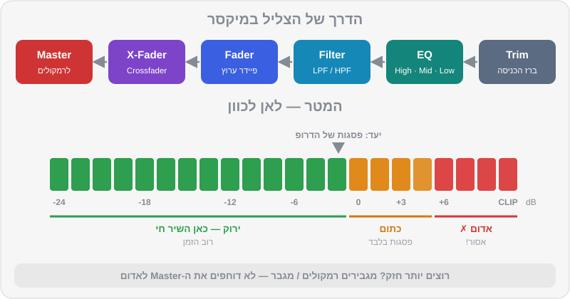
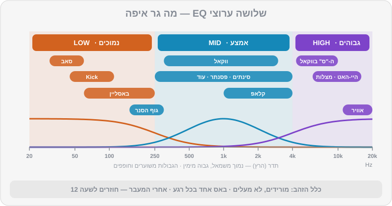

# המיקסר: Gain, מטרים, EQ ופילטר

ביטמאצ'ינג מושלם לא מבטיח מעבר טוב. תנסו: יישרו שני טראקים של טק-האוס ופשוט העלו את שני הפיידרים. מה שתשמעו הוא בוץ — שני באסים שנלחמים זה בזה, Kick שנשמע "שטוח", ועוצמה שקופצת פתאום. המיקסר הוא הכלי שהופך שני שירים לשיר אחד. הוא גם הכלי שבו רואים מיד מי DJ מקצועי ומי לא: המקצוען לא נוגע בהרבה כפתורים, הוא נוגע בכפתורים הנכונים — ולעולם לא נותן למטר להגיע לאדום.

## מה תלמדו בפרק

- הדרך שהצליל עושה במיקסר, מה-Trim ועד ה-Master
- כיוון עוצמה (Gain Staging): איך קובעים עוצמה נכונה לכל שיר, צעד אחר צעד
- איך קוראים מטרים, ולמה אדום = רע
- שלושת ערוצי ה-EQ: מה גר בכל תחום תדרים
- ההבדל בין EQ ל-Isolator
- פילטר: מתי הוא עדיף על EQ
- פיידרים, Crossfader ועקומות
- היציאות Master, Booth ו-Cue — מה הולך לאן

## הדרך של הצליל

כל ערוץ במיקסר (בקונטרולר, בתוכנה או במיקסר מועדון) בנוי באותו סדר, מלמעלה למטה:

1. ידית **Trim / Gain** — "ברז הכניסה". קובע כמה חזק השיר נכנס לערוץ.
2. ה-**EQ** — High, Mid, Low. מעצב את הצליל.
3. ה-**Filter / Color FX** — ידית אחת שמסננת גבוהים או נמוכים.
4. ה-**Channel Fader** — הפיידר האנכי. כמה מהערוץ נשלח למיקס.
5. ה-**Crossfader** — הפיידר האופקי. מעבר בין צד שמאל לצד ימין.
6. ה-**Master Level** — העוצמה של המיקס כולו, מה שיוצא לרמקולים.

> 💡 טיפ: הסדר הזה חשוב. Trim קובע את "חומר הגלם", כל השאר עובדים עליו. אם ה-Trim שגוי, כל השאר יעבוד קשה כדי לתקן — ויצא פחות טוב.

## כיוון עוצמה (Gain Staging) לכל שיר

לא כל השירים מוקלטים באותה עוצמה. טראק טכנו חדש יכול להיות חזק בהרבה משיר פופ מלפני 20 שנה. אם לא תתקנו את זה, כל מעבר ייצור קפיצת עוצמה שהרחבה תרגיש בבטן.

### קריאת מטרים

לכל ערוץ יש מטר (שורת נורות או פס על המסך), וגם ל-Master. בציוד של Pioneer DJ / AlphaTheta:

- **ירוק** — תקין. רוב הזמן השיר צריך לחיות כאן.
- **כתום** — חזק. מותר לפסגות הכי חזקות (ה-Kick בדרופ) לנגוע בו לרגע.
- **אדום** — עומס (Clip). אסור.

> ⚠️ זהירות: **אדום = רע. תמיד.** כשהאות "נחתך" (Clipping) הוא מתעוות, ה-Kick מאבד את המכה שלו, מגבילי העוצמה (Limiters) של מערכת ההגברה נכנסים לפעולה ומשטיחים את הצליל, ובמקרים קיצוניים — טוויטרים נשרפים. אנשי סאונד זוכרים DJ שדחף לאדום. לא תרצו להיות הוא.

### שיטת ה-Gain Staging

1. **התחילו נקי:** EQ באמצע (שעה 12), פילטר כבוי, Trim נמוך.
2. **נגנו את החלק החזק ביותר** של השיר — הדרופ, לא האינטרו. אינטרו של תופים בלבד יטעה אתכם.
3. **העלו את ה-Trim** עד שהמטר של הערוץ מגיע לראש הירוק, והפסגות נוגעות לכל היותר בכתום הראשון.
4. **את השיר הבא — באוזניות, לפני שהקהל שומע.** בהרבה ציוד (כולל `DDJ-FLX4`) מטר הערוץ מציג את העוצמה **לפני** הפיידר. כלומר אפשר לכוון את ה-Trim של השיר הבא כשהפיידר שלו עדיין למטה. נצלו את זה.
5. **השוו באוזן.** מטרים מודדים חשמל, לא תחושה. טראק עם הרבה באס יכול להיראות זהה במטר ולהישמע חזק יותר. אחרי שהמטרים דומים — תנו לאוזן להחליט.
6. **קבעו את ה-Master** כך שגם הוא מגיע בפסגות לסביבות 0 dB (ראש הירוק) ולא לאדום.
7. **רוצים יותר חזק?** מגבירים את הרמקולים או המגבר (או מבקשים מאיש הסאונד) — לא דוחפים את ה-Master לאדום.

> 🎚️ ב-Rekordbox: יש אפשרות Auto Gain, שמודדת את העוצמה הנתפסת (Loudness) של כל טראק בזמן הניתוח ומקזזת אותה אוטומטית. זה עוזר, במיוחד בספרייה מעורבת — אבל זה לא תחליף לבדיקה עם המטרים והאוזניים. שימו לב גם שההגדרה הזו לא בהכרח עוברת לנגני CDJ כשמנגנים מ-USB, אז ה-Trim נשאר מיומנות חובה.

### כששני שירים מתנגנים יחד

כשמעלים את השיר השני, העוצמה הכוללת **עולה** — שני שירים חזקים יותר משיר אחד. במהלך מעבר, ה-Master יכול לקפוץ בכמה dB. לכן:

- אל תעלו את הפיידר של השיר הנכנס עד הסוף כל עוד השיר היוצא עדיין מלא, או
- הורידו תדרים (בעיקר באס) מאחד מהם — כך גם המיקס נקי יותר וגם העוצמה לא קופצת.

> 💡 טיפ: dB בשתי שורות: ‎+6 dB‎ זה פי שניים במתח החשמלי; ‎+10 dB‎ נשמע בערך "פי שניים יותר חזק" לאוזן. גם ‎+3 dB‎ מורגש. לכן הבדלים "קטנים" במטר הם לא כל כך קטנים ברחבה.

### טראקים של DJ Lab ועוצמה

הטראקים במועדוני (האוס, טכנו ודומיהם) ממוסטרים לעוצמה של בערך ‎−9 LUFS‎, וההיפ-הופ והלו-פיי שקטים יותר, בערך ‎−11 עד −12 LUFS‎ — בדיוק כמו בעולם האמיתי. כשתעברו מ-`mainstream-05` (היפ-הופ) ל-`house-05` (טק-האוס), תצטרכו להוריד מעט את ה-Trim של הטק-האוס כדי שלא יקפוץ. תרגול מצוין למציאות.

## ה-EQ — שלושה ערוצים, שלושה עולמות

ה-EQ מחלק את הצליל לשלושה תחומי תדרים, ומאפשר להחליש (או להגביר מעט) כל אחד בנפרד.

| ידית | תחום (בערך) | מה גר שם | מה קורה כשמורידים |
|---|---|---|---|
| **Low** | עד ~250 Hz | ה-Kick, הבאסליין, הסאב | השיר נשמע "דק", מאבד את המכה בבטן |
| **Mid** | ~250 Hz עד ~4 kHz | ווקאל, סינתים, פסנתר, גוף הסנר והקלאפ, גיטרה, עוד | השיר "מתרחק", הווקאל נעלם כמעט |
| **High** | מעל ~4 kHz | היי-האטים, שייקרים, מצלות, "אוויר", ה-"ס" של ווקאל | השיר נשמע עמום, כאילו מאחורי דלת |

התחומים חופפים — אין "קיר" חד בין Low ל-Mid. כל מיקסר מכוון אחרת; במיקסרי מועדון של Pioneer, למשל, ה-Low מכוון סביב עשרות ה-Hz התחתונות, ה-Mid סביב 1 kHz וה-High סביב 13 kHz. לא צריך לזכור מספרים — צריך לזכור **מה גר איפה**.

### חמשת הכללים של EQ

1. **מורידים, לא מעלים.** הגברה של ערוץ EQ אוכלת מרווח עוצמה (Headroom) ושולחת את המטר לכתום ולאדום. אם צריך "יותר באס" בשיר אחד — כנראה שעדיף להוריד את הבאס של השני.
2. **באס אחד בכל רגע.** שני באסליינים מלאים יחד = בוץ. זה הכלל הכי חשוב בפרק, והבסיס ל-Bass Swap בפרק 6.
3. **תנועות קטנות ב-Mid.** הורדה קלה של ה-Mid בשיר אחד יוצרת מקום לווקאל או למלודיה של השני. הורדה מלאה גורמת לשיר "להיעלם".
4. **חוזרים לאמצע.** אחרי כל מעבר, ה-EQ של השיר שנשאר חוזר בהדרגה לשעה 12. EQ שנשכח חתוך = שיר שלם שנשמע חלש.
5. **אוזניים, לא ידיים.** אם אין סיבה לגעת — לא נוגעים. הרבה מעברים מצוינים כוללים רק Low ופיידר.

### ההבדל בין EQ ל-Isolator

- מצב **EQ** (הרגיל): הורדה מלאה מחלישה את התחום מאוד — אבל לא לגמרי. משהו עדיין נשאר, וזה מרכך מעברים.
- מצב **Isolator**: הורדה מלאה **מעלימה** את התחום לגמרי (Kill). דרמטי, חד, ופופולרי בטכנו ובסגנונות שבהם "הוצאת באס" היא חלק מההופעה.

> 🎚️ ב-Rekordbox: בהגדרות הבקר והמיקסר (Preferences > Controller > Mixer) אפשר לבחור בין EQ ל-ISOLATOR, ולפעמים גם את "אופי" ה-EQ (הדמיה של מיקסרים שונים). התחילו ב-EQ; נסו Isolator אחרי שה-Bass Swap שלכם יציב.

> 💡 טיפ: טריק קלאסי עם Isolator או EQ: הוציאו לגמרי את ה-Low בתיבה האחרונה לפני הדרופ, והחזירו אותו בדיוק על ה-1 של הדרופ. הבאס "נוחת" בעוצמה כפולה. עובד בהאוס, בטכנו, וגם בפופ באירועים.

## פילטר — EQ שזז

ידית הפילטר (ב-`DDJ-FLX4` זו ידית ה-Smart CFX / Color FX כשהיא במצב פילטר) היא בעצם שני פילטרים בידית אחת:

- **סיבוב שמאלה — Low-Pass Filter (LPF):** מעביר רק נמוכים. ככל שמסובבים יותר, הגבוהים נעלמים והשיר נשמע "מתחת למים" או "מהחדר הסמוך".
- **סיבוב ימינה — High-Pass Filter (HPF):** מעביר רק גבוהים. הבאס נעלם, השיר נשמע דק, "כמו רדיו קטן".
- **באמצע** — כבוי.

ההבדל מ-EQ: ב-EQ התחומים קבועים, ואתם רק מחלישים אותם. בפילטר **נקודת החיתוך זזה** — וזה מה שיוצר את תחושת ה"סוויפ" (Sweep) שמוכרת מכל מסיבה. לפילטר יש בדרך כלל גם רזוננס (Resonance): הדגשה קטנה סביב נקודת החיתוך, שנשמעת כמו "שריקה" עולה.

מתי פילטר ומתי EQ:

| מצב | הכלי |
|---|---|
| להחליף באסים בין שני שירים | EQ (Low) |
| לפנות מקום לווקאל | EQ (Mid) |
| לבנות מתח לפני דרופ | פילטר (HPF שעולה לאט) |
| להוציא שיר בהדרגה ו"להעלים" אותו | פילטר (HPF או LPF) |
| להכניס שיר בצורה מסתורית | פילטר (LPF שנפתח) |
| רגע דרמטי של שנייה | Isolator / Kill |

> ⚠️ זהירות: הפילטר הוא הכלי הכי "ממכר" במיקסר. DJ שמסובב פילטר כל 30 שניות מעייף את הרחבה. השתמשו בו כמו בתבלין — במעברים ובבניית מתח, לא כל הזמן.

## פיידרים ו-Crossfader

- ה-**Channel Fader** — שולט כמה מהערוץ נשמע. ברוב המעברים בהאוס ובטכנו עובדים בעיקר איתו.
- ה-**Crossfader** — מעביר בין צד A לצד B. DJs של האוס וטכנו משאירים אותו לרוב באמצע (או לא משתמשים בו בכלל). DJs של היפ-הופ, אופן-פורמט ואירועים משתמשים בו הרבה — לקאטים מהירים ולסקרץ'.
- **עקומות (Curves)** — אפשר לקבוע איך העוצמה משתנה לאורך הפיידר: עקומה "חלקה" למעברים ארוכים, עקומה "חדה" שבה הצליל נכנס כמעט מיד בתחילת התנועה — לקאטים ולסקרץ'.

> 🎚️ ב-Rekordbox: את עקומות הפיידרים וה-Crossfader קובעים בהגדרות המיקסר של הבקר. למתחילים: Crossfader באמצע, עקומה חלקה, ומעברים עם ה-Channel Faders.

## היציאות: Master, Booth ו-Cue

| יציאה | מי שומע | שליטה |
|---|---|---|
| **Master** | הקהל — רמקולי הרחבה | Master Level |
| **Booth** | אתם — מוניטור בעמדת ה-DJ (במיקסרי מועדון; ב-FLX4 אין) | Booth Level, נפרד מה-Master |
| **Cue / Headphones** | רק אתם — באוזניות | כפתורי CUE, Headphones Mix, Headphones Level |

ה-Booth (מוניטור העמדה) נועד לכך שתשמעו את מה שהקהל שומע **בלי השהיה** — במועדון גדול, הצליל מהרמקולים הראשיים מגיע אליכם באיחור. כוונו אותו לעוצמה שבה אתם שומעים בבירור, לא יותר. Booth חזק מדי מזיק לאוזניים, "בורח" לרחבה ומבלבל את איש הסאונד. נרחיב על האוזניות וה-Booth בפרק 8.

## טעויות נפוצות

| הטעות | איך נשמעת | התיקון |
|---|---|---|
| Trim גבוה מדי | Kick מעוות, המטר באדום | Trim למטה, בדקו בדרופ |
| שני באסים מלאים | בוץ, "רעידה" לא נעימה | Low של אחד למטה |
| EQ שנשכח חתוך | השיר החדש "חלש" אחרי המעבר | לחזור לשעה 12 בהדרגה |
| הגברת EQ במקום Trim | צליל קשה ו"נפוח" | EQ לאמצע, תקנו ב-Trim |
| Master באדום כי "לא מספיק חזק" | עיוות בכל המערכת | הורידו Master, העלו רמקולים |
| פילטר כל הזמן | הרחבה מתעייפת | פילטר רק במעברים ובבילדאפים |

## תרגילים

> 🎧 תרגיל 1 — אימון אוזן EQ: נגנו את `music/practice/practice-14-eq-ear-training.mp3`. כל 8 תיבות מודגש תחום תדרים אחר — Low, Mid או High. רשמו ביומן את הניחוש שלכם לכל קטע, ובסוף בדקו מול התיאור בקובץ ה-JSON של התרגיל. חזרו עד שאתם מגיעים ל-100%.

> 🎧 תרגיל 2 — מה גר איפה: נגנו את הדרופ של `music/tracks/tech_house/house-05-groove-machine.mp3` (Hot Cue D). הורידו לגמרי רק את ה-Low — מה נשאר? החזירו, והורידו רק את ה-Mid — מה נעלם? ואז את ה-High. רשמו אילו כלים נעלמו בכל פעם. עשו אותו דבר עם `music/tracks/mediterranean/mainstream-16-oud-club.mp3` — איפה גר העוד?

> 🎧 תרגיל 3 — Gain Staging: טענו את `music/tracks/deep_house/house-01-sunset-over-jaffa.mp3` (אנרגיה 4) לדק 1 ואת `music/tracks/techno/techno-03-strobe-ritual.mp3` (אנרגיה 9) לדק 2. כוונו את ה-Trim של שניהם לפי שיטת 7 השלבים — כל אחד בחלק החזק שלו. אחר כך חזרו על זה עם `music/tracks/hip_hop/mainstream-05-boom-bap-avenue.mp3` מול `house-05`. באיזה זוג הייתם צריכים הבדל גדול יותר ב-Trim?

> 🎧 תרגיל 4 — לשמוע בוץ בכוונה: טענו את `music/practice/practice-08-bass-swap-a-124.mp3` ואת `music/practice/practice-09-bass-swap-b-124.mp3`, ישרו אותם (124 / 124), והעלו את שני הפיידרים עם ה-Low של שניהם באמצע. הקשיבו לבוץ. עכשיו הורידו לגמרי את ה-Low של אחד מהם. ההבדל הזה הוא כל הסיבה לפרק הבא.

> 🎧 תרגיל 5 — סוויפ פילטר: נגנו את `music/tracks/melodic_techno/techno-05-neon-cathedral.mp3`. על ה-1 של פרייז, התחילו לסובב את הפילטר לאט ימינה (HPF) לאורך 16 תיבות — תנועה רציפה, לא קפיצות. על ה-1 של הפרייז הבא, החזירו לאמצע בבת אחת. אחר כך נסו את אותו דבר שמאלה (LPF). איזה מהם בונה יותר מתח?

> 🎧 תרגיל 6 — עשר דקות בלי אדום: הקליטו מיקס של עשר דקות עם שלושה-ארבעה טראקים של DJ Lab (למשל `house-03` → `house-04` → `mainstream-04` — כולם 124). החוק היחיד: המטר של ה-Master לא נוגע באדום אף פעם. אחר כך האזינו להקלטה: האם יש קפיצות עוצמה במעברים?

## סיכום

- הצליל זורם: Trim → EQ → פילטר → פיידר → Crossfader → Master. Trim נכון הוא הבסיס לכל השאר.
- כוונו Trim בחלק החזק של השיר, עד ראש הירוק. את השיר הבא — באוזניות, לפני שהקהל שומע.
- אדום = רע. רוצים יותר עוצמה? מגבירים את הרמקולים, לא את ה-Master.
- תחום Low = Kick ובאס. Mid = ווקאל ומלודיה. High = היי-האטים ואוויר. מורידים, לא מעלים. באס אחד בכל רגע.
- מצב Isolator מעלים תחום לגמרי; EQ רק מחליש. פילטר = EQ שזז, מצוין לבניית מתח וליציאה משיר.
- ה-Booth — כדי לשמוע בלי השהיה; ה-Cue — כדי לשמוע לפני כולם.

## בפרק הבא

יש לכם את כל הכלים: ספירה, ביטמאצ'ינג, Gain ו-EQ. עכשיו נחבר אותם לשישה מעברים אמיתיים, כל אחד עם מתכון מדויק של תיבות, וטראקים ודמואים מהרפו לתרגול.

👉 [פרק 6 — המעברים הראשונים](06-first-transitions.md)
