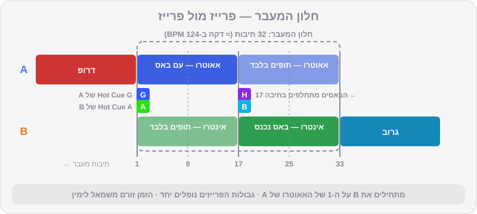
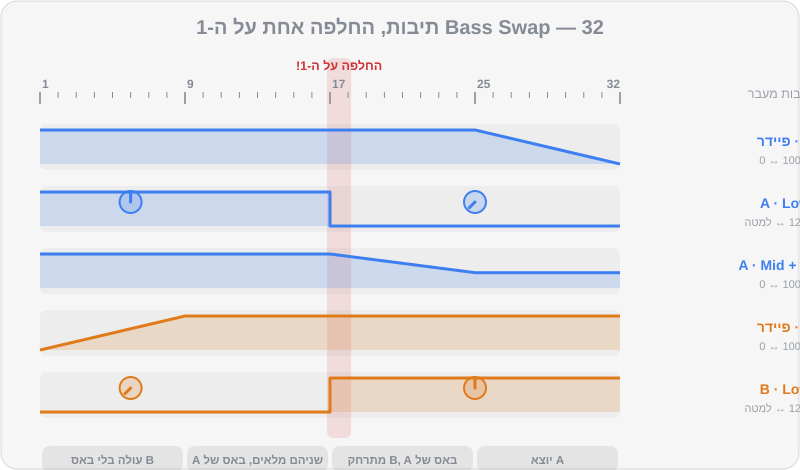

# המעברים הראשונים

זה הפרק שחיכיתם לו. כל מה שלמדתם עד עכשיו — ספירת פרייזים, ביטמאצ'ינג, Gain ו-EQ — מתחבר כאן לכלי אחד: **המעבר**. מעבר טוב הוא לא "טריק"; הוא החלטה מוזיקלית. איך אני רוצה שהרחבה תרגיש ברגע הזה? להמשיך לזרום בלי לשים לב? לקבל מכה? לנשום? בפרק נלמד שישה מעברים בסיסיים. לכל אחד יש מתכון מדויק לפי תיבות, וכל אחד מגיע עם דמו מוכן ברפו: קודם שומעים איך זה אמור להישמע — ואז משחזרים עם אותם שני טראקים בדיוק.

## מה תלמדו בפרק

- האנטומיה של כל מעבר, ורשימת הכנה של 7 צעדים
- מעבר **Blend ארוך** — המעבר ה"בלתי מורגש"
- מעבר **Bass Swap** — החלפת באסים על ה-1
- **מעבר פילטר** — להעלים שיר אחד ולחשוף את השני
- מעבר **Echo Out** — יציאה נקייה, גם בין ז'אנרים וקצבים
- **קאט / סלאם** — מעבר חד ברגע אחד
- **מעבר לופ** — לקנות זמן וליצור מתח
- איך מתרגלים עם הדמואים שב-`music/transitions/`

## אנטומיה של מעבר

נקרא לשיר שמתנגן עכשיו **A** (היוצא), ולשיר החדש **B** (הנכנס). כל מעבר בנוי משלושה חלקים:

1. **הכנה** — באוזניות, לפני שהקהל שומע משהו.
2. **חלון המעבר** — הזמן שבו שני השירים נשמעים יחד. אצלנו נספור אותו ב"תיבות מעבר": **תיבה 1 של המעבר** היא התיבה שבה B מתחיל להישמע.
3. **יציאה** — A נעלם, ה-EQ שלו חוזר לאמצע, ו-B הוא השיר החדש.

### רשימת הכנה — לפני כל מעבר

1. **בחרתם B?** BPM קרוב, אנרגיה בכיוון הנכון (על הרמוניה — פרק 10).
2. **השיר B טעון ובדוק** — Beatgrid תקין, Hot Cues במקום.
3. ה-**Trim** של B מכוון באוזניות (פרק 5).
4. ה-**EQ** של B מוכן — בדרך כלל Low למטה.
5. **ביטמאצ'ינג** של B — באוזן או ב-Sync.
6. **אתם יודעים איפה אתם ב-A.** כמה תיבות נשארו עד האאוטרו? (Hot Cue G, ו-Memory Cues עוזרים.)
7. **מתחילים את B על ה-1** של פרייז ב-A.

> 💡 טיפ: הכנה טובה היא 80% מהמעבר. אם הגעתם לחלון המעבר וכל שבעת הצעדים מוכנים, הידיים צריכות לעשות רק שניים-שלושה דברים פשוטים. אם הגעתם לא מוכנים — אף טכניקה לא תציל.

### שלושה כללי זהב

- **מתחילים על ה-1 של פרייז.** תמיד.
- **באס אחד בכל רגע.** אף פעם לא שני Lows מלאים יחד.
- **מעבר לוקח 8, 16 או 32 תיבות** — לא "בערך חצי דקה". סופרים.

## 1. בלנד ארוך (Blend) — המעבר הבלתי מורגש

- **מתי:** דיפ-האוס, מלודיק טכנו, אפרו-האוס, וורם-אפ. כשהשירים דומים באופי, ואתם רוצים שהרחבה לא תרגיש שהשיר התחלף.
- **אורך:** 32 תיבות (כדקה ב-124 BPM).
- **דמו:** `transition-01` (בתיקייה `music/transitions/`) — מ-`house-01` ("שקיעה ביפו", 122) ל-`house-02` ("גג קטיפה", 121).

| תיבות מעבר | A (יוצא) | B (נכנס) |
|---|---|---|
| הכנה | מתנגן, EQ באמצע | ב-Hot Cue A, Low למטה לגמרי, High מעט למטה (שעה 10), פיידר למטה |
| 1 | מגיע ל-Hot Cue G (אאוטרו) | **מתחיל**, פיידר עולה לאט |
| 1–8 | ללא שינוי | פיידר עולה בהדרגה עד כ-75% |
| 9–16 | High יורד מעט (לשעה 10) | פיידר 100%, High חוזר לאמצע |
| 17–20 | Low יורד בהדרגה עד למטה | Low עולה בהדרגה לאמצע (מתחלפים "באמצע הדרך") |
| 21–28 | Mid יורד מעט, פיידר יורד לאט | מלא |
| 29–32 | פיידר מגיע ל-0 | מלא |
| אחרי | EQ ופיידר חוזרים לאמצע/אפס | השיר החדש |

> ⚠️ זהירות: ב-Blend, הבאסים מתחלפים **בהדרגה** לאורך 4 תיבות — אבל שני ה-Lows אף פעם לא מלאים יחד. כשאחד בשעה 12, השני חייב להיות למטה. ב"אמצע הדרך" שניהם בערך בשעה 9–10.

**טעויות נפוצות:** להעלות את B מהר מדי; לשכוח להחזיר את ה-High של B; להשאיר את A עד הסוף כשהוא כבר "מת" באאוטרו.

## 2. החלפת באסים (Bass Swap) על ה-1

- **מתי:** האוס, טק-האוס, טכנו, אפרו-האוס — כמעט תמיד. זה המעבר הכי שימושי במוזיקה אלקטרונית.
- **אורך:** 32 תיבות (אפשר לקצר ל-16).
- **דמו:** `transition-02` — מ-`house-05` ("מכונת גרוב", 126) ל-`house-06` ("שודד הבאסליין", 127).
- **תרגול יבש:** `practice-08` ו-`practice-09` — שני לופים עם באס דומיננטי, באותו קצב (124).

ההבדל מ-Blend: ההחלפה קורית **ברגע אחד**, בדיוק על ה-1 של פרייז. הרחבה מרגישה "בעיטה" חדשה של באס — וזה חלק מהקסם.

| תיבות מעבר | A (יוצא) | B (נכנס) |
|---|---|---|
| הכנה | מתנגן | ב-Hot Cue A, **Low למטה לגמרי**, פיידר למטה |
| 1 | Hot Cue G | **מתחיל** |
| 1–8 | ללא שינוי | פיידר עולה עד 100% (בלי באס — רק התופים והגבוהים של B) |
| 9–16 | אפשר להוריד מעט High (שעה 10–11) | מלא, בלי Low |
| **17 — על ה-1** | **Low למטה בבת אחת** | **Low לאמצע בבת אחת** |
| 17–24 | Mid ו-High יורדים בהדרגה | מלא |
| 25–32 | פיידר יורד ל-0 | מלא |
| אחרי | EQ ופיידר מתאפסים | השיר החדש |

### שתי דרכים לבצע את ההחלפה

1. **שתי ידיים בבת אחת:** יד שמאל על ה-Low של A, יד ימין על ה-Low של B, ובדיוק על ה-1 — שתיהן זזות יחד. הכי מדויק, אבל דורש קואורדינציה.
2. **"יציאה ואז כניסה":** על ביט 4 של תיבה 16 — Low של A למטה. על ה-1 של תיבה 17 — Low של B למעלה. ביט אחד (רבע תיבה) בלי באס, שבדרך כלל אף אחד לא שם לב אליו — ולפעמים אפילו מוסיף "נשימה".

> 💡 טיפ: בטראקים של DJ Lab האינטרו הוא 32 תיבות של תופים, והבאס נכנס בדיוק ב-Hot Cue B (אחרי 32 תיבות). באאוטרו של A הבאס יוצא ב-Hot Cue H (16 תיבות לפני הסוף). לכן, כדי שהחלפת הבאס תיפול בתיבה 17 של מעבר באורך 32 תיבות: מתחילים את B **16 תיבות לפני Hot Cue B שלו** (כדאי לשים שם Memory Cue), ומיישרים את הנקודה הזאת ל-Hot Cue G (Outro) של A. ככה הבאס של B נכנס בדיוק כשהבאס של A יוצא, ואתם רק "מחזקים" את מה שהמבנה כבר עושה. בטראקים מסחריים זה לא תמיד כך — לכן ה-EQ.

**טעויות נפוצות:** להחליף באסים באמצע פרייז; להעלות את ה-Low של B לפני שהורדתם את של A ("רגע של בוץ"); לשכוח ש-B עדיין בלי באס, ולתהות למה המעבר "דק".

## 3. מעבר פילטר — להעלים ולחשוף

- **מתי:** טכנו ומלודיק טכנו, וגם כשהשירים לא ממש "מסתדרים" ורוצים להסתיר את החפיפה. מעולה כשאין לשיר B אינטרו נקי.
- **אורך:** 16 תיבות.
- **דמו:** `transition-03` — מ-`techno-05` ("קתדרלת ניאון", 122) ל-`techno-08` ("מסלול שקט", 122).

| תיבות מעבר | A (יוצא) | B (נכנס) |
|---|---|---|
| הכנה | מתנגן, פילטר באמצע | ב-Hot Cue A או B, Low למטה, פיידר למטה |
| 1 | — | **מתחיל**, פיידר עולה ל-80% במשך 4 תיבות |
| 1–12 | **פילטר HPF עולה לאט** משעה 12 לשעה 3 — הבאס והגוף נעלמים | עולה |
| 13–16 | פיידר יורד ל-0 (הפילטר עדיין פתוח) | Low חוזר לאמצע על ה-1 של תיבה 13 או 17 |
| 17 | — | מלא |
| אחרי | **רק עכשיו** הפילטר חוזר לאמצע | השיר החדש |

> ⚠️ זהירות: אל תחזירו את הפילטר של A לאמצע כשהפיידר שלו עדיין למעלה — אחרת השיר "יקפוץ" בחזרה לרגע עם באס מלא. קודם פיידר למטה, אחר כך פילטר.

**וריאציה — פילטר על B:** מתחילים את B עם LPF כמעט סגור (נשמע עמום ורחוק), ופותחים אותו לאט לאורך 16 תיבות בזמן ש-A יוצא. יוצר תחושה של "משהו מתקרב".

## 4. יציאה עם אקו (Echo Out)

- **מתי:** כשרוצים לעבור בין ז'אנרים או קצבים שונים, כשלשיר B אין אינטרו נוח, כשמשהו השתבש ורוצים "לאפס" — או סתם כשרוצים רגע דרמטי.
- **אורך:** 1–4 תיבות.
- **דמו:** `transition-04` — מ-`house-07` ("מחסן 26", טק-האוס, 128) ל-`techno-01` ("דופק בטון", טכנו, 130).

היתרון הגדול: אין חפיפה ארוכה, ולכן **לא חייבים ביטמאצ'ינג**. B יכול להישאר בקצב שלו.

1. **הכנה:** בחרו את אפקט ה-ECHO ב-Beat FX, עם ערך ביט של 1/2 או 3/4 (או ביט אחד), וכוונו את עוצמת האפקט לבערך 50%. הקצו אותו לערוץ של A. את B טענו ל-Hot Cue A (או D, אם רוצים להיכנס ישר לדרופ), עם Trim מכוון.
2. **ספרו את A** עד התיבה האחרונה של פרייז (תיבה 8, 16 או 32 שלו).
3. **על ה-1 של התיבה האחרונה** — הפעילו את האקו.
4. **על ביט 3 או 4 של אותה תיבה** — הורידו את הפיידר של A בבת אחת. הזנב של האקו ממשיך להדהד ולהתפוגג.
5. **על ה-1 הבא** — נגנו את B והעלו את הפיידר שלו.
6. כבו את האקו אחרי שהזנב נגמר, והחזירו את ה-EQ של A לאמצע (הפיידר שלו כבר למטה).

> 🎚️ ב-Rekordbox: ברוב הציוד של Pioneer DJ, הזנב של האקו ממשיך להישמע גם אחרי שהפיידר ירד. אם אצלכם הוא נקטע — הציצו במצב Pad FX: בהרבה קונטרולרים (כולל `DDJ-FLX4`) חלק מהפדים מוקצים לאפקטי "יציאה" מוכנים, כמו אקו שיוצא או Back Spin, שעושים את כל הפעולה בלחיצה אחת. בדקו מה מוקצה אצלכם — ההקצאות משתנות בין גרסאות ואפשר לערוך אותן.

**טעויות נפוצות:** להפעיל את האקו באמצע פרייז; לשכוח לכבות אותו (והאקו "נדבק" לשיר הבא); אקו חזק מדי שממלא את הרחבה בבוץ.

## 5. קאט / סלאם — רגע אחד חד

- **מתי:** מיינסטרים, ביג רום, היפ-הופ, רגאטון, מזרחית ואירועים — כל מקום שבו השירים קצרים, האינטרו קצר, והאנרגיה צריכה להישאר בשיא. גם בטכנו, כשרוצים "להכות".
- **אורך:** ביט אחד.
- **דמו:** `transition-05` — מ-`mainstream-01` ("הבמה הראשית", 128) ל-`mainstream-02` ("ידיים לשמיים", 128).

הרעיון: A ו-B מתחלפים **על ה-1**, בלי חפיפה. בדרך כלל ברגע הכי חזק — בסוף בילדאפ, במקום שבו הקהל מצפה לדרופ של A, הוא מקבל את הדרופ של B.

1. **הכנה:** קבעו עקומת Crossfader חדה (פרק 5). A בצד שמאל, B בצד ימין, שני ה-Channel Faders למעלה, ה-Crossfader בצד של A. אם תשתמשו בפיידרים בלבד — B למטה.
2. **השיר B בקצב:** ישרו את B ל-A (ביד או ב-Sync), ועצרו אותו על Hot Cue D (הדרופ).
3. **ספרו את הבילדאפ של A** — בדרך כלל 8 תיבות לפני הדרופ.
4. **על ה-1 של הדרופ** — הפעילו את Hot Cue D של B והעבירו את ה-Crossfader ל-B **באותה תנועה**.

> 💡 טיפ: כאן Quantize ו-Sync הם חברים טובים: כשהם דולקים, לחיצה על Hot Cue "נצמדת" לביט, גם אם לחצתם קצת מוקדם או מאוחר. לקאטים בהופעה, מותר — ומומלץ — להשתמש בהם.

**וריאציה — "סלאם" לבילדאפ:** קאט מ-A ישר לתחילת הבילדאפ של B (Hot Cue שסימנתם 8 תיבות לפני הדרופ שלו). הקהל מקבל עוד בילדאפ, והדרופ של B מגיע עם כל המתח.

**טעויות נפוצות:** קאט באמצע תיבה; שכחה של B ב-Low חתוך מהכנה קודמת (הדרופ נוחת בלי באס); Trim לא מכוון — הדרופ של B "קופץ" חזק מדי.

## 6. מעבר לופ — לקנות זמן וליצור מתח

- **מתי:** כשהאאוטרו של A קצר מדי (קורה הרבה בפופ, היפ-הופ ומזרחית), כשצריך עוד כמה שניות כדי להכין את B, או כשרוצים לבנות מתח לפני דרופ.
- **אורך:** גמיש.
- **דמו:** `transition-06` — מ-`techno-02` ("לב תעשייתי", 131) ל-`techno-03` ("טקס סטרובוסקופ", 132), עם Loop Roll.

### א. לופ שמאריך את A

1. כש-A מגיע לקטע של תופים בלבד (בטראקים של DJ Lab — Hot Cue H, "16 האחרונות"), **על ה-1** הפעילו לופ של 4 תיבות (16 ביטים).
2. השיר A מתנגן עכשיו בלולאה, בלי סוף. יש לכם זמן.
3. הכניסו את B על ה-1 של הלופ, וערבבו כמו ב-Bass Swap: B עולה בלי באס, החלפת באסים על ה-1 של מחזור לופ, A יוצא.
4. אם רוצים לחזור ל-A — יציאה מהלופ (Exit) על ה-1.

### ב. Loop Roll — מתח לפני דרופ

1. בתיבה האחרונה לפני הנקודה שבה B נוחת (או לפני שאתם יוצאים מ-A), הפעילו לופ של תיבה אחת.
2. **קצרו אותו בהדרגה:** תיבה → חצי תיבה → ביט → חצי ביט → רבע ביט. כל קיצור על ביט — "טררררר" שמאיץ.
3. **על ה-1** — צאו מהלופ, הורידו את A, ו-B נוחת (או נכנס לדרופ).

> ⚠️ זהירות: עשו לופים רק על קטעים של תופים או גרוב פשוט. לופ על ווקאל באמצע משפט, או על אקורד שמתחלף, נשמע כמו תקלה. ו-Quantize דולק — כדי שהלופ יתחיל ויסתיים בדיוק על הרשת.

## טבלת סיכום

| מעבר | אורך | קושי | הכי מתאים ל... | דמו |
|---|---|---|---|---|
| Blend ארוך | 32 תיבות | ⭐⭐ | דיפ-האוס, מלודיק, וורם-אפ | `transition-01` |
| Bass Swap | 16–32 | ⭐⭐ | האוס, טק-האוס, טכנו, אפרו | `transition-02` |
| פילטר | 16 | ⭐⭐ | טכנו, מלודיק, להסתרת חפיפה | `transition-03` |
| Echo Out | 1–4 | ⭐ | מעברי ז'אנר וקצב, חירום | `transition-04` |
| קאט / סלאם | ביט | ⭐ (תזמון ⭐⭐⭐) | מיינסטרים, היפ-הופ, אירועים | `transition-05` |
| לופ / Loop Roll | גמיש | ⭐⭐⭐ | אאוטרו קצר, בניית מתח | `transition-06` |

ובתיקייה מחכים עוד ארבעה דמואים לפרקים הבאים: `transition-07` (קפיצת אנרגיה הרמונית — פרק 10), `transition-08` (מעבר טמפו מ-95 ל-124 עם אקו — פרק 15), `transition-09` (החלפת דרופים בים-תיכוני) ו-`transition-10` (כניסה בברייקדאון במלודיק טכנו). שווה להקשיב להם כבר עכשיו, רק כדי לשמוע מה מחכה.

### "רכיבה" על הטמפו אחרי מעבר

נניח שעברתם מ-`house-02` (121) ל-`house-03` (124). בזמן המעבר, B רץ ב-121 כדי להתאים ל-A. אחרי ש-A יצא, אפשר להשאיר את B ב-121 — או להחזיר אותו בהדרגה לקצב המקורי שלו: הזזה זעירה של ה-Tempo Fader כל כמה תיבות, עד שמגיעים ל-124. כך מעלים אנרגיה לאט בלי שהרחבה תרגיש "קפיצה". הכלל: לא יותר מבערך 1 BPM בכל פרייז של 16–32 תיבות.

## איך מתרגלים עם הדמואים

1. **הקשיבו לדמו** פעמיים, בלי לעשות כלום.
2. **בהאזנה השלישית — רשמו**: באיזה זמן B נכנס? מתי הבאס התחלף? מתי A נעלם? השוו לשדה `steps_he` בקובץ ה-JSON של הדמו.
3. **שחזרו** עם אותם שני טראקים בדיוק.
4. **הקליטו** את הניסיון שלכם.
5. **השוו** את ההקלטה שלכם לדמו. מה שונה?
6. **חזרו** עד שקשה להבדיל.

## תרגילים

> 🎧 תרגיל 1 — Bass Swap יבש (15 דקות): טענו את `music/practice/practice-08-bass-swap-a-124.mp3` לדק 1 ואת `music/practice/practice-09-bass-swap-b-124.mp3` לדק 2. ישרו (שניהם 124). עם הפיידרים למעלה, החליפו את ה-Lows הלוך-חזור **על ה-1 של כל פרייז של 8 תיבות**. עשרים החלפות. אחר כך עם עיניים עצומות. המטרה: שלא יהיה אף רגע של "שני באסים" או "אף באס".

> 🎧 תרגיל 2 — Blend: שחזרו את `transition-01`: מ-`music/tracks/deep_house/house-01-sunset-over-jaffa.mp3` ל-`music/tracks/deep_house/house-02-velvet-rooftop.mp3` לפי הטבלה של Blend ארוך. שימו לב: B ב-121 ו-A ב-122 — צריך להתאים.

> 🎧 תרגיל 3 — Bass Swap אמיתי: שחזרו את `transition-02`: מ-`music/tracks/tech_house/house-05-groove-machine.mp3` ל-`music/tracks/tech_house/house-06-bassline-bandit.mp3`. Hot Cue G של A ↔ הנקודה 16 תיבות לפני Hot Cue B של B, החלפה בתיבה 17. הזמנים המדויקים נמצאים ב-`steps_he` שבקובץ ה-JSON של הדמו.

> 🎧 תרגיל 4 — פילטר: שחזרו את `transition-03`: מ-`music/tracks/melodic_techno/techno-05-neon-cathedral.mp3` ל-`music/tracks/melodic_techno/techno-08-silent-orbit.mp3`. נסו גם את הווריאציה עם LPF על B.

> 🎧 תרגיל 5 — Echo Out: שחזרו את `transition-04`: מ-`music/tracks/tech_house/house-07-warehouse-26.mp3` ל-`music/tracks/techno/techno-01-concrete-pulse.mp3`. השאירו את B ב-130 — בלי ביטמאצ'ינג. נסו ערכי ביט שונים לאקו (1/2, 3/4, 1) ובחרו את האהוב עליכם.

> 🎧 תרגיל 6 — קאט: שחזרו את `transition-05`: מ-`music/tracks/big_room/mainstream-01-festival-main-stage.mp3` ל-`music/tracks/big_room/mainstream-02-hands-in-the-sky.mp3`. נסו פעם אחת עם Quantize ופעם בלי. מרגישים את ההבדל בתזמון?

> 🎧 תרגיל 7 — לופ: שחזרו את `transition-06`: מ-`music/tracks/techno/techno-02-industrial-heart.mp3` ל-`music/tracks/techno/techno-03-strobe-ritual.mp3`. קודם הלופ שמאריך את A, ואחר כך Loop Roll.

> 🎧 תרגיל 8 — מיני-סט ראשון (20 דקות): הקליטו רצף של ארבעה טראקים עם שלושה סוגי מעברים שונים: `house-01` → (Blend) → `house-02` → (Bass Swap) → `music/tracks/house/house-03-hands-up-florentin.mp3` → (Echo Out) → `music/tracks/tech_house/house-08-shuffle-theory.mp3`. אחרי המעבר ל-`house-03`, "רכבו" לאט על הטמפו מ-121 ל-124. האזינו להקלטה למחרת, ורשמו ביומן מעבר אחד שהצליח ומעבר אחד לשיפור.

## סיכום

- כל מעבר: הכנה → חלון מעבר → יציאה. רוב העבודה בהכנה (7 צעדים).
- מתחילים על ה-1 של פרייז, באס אחד בכל רגע, סופרים תיבות.
- מעבר **Blend** — הדרגתי ובלתי מורגש. **Bass Swap** — החלפה על ה-1. **פילטר** — מעלים את A וחושף את B.
- מעבר **Echo Out** — יציאה נקייה בלי צורך בביטמאצ'ינג. **קאט** — רגע אחד חד, מושלם למיינסטרים ואירועים. **לופ** — קונה זמן ובונה מתח.
- תרגלו עם הדמואים: מקשיבים, רושמים, משחזרים, מקליטים, משווים.

## בפרק הבא

שמתם לב כמה פעמים כתבנו "Hot Cue G" ו"Hot Cue A"? בפרק הבא נלמד לעבוד עם Hot Cues, Memory Cues, לופים, Beat Jump ו-Quantize כמו מקצוענים — ולהכין כל טראק בספרייה כך שהמעברים יהיו קלים.

👉 [פרק 7 — Hot Cues ולופים](07-hot-cues-loops.md)
