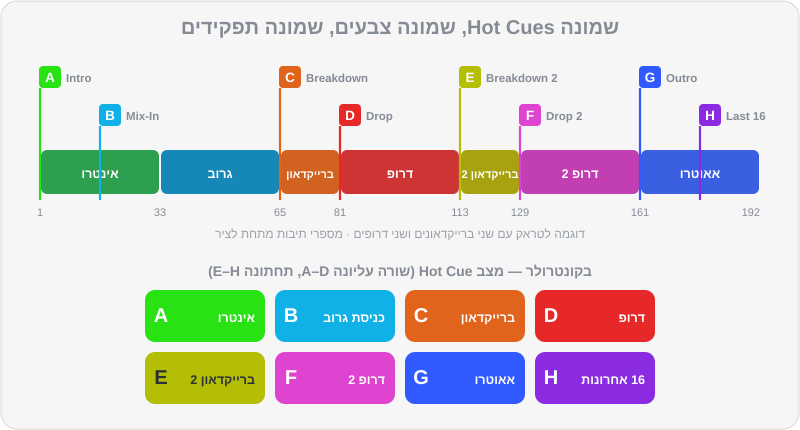

# Hot Cues, לופים ו-Beat Jump

תחשבו על Hot Cues כמו על סימניות בספר — רק שלחיצה על הסימנייה מקפיצה אתכם לעמוד הנכון ומתחילה להקריא ממנו, מיד, בדיוק בקצב. DJ שהכין Hot Cues לא מחפש בזמן אמת "איפה מתחיל האאוטרו?" — הוא יודע: זה הכפתור הכחול. לופים הם הכלי השני שמשנה את כל המשחק: הם מאריכים, מקצרים, קונים זמן ובונים מתח. יחד עם Beat Jump ו-Quantize, הם הופכים כל טראק לחומר גלם גמיש. בפרק הזה נלמד את כל הכלים האלה, ונבנה שגרת הכנה שתהפוך כל טראק חדש לטראק "מוכן לבמה" בתוך חמש דקות.

## מה תלמדו בפרק

- ההבדל בין כפתור CUE, Memory Cue ו-Hot Cue
- מוסכמת ה-Hot Cues של DJ Lab — שמונה סלוטים, שמונה צבעים, שמונה תפקידים
- איך יוצרים, צובעים, נותנים שם ומוחקים Hot Cues ב-Rekordbox
- לופים: ידניים, Auto Beat Loop, הכפלה וחציה, ושמירת לופים
- פונקציית Beat Jump: לתקן פרייז, לדלג על קטע, לקצר או להאריך
- מצבי Slip ו-Quantize — שתי "רשתות ביטחון"
- מצבי הפדים בקונטרולר
- שגרת הכנה מלאה לטראק — כולל מיינסטרים וים-תיכוני

## שלושה סוגי Cues

| | כפתור CUE | Memory Cue | Hot Cue |
|---|---|---|---|
| **כמה** | אחד (זמני) | עד 10 לטראק (כולל לופים) | 8 (A–H) במצב Export ובנגני CDJ; עד 16 במצב Performance |
| **מה קורה בלחיצה** | חוזר לנקודה ועוצר | מקפיץ לנקודה ועוצר — צריך ללחוץ Play | **מקפיץ ומנגן מיד** |
| **נשמר?** | לא, רק בזמן הטעינה | כן, עם הטראק | כן, עם הטראק |
| **הכי שימושי ל...** | הכנת השיר הבא באוזניות | סימני דרך על הווייבפורם, בעיקר ב-CDJ | ניווט מהיר והופעה חיה |

### כפתור ה-CUE (בסגנון CDJ)

- **השיר עצור:** לחיצה על CUE קובעת נקודת Cue במקום הנוכחי.
- **השיר מתנגן:** לחיצה על CUE מחזירה לנקודה ועוצרת.
- **החזקה כשעומדים על הנקודה:** השיר מתנגן כל עוד מחזיקים, ובשחרור חוזר לנקודה. מעולה כדי "להציץ" ולבדוק שה-1 במקום.

### נקודות זיכרון (Memory Cues)

סימני דרך שנשמרים עם הטראק ומופיעים על הווייבפורם. בנגני CDJ הם בולטים במיוחד: על המסך רואים כמה ביטים נשארו עד ה-Memory Cue הבא — עזרה מעולה לספירה. בטראקים של DJ Lab, ה-Memory Cues מסמנים נקודות כמו הברייקדאון.

> 🎚️ ב-Rekordbox: במצב Export, בפאנל ה-Cue שמתחת לדק, יש כפתור MEMORY: מציבים את הסמן במקום הנכון ולוחצים. בנגן CDJ זה כפתור MEMORY, וכפתורי CALL מדלגים בין הנקודות.

### נקודות חמות (Hot Cues)

הכלי הכי חשוב בפרק. Hot Cue הוא כפתור (פד) שמקפיץ לנקודה **ומנגן מיד**. אם Quantize דולק, הקפיצה "נצמדת" לביט — כך שאפשר ללחוץ באמצע שיר מתנגן, והשיר ממשיך בקצב בלי לפספס.

> 💡 טיפ: בנגני CDJ יש בדרך כלל שמונה Hot Cues (A–H). גם אם במצב Performance יש לכם 16, תכננו את החשובים בשמונה הראשונים — כך הספרייה שלכם תעבוד בכל מועדון.

## מוסכמת ה-Hot Cues של DJ Lab

כל הטראקים ברפו מגיעים עם Hot Cues לפי אותה שיטה. אנחנו ממליצים לאמץ אותה גם לטראקים שתקנו — עקביות היא מה שמאפשר לנגן בלי לחשוב.

| סלוט | שם | צבע | קוד צבע | איפה | למה |
|---|---|---|---|---|---|
| **A** | Intro | 🟢 ירוק | `#28E214` | הביט הראשון (ה-1 של תיבה 1) | נקודת הכניסה של השיר |
| **B** | Mix-In / Groove | 🔵 תכלת | `#10B1E6` | התיבה שבה הבאס או הגרוב המלא נכנסים | נקודת כניסה "מלאה" או יעד ל-Bass Swap |
| **C** | Breakdown | 🟠 כתום | `#E0641B` | הברייקדאון הראשון | לדעת מתי מגיעה "נשימה" |
| **D** | Drop | 🔴 אדום | `#E62828` | הדרופ / ההוק הראשי | קאטים, החלפת דרופים |
| **E** | Breakdown 2 | 🟡 צהוב | `#B4BE04` | ברייקדאון שני (אם יש) | |
| **F** | Drop 2 | 🩷 ורוד | `#DE44CF` | דרופ שני (אם יש) | |
| **G** | Outro | 🔷 כחול | `#305AFF` | תחילת האאוטרו | נקודת היציאה — כאן מתחיל המעבר |
| **H** | Last 16 | 🟣 סגול | `#8A2BE2` | 16 תיבות לפני הסוף | אזהרה אחרונה / לופ חירום |

ההיגיון: **ירוק = התחלה, כחול = יציאה, אדום = שיא.** אחרי שבוע של עבודה עם השיטה, העיניים כבר יודעות לבד איפה כל דבר.

### יצירה, צבע ושם ב-Rekordbox

> 🎚️ ב-Rekordbox:
> - **יצירה:** בקונטרולר, במצב Hot Cue — לחיצה על פד ריק שומרת את המקום הנוכחי. בתוכנה — לחיצה על סלוט ריק בדק.
> - **מחיקה:** ברוב הקונטרולרים, SHIFT + הפד. בתוכנה — דרך רשימת ה-Cues.
> - **צבע ושם:** לחיצה ימנית על ה-Hot Cue (או בפאנל ה-Cue במצב Export) מאפשרת לבחור צבע מתוך פלטה של 16 צבעים ולכתוב הערה/שם.
> - **צבעי ברירת מחדל:** בהגדרות התצוגה יש כמה ערכות צבעים ל-Hot Cues חדשים. הצבעים שקבעתם ידנית (או שהגיעו מקובץ ה-XML של DJ Lab) נשמרים לכל Cue בנפרד.

> 💡 טיפ: הפלטה של Rekordbox לא כוללת בדיוק את קודי הצבע שבטבלה. כשאתם מסמנים ידנית, בחרו את הגוון הקרוב ביותר — ירוק, תכלת, כתום, אדום, צהוב, ורוד, כחול, סגול. מה שחשוב זה העקביות, לא הגוון המדויק.

### נקודות Cue אוטומטיות

גרסאות Rekordbox 7 כוללות כלים ליצירה אוטומטית של Cues, בין השאר על בסיס ניתוח הפרייזים (ובגרסאות האחרונות נוספו גם יכולות של Cues "חכמים"). שווה לנסות — זה חוסך זמן בספרייה גדולה. אבל אל תסמכו בעיוורון: עברו על כל טראק, הקשיבו לכל Cue, ותקנו לפי המוסכמה שלכם.

## לופים

לופ חוזר על קטע קצר שוב ושוב, בלי הפסקה. בגלל שהוא מחובר לרשת, הוא נשאר בקצב.

### סוגי לופים

1. **לופ ידני:** LOOP IN בתחילת הקטע, LOOP OUT בסופו. EXIT / RELOOP — יציאה מהלופ או חזרה אליו.
2. **לופ אוטומטי (Auto Beat Loop):** לחיצה אחת יוצרת לופ באורך קבוע (למשל 4 ביטים) מהמקום הנוכחי. כפתורי ×2 ו-½ מכפילים או חוצים את האורך תוך כדי.
3. **לופים בפדים (Beat Loop):** כל פד הוא אורך אחר — לחיצה מפעילה, לחיצה נוספת מכבה.
4. **לופ שמור:** אפשר לשמור לופ כ-Memory Cue או כ-Hot Cue, ולהפעיל אותו בלחיצה.

### אורכי לופ — בביטים, בתיבות ובשניות

| ביטים | תיבות | ב-124 BPM | שימוש טיפוסי |
|---|---|---|---|
| 1/4 – 1/2 | — | פחות מרבע שנייה | Loop Roll, אפקט "טררר" |
| 1 | רבע תיבה | 0.48 שנ' | Loop Roll, מתח לפני דרופ |
| 4 | 1 | 1.9 שנ' | "גמגום", בילדאפ קצר |
| 16 | 4 | 7.7 שנ' | הארכת אינטרו/אאוטרו, החזקת גרוב |
| 32 | 8 | 15.5 שנ' | לופ "בטוח" — פרייז שלם |
| 64 | 16 | 31 שנ' | הארכה ארוכה של קטע תופים |

> ⚠️ זהירות: לופים רק על **קטעים פשוטים** — תופים, גרוב בסיסי. לופ שנחתך באמצע משפט של ווקאל, או על אקורד שאמור להתחלף, נשמע מיד כמו תקלה. ובתחילת לופ — תמיד על ה-1.

### מה עושים עם לופים

- **הארכת אינטרו או אאוטרו** — כשהשיר קצר מדי למעבר שתכננתם. קריטי בפופ, בהיפ-הופ ובמזרחית, שבהם האינטרו הוא לפעמים 4 תיבות.
- **קניית זמן** — הטלפון צלצל, מישהו ביקש שיר, ה-USB נתקע: לופ של 8 תיבות על קטע תופים, נשימה, ממשיכים.
- **בניית מתח** — Loop Roll שהולך ומתקצר לפני דרופ (פרק 6).
- **רימיקס חי** — להשאיר גרוב בלופ ולשלב מעליו אלמנטים משיר אחר.

## קפיצות קצב (Beat Jump)

פונקציית Beat Jump מקפיצה את השיר קדימה או אחורה במספר ביטים קבוע — 1, 2, 4, 8, 16, 32 ועוד — **בלי לצאת מהקצב**. הוא נשען על הרשת, ולכן עובד מושלם כש-Quantize דולק וה-Grid נכון.

### שלושה שימושים שמצילים מעברים

1. **תיקון פרייזים.** התחלתם את B, והקצב מסונכרן, אבל השינויים ב-B מגיעים 4 תיבות **אחרי** השינויים ב-A? קפיצה של 16 ביטים (4 תיבות) **קדימה** ב-B, והפרייזים מיושרים. בלי לעצור, בלי שהרחבה תשמע.
2. **דילוג על קטע.** ברייקדאון ארוך מדי לרגע הנוכחי ברחבה? קפיצה של 32 או 64 ביטים קדימה, על ה-1, ואתם קרובים לדרופ.
3. **הארכה.** רוצים עוד 8 תיבות של גרוב לפני שהשיר נגמר? קפיצה של 32 ביטים אחורה, על ה-1.

> 💡 טיפ: מספרים שכדאי לזכור — **16 ביטים = 4 תיבות, 32 ביטים = 8 תיבות (פרייז), 64 = 16 תיבות, 128 = 32 תיבות.** קפיצות בכפולות של 32 שומרות על היישור של הפרייזים.

## רשתות הביטחון: Slip ו-Quantize

### מצב Slip

כש-Slip דולק, השיר ממשיך "לרוץ בשקט" מתחת לכל מה שאתם עושים: לופ, סקרץ', Reverse או החזקת Hot Cue. ברגע שאתם משחררים, הנגינה חוזרת **למקום שבו השיר היה אמור להיות** — כאילו לא נגעתם.

- **לופ רול + Slip:** "גמגום" של כמה ביטים, וכשמשחררים — השיר ממשיך בדיוק בפרייז שלו.
- **צנזורה עם Reverse + Slip:** מילה גסה בשיר באירוע? Reverse לשנייה, משחררים, והשיר ממשיך בדיוק בקצב. שימושי מאוד בחתונות ובאירועי חברה.

> 🎚️ ב-Rekordbox: מצב SLIP מופעל בכפתור בדק (ובחלק מהקונטרולרים יש לו כפתור או קיצור ייעודי). כשהוא דולק, רואים על הווייבפורם "צל" שממשיך לנוע — המקום שאליו תחזרו.

### מצב Quantize

ה-Quantize "מצמיד" כל פעולה לרשת: הפעלת Hot Cue, התחלת לופ, Beat Jump. גם אם לחצתם 50 אלפיות מוקדם, הפעולה תקרה בדיוק על הביט.

- **השאירו אותו דולק** כמעט תמיד.
- **כבו אותו** כשה-Grid של טראק שגוי (ואין זמן לתקן), או כשאתם רוצים Cue שלא נמצא על ביט — למשל ווקאל שמתחיל "רגע לפני ה-1" (Pickup), כמו "יאללה!" שבא חצי ביט לפני הדרופ.
- אפשר לקבוע בהגדרות את רזולוציית ה-Quantize (ביט שלם או חלקי ביט).

## מצבי הפדים

לרוב הקונטרולרים יש שורה של 8 פדים לכל דק, שמשנים תפקיד לפי מצב. ב-`DDJ-FLX4`, למשל:

| מצב | מה הפדים עושים | חשיבות למתחילים |
|---|---|---|
| **Hot Cue** | הפעלה ושמירה של Hot Cues A–H | ⭐⭐⭐ — המצב שבו תהיו 80% מהזמן |
| **Pad FX** | אפקטים "ברגע": אקו, ריוורב, Roll, ואפקטי יציאה | ⭐⭐ — שימושי ל-Echo Out מפרק 6 |
| **Beat Jump** | קפיצות קבועות קדימה/אחורה | ⭐⭐⭐ — תיקון פרייזים |
| **Sampler** | הפעלת סאמפלים (הורנים, אפקטים קוליים) | ⭐ — במידה |
| **Beat Loop** (עם SHIFT) | לופ באורך קבוע לכל פד | ⭐⭐ |
| **Keyboard** (עם SHIFT) | מנגן Hot Cue בגבהים שונים | ⭐ — לשלב מתקדם |
| **Key Shift** (עם SHIFT) | משנה את הסולם של השיר | ⭐ — פרק 10 |

> ⚠️ זהירות: הטעות הכי נפוצה עם פדים: להיות במצב הלא נכון. לחצתם "Hot Cue" ושמעתם פתאום צופר? הייתם במצב Sampler. לפני כל מעבר — מבט מהיר על מצב הפדים.

## שגרת הכנה של חמש דקות לטראק

זה מה שמקצוענים עושים לכל טראק חדש, בבית, לפני שהוא נכנס לסט:

1. **רשת (Beatgrid)** — בדיקה בהתחלה, באמצע ובסוף (פרק 2).
2. **סלוט A** — על ה-1 הראשון של השיר (אחרי פתיחה חופשית או Pickup, אם יש).
3. **סלוט B** — איפה שהבאס או הגרוב המלא נכנסים.
4. **סלוטים C ו-D** — הברייקדאון הראשון והדרופ הראשון.
5. **סלוטים E ו-F** — אם יש ברייקדאון ודרופ שניים.
6. **סלוט G** — תחילת האאוטרו, על גבול פרייז.
7. **סלוט H** — 16 תיבות לפני הסוף (בקפיצת Beat Jump של 64 ביטים אחורה מהסוף, זה קל).
8. **נקודות Memory Cue** — לפחות על C, D ו-G, כדי שיופיעו כסימני דרך גם בנגני CDJ.
9. **צבע טראק, דירוג ותגיות** — פרק 9.
10. **נעילת ניתוח**, כדי שהעבודה לא תימחק.

### מיינסטרים, היפ-הופ וים-תיכוני

בשירים בלי מבנה "של DJ", המוסכמה מתגמשת:

- **סלוט A** — ה-1 הראשון, גם אם יש לפניו פתיחה חופשית (תקסים של עוד או כינור). את הפתיחה עצמה סמנו ב-Memory Cue נפרד — היא יכולה להיות רגע "וואו" באירוע.
- **סלוט B** — תחילת הבית הראשון, או ה-1 של הגרוב המלא.
- **סלוט D** — הפזמון / ההוק הראשון. זה ה"דרופ" של שיר פופ.
- **סלוט F** — הפזמון האחרון (לפעמים הכי חזק).
- **סלוט G** — תחילת הקטע האחרון שאפשר לצאת ממנו בנוחות.
- **סלוט פנוי (E או H)** — קטע תופים שמתאים ללופ, למקרה שהאאוטרו קצר.

## תרגילים

> 🎧 תרגיל 1 — ציד Hot Cues: נגנו את `music/practice/practice-13-cue-hunt-126.mp3`. יש בו אירועים קוליים ברורים בתיבות 1, 17, 33, 49 ו-65. **בלי להסתכל על הווייבפורם**, שמרו Hot Cues A עד E על כל אירוע, ברגע שאתם שומעים אותו (Quantize דולק). אחר כך בדקו בזום שכל Cue יושב בדיוק על קו של תחילת תיבה.

> 🎧 תרגיל 2 — אותו דבר בלי רשת: מחקו את ה-Cues, כבו את Quantize וחזרו על תרגיל 1. עכשיו הסתכלו בזום: כמה רחוק מהקו נפלה כל לחיצה שלכם? זה מראה לכם כמה Quantize עוזר — ועד כמה זמן התגובה שלכם ישתפר עם תרגול.

> 🎧 תרגיל 3 — לנחש את ה-Cues: בחרו שלושה טראקים של DJ Lab שעוד לא האזנתם להם (למשל `music/tracks/afro_house/house-10-kalimba-moon.mp3`, `music/tracks/melodic_techno/techno-06-afterglow-protocol.mp3` ו-`music/tracks/nu_disco/house-12-mirrorball-boulevard.mp3`). כסו את ה-Hot Cues על המסך, האזינו, וסמנו **Memory Cues** במקומות שבהם לדעתכם צריכים להיות B, C, D ו-G. אחר כך השוו ל-Hot Cues שהגיעו מקובץ ה-XML.

> 🎧 תרגיל 4 — הארכת אינטרו: טענו את `music/tracks/house/house-03-hands-up-florentin.mp3`. על ה-1 של תיבה 1 (Hot Cue A), הפעילו לופ של 8 תיבות (32 ביטים). תנו לו להסתובב שלוש פעמים, וצאו ממנו על ה-1. הארכתם את האינטרו ב-24 תיבות — בלי שאף אחד ישמע.

> 🎧 תרגיל 5 — תיקון פרייז עם Beat Jump: טענו את `house-03` לדק 1 ואת `music/tracks/house/house-04-piano-saturday.mp3` לדק 2, ו-Sync בדק 2. התחילו את `house-04` בכוונה 4 תיבות אחרי ה-1 של פרייז ב-`house-03`. שמעתם את ה"אי-נוחות"? עכשיו, על ה-1 של תיבה כלשהי, Beat Jump של 16 ביטים קדימה ב-`house-04`. הפרייזים מיושרים?

> 🎧 תרגיל 6 — Loop Roll עם Slip: טענו את `music/tracks/techno/techno-02-industrial-heart.mp3`, הדליקו Slip. בתיבה האחרונה של פרייז, הפעילו לופ של ביט אחד והחזיקו/קצרו (1 → 1/2 → 1/4) עד ה-1 הבא, ואז שחררו. השיר ממשיך בדיוק בפרייז הבא? נסו את אותו דבר בלי Slip, ושימו לב להבדל.

> 🎧 תרגיל 7 — הכנת טראק מיינסטרים: טענו את `music/tracks/mediterranean/mainstream-13-darbuka-nights.mp3` (100 BPM). עברו על שגרת ההכנה בגרסת המיינסטרים, וסמנו גם Cue של קטע תופים שמתאים ללופ. השוו ל-Cues הקיימים מה-XML.

> 🎧 תרגיל 8 — הכנה אמיתית: קחו חמישה טראקים מסחריים שקניתם (או שתקנו בפרק 9) ועברו על שגרת חמש הדקות המלאה. מדדו כמה זמן לקח לכל אחד. בטראק החמישי אתם אמורים להיות מהירים פי שניים מבראשון.

## סיכום

- כפתור CUE = נקודה זמנית. Memory Cue = סימן דרך שעוצר. Hot Cue = קפיצה ונגינה מיידית.
- מוסכמת DJ Lab: A ירוק (התחלה), B תכלת (כניסת גרוב), C כתום, D אדום (דרופ), E צהוב, F ורוד, G כחול (יציאה), H סגול (16 אחרונות).
- לופים רק על קטעים פשוטים ועל ה-1. 16 ביטים = 4 תיבות, 32 ביטים = פרייז.
- הפונקציה Beat Jump מתקנת פרייזים, מדלגת על קטעים ומאריכה — בלי לצאת מהקצב.
- מצב Slip מחזיר אתכם למקום שבו השיר "היה אמור להיות". Quantize מצמיד הכול לרשת.
- שגרת הכנה של חמש דקות לכל טראק — בבית, לא בהופעה.

## בפרק הבא

כל ההכנה הזו נבדקת בסוף באוזניות. בפרק הבא נלמד לעבוד איתן נכון: Cue Mix, טכניקת האוזן האחת, Split Cue, מוניטור Booth, השהיות — ואיך שומרים על השמיעה.

👉 [פרק 8 — אוזניות וקיואינג](08-headphones-cueing.md)
