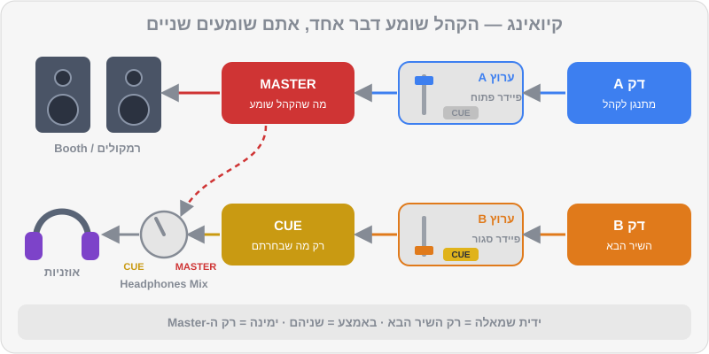

# אוזניות וקיואינג

כשאתם עומדים מאחורי העמדה, יש שני עולמות שמתנגנים בו-זמנית: מה שהקהל שומע, ומה שרק אתם שומעים. האוזניות הן החדר הפרטי שבו אתם מכינים את העתיד — מוצאים את ה-1, מכוונים עוצמה, מיישרים קצב — ורק כשהכול מוכן, פותחים את הדלת לרחבה. בבית, עם רמקולים קטנים ועוצמה נמוכה, זה נראה פשוט. במועדון, עם 110 דציבל, מוניטור שמאחר ותאורה מסנוורת, זה כבר מיומנות של ממש. הפרק הזה מכין אתכם לשני המצבים.

## מה תלמדו בפרק

- מה זה Cueing (נקרא גם PFL) ואיך זה עובד במיקסר
- הכפתורים: CUE לכל ערוץ, Headphones Mix ו-Headphones Level
- ארבע שיטות האזנה — ומתי כל אחת מתאימה
- טכניקת האוזן האחת, צעד אחר צעד
- Split Cue: השיר הבא באוזן אחת, ה-Master בשנייה
- מוניטור Booth: למה הוא קיים ואיך לכוון אותו
- השהיות (Latency): ממחשב, מ-Bluetooth ומהאוויר עצמו
- איך שומרים על השמיעה

## מה זה Cueing

לכל ערוץ במיקסר יש כפתור **CUE** (לפעמים מסומן באייקון של אוזניות). כשהוא דולק, הצליל של הערוץ נשלח לאוזניות — **בלי קשר למיקום הפיידר**. זה נקרא גם PFL (Pre-Fader Listen — האזנה לפני הפיידר). כלומר: הפיידר של B למטה, הקהל לא שומע אותו, ואתם שומעים אותו מצוין באוזניות.

### הכפתורים

| כפתור | מה הוא עושה |
|---|---|
| **CUE של ערוץ** | שולח את הערוץ לאוזניות. אפשר להדליק כמה בבת אחת |
| **CUE של Master** (בחלק מהציוד) | שולח את ה-Master לאוזניות |
| **Headphones Mix** (או Cue Mix) | מאזן בין "מה שבחרתם ב-CUE" (שמאלה) ל"Master" (ימינה) |
| **Headphones Level** | עוצמת האוזניות. לא קשור למה שהקהל שומע |

> 💡 טיפ: ב-`DDJ-FLX4` יש כפתור CUE לכל ערוץ, כפתור CUE ל-Master, ידית HEADPHONES MIX וידית HEADPHONES LEVEL — בדיוק אותה לוגיקה כמו במיקסר מועדון. מה שתתרגלו בבית יעבוד לכם בעמדה.

## ארבע שיטות האזנה

### 1. שתי אוזניים, רק השיר הבא

ה-Mix לגמרי לצד CUE, שתי האוזניות על הראש. שומעים רק את B.
**מתי:** למצוא את ה-1, לכוון Trim, לבדוק Hot Cues, להקשיב לשיר שלא מכירים.

### 2. שתי אוזניים, שני השירים

ה-Mix באמצע, CUE דולק על B. באוזניות שומעים את A ואת B יחד.
**מתי:** ביטמאצ'ינג בבית בעוצמה נמוכה, או כשהרמקולים בחדר גרועים, רחוקים או מאחרים. בדרך כלל זו השיטה הכי קלה למתחילים — אבל היא לא מלמדת אתכם לעבוד במועדון.

### 3. אוזן אחת (Single-Ear) — השיטה של המועדונים

אוזנייה אחת על האוזן עם B, האוזן השנייה פתוחה לחדר — שומעת את A מהרמקולים או מה-Booth. המוח "מחבר" את השניים ושומע אם הם מיושרים.
**מתי:** במועדון ובאירועים — כמעט תמיד. זו השיטה שהכי כדאי לאמץ מוקדם.

### 4. Split Cue — אוזן לכל שיר

הצליל באוזניות מתפצל: באוזן אחת השיר הבא (CUE), ובשנייה ה-Master, שניהם במונו. במיקסרים ובמערכות מסוימים יש לזה מתג או הגדרה (לרוב בשם MONO SPLIT מול STEREO).
**מתי:** כשאין מוניטור Booth, כשהוא גרוע, או כשהחדר כל כך רועש שאי אפשר לשמוע את הרמקולים כמו שצריך. החיסרון: מונו, ופחות טבעי משמיעה של החדר.

> 🎚️ ב-Rekordbox: הגדרות האוזניות והאודיו נמצאות ב-Preferences (תחת Audio ובהגדרות הבקר). בחלק ממערכות ה-All-in-One ונגני ה-XDJ, הגדרת MONO SPLIT / STEREO לאוזניות היא חלק מה-"My Settings" שאפשר להכין מראש ב-Rekordbox ולשמור על ה-USB. אם אתם מנגנים רק ממחשב, בלי קונטרולר, תצטרכו כרטיס קול או כבל מפצל ייעודי כדי להפריד בין Master לאוזניות.

## טכניקת האוזן האחת — צעד אחר צעד

1. **הכינו את B בשתי אוזניים** (שיטה 1): Cue, Trim, EQ.
2. **הזיזו אוזנייה אחת אחורה**, מאחורי האוזן או על הרקה. נהוג להשאיר פתוחה את האוזן שקרובה יותר לרמקול ה-Booth או לרחבה.
3. **החזיקו את האוזנייה** — עם היד, עם הכתף (הטיית ראש קלה), או כשהקשת סביב הצוואר ורק כרית אחת מורמת. נסו את כולן ובחרו מה שנוח.
4. **איזנו עוצמות.** B באוזנייה צריך להישמע **בערך באותה עוצמה** כמו A בחדר. אם B חזק בהרבה, המוח "שומע" רק אותו. בדרך כלל זה אומר: להנמיך את האוזניות, לא להגביר.
5. **שחררו את B על ה-1** ובצעו ביטמאצ'ינג כמו בפרק 4.
6. **בדיקה אחרונה:** הורידו את האוזניות לרגע ואחר כך העלו את הפיידר של B קצת (Low חתוך). שומעים מכה אחת בחדר? מצוין.

> ⚠️ זהירות: הפיתוי הכי גדול במועדון רועש — להגביר את האוזניות כדי "לגבור" על הרחבה. זה מסוכן לשמיעה, וגם לא עובד: אוזנייה צועקת מעוותת את הצליל ומעייפת את המוח. עדיף לבקש להגביר מעט את ה-Booth, או לעבור ל-Split Cue.

## מוניטור Booth

ה-Booth הוא רמקול (או זוג) בתוך עמדת ה-DJ, שמנגן את ה-Master. למה צריך אותו, אם יש רמקולים ענקיים ברחבה? בגלל **מהירות הקול**.

הקול עובר באוויר בערך 343 מטר לשנייה — כלומר כ-3 אלפיות שנייה לכל מטר. אם הרמקולים הראשיים נמצאים 15 מטר מכם, מה שאתם שומעים מהם מגיע באיחור של כ-44 אלפיות. ב-124 BPM, זה כמעט עשירית ביט. אם תיישרו את B ל"מה שאתם שומעים מהרחבה", הוא יהיה מוקדם מדי לכל מי שעומד ליד הרמקולים.

| מרחק מהרמקול | השהיה (בערך) |
|---|---|
| 1 מטר (Booth) | 3 אלפיות |
| 5 מטר | 15 אלפיות |
| 10 מטר | 29 אלפיות |
| 20 מטר | 58 אלפיות |

**הכללים:**

1. מבצעים ביטמאצ'ינג מול ה-Booth או האוזניות — **אף פעם** לא מול הרמקולים הראשיים כשהם רחוקים.
2. ה-Booth בעוצמה שבה אתם שומעים בבירור — לא יותר. הוא לא אמור להתחרות ברחבה.
3. בעמדות בלי Booth (ברים קטנים, אירועים) — Split Cue, או שיטה 2 (שני השירים באוזניות).

## השהיות (Latency) — האויב השקט

השהיה היא הזמן שעובר מהרגע שלחצתם (או מהרגע שהמחשב ניגן) עד שהצליל מגיע לאוזן. השהיה קטנה וקבועה לא מורגשת. השהיה גדולה הורסת ביטמאצ'ינג ותחושת "מגע" בציוד.

| מקור ההשהיה | כמה (בערך) | מה עושים |
|---|---|---|
| Buffer של כרטיס הקול | כמה אלפיות עד עשרות | ב-Rekordbox, ב-Preferences > Audio: Buffer Size נמוך ככל שעדיין אין "קליקים" (בדרך כלל סביב 5–10ms) |
| אוזניות Bluetooth | 100–300 אלפיות | **לא משתמשים.** רק אוזניות חוטיות |
| רמקול Bluetooth | 100–300 אלפיות | **לא משתמשים** לסאונד של המיקס |
| טלוויזיה / מקרן דרך HDMI | משתנה, לפעמים הרבה | לא מנגנים דרכם |
| מרחק מהרמקולים | ~3 אלפיות למטר | Booth או אוזניות |

> 💡 טיפ: Buffer נמוך מדי גורם ל"קליקים", קפיצות וניתוקים בצליל, במיוחד במחשב עמוס. Buffer גבוה מדי גורם לתחושה ש-Jog ו-Hot Cues "מגיבים באיחור". חפשו את הערך הנמוך ביותר שבו הצליל יציב גם כשאתם טוענים שירים ומפעילים אפקטים — ואז העלו אותו מעט, לביטחון.

## שמירה על השמיעה

השמיעה היא הכלי הכי חשוב שלכם — ואין לה חלקי חילוף. נזק לשמיעה מצטבר, הוא בלתי הפיך, והוא יכול להתבטא בצפצוף קבוע באוזניים (טנטון) או בירידה בשמיעה של צלילים גבוהים — בדיוק התחום שבו גרים ההיי-האטים.

### כלל ה-85 וה-3

ההמלצה המקובלת: **85 דציבל — עד 8 שעות ביום.** כל תוספת של 3 דציבל **מחצה** את הזמן הבטוח:

| עוצמה | זמן חשיפה מומלץ מקסימלי (בערך) |
|---|---|
| 85 dB | 8 שעות |
| 88 dB | 4 שעות |
| 91 dB | 2 שעות |
| 94 dB | שעה |
| 97 dB | 30 דקות |
| 100 dB | 15 דקות |

מועדונים ואירועים מגיעים בקלות ל-100 דציבל ויותר ברחבה. לכן:

1. **אטמי אוזניים למוזיקאים** (בערך 100–250 ₪) — מנמיכים את העוצמה באופן אחיד, כך שהמוזיקה עדיין נשמעת טוב. ביציאה למועדון ובכל הופעה.
2. **אוזניות בעוצמה הנמוכה ביותר** שבה אתם שומעים בבירור את ה-Kick של B.
3. **הפסקות שקט** — כמה דקות בכל שעה, מחוץ לחדר.
4. **בבית, בתרגול:** אפליקציית מד-דציבל בטלפון ליד הראש. מעל 85 לאורך זמן — הנמיכו.
5. **צפצוף אחרי סשן** הוא סימן אזהרה, לא "סימן לערב טוב".

נרחיב על בריאות האוזניים ועל ביצועים בהופעה בפרק 17.

> ⚠️ זהירות: אם אחרי הופעה או תרגול אתם שומעים צפצוף שלא עובר תוך יום, או שהשמיעה מרגישה "עמומה" — פנו לבדיקת שמיעה. זה לא עניין של "להתרגל".

## תרחישים מהשטח

כל עמדה שונה. לפני כל הופעה, שאלו את עצמכם (או את איש הסאונד) שלוש שאלות: יש Booth? כמה רחוקים הרמקולים? כמה רועש בעמדה? ואז בחרו שיטה:

| איפה | מה מחכה לכם | השיטה המומלצת |
|---|---|---|
| **בבית** | רמקולים קרובים, שקט יחסי | אוזן אחת — כדי להתרגל להופעות. שני השירים באוזניות רק כשמתרגלים מאוחר בלילה |
| **מועדון עם Booth טוב** | Booth ליד הראש, רחבה רועשת | אוזן אחת מול ה-Booth |
| **בר קטן בלי Booth** | רמקולים בפינות, לפעמים מאחוריכם | Split Cue, או שני השירים באוזניות עם ה-Mix באמצע |
| **אולם אירועים** | רמקולים רחוקים, הדהוד חזק, מיקרופונים | Split Cue או Booth קטן משלכם. לא לסמוך על מה ששומעים מהאולם |
| **אירוע בחוץ** | אין קירות, הצליל "בורח", רוח | Booth משלכם או Split Cue, ואוזניות שאוטמות היטב |

> 💡 טיפ: בהופעה הראשונה בכל מקום חדש, הגיעו מוקדם ובקשו בדיקת סאונד קצרה: נגנו טראק אחד, בדקו את ה-Booth, את האוזניות ואת ה-Split Cue, וסמנו לעצמכם (אפילו בצילום טלפון) איפה עמדו הידיות. זה חוסך הפתעות כשהרחבה כבר מלאה.

### בלי קונטרולר — רק מחשב?

אפשר לנגן במצב Performance עם מקלדת ועכבר, אבל המחשב צריך **שתי יציאות שמע נפרדות** — אחת ל-Master ואחת לאוזניות. יציאת האוזניות הרגילה של המחשב היא רק אחת. הפתרונות: כרטיס קול חיצוני עם ארבעה ערוצי יציאה, או כבל "מפצל" שמוציא Master בצד אחד ו-Cue בצד השני (במונו). זה עובד לתרגול, אבל לכל דבר רציני — קונטרולר עם כרטיס קול מובנה פותר את הכול.

## הרגלים קטנים, הבדל גדול

- **כבל מתולתל וקצר** — פחות הסתבכויות בעמדה.
- **מתאם בהברגה** — מתאם 3.5 ל-6.3 מ"מ שנתלש באמצע סט גומר את האוזניות לכל הערב.
- **וו או מקום קבוע לאוזניות** — כדי שלא ייפלו על הפיידרים (כן, זה קורה).
- **זוג אוזניות או כבל רזרבי** בתיק ההופעות.
- **CUE חוזר לכבוי** אחרי כל מעבר — אחרת בפעם הבאה תשמעו שני דברים באוזניות ולא תבינו למה.

## טעויות נפוצות

| טעות | מה קורה | התיקון |
|---|---|---|
| אוזניות חזקות מדי | עייפות, שמיעה שנפגעת, ביטמאצ'ינג גרוע | להנמיך אוזניות, להגביר מעט Booth |
| CUE דולק על הערוץ הלא נכון | "מכינים" את השיר שכבר מתנגן | מבט על כפתורי ה-CUE לפני כל הכנה |
| ביטמאצ'ינג מול הרמקולים הראשיים | B "מוקדם" לרחבה | רק מול Booth או אוזניות |
| שכחה של מה שיוצא ב-Master | עסוקים באוזניות ולא שמים לב שהשיר נגמר | אוזן אחת תמיד בחדר |
| אוזניות Bluetooth | אי אפשר ליישר | רק חוטיות |

## תרגילים

> 🎧 תרגיל 1 — ארבע השיטות: נגנו את `music/practice/practice-03-drums-124.mp3` בדק 1 דרך הרמקולים, וטענו את `music/practice/practice-04-drums-128.mp3` לדק 2. בצעו ביטמאצ'ינג ארבע פעמים, בכל פעם בשיטה אחרת: (1) לשמוע רק את B ולהחליט "על עיוור" — ואז לבדוק; (2) Mix באמצע; (3) אוזן אחת; (4) Split Cue, אם קיים אצלכם. רשמו ביומן: באיזו שיטה הכי קל לכם? ובאיזו הכי קשה?

> 🎧 תרגיל 2 — אוזן אחת בלבד (שבוע שלם): במשך שבוע, כל ביטמאצ'ינג נעשה רק בשיטת האוזן האחת. התחילו עם זוג קל — `music/tracks/tech_house/house-05-groove-machine.mp3` ו-`music/tracks/tech_house/house-08-shuffle-theory.mp3` (שניהם 126) — ועברו לזוג קשה יותר — `house-05` ו-`music/tracks/tech_house/house-07-warehouse-26.mp3` (126 / 128).

> 🎧 תרגיל 3 — הכנה ב-60 שניות: נגנו את `music/tracks/melodic_techno/techno-07-event-horizon.mp3` לקהל דמיוני. טענו את `music/tracks/melodic_techno/techno-06-afterglow-protocol.mp3` לדק השני ומדדו זמן: Cue על ה-1, Trim, Low למטה, ביטמאצ'ינג נעול — הכול באוזניות. היעד: פחות מ-60 שניות. רשמו את הזמנים ביומן.

> 🎧 תרגיל 4 — מבחן Buffer: ב-Preferences > Audio, נסו שלושה ערכי Buffer Size שונים. בכל אחד, הפעילו Hot Cues בקצב ותופפו עם ה-Jog. איפה מרגישים "דיליי"? איפה מתחילים קליקים? רשמו את הערך שבחרתם.

> 🎧 תרגיל 5 — היגיינת עוצמה: הורידו אפליקציית מד-דציבל. נגנו את `music/tracks/techno/techno-01-concrete-pulse.mp3` בעוצמת התרגול הרגילה שלכם, ומדדו ליד הראש — גם מהרמקולים וגם כשהטלפון צמוד לכרית האוזנייה (מדידה גסה, אבל מלמדת). אתם מתחת ל-85? אם לא — הנמיכו, ותרגלו כך שבוע. תופתעו כמה מהר האוזן מתרגלת.

## סיכום

- CUE שולח ערוץ לאוזניות בלי קשר לפיידר. Headphones Mix מאזן בין CUE ל-Master.
- ארבע שיטות: רק B, שני השירים באוזניות, אוזן אחת, ו-Split Cue. במועדון — אוזן אחת או Split Cue.
- B באוזנייה צריך להישמע בערך כמו A בחדר. מנמיכים אוזניות, לא מגבירים.
- ביטמאצ'ינג תמיד מול Booth או אוזניות — הרמקולים הראשיים מאחרים בכ-3 אלפיות לכל מטר.
- רק אוזניות ורמקולים חוטיים. Buffer נמוך אבל יציב.
- 85 dB ל-8 שעות, כל 3 dB מחצים את הזמן. אטמי אוזניים בכל הופעה.

## בפרק הבא

כל הכלים בידיים. עכשיו נדבר על מה שמקצוענים עושים לפני שהם בכלל נוגעים בקונטרולר: הכנת ספרייה. פורמטים ואיכות, איפה קונים מוזיקה כחוק, תגיות, דירוגים, צבעים, My Tag, פלייליסטים חכמים, סטרימינג בתוך Rekordbox, גיבויים וייצוא ל-USB.

👉 [פרק 9 — הכנת ספרייה](09-library-prep.md)
