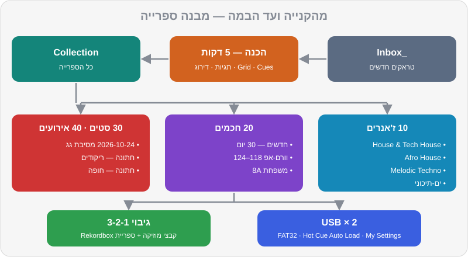

# הכנת ספרייה

שאלו DJ מנוסה מה ההבדל בינו לבין מתחיל, ורוב הסיכויים שהוא לא יגיד "המעברים". הוא יגיד: "אני מכיר את המוזיקה שלי". באמצע סט יש לכם בערך שלוש-ארבע דקות לבחור את השיר הבא, להכין אותו ולערבב — ובזמן הזה אין מקום לגלילה אינסופית בין 3,000 קבצים בשם `track_final_2.mp3`. ספרייה מסודרת היא מה שמאפשר לכם להיות נוכחים מול הקהל, במקום מול המסך. החדשות הטובות: זו עבודה שעושים בבית, בשקט, עם קפה. והיא אחת הדרכים הכי טובות להכיר מוזיקה לעומק.

## מה תלמדו בפרק

- פורמטים ואיכות: MP3, AAC, WAV, AIFF, FLAC — מה לבחור ולמה
- איפה קונים מוזיקה כחוק — לכל הז'אנרים שלכם, כולל מיינסטרים ומוזיקה ישראלית
- סטרימינג בתוך Rekordbox: מה זמין, מה עובד ומה המגבלות
- תגיות, דירוגים, צבעים ו-My Tag — שיטה מלאה
- פלייליסטים חכמים (Intelligent Playlists) ו-Related Tracks
- מבנה תיקיות ושמות קבצים שלא יתפרקו לכם
- גיבויים — הכלל של 3-2-1
- ייצוא ל-USB לנגני CDJ ו-XDJ
- שגרה שבועית של שעה

## פורמטים ואיכות

| פורמט | סוג | נפח לדקה (בערך) | תגיות ועטיפה | הערות |
|---|---|---|---|---|
| **MP3 320 kbps** | דחוס (Lossy) | 2.4MB | ✅ מלא | נתמך בכל מקום. איכות מצוינת למועדון |
| **AAC 256 kbps** (M4A) | דחוס | 1.9MB | ✅ מלא | הפורמט של חנות iTunes. איכות דומה ל-MP3 320 |
| **WAV** 16-bit / 44.1kHz | לא דחוס (Lossless) | 10MB | ⚠️ חלקי | איכות מלאה, אבל תגיות ועטיפות לא תמיד נשמרות או מוצגות בנגנים |
| **AIFF** 16-bit / 44.1kHz | לא דחוס | 10MB | ✅ מלא | איכות מלאה + תגיות. הבחירה הלא-דחוסה המומלצת לציוד Pioneer |
| **FLAC / ALAC** | דחוס ללא אובדן | 5–6MB | ✅ מלא | נתמך ב-Rekordbox ובנגנים מודרניים — **לא** בכל הנגנים הוותיקים |

**ההמלצה שלנו:** MP3 320 או AIFF. אם אתם קונים בחנות שמוכרת גם וגם — MP3 320 מספיק לגמרי בשלב הזה. כל הטראקים של DJ Lab הם MP3 ב-320 kbps.

> ⚠️ זהירות: הימנעו מ:
> - **"הורדות" מיוטיוב** — איכות נמוכה (ולא חוקי). במערכת של מועדון זה נשמע עמום ושטוח, ליד טראק אמיתי ההבדל צורם.
> - **קבצי MP3 ב-128 kbps** — אותה בעיה.
> - **"320 מזויף"** — קובץ 128 שהומר ל-320. המספר משקר, האיכות לא. מקור חוקי ואמין = אין בעיה.
> - **קבצים ב-24-bit / 96kHz** — לא כל הנגנים תומכים. 16-bit / 44.1kHz הוא הבטוח.

## איפה קונים מוזיקה כחוק

כשאתם קונים טראק, אתם תומכים באמנים שאתם מנגנים — וזה גם מה שמבטיח איכות. המחירים בטבלה מוערכים ומשתנים.

| חנות | הכי טובה ל... | מחיר לטראק (בערך) | פורמטים |
|---|---|---|---|
| **Beatport** | האוס, טק-האוס, אפרו-האוס, טכנו, מלודיק, טראנס | 1.49–2.49$ (~6–9 ₪), Lossless בתוספת | MP3, WAV, AIFF |
| **Traxsource** | האוס, דיפ, סולפול, אפרו-האוס | ~1.49–1.99$ | MP3, WAV, AIFF |
| **Bandcamp** | אמנים ולייבלים עצמאיים, כולל ישראלים | משתנה, האמן קובע | MP3 320, FLAC, WAV, AIFF, ALAC ועוד |
| **Juno Download** | מגוון רחב של מוזיקה אלקטרונית | דומה ל-Beatport | MP3, WAV, AIFF |
| **iTunes Store** | מיינסטרים, היפ-הופ, פופ, מוזיקה ישראלית ומזרחית | ~1–1.5$ | AAC 256 |
| **Record Pools** (DJcity, BPM Supreme ודומים) | מיינסטרים, היפ-הופ, לטיני — כולל גרסאות DJ עם אינטרו ואאוטרו נקיים | מנוי חודשי | MP3 |

### מוזיקה ישראלית וים-תיכונית

כאן החיים מורכבים יותר. הרבה להיטים ישראליים זמינים בחנות iTunes, חלק מהאמנים והלייבלים מוכרים ב-Bandcamp, ומפיקים ישראליים של האוס, טכנו ופסיי מוכרים ב-Beatport. בקבוצות WhatsApp וטלגרם מסתובבים הרבה "עריכות DJ" — חלקן מעולות, אבל רבות מהן בלי רישיון ובאיכות נמוכה. העדיפו מקורות רשמיים, ואם עריכה מגיעה ישירות מהמפיק — בקשו את הקובץ באיכות מלאה.

> 💡 טיפ: קניית טראק נותנת לכם רישיון שימוש אישי. השמעה בפומבי (מועדון, בר, אירוע) כרוכה ברישוי נפרד — בישראל, דרך ארגוני זכויות כמו אקו"ם (ליוצרים) וגופים נוספים (לבעלי ההקלטות והמבצעים). ברוב המקומות הקבועים, המקום הוא שמחזיק ברישיון. באירועים פרטיים כדאי לברר מראש עם המארגן. זה לא ייעוץ משפטי — נרחיב בפרק 18.

### והטראקים של DJ Lab?

ברישיון `CC0` — שלכם לגמרי, לכל שימוש, כולל הקלטות שתעלו לרשת. הם מושלמים לתרגול, למיקסים ראשונים שאתם רוצים לשתף, ולשלב בסטים כ"כלים" (אינטרואים, גשרים בין ז'אנרים).

## סטרימינג בתוך Rekordbox

התוכנה מתחברת לכמה שירותי סטרימינג, כך שאפשר לנגן טראקים בלי להחזיק את הקובץ. נכון לסתיו 2026:

| שירות | הערות |
|---|---|
| **Beatport Streaming** | הקטלוג האלקטרוני הגדול. נדרש מנוי ברמה שכוללת חיבור לתוכנות DJ (בערך 16$ לחודש ומעלה). ברמה הגבוהה (בערך 30$) — איכות גבוהה יותר וספריית Offline של עד 1,000 טראקים |
| **Beatsource** | שירות שמתמזג ל-Beatport — מי שמשתמש בו, יעבור לשם |
| **SoundCloud** (Go+) | הרבה רימיקסים ועריכות; אפשרות לשמירה במטמון |
| **TIDAL** | קטלוג מיינסטרים גדול; בדקו זמינות בישראל |
| **Apple Music** | קטלוג מיינסטרים ענק, כולל מוזיקה ישראלית |
| **Spotify** | נתמך ב-Rekordbox למחשב מסוף 2025; בגרסאות 2026 נוספו גם תמיכה במצב Export והתחברות בנגנים תואמים |

### המגבלות — חשוב לדעת

1. **צריך אינטרנט.** חיבור שנופל באמצע סט = שיר שנעצר. רק חלק מהשירותים (ורק בחלק מהמנויים) מאפשרים שמירה מקומית (Offline / Cache).
2. **אי אפשר לייצא ל-USB** טראקים מסטרימינג כמו קבצים רגילים. בנגני מועדון, סטרימינג עובד רק בנגנים חדשים ומחוברים לרשת.
3. **הקלטה** של סט עם טראקים מסטרימינג מוגבלת או חסומה ב-Rekordbox.
4. **איכות** תלויה בשירות ובמנוי — לפעמים נמוכה מ-MP3 320.
5. **הקטלוג משתנה** — טראק שבניתם עליו סט יכול להיעלם מחר.
6. **מנוי שמסתיים = ספרייה שנעלמת.**

> 💡 טיפ: סטרימינג מעולה **לגילוי מוזיקה** ולבקשות חריגות ("יש לך את...?"). את **הליבה** של הספרייה — הטראקים שאתם מנגנים כל שבוע — קנו. ככה הם שלכם, באיכות מלאה, ועובדים בכל עמדה.

## תגיות (Tags) — המידע שעל הטראק

לפני שמסדרים פלייליסטים, מסדרים את המידע. השדות החשובים:

| שדה | למה | טיפ |
|---|---|---|
| **Title** | שם השיר | כולל שם הגרסה, למשל `(Extended Mix)` |
| **Artist** | אמן | אחידות! לא "Artist feat. X" פעם אחת ו-"Artist & X" פעם אחרת |
| **Genre** | ז'אנר | רשימה קבועה וקצרה, לא 40 וריאציות |
| **BPM / Key** | מהניתוח | בדקו מול החנות אם משהו נראה חשוד |
| **Label / Year** | לייבל ושנה | עוזר למצוא "צלילים" דומים |
| **Comments** | הערות חופשיות | אנרגיה, מתי לנגן, עם מה מתחבר |

> 🎚️ ב-Rekordbox: עריכת תגיות נעשית מחלון המידע של הטראק (לחיצה ימנית → מידע) או ישירות בעמודות. אפשר לבחור כמה טראקים יחד ולשנות שדה לכולם. שינויים נשמרים בספרייה; לחלק מהשדות יש גם אפשרות לכתוב אותם לקובץ עצמו.

### גרסאות: Extended Mix מול Radio Edit

כשקונים, בחרו כמעט תמיד **Extended Mix** או **Original Mix** — גרסאות עם אינטרו ואאוטרו ארוכים, שבנויים למעברים. **Radio Edit** קצר, מתחיל ישר בשירה, ומתאים בעיקר לרדיו. במיינסטרים, חפשו גרסאות **DJ / Intro / Clean** במאגרי DJ.

### אנרגיה בשדה ההערות

לכל טראק של DJ Lab יש דירוג אנרגיה מ-1 עד 10, והוא כתוב גם בשדה ההערות של הקובץ (למשל: `Camelot 8A · Energy 7 · CC0`). אמצו את השיטה גם לטראקים שלכם: כתבו `Energy 6` בהערות. כשתבנו סטים (פרק 12), זה יהיה הכלי הכי שימושי שלכם — אפשר למיין ולסנן לפי זה.

## דירוגים, צבעים ו-My Tag

שלושה כלים, שלושה תפקידים. אל תערבבו ביניהם.

### דירוג (Rating) — "כמה אני אוהב את זה?"

| כוכבים | משמעות |
|---|---|
| ★★★★★ | פצצה. עובד תמיד, אני סומך עליו בעיניים עצומות |
| ★★★★ | טראק חזק, עובד ברוב הסטים |
| ★★★ | טוב במצבים מסוימים |
| ★★ | לבדוק שוב — אולי לא בשבילי |
| ★ | למחוק מהסטים |
| ללא | חדש, עוד לא דורג |

### צבע טראק — "מה התפקיד שלו בסט?"

ל-Rekordbox יש סט קבוע של צבעים לטראקים (אפשר לתת להם שמות). הצעה לשיטה לפי תפקיד:

| צבע | תפקיד |
|---|---|
| 🟢 ירוק | וורם-אפ |
| 🔵 כחול | בנייה (Build) |
| 🔴 אדום | שיא (Peak) |
| 🟣 סגול | סגירה / אפטר |
| 🟡 צהוב | "כולם שרים" — להיטים וקהל |
| 🟠 כתום | לבדיקה |

> 💡 טיפ: צבע הטראק הוא דבר אחד, וצבע ה-Hot Cue (פרק 7) הוא דבר אחר. אדום על הטראק = "שיר שיא"; אדום על Hot Cue D = "כאן הדרופ". אין התנגשות — הם מופיעים במקומות שונים במסך.

### תגיות אישיות (My Tag) — "באילו מצבים הוא עובד?"

מערכת My Tag היא מערכת התגיות האישית של Rekordbox. יש בה קבוצות (ברירת המחדל: Genre, Components, Situation), ואפשר לשנות ולהוסיף קבוצות ותגיות. טראק יכול לקבל כמה תגיות מכל קבוצה. בזמן נגינה, פותחים את פאנל הסינון ובוחרים — ו-3,000 טראקים הופכים ל-15.

הצעה ל-My Tag שמתאים לכם — מועדונים וגם אירועים:

| קבוצה | תגיות לדוגמה |
|---|---|
| **Situation** (מצב) | וורם-אפ, שיא, סגירה, קבלת פנים, ריקודים, חופה/טקס, סלואו, אפטר |
| **Components** (רכיבים) | ווקאל, אינסטרומנטלי, פסנתר, דרבוקה, עוד, Acapella באינטרו, אינטרו ארוך, אינטרו קצר |
| **Mood** (אווירה — קבוצה חדשה) | שמח, אפל, רגשי, היפנוטי, סקסי, אופורי |
| **Genre** (משלים לשדה הז'אנר) | תת-ז'אנרים: אפרו-טק, אורגני, רייב, ים-תיכוני מודרני |

## פלייליסטים חכמים ו-Related Tracks

### פלייליסטים חכמים (Intelligent Playlists)

פלייליסט שמתמלא לבד לפי כללים — וכל טראק חדש שמתאים לכללים נכנס אליו אוטומטית. דוגמאות שימושיות:

| שם | הכללים |
|---|---|
| **חדשים — 30 יום** | Date Added בתוך 30 הימים האחרונים |
| **וורם-אפ האוס** | BPM בין 118 ל-124 · דירוג 3 ומעלה · Genre מכיל House |
| **שיא טכנו** | BPM בין 128 ל-135 · My Tag: שיא · דירוג 4 ומעלה |
| **משפחת 8A** | Key הוא 7A, 8A, 9A או 8B (פרק 10) |
| **ריקודים — אירועים** | My Tag: ריקודים · My Tag: ווקאל |
| **לבדיקה** | אין דירוג, או צבע כתום |

> 🎚️ ב-Rekordbox: לחיצה ימנית על Playlists בעץ → יצירת Intelligent Playlist. מוסיפים תנאים (שדה + תנאי + ערך), ובוחרים אם כולם צריכים להתקיים או מספיק אחד.

### טראקים קשורים (Related Tracks)

כשטראק טעון בדק, Rekordbox יכול להציג טראקים "קשורים" מהספרייה שלכם — לפי BPM וסולם תואמים, ז'אנר, אמן ושיקולים נוספים. זה כלי מצוין לגלות חיבורים שלא חשבתם עליהם. אבל זכרו: התוכנה מכירה מספרים; אתם מכירים את הרחבה.

## מבנה תיקיות ושמות קבצים

התוכנה זוכרת כל קובץ לפי **המיקום שלו בדיסק**. אם תזיזו קובץ או תשנו לו שם — הוא "ייעלם" מהספרייה (Missing File), יחד עם ה-Cues שלו, עד שתאתרו אותו מחדש. לכן מחליטים על מבנה פעם אחת, ולא נוגעים.

```
Music/DJ/
├── _Inbox/                 ← הורדות חדשות שעוד לא הוכנו
├── 2026/
│   ├── 2026-09/
│   └── 2026-10/            ← כל קנייה נכנסת לחודש שבו נקנתה
│       ├── Artist - Title (Extended Mix).aiff
│       └── Artist - Title (Original Mix).mp3
└── DJ Lab/                 ← הרפו הזה
```

למה לפי תאריך ולא לפי ז'אנר? כי ז'אנר זה עניין של דעה ומשתנה, ותאריך לא. את הסידור לפי ז'אנר, אווירה ותפקיד עושים **בפלייליסטים** — שם אפשר לשנות בלי לשבור כלום.

**שמות קבצים:**

- המבנה: `Artist - Title (Mix Name).ext`
- בלי תווים בעייתיים: `/ \ : * ? " < > |`, ובלי אמוג'י.
- שמות בעברית עובדים ב-Rekordbox, אבל בחלק מהנגנים והמערכות הוותיקים התצוגה עלולה להשתבש. פתרון בטוח: שם קובץ בתעתיק לאנגלית, ועברית בתגית Title.



### מבנה פלייליסטים מומלץ

```
00 תרגול
10 ז'אנרים
   11 House & Tech House
   12 Afro House
   13 Melodic Techno
   14 Techno
   15 Mainstream & Hip-Hop
   16 ים-תיכוני ומזרחית
20 חכמים (Intelligent)
30 סטים
   2026-10-24 מסיבת גג — תל אביב
40 אירועים
   חתונה — קבלת פנים
   חתונה — ריקודים
   חתונה — חופה
90 לבדיקה
```

## גיבויים — הכלל של 3-2-1

אובדן ספרייה הוא אחד הדברים הכואבים שיכולים לקרות ל-DJ: מאות שעות של Cues, תגיות ופלייליסטים. הכלל:

- **3** עותקים של כל דבר,
- על **2** סוגי אחסון שונים (מחשב + כונן חיצוני),
- **1** מהם מחוץ לבית (ענן).

מה מגבים — **שני דברים נפרדים**:

1. **קבצי המוזיקה** — כל תיקיית `Music/DJ`.
2. **הספרייה של Rekordbox** — שם נמצאים ה-Cues, ה-Grids, הפלייליסטים והדירוגים.

> 🎚️ ב-Rekordbox: גיבוי הספרייה נעשה מתפריט File (Library > Backup Library). מומלץ פעם בשבוע ולפני כל עדכון גרסה. מי שיש לו תוכנית Creative או Professional (או תוסף ענן) יכול להשתמש גם ב-Cloud Library Sync, שמסנכרן את הספרייה בין מחשבים דרך Dropbox או Google Drive — זה נוח, אבל זה לא תחליף לגיבוי.

## ייצוא ל-USB לנגני CDJ ו-XDJ

כשתנגנו בקורס או במועדון על נגני Pioneer DJ / AlphaTheta, תביאו USB מוכן:

1. **פרמטו את ה-USB.** FAT32 עובד כמעט בכל הנגנים. exFAT נתמך רק בנגנים חדשים יותר (כמו `CDJ-3000`, `CDJ-3000X`, `XDJ-AZ`, `XDJ-RX3`). לא בטוחים מה מחכה לכם? FAT32.
2. **עדכנו את Rekordbox.** הנגנים החדשים ביותר (כמו `CDJ-3000X`) קוראים את פורמט הספרייה החדש — OneLibrary — וגרסאות 7.2 העדכניות של Rekordbox כותבות ל-USB גם את הפורמט הישן וגם את החדש. ככה USB אחד עובד גם על נגן ותיק וגם על חדש.
3. **במצב Export,** חברו את ה-USB. הוא יופיע בעץ תחת ההתקנים (Devices).
4. **גררו פלייליסטים** אל ה-USB. Rekordbox יעתיק את הקבצים יחד עם כל המידע: Grid, Hot Cues, Memory Cues, צבעים ודירוגים.
5. **הגדרות נגן (My Settings):** אפשר לשמור על ה-USB העדפות לנגנים — Quantize, טווח Tempo, טעינה אוטומטית של Hot Cues ועוד. כשמכניסים את ה-USB לנגן, ההגדרות נטענות.
6. **טעינה אוטומטית של Hot Cues (Hot Cue Auto Load)** — ודאו שהאפשרות דולקת, כדי שה-Hot Cues ייטענו אוטומטית עם כל טראק בנגן.
7. **הוציאו את ה-USB בבטחה** (Eject), ולא פשוט שולפים.
8. **בדקו** על הציוד האמיתי — בקורס, בחדר חזרות או אצל חבר — לפני ההופעה הראשונה.

> ⚠️ זהירות: **תמיד שני USB עם אותו תוכן.** ה-USB הוא לא גיבוי — הוא עותק עבודה. ולעולם אל תמחקו קבצים מהמחשב "כי הם כבר על ה-USB".

## שגרה שבועית: שעה אחת

1. **10 דקות — קנייה וגילוי.** עברו על צ'ארטים, סטים ששמעתם, והמלצות. קנו 5–10 טראקים.
2. **5 דקות — ייבוא.** ל-`_Inbox`, ואז לתיקיית החודש. ייבוא ל-Rekordbox וניתוח.
3. **30 דקות — הכנה.** לכל טראק: Grid, Hot Cues לפי המוסכמה, Memory Cues (פרק 7).
4. **10 דקות — מידע.** תגיות, אנרגיה בהערות, דירוג, צבע, My Tag.
5. **5 דקות — סדר וגיבוי.** פלייליסטים, גיבוי ספרייה, ועדכון ה-USB.

## תרגילים

> 🎧 תרגיל 1 — לתייג את DJ Lab: בחרו 20 טראקים של DJ Lab מהז'אנרים שאתם אוהבים. לכל אחד פתחו את קובץ ה-JSON, ותנו לו צבע לפי `role` (וורם-אפ / בנייה / שיא / סגירה), תגית Situation ב-My Tag בהתאם, ותגיות Components לפי מה שאתם שומעים (למשל דרבוקה ב-`music/tracks/mediterranean/mainstream-13-darbuka-nights.mp3`, קלימבה ב-`music/tracks/afro_house/house-10-kalimba-moon.mp3`). דרגו כל אחד לפי הטעם **שלכם**.

> 🎧 תרגיל 2 — שלושה פלייליסטים חכמים: צרו "וורם-אפ 118–124", "שיא 126 ומעלה" ו"משפחת 8A" (סולמות 7A, 8A, 9A, 8B). בדקו: האם `house-01`, `house-05` ו-`techno-08` נכנסו לפלייליסטים הנכונים? למה כן או למה לא?

> 🎧 תרגיל 3 — Related Tracks: טענו את `music/tracks/tech_house/house-05-groove-machine.mp3` (126, 8A) ופתחו את תצוגת הטראקים הקשורים. אילו טראקים של DJ Lab Rekordbox מציע? נסו מעבר לאחד מהם, ורשמו ביומן אם ההצעה עבדה.

> 🎧 תרגיל 4 — קנייה ראשונה: קבעו תקציב קטן (בערך 50 ₪) וקנו 5–6 טראקים בחנויות שבטבלה — לפחות אחד מכל אחד מהז'אנרים האהובים עליכם. העדיפו Extended Mix. ייבאו, ועברו על שגרת ההכנה המלאה מפרק 7.

> 🎧 תרגיל 5 — מבנה וגיבוי: בנו את מבנה התיקיות בדיסק ואת מבנה הפלייליסטים ב-Rekordbox. בצעו גיבוי ספרייה, והעתיקו גם את תיקיית המוזיקה לכונן חיצוני. כתבו ביומן תאריך ותזכורת לגיבוי הבא.

> 🎧 תרגיל 6 — USB ראשון: פרמטו דיסק-און-קי ל-FAT32 וייצאו אליו את הפלייליסט "שבוע 1" מפרק 2 ופלייליסט של 10 טראקים מוכנים. אם יש לכם גישה לנגן CDJ או XDJ בקורס — הכניסו ובדקו שה-Hot Cues נטענים בצבעים הנכונים.

## סיכום

- פורמט: MP3 320 או AIFF. בלי הורדות מיוטיוב ובלי 128.
- קונים בחנויות חוקיות: Beatport ו-Traxsource לאלקטרוני, Bandcamp לעצמאיים, iTunes ומאגרי DJ למיינסטרים ולמוזיקה ישראלית.
- סטרימינג בתוך Rekordbox — מעולה לגילוי ולבקשות, עם מגבלות של אינטרנט, ייצוא והקלטה. את הליבה קונים.
- תגיות אחידות, אנרגיה בהערות, דירוג = כמה אני אוהב, צבע = תפקיד בסט, My Tag = באילו מצבים.
- פלייליסטים חכמים חוסכים שעות. Related Tracks מציע — אתם מחליטים.
- לא מזיזים קבצים אחרי ייבוא. מבנה לפי תאריך בדיסק, לפי ז'אנר בפלייליסטים.
- גיבוי 3-2-1, גם למוזיקה וגם לספרייה. שני USB, FAT32 אם לא בטוחים, Rekordbox מעודכן.

## בפרק הבא

סיימתם את החצי הראשון של הקורס — מזל טוב! יש לכם ספרייה, מעברים וכלים. בחלק הבא נלמד את מה שהופך מעבר "נכון" למעבר **יפה**: מיקס הרמוני וגלגל Camelot.

👉 [פרק 10 — מיקס הרמוני](10-harmonic-mixing.md)
