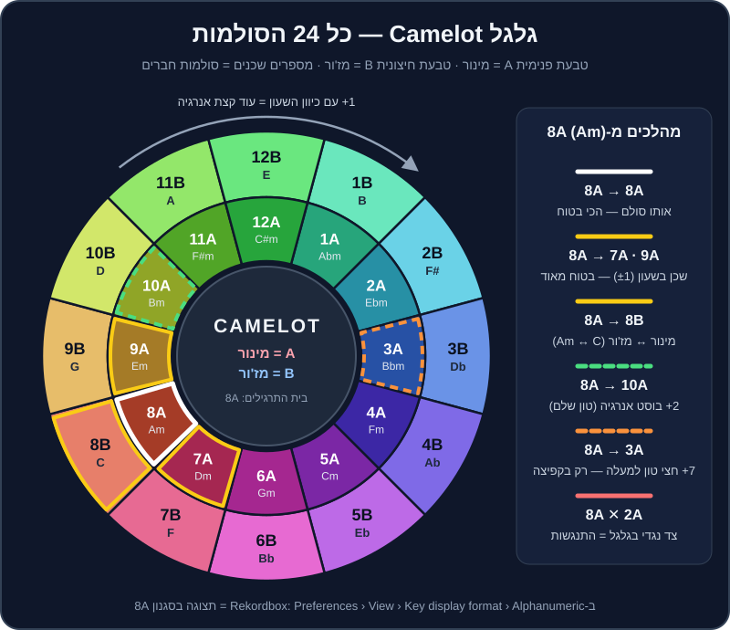

# מיקס הרמוני

יש רגע שכל DJ מתחיל מכיר: הביטמאצ'ינג מושלם, התופים נעולים, הפרייזים מיושרים — ובכל זאת, ברגע שהבאס והאקורדים של השיר השני נכנסים, משהו "מזייף". זה לא נשמע כמו שיר אחד גדול, אלא כמו שני מכשירי רדיו שמנגנים באותו חדר. הסיבה כמעט תמיד היא **סולם** (`Key`).

בפרק הזה נלמד לשמוע את זה, להבין למה זה קורה, ולהשתמש בכלי פשוט וגאוני — **גלגל Camelot** — כדי לבחור את השיר הבא כך שהמעבר יישמע כאילו הוא תוכנן מראש. ובסוף נדבר גם על הצד השני: מתי לא לעבוד לפי הספר.

## מה תלמדו בפרק

- מה זה סולם, ומה ההבדל בין מז'ור למינור — בלי תואר במוזיקה.
- איך קוראים את גלגל Camelot, כולל טבלה מלאה של 24 הסולמות והטראקים שלנו בכל אחד.
- חמשת המהלכים הבטוחים: אותו סולם, ‎±1, מעבר A↔B, בוסט ‎+2, וקפיצת ‎+7.
- למה חייבים להבין `Key Lock` (ב-Rekordbox: `Master Tempo`) לפני שנוגעים בפיץ'.
- איך משתמשים ב-`Key Shift`, ב-`Key Sync` ובכלי ההמלצה של Rekordbox.
- מתי הרמוניה פשוט לא משנה — ומתי כדאי לשבור את החוקים בכוונה.
- תרגילים מעשיים עם קובצי התרגול `practice-10`, `practice-11`, `practice-12` והטראקים של הרפו.

## קצת תיאוריה, בלי כאב ראש

### 12 צלילים, וזהו

במוזיקה המערבית יש בסך הכול 12 צלילים שחוזרים על עצמם באוקטבות: דו, דו דיאז, רה, מי במול, מי, פה, פה דיאז, סול, לה במול, לה, סי במול, סי — ושוב דו. המרחק בין שני צלילים סמוכים נקרא **חצי טון** (`semitone`).

**סולם** הוא בחירה של 7 מתוך 12 הצלילים האלה, סביב צליל "בית" (ה-`tonic`). שיר בסולם לה מינור (`A minor`, או בקיצור `Am`) "חוזר הביתה" לצליל לה, ומשתמש בעיקר בצלילים לה, סי, דו, רה, מי, פה, סול.

### מז'ור ומינור

- **מז'ור** (`major`) — נשמע לרוב בהיר, שמח, "פתוח". רוב שירי הפופ השמחים.
- **מינור** (`minor`) — נשמע לרוב כהה, רגשי, מסתורי. רוב הטכנו, המלודיק טכנו, הטק האוס, וגם הרבה מהמוזיקה הים-תיכונית.

> 💡 טיפ: ההגדרה "שמח/עצוב" היא פישוט. יש להיטי מינור שמקפיצים רחבות שלמות (תחשבו על רוב הרגאטון), ויש בלדות מז'ור. אבל כנקודת התחלה לאוזן — זה עובד.

### הסוד: מז'ור ומינור "קרובי משפחה"

לכל סולם מז'ור יש סולם מינור שמשתמש **בדיוק באותם 7 צלילים**. לה מינור ודו מז'ור (`Am` ו-`C`) חולקים את אותם צלילים — רק "הבית" שונה. לזוג כזה קוראים **סולמות מקבילים** (`relative keys`), ובגלל זה מעבר ביניהם נשמע טבעי לגמרי. זה בדיוק המעבר A↔B בגלגל Camelot.

### למה שני סולמות "מתנגשים"?

כששני טראקים מנגנים יחד, הבאס, האקורדים, הפדים והווקאל של שניהם נשמעים בו-זמנית. אם בטראק אחד יש פה ובשני פה דיאז — שני צלילים במרחק חצי טון — נוצרת "חיכוך" צורם. ככל שיש יותר צלילים שונים בין שני הסולמות, כך החיכוך גדול יותר.

> 💡 טיפ: **לתופים כמעט אין סולם.** קיק, היי-האט וקלאפ לא "מזייפים". לכן כשמערבבים רק תופים מול תופים — הסולם כמעט לא משנה. בכל הטראקים של DJ Lab, 16 התיבות הראשונות של האינטרו הן תופים בלבד, בלי באס ובלי צלילים טונליים (ראו `music/SCHEMA.md`). הסולם "נכנס לתמונה" בתיבה 17, בדרך כלל בנקודת ה-Hot Cue **B** (`Mix-In / Groove`).

## גלגל Camelot

ה-DJ מארק דייוויס (`Mark Davis`), מחלוצי המיקס ההרמוני, פישט את "מעגל הקווינטות" של המוזיקאים למשהו ש-DJ יכול לקרוא בחושך של בודקה: שעון עם 12 מספרים ושתי טבעות. בשנות ה-2000 השיטה הפכה לסטנדרט בזכות התוכנה `Mixed In Key`, והיום כמעט כל תוכנת DJ יודעת להציג אותה.

### איך קוראים את הגלגל

1. **המספר (1 עד 12)** — המיקום על השעון. מספרים סמוכים = סולמות שחולקים 6 מתוך 7 צלילים.
2. **האות** — `A` בטבעת הפנימית = מינור. `B` בטבעת החיצונית = מז'ור.
3. **אותו מספר, אות שונה** = סולמות מקבילים (אותם צלילים בדיוק). למשל `8A` (Am) ו-`8B` (C).
4. השעון "מתגלגל": אחרי 12 בא 1. לכן 12A ו-1A שכנים.

> 🎚️ ב-Rekordbox: כדי לראות קודים כמו `8A` במקום `Am`, היכנסו ל-`Preferences` ← `View` ← `Key display format` ובחרו `Alphanumeric`. Rekordbox לא קורא לזה "Camelot" (זה סימן מסחרי), אבל המספור זהה. ההגדרה `Classic` מציגה את השמות הרגילים (`Am`, `F#m`).

### הטבלה המלאה — 24 הסולמות והטראקים שלנו

הטבלה הזו זהה לטבלת הייחוס ב-`music/SCHEMA.md`. בעמודה האחרונה — הטראקים של DJ Lab בכל סולם (ה-BPM בסוגריים), כדי שתוכלו לתרגל מיד.

| Camelot | סולם | בעברית | טראקים וקבצי תרגול שלנו |
|---|---|---|---|
| 1A | `Abm` | לה במול מינור | — |
| 1B | `B` | סי מז'ור | — |
| 2A | `Ebm` | מי במול מינור | — |
| 2B | `F#` | פה דיאז מז'ור | — |
| 3A | `Bbm` | סי במול מינור | `practice-11` (124) — קובץ ה"התנגשות" |
| 3B | `Db` | רה במול מז'ור | — |
| 4A | `Fm` | פה מינור | house-09 (122), house-14 (113), techno-02 (131), techno-09 (128), mainstream-01 (128), mainstream-06 (140), breadth-05 (174), breadth-07 (140) |
| 4B | `Ab` | לה במול מז'ור | — |
| 5A | `Cm` | דו מינור | house-10 (120), techno-10 (127), mainstream-05 (92), breadth-06 (172) |
| 5B | `Eb` | מי במול מז'ור | — |
| 6A | `Gm` | סול מינור | house-04 (124), house-07 (128), house-11 (122), techno-04 (129), mainstream-02 (128), mainstream-07 (95), mainstream-16 (125), breadth-08 (132) |
| 6B | `Bb` | סי במול מז'ור | — |
| 7A | `Dm` | רה מינור | house-03 (124), house-06 (127), techno-03 (132), techno-12 (150), mainstream-09 (92), mainstream-15 (124), breadth-02 (138), breadth-09 (130) |
| 7B | `F` | פה מז'ור | house-13 (116), breadth-10 (84) |
| 8A | `Am` | לה מינור | house-01 (122), house-05 (126), techno-01 (130), techno-08 (122), techno-11 (148), mainstream-04 (124), mainstream-08 (95), mainstream-14 (104), breadth-03 (138), `practice-08`, `practice-10` |
| 8B | `C` | דו מז'ור | house-12 (118), mainstream-03 (122) |
| 9A | `Em` | מי מינור | house-02 (121), house-08 (126), techno-07 (124), mainstream-10 (108), mainstream-13 (100), breadth-04 (134), `practice-09`, `practice-12` |
| 9B | `G` | סול מז'ור | mainstream-11 (104) |
| 10A | `Bm` | סי מינור | techno-05 (122) |
| 10B | `D` | רה מז'ור | mainstream-12 (106) |
| 11A | `F#m` | פה דיאז מינור | techno-06 (123), breadth-01 (142) |
| 11B | `A` | לה מז'ור | — |
| 12A | `C#m` | דו דיאז מינור | — |
| 12B | `E` | מי מז'ור | — |

> 💡 טיפ: שימו לב כמה טראקים יש ב-4A עד 9A. זה לא מקרי — מוזיקת מועדונים נכתבת הרבה במינור, ובסולמות שנוח לנגן ולהפיק בהם. בספרייה האמיתית שלכם תגלו כנראה תמונה דומה.

## המהלכים הבטוחים

הנה ה"תפריט" של מעברים הרמוניים, מהבטוח ביותר ועד הנועז. הדוגמאות מתחילות מ-`8A` (לה מינור), סולם הבית של קובצי התרגול שלנו.

| מהלך | מ-8A אל | איך זה נשמע | מתי להשתמש | זוג לתרגול מהרפו |
|---|---|---|---|---|
| אותו סולם | 8A | חלק לגמרי, כמו שיר אחד | בלנדים ארוכים, לייר של שני טראקים | house-01 + techno-08 (שניהם 122) |
| שכן ‎±1 | 7A / 9A | טבעי מאוד, תחושת "המשך" | הבחירה היומיומית שלכם | house-05 ← house-08 (שניהם 126) |
| מקביל A↔B | 8B | שינוי מצב רוח: מינור כהה ↔ מז'ור מואר | להאיר סט כהה, או להעמיק סט שמח | mainstream-04 ← mainstream-03 |
| בוסט ‎+2 | 10A | הרמה מורגשת, "עלינו מדרגה" | לפני שיא, אחרי כמה טראקים באותו אזור | techno-08 ← techno-05 (שניהם 122) |
| קפיצת ‎+7 | 3A | חצי טון למעלה — "הקלאסיקה של הפזמון האחרון" | בקאט או בכניסה חדה, לא בבלנד ארוך | house-09 ← techno-06 (122 ו-123) |
| אלכסון (מתקדם) | 9B | שינוי צבע עדין | כשאין אפשרות אחרת, בבלנד קצר | mainstream-08 ← mainstream-11 (בגשר טמפו) |

בואו נפרק אותם.

### 1. אותו סולם

הכי בטוח שיש. אפשר להחזיק שני טראקים יחד 32 ו-64 תיבות, אפילו לבנות "טראק שלישי" מהשילוב שלהם. החיסרון: אם כל הסט באותו סולם, הוא מתחיל להישמע שטוח.

### 2. שכן: ‎+1 או ‎−1

זז מספר אחד בשעון, באותה טבעת. 8A↔9A או 8A↔7A. ששה מתוך שבעה צלילים משותפים — האוזן כמעט לא מרגישה תפר.

לפי המוסכמה של Mixed In Key, צעד **עם כיוון השעון** (‎+1) מוסיף מעט אנרגיה, וצעד **נגד כיוון השעון** (‎−1) מרגיע מעט. זה עדין, אבל כשבונים סט שלם — זה מצטבר.

> 🎧 תרגיל קצר: `transition-01` בתיקייה `music/transitions/` הוא בדיוק מהלך כזה: house-01 (8A) אל house-02 (9A) בבלנד ארוך. האזינו לו ותשמעו כמה "חלק" זה נשמע. גם `transition-02` (house-05 8A אל house-06 7A) הוא שכן — ‎−1.

### 3. מקביל: A↔B

אותו מספר, טבעת אחרת. 8A (Am) ↔ 8B (C). אותם צלילים בדיוק — אבל "הבית" זז, ואיתו מצב הרוח. ממינור למז'ור זה כמו לפתוח חלון בבוקר; ממז'ור למינור זה כמו לכבות חצי מהאורות.

### 4. בוסט אנרגיה: ‎+2

שני צעדים עם כיוון השעון, באותה טבעת: 8A → 10A. מבחינה מוזיקלית זה **טון שלם למעלה**. זה כבר לא "חלק" לגמרי — וזה בדיוק העניין: הקהל מרגיש הרמה. עובד מצוין כשמכניסים את הטראק החדש בברייקדאון או מיד אחרי פרייז, ולא בבלנד ארוך של 64 תיבות עם שני באסים.

> ⚠️ זהירות: ב-`transition-07` (house-09 4A אל house-11 6A) הכיתוב הפנימי מדבר על "‎+1 Camelot", אבל בפועל 4A → 6A הוא **‎+2** — בוסט אנרגיה קלאסי. האזינו ושימו לב איפה הבאס של house-11 נכנס: לא באמצע בלנד, אלא על תחילת פרייז.

### 5. קפיצת ‎+7: חצי טון למעלה

זה הטריק הכי מבלבל בגלגל: ‎+7 צעדים (או ‎−5, זה אותו דבר) = **חצי טון למעלה**. 8A (Am) → 3A (Bbm). זה בדיוק מה שעושים בהרבה שירי פופ בפזמון האחרון ("ה-key change"), והאפקט רגשי וחזק.

אבל שימו לב: אם תנגנו 8A ו-3A **יחד** — זה הכי מזייף שיש. רק שני צלילים מתוך שבעה משותפים להם. לכן ‎+7 עובד רק כ**קפיצה**: Echo Out, קאט על ה-1, או כניסה בברייקדאון שקט. זה בדיוק מה שקובץ `practice-11` מדגים — הוא ב-3A, ונועד להישמע רע כשמנגנים אותו יחד עם `practice-10` (8A).

### 6. אלכסון (מתקדם)

ממינור למז'ור **ועוד** צעד אחד: 8A (Am) ↔ 9B (G). יש ביניהם הבדל של צליל אחד. זה מהלך "צבע" — מעניין, אבל פחות בטוח. השתמשו בו כשהמהלכים האחרים לא מתאפשרים, ובבלנד קצר.

### מה לא לעשות (רוב הזמן)

- **הצד השני של השעון** — 8A מול 2A. כמעט שום צליל משותף. בבלנד ארוך זה יישמע כמו תקלה.
- **אותו מספר, אותה אות, אבל מז'ור מול מינור על אותו "בית"** — `Am` מול `A` (8A מול 11B). נשמע קרוב, אבל שלושה צלילים שונים. זו טעות נפוצה של מתחילים: "זה גם לה, אז זה מתאים" — לא.

## Key Lock: הצד הנסתר של כפתור הטמפו

### מה קורה כשמזיזים את הטמפו?

בפלטות ויניל, כשמאיצים תקליט — הוא גם עולה בגובה הצליל (כמו אפקט "צ'יפמאנק"). אותו דבר קורה בתוכנה אם `Key Lock` כבוי.

החשבון הוא כזה: **שינוי של בערך 6% בטמפו = חצי טון.** (המספר המדויק הוא 5.95%.)

| שינוי טמפו (בלי Key Lock) | שינוי בגובה הצליל | מה זה אומר בגלגל |
|---|---|---|
| ‎±1% | כ-1/6 חצי טון | זייוף קל שאוזן מאומנת שומעת בבלנד ארוך |
| ‎±3% | כחצי מחצי טון | כבר "בין הסולמות" — מזייף מול כל דבר |
| ‎±6% | חצי טון | עברתם 7 צעדים בגלגל! 8A נהיה בערך 3A |

כלומר: אם הגברתם טראק ב-8A ב-6% בלי Key Lock — הוא כבר לא 8A. ה-Camelot שמופיע בתוכנה כבר לא נכון לגביו.

### Master Tempo ב-Rekordbox

> 🎚️ ב-Rekordbox: בכל דק יש כפתור `MASTER TEMPO` (מסומן לפעמים `MT`). כשהוא דולק, שינוי הטמפו לא משנה את גובה הצליל. זה ה-`Key Lock` של Rekordbox.

1. טענו טראק לדק.
2. הדליקו `MASTER TEMPO` (הכפתור נצבע).
3. הזיזו את ה-`Tempo` ל-‎+4% — הקצב עולה, הצליל נשאר באותו גובה.
4. כבו את `MASTER TEMPO` — עכשיו תשמעו את הצליל "קופץ" למעלה.

> 💡 טיפ: לרוב ז'אנרי הקלאב — השאירו `MASTER TEMPO` דולק כברירת מחדל. היוצאים מן הכלל: סקרץ' ופרפורמנס בסגנון ויניל, ושינויי טמפו קיצוניים (מעל 8-10%) שבהם האלגוריתם מתחיל להשאיר "שאריות" (ארטיפקטים) בצליל.

## Key Shift ו-Key Sync ב-Rekordbox

ב-Rekordbox יש כלים שמשנים את הסולם בפועל.

- **`Key Shift`** — מזיז את הסולם של הדק בחצאי טון, עד 12 למעלה או למטה. חץ למעלה = חצי טון למעלה = ‎+7 בגלגל. חץ למטה = ‎−7 (או ‎+5).
- **`Key Sync`** — לחיצה אחת, והתוכנה מזיזה את הסולם של הדק כך שיתאים לטראק שמנגן בדק השני (בתנאי ששני הטראקים נותחו). בגרסאות החדשות האלגוריתם מחפש את ההתאמה הקרובה ביותר, לרוב בהזזה של עד שני חצאי טון.
- **`Key Reset`** — מחזיר את הסולם המקורי.

> 🎚️ ב-Rekordbox: הכפתורים האלה נמצאים בתצוגת הדק במצב `PERFORMANCE`, ליד תצוגת הסולם. בחלק מהפריסות צריך להרחיב את תצוגת הדק כדי לראות אותם, ובחלק מהקונטרולרים יש להם קיצור (למשל עם `SHIFT`). בדקו את מדריך החומרה של הקונטרולר שלכם.

### מתי זה שימושי, ומתי זה הורס

- **שימושי:** לתקן מעבר של "כמעט" — טראק אחד ב-8A ואחר ב-3A, ומזיזים את השני חצי טון למטה.
- **שימושי:** אקפלה או לופ מלודי מעל טראק אחר.
- **הורס:** הזזה של יותר מ-1-2 חצאי טון על ווקאל. קולות נשמעים מלאכותיים מהר מאוד.
- **הורס:** לסמוך על זה במקום לבחור טראקים נכון. Key Sync הוא תיקון, לא שיטה.

> ⚠️ זהירות: אם `Key Shift` או `Key Sync` פעילים, הסולם המוצג בדק עשוי להשתנות — בדקו שאתם יודעים אם אתם רואים את הסולם המקורי או את הנוכחי. כשמשהו נשמע מוזר, `Key Reset` ותחזרו לנקודת ההתחלה.

### הכלים שעוזרים לבחור את השיר הבא

- **הדגשת סולמות תואמים** — כשטראק מנגן, Rekordbox יכול להדגיש בצבע (בדרך כלל ירוק) בעמודת ה-`Key` בספרייה את הטראקים בסולמות תואמים.
- **`Related Tracks`** — פאנל שמציג טראקים "קשורים" לפי קריטריונים שאתם מגדירים: סולם תואם, BPM קרוב, ז'אנר, ועוד.
- **`Track Suggestion`** (ב-Rekordbox 7) — המלצות לפי מצבים כמו `Era`, `Mood`, `Association`, ובנוסף `Collection Radar` ו-`Streaming Radar` שמבוססים על ניתוח מוזיקלי.

> 💡 טיפ: הכלים האלה מצוינים לגלות אפשרויות, אבל הם לא יודעים מה הקהל שלכם מרגיש עכשיו. השתמשו בהם כרשימת מועמדים, ותבחרו בעצמכם.

## זיהוי הסולם — לא תמיד נכון

תוכנות מזהות סולם לפי "כמה אנרגיה יש בכל אחד מ-12 הצלילים" לאורך הטראק. זה עובד יפה, אבל טועה לא מעט. הטעויות הנפוצות:

1. **מז'ור ↔ מינור מקבילים** (8A נקרא 8B). למזלנו — זה מהלך תואם, אז הנזק קטן.
2. **שכן בגלגל** (8A נקרא 9A). גם כאן הנזק קטן.
3. **טראקים כמעט בלי מלודיה** (טכנו מינימלי, טק האוס של באס וקלאפ) — הזיהוי כמעט אקראי, אבל גם ההתנגשות האפשרית קטנה.
4. **מוזיקה ים-תיכונית ומזרחית.** מקאמים כמו חיג'אז (`Hijaz`) לא יושבים טבעית על מז'ור/מינור מערבי, ובחלק מהמקאמים יש רבעי טונים. שיר בחיג'אז על רה עלול להיות מזוהה כסול מינור או כרה מז'ור. כאן — **האוזן קובעת**.

> 💡 טיפ: בטראקים של DJ Lab הסולם ידוע במדויק מהמפרט (`tracklist.plan.json`), וכתוב גם בתג `TKEY` וגם בהערה (`Camelot 8A · Energy 7 · CC0`). לספרייה שלכם אפשר להריץ את `tools/analyze_library.py` (ראו `CLAUDE.md`) ולהשוות מול Rekordbox. כשיש מחלוקת — תסמכו על האוזניים.

## מתי לשבור את החוקים

הרמוניה היא כלי, לא דת. הקהל לא רוקד עם גלגל Camelot ביד. הנה מצבים שבהם מותר (ולפעמים עדיף) לא להתייחס לסולם:

- **תופים מול תופים.** אם המעבר כולו קורה באינטרו/אאוטרו בלי באס ומלודיה — כל סולם הולך. בטראקים שלנו: 16 התיבות הראשונות וה-16 האחרונות.
- **קאט חד או Echo Out.** כשאין חפיפה, אין התנגשות. ככה מכניסים ‎+7 ואפילו סולמות רחוקים.
- **שינוי ז'אנר או טמפו גדול.** ממילא אתם "מאפסים" את האוזן (ראו [פרק 15](15-tempo-genre-switching.md)).
- **השיר שכולם מחכים לו.** בחתונה, כשהקהל צועק שיר — מנגנים אותו. בונים מעבר נקי (Echo Out, קאט על ה-1), ולא מוותרים על רגע ענק בגלל ‎+5 בגלגל.
- **הפתעה מכוונת.** לפעמים "הזרות" של סולם רחוק היא האפקט. ‎+7 הוא הדוגמה הקלאסית.
- **טראק הפרקשן.** אפרו האוס עם תופים בלבד, טכנו היפנוטי של קיק ורעש — סולם כמעט לא רלוונטי.

> 🎧 תרגיל מחשבה: בפעם הבאה שאתם שומעים מעבר "מזייף" בסט של מישהו אחר — נסו לנחש: האם זו התנגשות סולמות, או שהביטמאץ' זז? זו אחת המיומנויות החשובות ביותר שתפתחו.

## שיטת עבודה: הרמוניה בהכנת סט

1. **הציגו את עמודת `Key`** בספרייה, במצב `Alphanumeric`.
2. **מיינו פלייליסט לפי Key**, ותראו "משפחות" של טראקים.
3. **סמנו זוגות שעובדים** — אחרי שניסיתם מעבר וזה עבד, כתבו את זה ב-`Comments` או ב-`My Tag` (למשל "→ house-08").
4. **תכננו מסלול**, לא רק מעבר. למשל מסלול עם כיוון השעון שמעלה אנרגיה בהדרגה:
   house-09 (4A, 122) → house-10 (5A, 120) → house-04 (6A, 124) → house-03 (7A, 124) → house-05 (8A, 126) → house-08 (9A, 126).
5. **השאירו "דלתות יציאה"** — בכל רגע תדעו מה אפשר לנגן ב-‎±1, ב-A↔B וב-‎+2.

> 💡 טיפ: באתר של DJ Lab (התיקייה `docs/`) יש **גלגל Camelot אינטראקטיבי**: לוחצים על סולם ורואים מיד את המהלכים הבטוחים ואת הטראקים מהרפו בכל אחד. ככה מתכננים מסלול בדקה.

## תרגילים

> 🎧 תרגיל 1 — לשמוע התנגשות (15 דקות)
> 1. טענו את `music/practice/practice-10-key-home-8A-124.mp3` לדק 1 ואת `music/practice/practice-12-key-friend-9A-124.mp3` לדק 2. שניהם 124 BPM.
> 2. הפעילו `Sync` (או סנכרנו באוזן), ושני הפיידרים למעלה. הקשיבו 32 תיבות. כך נשמע 8A + 9A.
> 3. החליפו את דק 2 ל-`music/practice/practice-11-key-clash-3A-124.mp3` (3A). אותו דבר. כך נשמעת התנגשות.
> 4. סגרו עיניים ובקשו ממישהו להחליף ביניהם באקראי. כמה פעמים מתוך 10 זיהיתם נכון?

> 🎧 תרגיל 2 — החלפת באס הרמונית (15 דקות)
> טענו את `practice-08` (באס ב-8A) ואת `practice-09` (באס ב-9A). תרגלו Bass Swap על תחילת פרייז: ה-Low של דק אחד יורד בדיוק כשה-Low של השני עולה. כי הסולמות שכנים — גם רגע החפיפה (אם תפספסו) לא יישמע נורא. עכשיו נסו אותו דבר עם `practice-11` מול `practice-08` ותשמעו כמה זה פחות סלחני.

> 🎧 תרגיל 3 — שכן ‎+1 בטראקים אמיתיים (15 דקות)
> מעבר מ-`music/tracks/tech_house/house-05-groove-machine.mp3` (8A) אל `music/tracks/tech_house/house-08-shuffle-theory.mp3` (9A). שניהם 126 — אין צורך בשינוי טמפו. היכנסו עם house-08 מ-Hot Cue **A** כש-house-05 מגיע ל-Hot Cue **G** (`Outro`), ועשו Bass Swap כש-house-08 מגיע ל-Hot Cue **B**.

> 🎧 תרגיל 4 — A↔B (10 דקות)
> מ-`mainstream-04` (Golden Hour, 8A, 124) אל `mainstream-03` (Summer In Tel Aviv, 8B, 122). הורידו את mainstream-04 ל-122 (או העלו את mainstream-03 ל-124) עם `MASTER TEMPO` דולק. האם אתם שומעים את ה"התבהרות" כשהמז'ור משתלט?

> 🎧 תרגיל 5 — בוסט ‎+2 (15 דקות)
> מ-`music/tracks/melodic_techno/techno-08-silent-orbit.mp3` (8A) אל `music/tracks/melodic_techno/techno-05-neon-cathedral.mp3` (10A), שניהם 122. נסו פעמיים: (א) בלנד ארוך של 32 תיבות עם שני הבאסים; (ב) כניסה של techno-05 בדיוק כשהברייקדאון של techno-08 (Hot Cue **C**) מתחיל, וחיתוך הבאס הישן. איזה עבד טוב יותר? למה?

> 🎧 תרגיל 6 — קפיצת ‎+7 (10 דקות)
> מ-`house-09` (Desert Drums, 4A, 122) אל `techno-06` (Afterglow Protocol, 11A, 123): 4 + 7 = 11, כלומר חצי טון למעלה. קודם נסו בלנד ארוך — ותשמעו את החיכוך. אחר כך: Echo Out של פעמה אחת על house-09 בסוף פרייז, וכניסה של techno-06 על ה-1 מנקודת Hot Cue **D**. זה כבר נשמע כמו "הרמה" ולא כמו טעות.

> 🎧 תרגיל 7 — ניסוי Key Lock (10 דקות)
> 1. טענו את `practice-10` (8A) לדק 1, כבו את `MASTER TEMPO`, והעלו את הטמפו ב-5.9% (בערך 131.3 BPM).
> 2. טענו את `practice-11` (3A) לדק 2, השאירו `MASTER TEMPO` דולק, והביאו גם אותו ל-131.3 BPM.
> 3. נגנו יחד. ההתנגשות נעלמה! כי practice-10 "עלה" חצי טון — מ-8A ל-3A.
> 4. עכשיו הדליקו `MASTER TEMPO` בדק 1 — וההתנגשות חוזרת. זה כל הסיפור של Key Lock בניסוי אחד.

> 🎧 תרגיל 8 — Key Sync (10 דקות)
> נגנו את `practice-10` בדק 1. טענו את `practice-11` לדק 2 ולחצו `Key Sync` בדק 2. הקשיבו לתוצאה. אחר כך `Key Reset`. שימו לב כמה זה נוח — וכמה חשוב לא להתמכר לזה.

> 🎧 תרגיל 9 — מסלול הרמוני על נייר (20 דקות)
> פתחו את `music/tracklist.plan.json` (או את כלי ה-Set Builder באתר) ובנו מסלול של 6 טראקים שבו כל מעבר הוא אחד מהמהלכים הבטוחים, וה-BPM לא קופץ ביותר מ-3 בין טראק לטראק. רשמו ליד כל מעבר איזה מהלך זה (‎±1, A↔B, ‎+2). נגנו את המסלול והקליטו (ראו [פרק 16](16-recording-sharing.md)).

## סיכום

- סולם = 7 צלילים סביב "בית". מז'ור ומינור מקבילים חולקים את אותם צלילים.
- גלגל Camelot הופך את זה למשחק מספרים: אותו קוד, ‎±1, A↔B — בטוחים. ‎+2 — בוסט. ‎+7 — חצי טון למעלה, רק בקפיצה.
- בלי `MASTER TEMPO`, שינוי של 6% בטמפו מזיז את הסולם בחצי טון. השאירו אותו דלוק.
- `Key Shift` ו-`Key Sync` הם כלי תיקון — בעדינות, ובעיקר בלי ווקאל.
- תופים לא מזייפים. באינטרו ובאאוטרו של תופים בלבד, ובקאט חד — הסולם כמעט לא משנה.
- האוזן היא השופטת האחרונה, במיוחד במוזיקה ים-תיכונית.

בפרק הבא נוסיף "תבלינים" למעברים: **אפקטים** — Echo, Reverb, פילטרים ועוד, ומתי פחות זה הרבה יותר. ← [פרק 11: אפקטים](11-effects.md)
