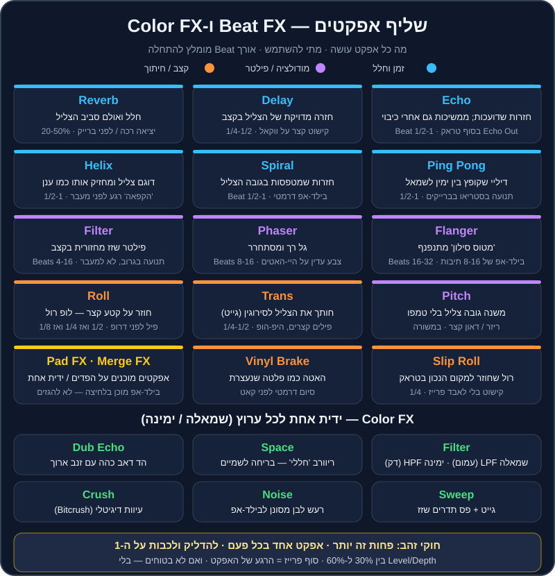

# אפקטים

אפקטים הם כמו תבלינים. קורט מלח הופך מנה טובה למעולה; חצי צנצנת — והמנה הלכה. ברוב הסטים הטובים שתשמעו, האפקטים כמעט לא מורגשים: Echo קטן שסוגר טראק, פילטר שמרים מתח לפני דרופ, Reverb שנותן לברייקדאון "לנשום". ודווקא אצל מתחילים, האפקטים הם הדבר הכי רועש בסט.

בפרק הזה נעבור על כל האפקטים של Rekordbox אחד-אחד, נלמד לבחור אורך Beat בלי לנחש, ונבנה "מתכונים" מוכנים לכל ז'אנר שאתם אוהבים — מאפרו האוס ועד ים-תיכוני.

## מה תלמדו בפרק

- איפה האפקטים ב-Rekordbox ומה ההבדל בין `Beat FX`, `Color FX`, `Pad FX` ו-`Merge FX`.
- מה עושה כל אחד מה-Beat FX (Echo, Delay, Reverb, Spiral, Roll, Trans ועוד).
- איך מחשבים אורך Beat, ולמה Echo של פעמה אחת נשמע אחרת מ-Echo של 3/4.
- שלושה מעברים "חובה" עם אפקטים: Echo Out, מעבר פילטר, ו-Loop Roll לפני דרופ.
- מתכונים לפי ז'אנר, וטעויות נפוצות.

## איפה האפקטים נמצאים

### Beat FX — אפקטים מסונכרנים לקצב

ה-`Beat FX` הם אפקטים שה"זמן" שלהם נמדד בפעמות (`Beats`) של הטראק. אם הטראק ב-124 BPM ובחרתם Echo של פעמה אחת — כל חזרה תגיע בדיוק על הפעמה הבאה. זה מה שהופך אותם למוזיקליים.

> 🎚️ ב-Rekordbox: במצב `PERFORMANCE` פותחים את פאנל ה-`FX` (אם הוא לא מוצג — דרך תפריט התצוגה של המסך). בכל יחידת FX בוחרים: **סוג אפקט** מרשימה, **אורך Beat** (חיצים או ערכים כמו 1/2, 1, 2), **ערוץ** שעליו האפקט פועל (דק 1, דק 2 או `Master`), ידית **`Level/Depth`** (כמה מהאפקט נשמע), וכפתור **הפעלה**. יש מצב של אפקט יחיד ומצב של כמה אפקטים במקביל — למתחילים, תתחילו עם אפקט אחד.

> 🎚️ בקונטרולר: ברוב הקונטרולרים של Pioneer DJ — כמו `DDJ-FLX4` — יש אזור `BEAT FX` עם כפתור בחירת אפקט, כפתורי Beat שמאלה/ימינה, בורר ערוץ, ידית `LEVEL/DEPTH` וכפתור `ON`. ככה לא צריך לגעת במחשב בזמן הופעה.

### Color FX — ידית אחת לכל ערוץ

ה-`Color FX` (ב-Rekordbox נקראים גם `Sound Color FX`) עובדים אחרת: ידית אחת לכל ערוץ במיקסר. מרכז = כבוי. מסובבים שמאלה או ימינה — והאפקט גדל. סוג האפקט (Filter, Space וכו') נבחר במסך, והוא אותו סוג לכל הערוצים.

ב-`DDJ-FLX4` הידית הזו מסומנת `CFX`, וכברירת מחדל היא פילטר. יש לו גם מצב `Smart CFX`, שבו ידית אחת מפעילה שילוב של כמה אפקטים.

### Pad FX ו-Release FX

ב-`Pad FX` כל פד בקונטרולר הוא אפקט מוכן מראש — סוג, אורך Beat ועוצמה. לוחצים ומחזיקים — האפקט פועל; משחררים — הוא נעלם. זו דרך מהירה ומדויקת להשתמש באפקטים בלי לסובב ידיות.

חלק מהפדים הם `Release FX` — אפקטי "סיום" כמו Echo ארוך, Backspin או בלימת פלטה, שנועדו להוציא טראק בצורה דרמטית לפני שהבא נכנס.

### Merge FX

`Merge FX` הוא אפקט "בילד-אפ" שמשלב כמה אפקטים (פילטר, נויז, רול ועוד) על ידית אחת: מסובבים — והמתח עולה בהדרגה. זה זמין ב-Rekordbox עם חלק מהקונטרולרים (גם ב-`DDJ-FLX4`, דרך ה-Hardware Unlock). זה מהנה מאוד — ובדיוק בגלל זה קל להגזים.

> ⚠️ זהירות: שמות, מיקומים ופריסות משתנים בין גרסאות ובין קונטרולרים. אם אתם לא מוצאים כפתור — חפשו במדריך החומרה של הקונטרולר שלכם (`Hardware Diagram`), ולא בפורומים ישנים.

## כל ה-Beat FX, אחד-אחד

ברשימה הבסיסית של Rekordbox יש את האפקטים הבאים (בגרסאות חדשות יש לעיתים עוד כמה):

| אפקט | מה הוא עושה | Beat מומלץ להתחלה | מתי להשתמש | זהירות |
|---|---|---|---|---|
| `Echo` | חזרות שדועכות בהדרגה; **ממשיכות גם אחרי שמכבים** | 1/2 או 1 | Echo Out בסוף טראק, סגירת משפט ווקאלי | יותר מ-60% Level מייצר "בוץ" |
| `Delay` | חזרה מדויקת של הצליל בקצב, בלי זנב ארוך | 1/4, 1/2, 3/4 | קישוט קצר על ווקאל, סנר או היי-האט | מתנגש עם סינקופות |
| `Ping Pong` | דיליי שקופץ בין ימין לשמאל | 1/2 או 1 | תנועה בסטריאו בברייקדאון | ברחבה עם רמקול מונו — לא מורגש |
| `Spiral` | חזרות שמשנות גובה צליל ו"מסתחררות" | 1/2 או 1 | בילד-אפ דרמטי, מעבר בין ז'אנרים | מהר מאוד נשמע "טריקי" |
| `Reverb` | חלל, אולם, הד של חדר | Level 20-50% | ריכוך יציאה, הכנה לברייקדאון | על באס — מטשטש הכול |
| `Trans` | חותך את הצליל לסירוגין (גייט קצבי) | 1/4 או 1/2 | פילים קצרים, היפ-הופ, אפקט "סקרץ'" | מעייף אחרי 2 תיבות |
| `Filter` | פילטר שזז מחזורית בקצב | 4-16 | תנועה עדינה בתוך גרוב | לא מחליף פילטר של מעבר |
| `Flanger` | צליל "מטוס סילון" מתנפנף | 16-32 | בילד-אפ של 8-16 תיבות | קלישאה אם בכל דרופ |
| `Phaser` | גל רך ומסתחרר | 8-16 | צבע עדין על היי-האטים | על ווקאל — מוזר |
| `Pitch` | משנה גובה צליל בלי לשנות טמפו | — | ריזר קצר או "דאון" לפני קאט | מזייף מול הדק השני |
| `Roll` | דוגם קטע קצר וחוזר עליו (לופ רול) | 1/2, אחר כך 1/4, אחר כך 1/8 | פיל לפני דרופ, בילד-אפ | לכבות **בדיוק** על ה-1 |
| `Slip Roll` | כמו Roll, אבל הטראק ממשיך "ברקע" וחוזר למקום הנכון | 1/4 | קישוט בלי לאבד את הפרייז | — |
| `Vinyl Brake` | האטה עד עצירה, כמו פלטה שכובתה | — | סיום דרמטי לפני קאט | פעם בערב, לא בכל מעבר |
| `Helix` | דוגם את הצליל ומחזיק אותו כמו "ענן" מתמשך | 1/2 או 1 | הקפאת רגע לפני מעבר | זנב ארוך — לכבות בזמן |

> 💡 טיפ: הכלל הכי חשוב לאפקטי זמן (Echo, Delay, Spiral, Helix): **הזנב.** כשמכבים אותם, ההד ממשיך לדעוך עוד כמה שניות. זה בדיוק מה שהופך את Echo Out לקסם — הטראק נעלם, וההד "נושא" אתכם אל הטראק הבא.

## אורך Beat — בלי לנחש

ה-Beat הוא יחידת הזמן של האפקט. הנה מה שזה אומר בשניות, ב-124 BPM (קצב האוס טיפוסי):

| Beat | מה זה מוזיקלית | אורך ב-124 BPM | איך זה נשמע |
|---|---|---|---|
| 1/8 | שלושים-ושתיים | 0.06 שנ' | רטט, "זמזום" |
| 1/4 | שש-עשרה | 0.12 שנ' | מהיר, קצבי |
| 1/2 | שמינית | 0.24 שנ' | חי, נושם |
| 3/4 | שמינית מנוקדת | 0.36 שנ' | "מתנדנד", מוסיף גרוב |
| 1 | פעמה (רבע) | 0.48 שנ' | ההד הכי "ברור" |
| 2 | חצי תיבה | 0.97 שנ' | מרווח, דרמטי |
| 4 | תיבה | 1.94 שנ' | הד של משפט שלם |

**הנוסחה:** אורך במילישניות = 60,000 ÷ BPM × מספר הפעמות. ב-124 BPM, פעמה = ‎60,000 ÷ 124 ≈ 484 מילישניות.

> 💡 טיפ: באפקטי **מודולציה** (Flanger, Phaser, Filter) ה-Beat הוא אורך **מחזור** שלם של התנודה. Flanger של 32 פעמות = 8 תיבות מקצה לקצה — מושלם לבילד-אפ של 8 תיבות.

> 🎚️ ב-Rekordbox: ה-Beat FX מסתנכרנים ל-BPM של הטראק שבערוץ (או ל-BPM של המאסטר). אם הגריד של הטראק שגוי — גם האפקט יישמע "מחוץ לקצב". עוד סיבה לוודא גריד נכון (ראו [פרק 4](04-bpm-beatmatching.md)).

## Color FX, אחד-אחד

| אפקט | שמאלה | ימינה | שימוש קלאסי |
|---|---|---|---|
| `Filter` | `LPF` — חותך גבוהים, הצליל נהיה עמום ו"מתחת למים" | `HPF` — חותך נמוכים, הצליל נהיה דק ו"מרחף" | מעבר פילטר, בילד-אפ, הכנסת טראק "מאחורי" אחר |
| `Space` | ריוורב "חללי" עם דגש על נמוכים | ריוורב עם דגש על גבוהים | "בריחה לשמיים" בסוף פרייז |
| `Dub Echo` | הד דאב כהה | הד דאב בהיר | זנב דאבי לטכנו, דיפ ואפרו |
| `Sweep` | אפקט גייט שמהדק את הצליל | פס תדרים שזז | תנועה ומתח בגרוב |
| `Noise` | רעש לבן מסונן לנמוכים | רעש לבן מסונן לגבוהים | בילד-אפ בסגנון EDM |
| `Crush` | עיוות דיגיטלי עדין | עיוות חזק יותר | "לכלוך" לטכנו והארד טכנו |

> 💡 טיפ: הפילטר הוא האפקט הכי שימושי שיש. אם אתם לומדים רק אפקט אחד החודש — תלמדו לסובב פילטר **לאט**: 8 תיבות לכיוון אחד, לא 2 שניות.

## שלושה מעברים עם אפקטים שכל DJ חייב לדעת

### 1. Echo Out — יציאה נקייה מכל מצב

זה הכלי הכי שימושי בארגז: מעבר בין טמפואים, בין ז'אנרים, בין סולמות רחוקים — ואפילו "חילוץ" ממעבר שהשתבש.

1. בחרו `Echo`, Beat של **1/2** או **1**, `Level/Depth` בסביבות 50%, על הערוץ של הטראק היוצא.
2. הכינו את הטראק הבא בדק השני — עם Hot Cue בנקודת הכניסה (אינטרו או דרופ).
3. ספרו לסוף פרייז (32 תיבות). בפעמה האחרונה של התיבה האחרונה — **הדליקו** את ה-Echo.
4. **מיד** אחרי — על ה-1 של התיבה הבאה — הורידו את הפיידר של הטראק היוצא (או כבו אותו), וההד ממשיך לבד.
5. על אותו 1, או פעמה-שתיים אחרי, הפעילו את הטראק החדש.
6. כבו את ה-Echo (הזנב ידעך בעצמו) והחזירו את ה-Level לאפס לקראת הפעם הבאה.

> 🎧 האזינו: `transition-04` (house-07 אל techno-01) הוא Echo Out קלאסי מטק האוס לטכנו. `transition-08` הוא Echo Out שמשמש לקפיצת טמפו מ-95 ל-124.

### 2. מעבר פילטר — "להחליף מאחורי הקלעים"

1. הכניסו את הטראק החדש כשה-`Color FX` שלו על `HPF` כמעט עד הסוף (ימינה) — שומעים רק היי-האטים דקים.
2. לאורך 16 תיבות, פתחו לאט את הפילטר של החדש לכיוון המרכז.
3. במקביל, סובבו את הטראק הישן לכיוון `HPF` (או `LPF`, לטעמכם) — הוא "מתרחק".
4. על תחילת פרייז — החלפה: החדש במרכז (נקי), הישן מסונן לגמרי, ואז הפיידר שלו למטה.

> 🎧 האזינו: `transition-03` (techno-05 אל techno-08) — מעבר פילטר במלודיק טכנו. שימו לב: הסולמות שם (10A ו-8A) רחוקים בשני צעדים, והפילטר עוזר להסתיר את זה.

### 3. Loop Roll לפני דרופ

1. כמה פעמות לפני סוף הבילד-אפ, הפעילו `Roll` של 1/2 (או `Slip Roll`).
2. אחרי פעמה-שתיים, קצרו ל-1/4, ואז ל-1/8 — המתח עולה.
3. **בדיוק על ה-1** של הדרופ — כבו. הדרופ נכנס בעוצמה מלאה.

> 🎧 האזינו: `transition-06` (techno-02 אל techno-03) — מעבר עם Loop Roll בטכנו של שיא.

> ⚠️ זהירות: Roll שנגמר חצי פעמה מאוחר יותר הורס את הדרופ. עדיף Roll קצר ומדויק מארוך ומרשים. אם `Quantize` דולק ב-Rekordbox, ההפעלה והכיבוי "נתפסים" לגריד — זה עוזר מאוד בהתחלה.

### בונוס: בילד-אפ של 16 תיבות, צעד אחר צעד

כשהטראק עצמו לא מספיק דרמטי, אפשר "לבנות" מתח בעצמכם. ספרו מתחילת פרייז של 16 תיבות לפני הדרופ (בטראקים שלנו: 16 תיבות לפני Hot Cue **D**):

| תיבות | מה עושים | למה |
|---|---|---|
| 1-8 | `Color FX` → `Filter` מסתובב לאט ימינה (HPF) עד בערך שעה 2 | הבאס מתחיל להיעלם, הקהל מרגיש "ציפייה" |
| 9-12 | מוסיפים `Flanger` של 16 פעמות על Level נמוך (30%) | תנועה ועלייה |
| 13-14 | מעלים את ה-Level של ה-Flanger ל-50-60%, ה-HPF ממשיך לעלות | שיא המתח |
| 15 | מחליפים ל-`Roll` של 1/4 (או מכבים Flanger ומפעילים Roll) | "מתופף" שמגביר קצב |
| 16 | Roll של 1/8 בשתי הפעמות האחרונות | הצעקה שלפני הדרופ |
| 1 (הדרופ) | **הכול נכבה בבת אחת**: Roll כבוי, Filter למרכז, Flanger כבוי | הדרופ חוזר בעוצמה מלאה עם באס |

> 💡 טיפ: הסוד הוא בשורה האחרונה. בילד-אפ טוב נמדד ברגע שהוא נגמר — אם הפילטר חוזר למרכז שנייה אחרי הדרופ, כל העבודה הלכה. תרגלו קודם רק את "הכול נכבה על ה-1", בלי הבילד-אפ.

> 🎚️ ב-Rekordbox: בגרסאות עם `Stems` (הפרדת ערוצים: ווקאל, תופים, כלים) אפשר להשתיק לרגע את התופים או את הווקאל של טראק. זה לא אפקט במובן הקלאסי, אבל זה עובד דומה: "ברייקדאון" מלאכותי של 4 תיבות בלי תופים לפני דרופ הוא כלי חזק. הפרדת Stems כבדה למעבד — בדקו שהמחשב עומד בזה לפני הופעה.

## פחות זה יותר — חוקי הזהב

1. **אפקט אחד בכל פעם.** Echo + Flanger + Reverb יחד = רעש.
2. **להדליק ולכבות על ה-1.** אפקט שמתחיל באמצע תיבה נשמע כמו טעות.
3. **סוף פרייז הוא הרגע.** אפקטים עובדים הכי טוב במעברים בין חלקים (כל 8, 16 או 32 תיבות).
4. **`Level/Depth` בין 30% ל-60%** כמעט תמיד מספיק. 100% זה לרגעים מיוחדים.
5. **אל תשאירו אפקט דלוק "בטעות".** סמנו לעצמכם: הדלקתי → אני אחראי לכבות.
6. **אפקטים מוסיפים ווליום.** Reverb ו-Echo מצטברים. עקבו אחרי המטרים — אל תיכנסו לאדום (ראו [פרק 5](05-mixer-gain-eq.md)).
7. **אפקט לא מתקן ביטמאץ'.** אבל Echo Out יכול **לחלץ** אתכם ממעבר שהשתבש — וזה לגיטימי לגמרי.
8. **בחתונות ובאירועים — במשורה.** הקהל רוצה לשמוע את השיר שהוא אוהב, לא את הפלאנג'ר שלכם על המילים.

> 💡 טיפ: הקליטו סט, ואז ספרו כמה פעמים השתמשתם באפקט. אם זה יותר מפעם אחת בכל שני מעברים — כנראה שזה יותר מדי.

### אפקטים ו-EQ — מי עושה מה

הרבה מתחילים משתמשים בפילטר במקום ב-EQ ולהפך. הנה ההבדל המעשי:

- **EQ** (Low/Mid/High) הוא "ניהול תנועה": מי מהשניים מחזיק את הבאס עכשיו, למי יש את הסנר. הוא קבוע, שקט, ולא אמור להישמע כמו אפקט.
- **פילטר** הוא "תנועה מוזיקלית": הקהל **אמור** לשמוע אותו זז. הוא יוצר מתח ושחרור.
- **אפקטי זמן** (Echo, Reverb) מוסיפים צליל חדש שלא היה בטראק — ולכן גם ווליום חדש.

> ⚠️ זהירות: כשהפילטר של ה-Color FX מסובב ל-`LPF` עמוק, הבאס של הטראק עדיין שם (ה-LPF משאיר דווקא את הנמוכים!). אם אתם מכניסים טראק שני עם באס — תורידו גם את ה-Low ב-EQ, אחרת יהיו שני באסים.

## מתכונים לפי ז'אנר

### דיפ האוס ואפרו האוס

- **Reverb או `Space`** עדין על פיל של פרקשן בסוף פרייז — נותן "אוויר".
- **`Dub Echo`** על צ'אנט או ווקאל קצר: חצי סיבוב ידית, ובחזרה.
- **פילטר ארוך** (16 תיבות) במעבר בין שני טראקים של פרקשן.
- **Echo Out של פעמה אחת** בסוף סט שקיעה — יציאה רכה.
- טראקים לתרגול: house-01, house-02, house-09, house-10, house-11.

### טק האוס

- **`HPF` + `Roll`** של 1/2 ואחר כך 1/4 בשתי הפעמות שלפני הדרופ.
- **`Trans` של 1/4** לתיבה אחת על הלופ של הבאסליין — אפקט "גמגום" שהקהל אוהב.
- **`Delay` של 3/4** על היי-האטים — מוסיף שאפל.
- **חיתוך באס עם EQ** חשוב יותר מכל אפקט. האפקט הוא קישוט.
- טראקים לתרגול: house-05 עד house-08.

### מלודיק טכנו

- **`Reverb` + `Spiral`** בכניסה לברייקדאון — "פתיחת שמיים".
- **`Ping Pong`** של 1 על ארפג'יו בברייקדאון.
- **Echo Out של 2 פעמות** מברייקדאון לברייקדאון (ראו `transition-10`).
- **`Space`** כדי "להרחיק" טראק לפני שהבא נכנס.
- טראקים לתרגול: techno-05 עד techno-08.

### טכנו של שיא והארד טכנו

- **`Flanger` של 32 פעמות** לאורך 8 תיבות של בילד-אפ.
- **`Noise`** (Color FX) שעולה לאורך 16 תיבות, ונחתך על ה-1.
- **`Crush`** עדין על הקיק לפני הדרופ — "לכלוך".
- **`Roll` קצר מאוד** (1/8) לפעמה אחת — כמו פיל של מתופף.
- טראקים לתרגול: techno-01 עד techno-04, techno-11, techno-12.

### היפ-הופ, רגאטון וים-תיכוני

- **Echo Out של 1/2** על המילה האחרונה של משפט — ואז קאט לשיר הבא. זה המעבר הכי נפוץ ב-Open Format.
- **`Vinyl Brake`** או Backspin (מ-`Pad FX`) כסיום דרמטי — פעם-פעמיים בערב, לא יותר.
- **`Trans`** קצר על הוק של היפ-הופ — נותן תחושת סקרץ'.
- **Reverb** על הצליל האחרון של שיר ים-תיכוני לפני מעבר לרמיקס האוס.
- טראקים לתרגול: mainstream-05 עד mainstream-09, mainstream-13, mainstream-14.

### ביג רום / EDM

- **בילד-אפ קלאסי:** `Noise` + פילטר `HPF` שעולים יחד, ו-`Roll` של 1/4 ואז 1/8 בשתי הפעמות האחרונות. הכול נחתך על ה-1 של הדרופ.
- **`Merge FX`** בדיוק בשביל זה — אבל רק כשהטראק עצמו לא מכיל כבר בילד-אפ ענק.
- טראקים לתרגול: mainstream-01, mainstream-02 (וגם `transition-05` — קאט).

### פסיכדלי טראנס

- **`Phaser` או `Flanger`** איטי על ההיי-האטים בזמן לופ.
- **`Delay` של 3/4** על ליד — מוסיף את ה"פסיכדליה".
- **זהירות עם Reverb על הבאס המתגלגל** — הוא כבר מספיק צפוף.
- טראקים לתרגול: breadth-01, breadth-02.

## סדר לימוד מומלץ

אל תנסו ללמוד 20 אפקטים בשבוע. הנה סדר שעובד, מהשימושי ביותר לפחות שימושי:

1. **פילטר (Color FX)** — שבוע שלם. סיבוב איטי, מעבר פילטר, הכנסת טראק "מאחורי" אחר.
2. **Echo** — Echo Out בכל מצב: סוף טראק, קפיצת טמפו, חילוץ ממעבר שהשתבש.
3. **Reverb / Space** — יציאה רכה ו"אוויר" בסוף פרייז.
4. **Roll** — בילד-אפ קצר לפני דרופ, עם כיבוי מדויק על ה-1.
5. **Delay ו-Trans** — קישוטים קצביים קצרים.
6. **Flanger ו-Phaser** — לבילד-אפים ארוכים, במשורה.
7. **השאר** (Spiral, Helix, Vinyl Brake, Pitch, Merge FX) — כשהבסיס כבר יושב טוב.

> 💡 טיפ: אחרי כל שלב, הקליטו מיקס קצר שבו האפקט החדש מופיע **פעם אחת בלבד**, ברגע הכי מתאים. זה מאמן את החלק החשוב באמת — הבחירה **מתי**.

## טעויות נפוצות

| טעות | איך זה נשמע | התיקון |
|---|---|---|
| אפקט על הערוץ הלא נכון | האפקט "לא עובד", או עובד על השיר הלא נכון | בדקו את בורר הערוץ לפני ההדלקה |
| אפקט על `Master` כל הערב | הסט כולו נשמע מעובד ושטוח | השתמשו ב-Master רק לרגעים מיוחדים |
| Level של 100% | הצליל המקורי נעלם, הכול "רטוב" | 30-60% |
| Reverb ארוך על באס | בוץ בנמוכים | פחות Level, או אפקט על טראק בלי באס |
| Roll שלא נכבה בזמן | הדרופ "מאחר" | `Quantize` דולק, ותרגלו את הכיבוי על ה-1 |
| Echo שנשכח דלוק | הטראק הבא נשמע עם הד מוזר | אחרי Echo Out — Level חזרה לאפס |
| אפקטים במקום מעבר טוב | נשמע כמו כיסוי | קודם מעבר נקי עם EQ, אחר כך תבלין |

## תרגילים

> 🎧 תרגיל 1 — סיור אפקטים (20 דקות)
> טענו את `music/practice/practice-03-drums-124.mp3` (לופ תופים נקי ב-124). עברו על כל אחד מה-Beat FX בטבלה: 4 תיבות כבוי, 4 תיבות דלוק, ושוב כבוי. נסו שלושה ערכי Beat לכל אפקט. רשמו במשפט אחד איך כל אפקט נשמע לכם.

> 🎧 תרגיל 2 — Echo Out על ה-1 (15 דקות)
> טענו את `practice-03` לדק 1 ואת `music/practice/practice-04-drums-128.mp3` לדק 2. תרגלו Echo Out מדק 1 וכניסה של דק 2 על ה-1 — **בלי** לסנכרן ביניהם (128 ו-124). חזרו 10 פעמים, עד שזה טבעי. זה הבסיס של [פרק 15](15-tempo-genre-switching.md).

> 🎧 תרגיל 3 — שחזור מעברים (30 דקות)
> האזינו ל-`transition-03` (פילטר), `transition-04` (Echo Out) ו-`transition-06` (Loop Roll) בתיקייה `music/transitions/`. אחר כך שחזרו כל אחד מהם בעצמכם עם אותם שני טראקים:
> - techno-05 ← techno-08 (פילטר)
> - house-07 ← techno-01 (Echo Out; שימו לב לפער הטמפו 128 מול 130)
> - techno-02 ← techno-03 (Loop Roll)
> הקליטו את הגרסה שלכם והשוו.

> 🎧 תרגיל 4 — אימון אוזן לפילטר (10 דקות)
> טענו את `music/practice/practice-14-eq-ear-training.mp3`. בכל 8 תיבות מודגש תחום תדרים אחר. נחשו איזה (Low/Mid/High). אחר כך נסו "לחקות" את אותו צבע עם ידית ה-Filter של ה-Color FX — שמאלה (LPF) או ימינה (HPF).

> 🎧 תרגיל 5 — אתגר "אפקט אחד ביום" (שבוע)
> כל יום בשבוע הקרוב בחרו אפקט אחד בלבד, ובנו איתו מעבר אחד בין שני טראקים מהרפו. ביום השביעי — סט של 15 דקות שבו מותר להשתמש בכל האפקטים, אבל לא יותר מ-5 פעמים בסך הכול.

## סיכום

- `Beat FX` מסונכרנים לקצב; `Color FX` הם ידית אחת לכל ערוץ; `Pad FX` ו-`Merge FX` הם קיצורי דרך מוכנים מראש.
- אורך Beat = זמן. פעמה ב-124 BPM היא כחצי שנייה. Flanger של 32 פעמות = 8 תיבות.
- שלושת המעברים הכי חשובים: Echo Out, מעבר פילטר ו-Loop Roll.
- להדליק ולכבות על ה-1, אפקט אחד בכל פעם, 30-60% Level.
- אפקט הוא תבלין, לא המנה.

עכשיו כשיש לכם את כל הכלים למעבר בודד — הגיע הזמן לחשוב בגדול: איך בונים **סט שלם** עם התחלה, אמצע וסוף. ← [פרק 12: בניית סט](12-set-building.md)
