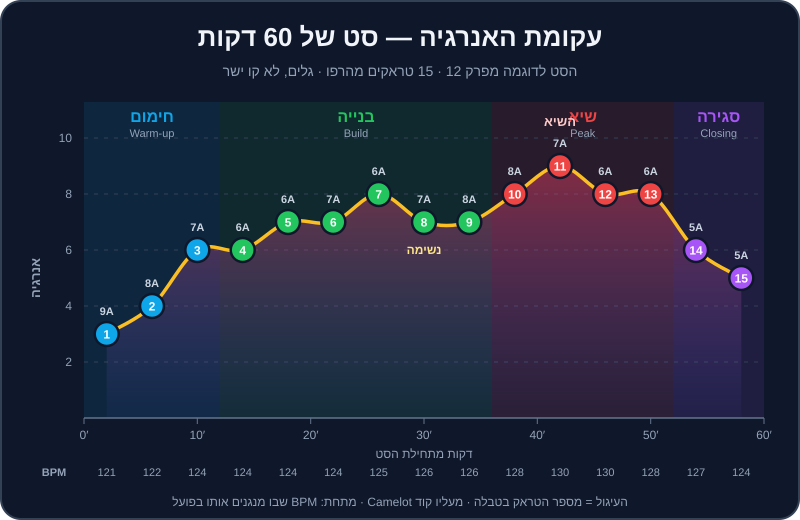

# בניית סט

אפשר לעשות עשרה מעברים מושלמים ברצף — ועדיין לנגן סט משעמם. כי סט הוא לא רשימה של מעברים, אלא **סיפור**: יש לו פתיחה שמזמינה פנימה, בנייה שמגבירה ציפייה, שיא שמשחרר, ורגעי נשימה שנותנים לשיא להרגיש כמו שיא. ה-DJs שאתם הכי אוהבים לא בהכרח עושים מעברים טובים יותר מכם בעוד שנה — הם פשוט יודעים **מה לנגן אחרי מה**, ומתי.

בפרק הזה נלמד לחשוב כמו מספרי סיפורים: לתכנן עקומת אנרגיה, להבין את התפקיד של כל חלק בערב, לקרוא את הקהל, ולארגן את הספרייה כך שהשיר הבא תמיד יחכה לכם. ובסוף — סט מלא של 60 דקות מהטראקים של DJ Lab, עם הוראות לכל מעבר.

## מה תלמדו בפרק

- מה זו "אנרגיה" של טראק, ואיך מדרגים אותה מ-1 עד 10.
- עקומת אנרגיה: למה גלים עדיפים על קו ישר.
- התפקידים בערב: `warmup`, `build`, `peak`, `closing` — ומה האחריות של כל אחד.
- קריאת קהל: סימנים, תגובות, וכלל "שלוש הדלתות".
- הכנה מול אלתור: כמה לתכנן, ואיך לארגן קרייטים ופלייליסטים ב-Rekordbox.
- סט של 60 דקות מהרפו, טראק אחר טראק, עם ספירת תיבות לכל מעבר.

## מה זו "אנרגיה"?

אנרגיה היא לא רק BPM. טראק טכנו ב-128 יכול להיות עדין יותר מטראק רגאטון ב-95. האנרגיה היא שילוב של עוצמת הקיק והבאס, צפיפות הכלים, אגרסיביות הסאונד, כמה "מתח" יש בבילד-אפים, ועד כמה הטראק מוכר לקהל.

ב-DJ Lab כל טראק מתויג ב-`energy` מ-1 עד 10 (בשדה `energy` בקובץ ה-JSON ובהערה בתוך ה-MP3). הנה הסקאלה שלנו:

| אנרגיה | איך זה מרגיש | איפה בערב | דוגמאות מהרפו |
|---|---|---|---|
| 1-2 | רקע, נושם, אפשר לדבר מעליו | קבלת פנים, אפטר | `breadth-10` (לו-פיי) |
| 3-4 | חם, מזמין, מנענעים ראש | תחילת חימום | `house-02`, `house-01` |
| 5-6 | גרוב שמזיז רגליים, עוד לא "משתחררים" | סוף חימום, בנייה | `house-10`, `house-03`, `techno-08` |
| 7-8 | רחבה מלאה, ידיים למעלה מדי פעם | בנייה מאוחרת, שיא | `house-05`, `mainstream-16`, `techno-01` |
| 9-10 | פיצוץ, צעקות, "הרגע של הערב" | שיא — במנות קטנות | `techno-03`, `mainstream-01`, `techno-11` |

> 💡 טיפ: האנרגיה של טראק היא גם יחסית. אחרי שעה של 8-9, טראק של 6 מרגיש כמו נשימה עמוקה. אחרי חצי שעה של 3-4, אותו טראק של 6 מרגיש כמו התחלה של מסיבה.

> 🎚️ ב-Rekordbox: בטראקים של DJ Lab, עמודת `Comments` מציגה למשל `Camelot 8A · Energy 7 · CC0`. הוסיפו את העמודה לתצוגת הספרייה, ותוכלו למיין לפיה. לטראקים שלכם — דרגו בעצמכם, באותה סקאלה, ושמרו את זה ב-`Comments` או ב-`My Tag`.

## עקומת האנרגיה

שלושה עקרונות:

1. **מתחילים נמוך יותר ממה שנראה לכם.** אם תפתחו ב-8, לאן תלכו משם?
2. **עולים בגלים, לא בקו ישר.** שניים למעלה, אחד למטה. ה"ירידה" הקטנה היא מה שגורם לעלייה הבאה להרגיש חזקה. בתרשים — שימו לב לטראק 8: נשימה קצרה לפני השיא.
3. **השיא קצר.** 10-15 דקות של 9-10 זה הרבה. אחרי זה האוזניים והרגליים מתעייפות.

> ⚠️ זהירות: הטעות הכי נפוצה של מתחילים היא "רק בנגרים". DJ שמנגן רק טראקים של 9 מעייף את הרחבה תוך חצי שעה — וגם לא נשאר לו לאן לעלות.

### ומה עם BPM?

הטמפו הוא חלק מהסיפור, אבל הוא זז **לאט**. כלל אצבע לסט קלאב: עד 2-3 BPM בכל מעבר, ולא יותר מ-8-10 BPM בשעה. בסט לדוגמה בהמשך הטמפו עולה מ-121 ל-130 בתוך 40 דקות, וחוזר ל-124 בסגירה. קפיצות גדולות יותר — עם הטכניקות של [פרק 15](15-tempo-genre-switching.md).

## התפקידים בערב

| תפקיד | מטרה | אנרגיה טיפוסית | מה לא לעשות |
|---|---|---|---|
| `warmup` — חימום | להכניס אנשים לרחבה, לבנות אמון, "לחמם את החדר" | 3-6 | לא לנגן את הלהיטים הגדולים, לא "לגנוב" את השיא של מי שבא אחריכם |
| `build` — בנייה | להעלות אנרגיה בהדרגה, לבנות ציפייה | 5-8 | לא לקפוץ לשיא מוקדם מדי |
| `peak` — שיא | הרגעים הגדולים של הערב | 7-10 | לא להחזיק 10 לאורך שעה |
| `closing` — סגירה | לסיים עם טעם טוב, "לשחרר" את הקהל הביתה | יורד מ-8 ל-4, או שיא אחרון ואז ירידה | לא לנתק פתאום |

> 💡 טיפ: הסט הראשון שתקבלו בבר או במועדון יהיה כמעט תמיד **חימום**. זו לא "עבודה פחות חשובה" — זו המשרה הכי קשה בערב. DJ חימום טוב הוא זה שהרחבה מלאה כשה-DJ הראשי עולה, ושהשאיר לו לאן לעלות. הוא גם זה שמזמינים שוב.

ב-`tracklist.plan.json` כל טראק מתויג גם ב-`role`. זה התפקיד ה"טבעי" שלו, אבל לא חוק: `house-11` מתויג `peak`, ובסט שלנו הוא משמש כטראק בנייה — כי בסט של שעה, ה-peak של אפרו האוס הוא עדיין רק אמצע הדרך לטכנו.

## קריאת הקהל

### מה מסתכלים

| סימן | מה הוא אומר | מה עושים |
|---|---|---|
| ראשים מנענעים, רגליים כמעט לא זזות | אוהבים, אבל עוד לא "בפנים" | ממשיכים לבנות לאט, גרוב יציב |
| רחבה מלאה, ידיים למעלה בדרופים | אתם בשיא — מצוין | עוד 2-3 טראקים, ואז נשימה |
| אנשים יוצאים לבר בגלים | עייפות או שעמום | שינוי: ז'אנר, ווקאל מוכר, או נשימה מכוונת |
| טלפונים בחוץ, מצלמים | רגע חזק! | אל תחתכו אותו מוקדם |
| טלפונים בחוץ, מסמסים | איבדתם אותם | שינוי מהיר — ווקאל, להיט, מעבר ז'אנר |
| אנשים עומדים ליד ה-DJ ומבקשים שירים | הקהל רוצה משהו אחר ממה שאתם מנגנים | הקשיבו — זה מידע, גם אם לא תנגנו בדיוק את הבקשה |

### כלל שלוש הדלתות

בכל רגע בסט, כשטראק מנגן, דעו שלוש אפשרויות לשיר הבא:

1. **דלת למעלה** — טראק עם קצת יותר אנרגיה (או ‎+1/+2 בגלגל Camelot).
2. **דלת ישרה** — באותה אנרגיה, להמשיך את מה שעובד.
3. **דלת למטה** — טראק שנותן נשימה, או משנה כיוון.

כשהקהל מגיב — אתם בוחרים דלת. ככה אתם אף פעם לא "תקועים", ואף פעם לא מחפשים בבהלה בספרייה כשנשארו 30 שניות לטראק.

> 💡 טיפ: "טראק בדיקה" — כשאתם לא בטוחים מה הקהל רוצה, נגנו טראק אחד בכיוון חדש (למשל ווקאלי יותר, או אפרו במקום טק האוס) וצפו בתגובה במשך דקה. עבד? המשיכו בכיוון. לא עבד? חזרו בעדינות.

## הכנה מול אלתור

יש שני קצוות: DJ שמתכנן כל טראק מראש (ומתעלם מהקהל), ו-DJ שמגיע עם 5,000 שירים ובלי שום תוכנית (ומתבלבל). התשובה הנכונה באמצע.

### שיטת 70/30

1. **הכינו פלייליסט של בערך פי 2-3 טראקים** ממה שתנגנו. לסט של שעה (12-16 טראקים) — 30-40 מועמדים.
2. **תכננו את 3 הטראקים הראשונים** בדיוק. זה מרגיע את הלחץ של ההתחלה.
3. **סמנו 3-5 "עוגנים"** — טראקים שאתם בטוחים שתנגנו (הפתיחה, השיא, הסיום).
4. **הכינו זוגות** — מעברים שתרגלתם ואתם יודעים שעובדים.
5. **את השאר — מאלתרים** לפי הקהל, עם כלל שלוש הדלתות.

### ארגון ב-Rekordbox

> 🎚️ ב-Rekordbox: כמה כלים שהופכים את ההכנה לקלה (ראו גם [פרק 9](09-library-prep.md)):
> - **פלייליסטים לפי תפקיד** — "חימום", "בנייה", "שיא", "סגירה". טראק יכול להיות ביותר מפלייליסט אחד.
> - **`My Tag`** — תגיות שאתם מגדירים: תפקיד, אווירה ("שקיעה", "מחסן"), ווקאל/אינסטרומנטלי, "ישראלי", "חתונה".
> - **צבעים ודירוג כוכבים** — למשל אדום = בנגר, כחול = חימום; כוכבים = כמה אתם אוהבים את הטראק.
> - **`Intelligent Playlist`** — פלייליסט "חכם" שמתעדכן לבד לפי תנאים (למשל: BPM בין 122 ל-126, ו-My Tag = "שיא").
> - **`Related Tracks` ו-`Track Suggestion`** — רעיונות לשיר הבא לפי סולם, BPM ומאפיינים מוזיקליים.
> - **`History`** — אחרי כל סט, Rekordbox שומר את רשימת הטראקים שניגנתם. זה הבסיס ל-Tracklist ולניתוח מה עבד.

> 💡 טיפ: בתיקייה `crates/` יש רשימות של טראקים אמיתיים לפי ז'אנר (למשל `crates/tech-house.md`, `crates/afro-house.md`, `crates/wedding-essentials.md`), עם BPM, סולם, אנרגיה ותפקיד — בדיוק באותה שיטה. השתמשו בהם כדי לבנות את הספרייה החוקית שלכם (קנייה או סטרימינג).

## כללי אצבע לרצף טוב

- **טמפו:** עד 2-3 BPM לכל מעבר. "רכבו" על הטמפו בהדרגה לאורך טראק, לא בבת אחת.
- **סולם:** רוב המעברים — מהלכים בטוחים (ראו [פרק 10](10-harmonic-mixing.md)). מדי פעם ‎+2 כדי להרים.
- **ז'אנר:** מעבר בין ז'אנרים דרך "גשר" — טראק שיש בו קצת משניהם (למשל מלודיק טכנו ב-124 בין האוס לטכנו).
- **ווקאל:** לסירוגין. שלושה טראקים ווקאליים ברצף מעייפים; אף אחד — יבש.
- **ברייקדאונים:** אל תצאו מברייקדאון ארוך ישר לתוך ברייקדאון ארוך של הטראק הבא — הרחבה "נופלת". (המעבר "מברייקדאון לברייקדאון" במלודיק טכנו עובד הפוך: הטראק החדש נכנס בברייקדאון של הקודם, והדרופ החדש מחליף את הדרופ הישן.)
- **פרייזים:** מעברים בגבולות של 16 או 32 תיבות. המבנה של הטראקים שלנו בנוי בדיוק לזה.

### כמה טראקים בשעה?

| סוג סט | זמן ממוצע לטראק | טראקים בשעה |
|---|---|---|
| טכנו / מלודיק / היפנוטי | 5-7 דקות | 9-12 |
| האוס / טק האוס / אפרו | 4-5 דקות | 12-15 |
| הסט לדוגמה בפרק הזה | כ-4 דקות | 15 |
| ביג רום / EDM | 2.5-3.5 דקות | 17-24 |
| Open Format (חתונות, היפ-הופ, ים-תיכוני) | 1.5-3 דקות | 20-40 |

## הסט לדוגמה: "מגג ביפו למחסן בפלורנטין" — 60 דקות

סט קלאב שעולה מדיפ האוס של שקיעה, דרך האוס, אפרו וים-תיכוני, לטק האוס וטכנו — וחוזר לנחיתה רכה. נבנה **רק** מהטראקים של הרפו, לפי BPM, Camelot ואנרגיה מתוך `music/tracklist.plan.json`. כל המעברים הם מהלכים בטוחים בגלגל (אותו סולם או ‎±1).

| # | דקה | טראק | ז'אנר | BPM מקורי | BPM בפועל | Camelot | אנרגיה | תפקיד בסט |
|---|---|---|---|---|---|---|---|---|
| 1 | 0:00 | `house-02` Velvet Rooftop | Deep House | 121 | 121 | 9A | 3 | חימום |
| 2 | 4:00 | `house-01` Sunset Over Jaffa | Deep House | 122 | 122 | 8A | 4 | חימום |
| 3 | 8:00 | `house-03` Hands Up Florentin | House | 124 | 124 | 7A | 6 | חימום ← בנייה |
| 4 | 12:00 | `house-04` Piano Saturday | House | 124 | 124 | 6A | 6 | בנייה |
| 5 | 16:00 | `house-11` Spirit Dance | Afro House | 122 | 124 | 6A | 7 | בנייה |
| 6 | 20:00 | `mainstream-15` Mediterranean Sunrise | Mediterranean House | 124 | 124 | 7A | 7 | בנייה |
| 7 | 24:00 | `mainstream-16` Oud Club | Mediterranean House | 125 | 125 | 6A | 8 | שיא ראשון |
| 8 | 28:00 | `house-06` Bassline Bandit | Tech House | 127 | 126 | 7A | 7 | נשימה |
| 9 | 32:00 | `house-05` Groove Machine | Tech House | 126 | 126 | 8A | 7 | בנייה מחדש |
| 10 | 36:00 | `techno-01` Concrete Pulse | Peak-Time Techno | 130 | 128 | 8A | 8 | שיא |
| 11 | 40:00 | `techno-03` Strobe Ritual | Peak-Time Techno | 132 | 130 | 7A | 9 | השיא |
| 12 | 44:00 | `techno-04` Night Shift | Driving Techno | 129 | 130 | 6A | 8 | שיא |
| 13 | 48:00 | `house-07` Warehouse 26 | Tech House | 128 | 128 | 6A | 8 | שיא ← ירידה |
| 14 | 52:00 | `techno-10` Micro Groove | Minimal Techno | 127 | 127 | 5A | 6 | סגירה |
| 15 | 56:00 | `house-10` Kalimba Moon | Afro House | 120 | 120 | 5A | 5 | סגירה |

**"BPM בפועל"** = הטמפו שבו הטראק מתנגן כשהוא הטראק הראשי. כל ההזזות קטנות מ-3.5% — עם `MASTER TEMPO` דולק, אף אחד לא ישמע אותן. **"דקה"** = בערך מתי הטראק נעשה הראשי; כל טראק מתנגן כ-4 דקות כולל החפיפות.

> 💡 טיפ: בספרייה, צרו פלייליסט בשם "DJ Lab — 60 Min Journey" וגררו אליו את 15 הטראקים לפי הסדר. בכלי ה-Set Builder באתר (תיקיית `docs/`) אפשר לבנות את אותו סט ולראות עקומת אנרגיה ובדיקת התאמה (סולם ו-BPM) לכל מעבר.

### הוראות מעבר, זוג אחר זוג

ההוראות מניחות את מוסכמת ה-Hot Cues שלנו: **A** = אינטרו, **B** = כניסת הבאס/גרוב, **C** = ברייקדאון, **D** = דרופ, **G** = אאוטרו, **H** = 16 תיבות לסוף.

**מעבר 1-2 · `house-02` אל `house-01` (9A→8A, 121 ו-122)** — בלנד ארוך. העלו את `house-01` ל-121 כדי להתאים. כש-house-02 מגיע ל-G, הפעילו את `house-01` מ-A. 16 תיבות של תופים על תופים, ובתיבה 17 (`house-01` ב-B) — Bass Swap. אחרי המעבר, "רכבו" לאט עם `house-01` חזרה ל-122. (זה בדיוק `transition-01` בכיוון ההפוך.)

**מעבר 2-3 · `house-01` אל `house-03` (8A→7A, מ-122 ל-124)** — בדקות האחרונות של `house-01`, העלו את הטמפו בהדרגה מ-122 ל-124 (חצי BPM בכל 16 תיבות). הכניסו את `house-03` מ-A בתחילת ה-G של `house-01`. Bass Swap בתיבה 17. זה המעבר הראשון שבו האנרגיה קופצת (מ-4 ל-6) — תנו לבאס של `house-03` להיכנס בביטחון.

**מעבר 3-4 · `house-03` אל `house-04` (7A→6A, 124)** — שני טראקי האוס באותו טמפו. מעבר קלאסי של 32 תיבות: מ-H של `house-03` (16 תיבות לסוף) הכניסו את `house-04` מ-A, וחפפו. פסנתר על פסנתר עלול להתנגש — הורידו את ה-Mid של `house-03` בהדרגה כשהפסנתר של `house-04` נכנס.

**מעבר 4-5 · `house-04` אל `house-11` (6A→6A, `house-11` מועלה ל-124)** — אותו סולם, ולכן אפשר "ללייר". הכניסו את התופים של `house-11` (אפרו האוס) מתחת לאאוטרו של `house-04` ותנו לשני הגרובים לחיות יחד 16 תיבות. זה רגע יפה: פרקשן אפריקאי מתחת לאקורדים של האוס.

**מעבר 5-6 · `house-11` אל `mainstream-15` (6A→7A, 124)** — ‎+1 בגלגל, הרמה עדינה. מעבר פילטר: `mainstream-15` נכנס עם `HPF`, נפתח לאורך 16 תיבות, ובמקביל `house-11` "מתרחק" עם פילטר. כשהמלודיה הים-תיכונית נכנסת — הקהל הישראלי מזהה את הצבע מיד.

**מעבר 6-7 · `mainstream-15` אל `mainstream-16` (7A→6A, מ-124 ל-125)** — שני טראקי Mediterranean House. העלו את `mainstream-15` ל-125 לאורך הטראק. מעבר בדרופ: חכו לברייקדאון (C) של `mainstream-15`, הכניסו את `mainstream-16` כך שהדרופ שלו (D) ייפול בדיוק כשהברייקדאון של הראשון נגמר. זה השיא הראשון של הסט — אנרגיה 8.

**מעבר 7-8 · `mainstream-16` אל `house-06` (6A→7A, `house-06` מוריד ל-126)** — הנשימה. הורידו את `house-06` ל-126 (‎−0.8%), והעלו את המאסטר בהדרגה ל-126. Bass Swap קלאסי של טק האוס בתיבה 17. האנרגיה יורדת ל-7 — זה מכוון. תנו לגרוב של הבאסליין לנשום.

**מעבר 8-9 · `house-06` אל `house-05` (7A→8A, 126)** — ‎+1, אותו ז'אנר. זה `transition-02` בכיוון ההפוך: G של `house-06` עם A של `house-05`, Bass Swap בתיבה 17. השתמשו באפקט `Trans` של 1/4 לתיבה אחת לפני ההחלפה, אם בא לכם תבלין.

**מעבר 9-10 · `house-05` אל `techno-01` (8A→8A, מ-126 ל-128)** — מטק האוס לטכנו. בזמן `house-05`, "רכבו" מ-126 ל-128. הכניסו את `techno-01` (מורד ל-128) מ-A, עם `HPF` עדין, לאורך 32 תיבות. אותו סולם — אפשר בלנד ארוך. ההבדל בין הז'אנרים מורגש בעיקר בקיק: הקיק של הטכנו "יבש" ועמוק יותר.

**מעבר 10-11 · `techno-01` אל `techno-03` (8A→7A, מ-128 ל-130)** — העלו את `techno-01` ל-130 לאורך הטראק (‎+1.5%). `techno-03` (מורד ל-130) נכנס מ-A, ובתיבה 17 — Bass Swap חד. לפני הדרופ (D) של `techno-03` — `Roll` של 1/2 ואז 1/4 לפעמה אחת. **השיא של הסט.**

**מעבר 11-12 · `techno-03` אל `techno-04` (7A→6A, 130)** — בלנד היפנוטי ארוך של 32 תיבות. `techno-04` מועלה ל-130. ‎−1 בגלגל מרגיע מעט — האנרגיה יורדת מ-9 ל-8, אבל הרחבה עדיין בוערת.

**מעבר 12-13 · `techno-04` אל `house-07` (6A→6A, מ-130 ל-128)** — חזרה לטק האוס, הפעם בשיא. הורידו בהדרגה את המאסטר מ-130 ל-128 לאורך `techno-04`. אותו סולם, אותו גרוב של "מחסן" — זה `transition-04` הפוך, אבל כאן אפשר בלנד ולא Echo Out, כי הטמפו כבר מותאם.

**מעבר 13-14 · `house-07` אל `techno-10` (6A→5A, מ-128 ל-127)** — תחילת הסגירה. ‎−1 בגלגל, ‎−1 BPM. מעבר פילטר `LPF` על `house-07`: הוא "שוקע" כשהגרוב המינימלי של `techno-10` עולה. האנרגיה יורדת ל-6.

**מעבר 14-15 · `techno-10` אל `house-10` (5A→5A, מ-127 ל-120)** — הפרידה. אותו סולם, אבל פער של 7 BPM. במקום להזיז את `house-10` ב-6%, עשו **Echo Out** של פעמה אחת על `techno-10` בסוף פרייז, ותנו ל-house-10 להתחיל מ-A בטמפו המקורי שלו, 120. הקלימבה והפרקשן של אפרו האוס סוגרים את הסט ברכות. בסוף `house-10` — תנו לאאוטרו להתנגן עד הסוף, או Echo Out ארוך.

> 💡 טיפ: הסט הזה הוא נקודת התחלה, לא חוק. נסו להחליף טראק אחד או שניים — למשל `techno-07` (Event Horizon, 9A, 124) במקום `house-05`, ובדקו אילו מעברים צריך לשנות. ככה לומדים לחשוב בסטים.

## תבניות לסטים אחרים

- **חימום של 30 דקות בבר:** 6-7 טראקים, אנרגיה 4 עד 7, BPM מ-116 עד 124. למשל: `house-13` (7B) → `house-12` (8B) → `house-01` (8A) → `techno-08` (8A) → `mainstream-04` (8A) → `techno-07` (9A). שימו לב למעבר A↔B בין `house-12` ל-house-01, ולקפיצת הטמפו מ-118 ל-122 — כדאי "לרכוב" עליה לאורך `house-12`.
- **סט שיא של שעה (אחרי מישהו אחר):** מתחילים מהאנרגיה שהשאירו לכם (נניח 7), עולים ל-9-10 בדקה 30-45, ומסיימים ב-8 כדי להשאיר לבא אחריכם.
- **סט Open Format לאירוע:** בלוקים של 15-20 דקות לפי סגנון, מעברים קצרים — ראו [פרק 14](14-events-weddings.md).

> 🎚️ אם אתם עובדים עם Claude Code ברפו: אפשר לבקש "תכין לי סט של שעה לבר בחמישי" — הסקיל `plan-dj-set` בונה סט לפי BPM, Camelot ואנרגיה (עם `tools/set_planner.py`) ושומר אותו בתיקייה `sets/`. תמיד תעברו עליו ותשנו לפי הטעם שלכם.

## אחרי הסט

1. **הקליטו כל סט**, גם בבית (ראו [פרק 16](16-recording-sharing.md)).
2. **האזינו למחרת**, לא באותו לילה. רשמו שלושה מעברים שעבדו ושלושה לשיפור.
3. **בדקו את ה-`History`** ב-Rekordbox — אילו טראקים ניגנתם, ובאיזה סדר.
4. **ציירו את עקומת האנרגיה** האמיתית של הסט: עלתה מהר מדי? היה שיא בכלל?
5. **עדכנו את הספרייה:** טראק שעבד מעולה — סמנו. טראק שרוקן את הרחבה — שאלו למה.

## תרגילים

> 🎧 תרגיל 1 — לדרג אנרגיה (20 דקות)
> בחרו 10 טראקים מהספרייה שלכם (או מ-`crates/`). דרגו כל אחד 1-10 לפי הטבלה בפרק. אחר כך השוו לטראקים של הרפו באותה אנרגיה — האם הדירוג שלכם עקבי?

> 🎧 תרגיל 2 — הסט לדוגמה, חלק א' (45 דקות)
> בנו את הפלייליסט "DJ Lab — 60 Min Journey" ונגנו את טראקים 1 עד 8 לפי הוראות המעבר. הקליטו. אל תעצרו כשמשהו משתבש — תתקנו "בלייב", כמו בהופעה.

> 🎧 תרגיל 3 — הסט לדוגמה, חלק ב' (45 דקות)
> טראקים 8 עד 15. שימו לב במיוחד למעברי הטמפו (9-10 ו-10-11) ולסגירה עם Echo Out (14-15).

> 🎧 תרגיל 4 — העקומה שלכם (20 דקות)
> האזינו להקלטה של הסט המלא. כל 4 דקות רשמו את האנרגיה כפי שהרגשתם אותה (לא כפי שכתוב בטבלה). ציירו גרף והשוו לתרשים בפרק.

> 🎧 תרגיל 5 — סט ים-תיכוני משלכם (40 דקות)
> בנו סט של 30 דקות לחתונה או למסיבה, שמתחיל ב-mainstream-09 (Perreo Nocturno, 92, 7A) ועובר דרך `mainstream-08`, `mainstream-13` ו-mainstream-14 — ואז קופץ לעולם של 124-128 (`mainstream-15`, `mainstream-16`, `mainstream-02`). רמזים: 7A→8A→9A→8A הם כולם מהלכים בטוחים; הקפיצה מ-104 ל-124 דורשת Echo Out (ראו `transition-08` ו[פרק 15](15-tempo-genre-switching.md)); ו-mainstream-16 (6A) אל `mainstream-02` (6A) — אותו סולם.

> 🎧 תרגיל 6 — שלוש דלתות (15 דקות)
> נגנו את `house-05`. לפני שהוא נגמר, רשמו שלוש אפשרויות מהרפו: דלת למעלה, ישרה ולמטה. (רמז: מה עם `house-07`, `house-08` ו-techno-08?) אחר כך בקשו מחבר להגיד לכם "למעלה", "ישר" או "למטה" — ובצעו.

## סיכום

- סט הוא סיפור: חימום, בנייה, שיא וסגירה — בגלים, לא בקו ישר.
- אנרגיה 1-10 היא שילוב של צליל, צפיפות והיכרות, ולא רק BPM.
- כלל שלוש הדלתות: תמיד דעו מה לנגן למעלה, ישר ולמטה.
- 70/30: מכינים פי 2-3 טראקים, מתכננים פתיחה ועוגנים, ומאלתרים את השאר לפי הקהל.
- הטמפו זז לאט — עד 2-3 BPM למעבר; קפיצות גדולות עם הטכניקות של פרק 15.
- הקליטו, האזינו למחרת, ושפרו.

בפרק הבא נכיר לעומק את כל הז'אנרים שברפו ובקרייטים — מה מאפיין כל אחד, ואיך מערבבים אותו. ← [פרק 13: תנ"ך הז'אנרים](13-genre-bible.md)
