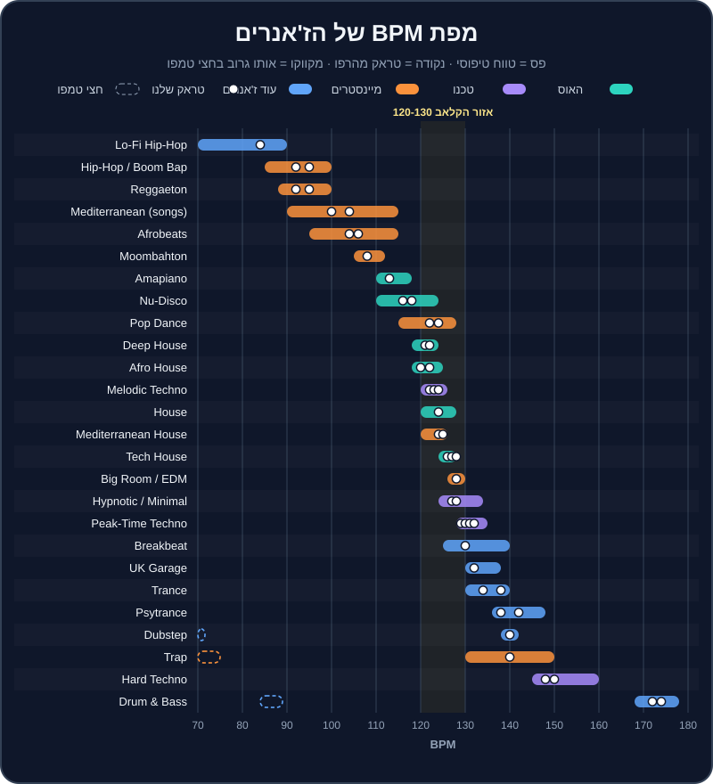

# תנ"ך הז'אנרים

"מה אתה מנגן?" — זו השאלה הראשונה שישאלו אתכם בכל בר, בכל פגישה עם זוג, ובכל שיחה עם פרומוטר. והתשובה "אני מנגן הכול" היא בדרך כלל התשובה הלא נכונה. כל ז'אנר הוא שפה: יש לו קצב משלו, משפטים באורך משלו, כלים מזהים, והרגלים של מיקס. DJ שמבין את השפה — יודע מתי מעבר של 64 תיבות הוא אמנות ומתי הוא שעמום, ומתי קאט של שנייה הוא חובה.

הפרק הזה הוא ספר עיון. אין צורך לקרוא אותו ברצף — קפצו לז'אנר שמעניין אתכם, הקשיבו לטראקים מהרפו, ופתחו את הארגז המתאים בתיקייה `crates/`. בז'אנרים האהובים עליכם — משפחת ההאוס, משפחת הטכנו, מיינסטרים, היפ-הופ וים-תיכוני — נעמיק יותר.

## מה תלמדו בפרק

- טווח ה-BPM, אורך הפרייז והמבנה הטיפוסי של כל ז'אנר.
- הצלילים שמזהים ז'אנר תוך שנייה.
- איך מערבבים כל ז'אנר: בלנדים ארוכים, Bass Swap, קאטים או דאבל-דרופים.
- אמנים ולייבלים מרכזיים (שמות אמיתיים, לחיפוש ולהאזנה).
- הערות על הסצנה הישראלית.
- אילו טראקים מהרפו ואילו ארגזים מ-`crates/` מתאימים לתרגול.

## מפת BPM

> 💡 טיפ: שימו לב ל"אזור הקלאב" בין 120 ל-130 — רוב הז'אנרים האהובים עליכם יושבים שם, ולכן קל לעבור ביניהם. ושימו לב לפסים המקווקוים: דאבסטפ וטראפ ב-140 "מרגישים" כמו 70, ודראם אנד בייס ב-174 "מרגיש" כמו 87 — בדיוק כמו היפ-הופ. על זה בונים מעברי טמפו ב[פרק 15](15-tempo-genre-switching.md).

## טבלת סיכום

| ז'אנר | BPM טיפוסי | פרייז / מבנה | סגנון מיקס | אצלנו | ארגז |
|---|---|---|---|---|---|
| Deep House | 118-124 | 8/16/32, אינטרו ארוך | בלנד ארוך | `house-01`, `house-02` | `deep-house` |
| House | 120-128 | 8/16/32 | בלנד, Bass Swap | `house-03`, `house-04` | `house` |
| Tech House | 124-128 | 8/16/32, לופים | Bass Swap, לופים | `house-05` עד `house-08` | `tech-house` |
| Afro House | 118-125 | 16/32, פרקשן ארוך | ליירים ארוכים | `house-09` עד `house-11` | `afro-house` |
| Nu-Disco | 110-124 | 8/16, שיר | בלנד זהיר | `house-12`, `house-13` | `house` |
| Amapiano | 110-118 | 8/16, אינטרו ארוך | בלנד, Bass Swap | `house-14` | `afro-house` |
| Peak-Time / Driving Techno | 128-135 | 16/32, התפתחות איטית | בלנד ארוך, EQ | `techno-01` עד `techno-04` | `techno` |
| Melodic Techno | 120-126 | 16/32, ברייקדאון גדול | ברייקדאון לברייקדאון | `techno-05` עד `techno-08` | `melodic-techno` |
| Hypnotic / Minimal | 124-134 | 32/64, חזרתי | ליירים ארוכים מאוד | `techno-09`, `techno-10` | `techno` |
| Hard Techno | 145-160 | 8/16, מהיר | קצר, קאטים | `techno-11`, `techno-12` | `techno` |
| Big Room / EDM | 126-130 | בילד-אפ ודרופ | מיקס בבילד-אפ, קאט | `mainstream-01`, `mainstream-02` | `edm-festival` |
| Pop Dance | 115-128 | בית/פזמון | אינטרו/אאוטרו, קאט | `mainstream-03`, `mainstream-04` | `pop-dance` |
| Hip-Hop / Trap | 85-100 / 130-150 | בית/פזמון | קאטים, Echo Out | `mainstream-05` עד `mainstream-07` | `hip-hop-rnb` |
| Reggaeton | 88-100 | 8 תיבות, שיר | קאט על ה-1 | `mainstream-08`, `mainstream-09` | `latin-reggaeton` |
| Moombahton | 105-112 | 8/16 | גשר טמפו | `mainstream-10` | `latin-reggaeton` |
| Afrobeats | 95-115 | שיר | בלנד קצר | `mainstream-11`, `mainstream-12` | `afrobeats` |
| Mediterranean | 90-115 (שירים), 120-140 (רמיקסים) | שיר, מחרוזת | קאט, Echo, מחרוזת | `mainstream-13` עד `mainstream-16` | `mediterranean`, `israeli-party` |
| Psytrance | 136-148 | 16/32, באס מתגלגל | Bass Swap מדויק | `breadth-01`, `breadth-02` | `psytrance` |
| Trance | 130-140 | 16/32, ברייקדאון אפי | בלנד ארוך, הרמוני | `breadth-03`, `breadth-04` | `trance` |
| Drum & Bass | 168-178 | 16/32 | מהיר, דאבל-דרופ | `breadth-05`, `breadth-06` | `bass-music` |
| Dubstep | 138-142 | 16, דרופים | החלפת דרופים | `breadth-07` | `bass-music` |
| UK Garage | 130-138 | 8/16, שאפל | ביטמאץ' זהיר | `breadth-08` | — |
| Breakbeat | 125-140 | 8/16 | יישור לפי סנר | `breadth-09` | — |
| Lo-Fi Hip-Hop | 70-90 | לופים קצרים | פייד פשוט | `breadth-10` | — |

> ⚠️ זהירות: טווחי BPM הם "טיפוסיים", לא חוקים. תמיד יהיו טראקים מחוץ לטווח, וז'אנרים זזים עם השנים — הארד טכנו של היום מהיר בהרבה מזה של לפני עשור. כל הנתונים על הארגזים נמצאים ב-`crates/index.json` ובקובצי ה-`.md` של כל ארגז.

---

# חלק א' — משפחת ההאוס

## דיפ האוס — Deep House

> **טמפו (BPM):** 118-124 · **פרייז:** 8/16/32 · **מיקס:** בלנדים ארוכים · **אצלנו:** `house-01` (Sunset Over Jaffa, 122, 8A), `house-02` (Velvet Rooftop, 121, 9A) · **ארגז:** `crates/deep-house.md`

**מאיפה זה בא.** דיפ האוס נולד בשיקגו ובניו ג'רזי באמצע שנות ה-80, כשמפיקים כמו לארי הרד (`Larry Heard`, בשם Mr. Fingers — "Can You Feel It", 1986) לקחו את ההאוס והוסיפו לו אקורדים של ג'אז וסול. מאז הוא עבר גלגולים: הסאונד הנשמתי של קרי צ'נדלר (`Kerri Chandler`) ושל מודימן (`Moodymann`), ועד הדיפ המלודי והאווירתי של הלייבל `Anjunadeep` ושל אמנים כמו בן בוהמר (`Ben Böhmer`).

**הצליל.** אקורדים "רכים" (ספטאקורדים ונונות), פסנתר חשמלי (`Rhodes`), באס עגול וחם, היי-האטים עדינים, לפעמים ווקאל נשמתי. האנרגיה נשארת נמוכה-בינונית: זה נעים, לא דוחף.

**המבנה.** אינטרו ארוך של 16-32 תיבות, כניסה הדרגתית של כלים כל 8 תיבות, ברייקדאון רך, ואאוטרו ארוך. מושלם ל-DJ.

**איך מערבבים.** כאן בלנדים של 32 ואפילו 64 תיבות הם אמנות. מאחר שיש הרבה אקורדים — **הסולם חשוב** (ראו [פרק 10](10-harmonic-mixing.md)). EQ עדין: מורידים Mid של טראק אחד כשהאקורדים של השני נכנסים. אפקטים: מעט Reverb ו-`Dub Echo`.

**בישראל.** הפסקול של שקיעות על חוף הים, ברים על גגות בתל אביב ובית קפה בשישי בצהריים. אם יבקשו מכם לנגן "משהו נעים" בקבלת פנים — זה כנראה מה שהם מתכוונים אליו.

> 🎧 תרגול: `transition-01` הוא בדיוק בלנד דיפ האוס ארוך (`house-01` אל `house-02`). שחזרו אותו, ואז נסו לבנות "טראק שלישי": שני הטראקים יחד 32 תיבות, בלי שאחד מהם "מנצח".

## האוס — House

> **טמפו (BPM):** 120-128 · **פרייז:** 8/16/32 · **מיקס:** בלנד, Bass Swap · **אצלנו:** `house-03` (Hands Up Florentin, 124, 7A), `house-04` (Piano Saturday, 124, 6A) · **ארגז:** `crates/house.md`

**מאיפה זה בא.** שיקגו, תחילת שנות ה-80. ה-DJ פרנקי נאקלס (`Frankie Knuckles`), "הסנדק של ההאוס", ניגן במועדון The Warehouse — ומשם, לפי הגרסה הנפוצה, השם "האוס". בניו יורק, לארי לבן (`Larry Levan`) במועדון Paradise Garage הוליד את סאונד ה"גראז'". קלאסיקות כמו "Move Your Body" של מרשל ג'פרסון (1986) הגדירו את הז'אנר. בשנות ה-90 וה-2000 — `Masters At Work`, הלייבל הבריטי `Defected`, ואינספור להיטי פסנתר.

**הצליל.** קיק על כל פעמה ("ארבע על הרצפה" — `four-on-the-floor`), קלאפ על 2 ו-4, היי-האט פתוח על ה"אנד" (בין הפעמות), פסנתר, ווקאל דיוות, דגימות דיסקו.

**המבנה.** אינטרו של תופים, כניסת באס (בטראקים שלנו — Hot Cue B בתיבה 17), בית/פזמון או לופים, ברייקדאון עם פסנתר או ווקאל, דרופ, אאוטרו.

**איך מערבבים.** Bass Swap על תחילת פרייז הוא המעבר הקלאסי. פסנתר מול פסנתר מתנגש מהר — הורידו את ה-Mid של היוצא. לטראקים ווקאליים — היכנסו כשהווקאל של הקודם נגמר.

**בישראל.** האוס הוא הבסיס של סצנת הלילה בתל אביב כבר עשורים — מהמועדונים, דרך מסיבות הגאווה (שם האוס "דיווה" ורמיקסים לזמרות פופ, בסגנון של DJs כמו עופר ניסים), ועד הברים.

> 🎧 תרגול: מעבר 3-4 בסט לדוגמה ב[פרק 12](12-set-building.md): `house-03` אל `house-04`, שניהם 124, 7A→6A. תרגלו את "פסנתר על פסנתר" עם הורדת Mid.

## טק האוס — Tech House

> **טמפו (BPM):** 124-128 · **פרייז:** 8/16/32 · **מיקס:** Bass Swap, לופים · **אצלנו:** `house-05` (Groove Machine, 126, 8A), `house-06` (Bassline Bandit, 127, 7A), `house-07` (Warehouse 26, 128, 6A), `house-08` (Shuffle Theory, 126, 9A) · **ארגז:** `crates/tech-house.md`

**מאיפה זה בא.** בסוף שנות ה-90 בבריטניה התחילו לשלב את הגרוב של ההאוס עם המינימליזם והסאונד ה"מכני" של הטכנו. בעשור הקודם הז'אנר התפוצץ: לייבלים כמו `Toolroom` (מארק נייט), `Hot Creations` (ג'יימי ג'ונס), `Dirtybird` (קלוד פון-סטרוק), `Solid Grooves` (מייקל ביבי ו-PAWSA) ו-`Catch & Release` (פישר, `FISHER`). להיטים כמו "Losing It" של פישר (2018) ו-"Drugs From Amsterdam" של מאו פי (`Mau P`, 2023) הפכו את הטק האוס למיינסטרים של מועדונים ופסטיבלים. עוד שמות: כריס לייק (`Chris Lake`), ג'ון סאמיט (`John Summit`), קלוני (`Cloonee`).

**הצליל.** באסליין מתגלגל וקופצני (לרוב הכוכב של הטראק), היי-האטים עם "שאפל" (נדנוד קצבי), קלאפים יבשים, פרקשן, וקטעי ווקאל קצרים שחוזרים ("ווקאל הוק"). מעט אקורדים — הרבה גרוב.

**המבנה.** בנוי מלופים של 8 תיבות. אינטרו ארוך של תופים, כניסת באסליין, ברייקדאון קצר עם הווקאל, דרופ שמחזיר את הבאס. טראקים רבים בנויים במיוחד ל-DJs.

**איך מערבבים.**
- **החלפת באס (Bass Swap) היא הכול.** שני באסליינים מתגלגלים יחד = בלגן. מחליפים על ה-1 של פרייז (`transition-02`).
- **לופים** — לולאה של 4 או 8 תיבות של תופים מהאאוטרו קונה זמן.
- **שני ווקאל הוקים יחד** — אסור. חכו שאחד ייגמר.
- **אפקטים:** `HPF` + `Roll` לפני דרופ, `Trans` קצר, `Delay` של 3/4 על ההיי-האט.
- **הסולם פחות קריטי** מבדיפ האוס (פחות אקורדים), אבל הבאסליין טונלי — אז ‎±1 עדיין עדיף.

**בישראל.** אחד הז'אנרים הכי פופולריים במסיבות תל אביב כיום, ושפה משותפת לברים ולמועדונים. "גרוב טק האוסי" עובד גם בחלק השני של חתונה צעירה.

> 🎧 תרגול: נגנו את ארבעת טראקי הטק האוס ברצף במסלול הרמוני: `house-07` (6A) → `house-06` (7A) → `house-05` (8A) → `house-08` (9A). כל המעברים ‎+1, וה-BPM בין 126 ל-128.

## אפרו האוס — Afro House

> **טמפו (BPM):** 118-125 · **פרייז:** 16/32 · **מיקס:** ליירים ארוכים של פרקשן · **אצלנו:** `house-09` (Desert Drums, 122, 4A), `house-10` (Kalimba Moon, 120, 5A), `house-11` (Spirit Dance, 122, 6A) · **ארגז:** `crates/afro-house.md`

**מאיפה זה בא.** השורשים בדרום אפריקה, ששם האוס הוא כמעט מוזיקת עם. ה-DJ והמפיק בלאק קופי (`Black Coffee`), שזכה בפרס גראמי ב-2022 על האלבום "Subconsciously", הוא השגריר הגדול של הז'אנר; לצידו קולואה דה סונג (`Culoe De Song`), דה קאפו (`Da Capo`), אנו נאפה (`Enoo Napa`) ושימזה (`Shimza`). בשנים האחרונות קם גל אירופי של "אפרו" — בעיקר הקולקטיב הברלינאי `Keinemusik` (&ME, Rampa, Adam Port), שהלהיט "Move" (2024) שלהם הפך ויראלי, והלייבל `MoBlack`.

**הצליל.** פרקשן פוליריתמי — קונגות, ג'מבה, שייקרים, תופי מרים — שכבות על שכבות. צ'אנטים ושירת "קריאה ותגובה", קלימבה ומרימבה, באס עמוק ומתגלגל, ולפעמים מלודיות כמעט מלודיק-טכנו.

**המבנה.** אינטרו ארוך מאוד של פרקשן, בנייה איטית, ברייקדאון עם צ'אנט, ודרופ שמחזיר את הבאס. פרייזים של 16 ו-32 תיבות.

**איך מערבבים.**
- **ליירים של פרקשן** — הכניסו את התופים של הטראק החדש מתחת לטראק הקודם, ותנו לשני הגרובים לחיות יחד 16-32 תיבות. זה הקסם של הז'אנר.
- **הסולם חשוב** — צ'אנטים, פדים ובאס טונלי. ‎+2 עובד מצוין להרמה (`transition-07`: `house-09` 4A אל `house-11` 6A).
- **אקולייזר (EQ):** הרבה תדרים בתחום ה-Mid (קונגות) — הורידו Mid של אחד כשהשני מלא.
- **אפקטים:** `Space` ו-`Dub Echo` עדינים על צ'אנט.

**בישראל.** אפרו האוס הוא כנראה הסאונד הכי "חם" במסיבות בישראל בשנים האחרונות: שקיעות על החוף, מסיבות מדבר, ברים ומועדונים. גם מפיקים ישראלים פעילים בז'אנר (בארגז תמצאו, למשל, את ערן הרש). ובחתונות צעירות — סט אפרו בקבלת הפנים או בסבב השני הפך לבקשה נפוצה.

> 🎧 תרגול: `house-10` (5A, 120) → `house-09` (4A, 122): ‎−1 בגלגל, ‎+2 BPM. ואז `transition-07` — `house-09` אל `house-11` בבוסט ‎+2. שימו לב איך הפרקשן "מחזיק" את המעבר גם כשהסולם קופץ.

## נו-דיסקו — Nu-Disco

> **טמפו (BPM):** 110-124 · **פרייז:** 8/16 · **מיקס:** בלנד זהיר · **אצלנו:** `house-12` (Mirrorball Boulevard, 118, 8B), `house-13` (Funk Cruise, 116, 7B) · **ארגז:** `crates/house.md`

**מאיפה זה בא.** הדיסקו של שנות ה-70 (Chic ונייל רוג'רס, דונה סאמר וג'ורג'יו מורודר עם "I Feel Love" מ-1977) חזר בשנות ה-2000 כ"נו-דיסקו": רי-אדיטים של קלאסיקות, והפקות חדשות עם צליל רטרו. שמות: טוד טרייה (`Todd Terje`), פרפל דיסקו מאשין (`Purple Disco Machine`), דימיטרי פרום פריז (`Dimitri From Paris`), והלייבל `Glitterbox`.

**הצליל.** באס גיטרה "חי" ומלודי, גיטרות פאנק, כלי מיתר, קלאפ על 2 ו-4, היי-האט פתוח על ה"אנד". הרבה אקורדים — ובמז'ור.

**איך מערבבים.** שני באסליינים מלודיים יחד מתנגשים מהר — בלנד קצר יחסית, ו**הסולם חשוב**. ברי-אדיטים לרוב יש אינטרו של תופים; בהקלטות דיסקו ישנות הטמפו "חי" — כבו Sync והקשיבו.

**בישראל.** הצמד התל-אביבי Red Axes מוכר בעולם בסצנת הדיסקו, האינדי-דאנס והאדיטים. נו-דיסקו הוא בחירה מצוינת לחימום בבר, לקבלת פנים בחתונה, ולמסיבות "גרוב" בשישי.

> 🎧 תרגול: `house-13` (7B, 116) → `house-12` (8B, 118) — ‎+1 במז'ור. ואז A↔B: `house-12` (8B) → `house-01` (8A, 122) — שימו לב ל"התכהות" כשעוברים למינור.

## אמאפיאנו — Amapiano

> **טמפו (BPM):** 110-118 (רוב הטראקים 112-115) · **פרייז:** 8/16 · **מיקס:** בלנד, Bass Swap · **אצלנו:** `house-14` (Log Drum Lagoon, 113, 4A) · **ארגז:** `crates/afro-house.md`

**מאיפה זה בא.** נולד בטאונשיפים של חבל גאוטנג בדרום אפריקה באמצע העשור הקודם, והתפוצץ עולמית מסוף העשור. שמות: קבזה דה סמול (`Kabza De Small`), DJ מפוריסה (`DJ Maphorisa`), פוקליסטיק (`Focalistic`), אנקל וופלס (`Uncle Waffles`), והזמרת טיילה (`Tyla`), שהלהיט שלה "Water" זכה בגראמי הראשון בקטגוריית המוזיקה האפריקאית (2024).

**הצליל.** ה-`log drum` — באס הקשה, עמוק ו"מוקפץ", שהוא בעצם הכוכב — פסנתר ג'אזי, שייקרים, פדים אווריריים, וקריאות ווקאליות.

**איך מערבבים.** ה-log drum טונלי (יש לו גובה צליל) — אז **Bass Swap ו-סולם** חשובים. האינטרואים ארוכים ונוחים. אמאפיאנו הוא גשר טמפו מושלם: בין אפרוביטס (100-106) לאפרו האוס (120). פרטים ב[פרק 15](15-tempo-genre-switching.md).

**בישראל.** מופיע יותר ויותר בערבי אפרו ובמסיבות קיץ, לרוב כבלוק קצר בין אפרוביטס לאפרו האוס.

> 🎧 תרגול: `house-14` (4A, 113) → `house-09` (4A, 122). אותו סולם, אבל ‎+8%. נסו קודם Echo Out, ואחר כך "מדרגה": `house-14` → `house-10` (120, 5A) → `house-09`.

---

# חלק ב' — משפחת הטכנו

## טכנו — Peak-Time ו-Driving Techno

> **טמפו (BPM):** 128-135 · **פרייז:** 16/32 · **מיקס:** בלנד ארוך, EQ, ליירים · **אצלנו:** `techno-01` (Concrete Pulse, 130, 8A), `techno-02` (Industrial Heart, 131, 4A), `techno-03` (Strobe Ritual, 132, 7A), `techno-04` (Night Shift, 129, 6A) · **ארגז:** `crates/techno.md`

**מאיפה זה בא.** דטרויט, אמצע שנות ה-80: שלושה חברים מהפרבר בלוויל — חואן אטקינס (`Juan Atkins`), דריק מיי (`Derrick May`) וקווין סונדרסון (`Kevin Saunderson`) — לקחו מכונות תופים וסינתסייזרים ויצרו מוזיקה עתידנית וקרה. אחרי נפילת חומת ברלין, הטכנו מצא בית שני בברלין: המועדון Tresor (1991) ואחר כך Berghain. הטכנו של "שעת השיא" של היום — לייבלים כמו `Drumcode` (אדם בייר, `Adam Beyer`), `KNTXT` (שרלוט דה ויט, `Charlotte de Witte`) ו-`Lenske` (אמלי לנס, `Amelie Lens`), ושמות כמו אנריקו סנג'וליאנו (`Enrico Sangiuliano`).

**הצליל.** קיק עמוק ויבש על כל פעמה, "רמבל" (באס מהדהד מתחת לקיק), לופים של פרקשן, טקסטורות תעשייתיות, מעט מלודיה (לרוב סטאב או סינת' אחד). ה-"Driving" — ממוקד בתנועה קדימה; ה-"Peak-Time" — חזק יותר, עם בילד-אפים ודרופים.

**המבנה.** התפתחות איטית: כל 16 או 32 תיבות משהו נוסף או יוצא. ברייקדאון אחד או שניים. אינטרו ואאוטרו ארוכים.

**איך מערבבים.**
- **בלנדים ארוכים של 32-64 תיבות**, עם EQ: Low של אחד בלבד בכל רגע.
- **ליירים** — שני טראקים יחד הם "טראק שלישי". DJs של טכנו לפעמים מחזיקים שלושה ערוצים.
- **לופים** לקניית זמן ולבניית מתח (`transition-06`).
- **הסולם** פחות קריטי מבמלודיק, אבל ה"רמבל" טונלי — שימו לב בבלנדים ארוכים.

**בישראל.** סצנת טכנו ותיקה ואיתנה: מועדונים ומסיבות מחסן בתל אביב, ו-DJs ישראלים בשורה הראשונה בעולם — למשל שלומי אבר (`Shlomi Aber`) והלייבל שלו `Be As One`, וגיא גרבר (`Guy Gerber`) והלייבל `Rumors`.

> 🎧 תרגול: `transition-06` (`techno-02` אל `techno-03`, Loop Roll) ומעברים 10 עד 12 בסט לדוגמה ב[פרק 12](12-set-building.md).

## מלודיק טכנו — Melodic Techno

> **טמפו (BPM):** 120-126 · **פרייז:** 16/32 · **מיקס:** ברייקדאון לברייקדאון, בלנדים ארוכים · **אצלנו:** `techno-05` (Neon Cathedral, 122, 10A), `techno-06` (Afterglow Protocol, 123, 11A), `techno-07` (Event Horizon, 124, 9A), `techno-08` (Silent Orbit, 122, 8A) · **ארגז:** `crates/melodic-techno.md`

**מאיפה זה בא.** בעשור הקודם צמח ז'אנר שלקח את הקיק והגרוב של הטכנו והוסיף להם רגש: ארפג'יו, אקורדים במינור, וברייקדאונים קולנועיים. הלייבל `Afterlife` של הצמד האיטלקי Tale Of Us (נוסד ב-2016) והפרויקט `Anyma` הפכו אותו לתופעה עולמית; לצידם `ARTBAT` מאוקראינה, `Adriatique` משווייץ, `Innellea`, `Massano`, `Mind Against`, ולייבלים כמו `Diynamic` (סולומון, `Solomun`) ו-`Innervisions` (דיקסון ו-Âme). בחנות `Beatport` הקטגוריה נקראת "Melodic House & Techno".

**הצליל.** ארפג'יו של סינת' שמתפתח לאט, באס אנלוגי עבה, פדים רחבים, ריזרים, ולפעמים ווקאל רחוק ומהדהד. כמעט תמיד במינור.

**המבנה.** אינטרו ארוך, בנייה, **ברייקדאון גדול באמצע** (לפעמים דקה וחצי ויותר), דרופ אפי, ואאוטרו. פרייזים של 16 ו-32.

**איך מערבבים.**
- **הסולם קריטי** — הז'אנר כולו מלודיה. עבדו לפי Camelot (‎±1, ‎+2).
- **מברייקדאון לברייקדאון** — היכנסו עם הטראק החדש כשהברייקדאון של הקודם מתחיל, כך שהדרופ החדש "יחליף" את הדרופ הישן (`transition-10`: `techno-06` אל `techno-07`).
- **מעבר פילטר** — `transition-03` (`techno-05` אל `techno-08`).
- **שני ארפג'יו יחד** — רק אם הסולם תואם, ועם Mid מנוהל.
- **אפקטים:** Reverb ו-`Spiral` בברייקדאון, Echo Out של 2 פעמות.

**בישראל.** לישראל יש מסורת עשירה בסאונד מלודי-פרוגרסיבי: גיא ג'יי (`Guy J`) והלייבל `Lost & Found`, גיא מנצור (`Guy Mantzur`), סהר זי (`Sahar Z`) ואחרים. מלודיק טכנו ממלא מסיבות זריחה ומדבר, וגם "סוף ערב" בחתונות של קהל צעיר שאוהב אלקטרוני.

> 🎧 תרגול: `techno-08` (8A) → `techno-05` (10A, ‎+2) → `techno-06` (11A, ‎+1) → `techno-07` (9A, ‎−2, בברייקדאון). מסלול שלם בתוך המלודיק.

## טכנו היפנוטי ומינימל — Hypnotic / Minimal

> **טמפו (BPM):** 124-134 · **פרייז:** 32/64 · **מיקס:** ליירים ארוכים מאוד · **אצלנו:** `techno-09` (Infinite Loop, 128, 4A), `techno-10` (Micro Groove, 127, 5A) · **ארגז:** `crates/techno.md`

**מאיפה זה בא.** המינימל טכנו התגבש בשנות ה-90 — רוברט הוד (`Robert Hood`) מדטרויט, וריצ'י הוטין (`Richie Hawtin`, Plastikman) עם הלייבלים `Plus 8` ו-`M_nus`. בשנות ה-2000 — ריקרדו וילאלובוס (`Ricardo Villalobos`) והמינימל הרומני (`Raresh`, `Petre Inspirescu`, `Rhadoo`). הטכנו ההיפנוטי — עמוק, דאבי וחזרתי — מזוהה עם שמות כמו דונאטו דוזי (`Donato Dozzy`), `Rrose` ואוסקר מולרו (`Oscar Mulero`).

**הצליל.** חזרתיות. לופ אחד שמשתנה מעט מאוד לאורך דקות, דאב, טקסטורות, פרקשן קטן ומדויק. המטרה היא "טראנס" של הגוף — לא דרופים.

**איך מערבבים.** הכי ארוך שיש: 64 תיבות ויותר, ליירים של שניים-שלושה טראקים, שינויים מיקרוסקופיים ב-EQ. אם הקהל שם לב למעבר — כנראה מיהרתם.

> 🎧 תרגול: `techno-10` (5A) מתחת ל-techno-09 (4A) — ‎−1 בגלגל, 127 ו-128. החזיקו את שניהם יחד 64 תיבות, ושחקו רק עם ה-EQ.

## הארד טכנו — Hard Techno

> **טמפו (BPM):** 145-160 · **פרייז:** 8/16 · **מיקס:** מהיר, קאטים, לופים · **אצלנו:** `techno-11` (Rave Engine, 148, 8A), `techno-12` (Overdrive 150, 150, 7A) · **ארגז:** `crates/techno.md`

**מאיפה זה בא.** לשורשים בשנות ה-90 (ה"שראנץ" הגרמני ועוד) הגיעה בעשור הנוכחי תחייה ענקית, עם אמנים כמו שרה לנדרי (`Sara Landry`), `I Hate Models`, `999999999` ו-`Klangkuenstler`. הטמפו עלה בהתמדה — והיום 150 ומעלה הוא דבר רגיל.

**הצליל.** קיק מעוות ו"שבור", רמבל מהיר, סטאבים של רייב שנות ה-90, אלמנטים מטראנס, ברייקים קצרים ואגרסיביים.

**איך מערבבים.** קצר וחד: 8-16 תיבות, קאטים על ה-1, לופים קצרים, החלפת דרופים. אנרגיה כל הזמן למעלה. הטמפו הגבוה מקשה על ביטמאץ' באוזן — הקיק מהיר — אז מקשיבים לסנר ולקלאפ.

> ⚠️ זהירות: הארד טכנו מנוגן בווליום גבוה ומעייף אוזניים מהר. פלאגים — חובה (ראו [פרק 17](17-ear-health-performance.md)).

> 🎧 תרגול: מ-techno-03 (132, 7A) אל `techno-12` (150, 7A) — אותו סולם, אבל ‎+13.6% בטמפו. נסו "רמפה": העלו את `techno-03` בהדרגה ל-138 לאורך הברייקדאון שלו, ואז Echo Out וכניסה של `techno-12` על ה-1. אחר כך `techno-12` (150, 7A) → `techno-11` (148, 8A): ‎+1 בגלגל, בלנד קצר של 8 תיבות או קאט על דרופ.

---

# חלק ג' — מיינסטרים, אירועים ומסיבות

## ביג רום — Big Room / EDM

> **טמפו (BPM):** 126-130 (בעיקר 128) · **מבנה:** בילד-אפ ודרופ · **מיקס:** מיקס בבילד-אפ, קאט על הדרופ · **אצלנו:** `mainstream-01` (Festival Main Stage, 128, 4A), `mainstream-02` (Hands In The Sky, 128, 6A) · **ארגז:** `crates/edm-festival.md`

**מאיפה זה בא.** עידן הפסטיבלים של העשור הקודם — Tomorrowland, Ultra. מרטין גאריקס (`Martin Garrix`) עם "Animals" (2013), הארדוול (`Hardwell`) והלייבל `Revealed Recordings`, דימיטרי וגאס ולייק מייק, אפרוג'ק (`Afrojack`), `W&W`, ולייבלים כמו `Spinnin' Records` ו-`STMPD`.

**הצליל.** סינת'ים ענקיים, סנר רול שמאיץ, ריזרים, "צעקת" דרופ — לרוב לופ קצר ופשוט שכל הרחבה קופצת עליו. 

**המבנה.** אינטרו, ברייק, **בילד-אפ** (8-16 תיבות של מתח), **דרופ** (16 תיבות), ברייק שני, בילד-אפ, דרופ. טראקים קצרים יחסית.

**איך מערבבים.** לא בלנדים ארוכים. הכניסו את הטראק הבא בזמן הבילד-אפ של הקודם, כך שהדרופ החדש ינחת על ה-1 (או קאט חד — `transition-05`). מאש-אפים (אקפלה של שיר אחד על דרופ של אחר) הם חלק מהסגנון.

**בישראל.** ביג רום הוא עדיין חלק בלתי נפרד מבר/בת מצווה, חתונות צעירות ומסיבות נוער. "קלאסיקות EDM" של העשור הקודם עובדות כמעט תמיד בסבב השני של אירוע.

> 🎧 תרגול: `transition-05` — קאט מ-mainstream-01 אל `mainstream-02` (4A→6A, ‎+2 בקפיצה). אחר כך נסו "מיקס בבילד-אפ": `mainstream-02` מתחיל בבילד-אפ שלו כש-mainstream-01 בדרופ האחרון.

## פופ דאנס — Pop Dance

> **טמפו (BPM):** 115-128 · **מבנה:** בית/פזמון · **מיקס:** אינטרו/אאוטרו, קאט אחרי פזמון · **אצלנו:** `mainstream-03` (Summer In Tel Aviv, 122, 8B), `mainstream-04` (Golden Hour, 124, 8A) · **ארגז:** `crates/pop-dance.md`

**מאיפה זה בא.** פופ רדיו עם ביט של מועדון: דייויד גואטה (`David Guetta`), קלווין האריס (`Calvin Harris`), רובין שולץ (`Robin Schulz`), ומאות להיטי רדיו. בישראל — נועה קירל, סטטיק ובן אל, נטע ואחרים (ראו `crates/israeli-party.md`).

**הצליל.** שיר לכל דבר — בית, פזמון, ברידג' — עם קיק ארבע על הרצפה ובאס של האוס. הווקאל הוא הכוכב.

**איך מערבבים.** גרסאות רדיו קצרות ומתחילות ישר בשירה — לא נוחות למיקס. DJs משתמשים ב"גרסה מורחבת" (`Extended Mix`) או ב"אדיט אינטרו" מספריות DJ (`DJ pools`). כלל ברזל: **אל תערבבו שני ווקאלים**. היכנסו בסוף הפזמון, או עשו קאט על ה-1.

> 🎧 תרגול: `mainstream-04` (8A) ↔ `mainstream-03` (8B) — A↔B. נסו פעמיים: קאט אחרי הפזמון, ובלנד של 16 תיבות על האאוטרו.

## היפ-הופ וטראפ — Hip-Hop / Trap

> **טמפו (BPM):** בום-באפ 85-100 · טראפ 130-150 (מורגש כ-65-75) · **מבנה:** בית/פזמון · **מיקס:** קאטים, Echo Out, משחקי מילים · **אצלנו:** `mainstream-05` (Boom Bap Avenue, 92, 5A), `mainstream-06` (808 Skyline, 140, 4A), `mainstream-07` (Late Night Cypher, 95, 6A) · **ארגז:** `crates/hip-hop-rnb.md`

**מאיפה זה בא.** ברונקס, ניו יורק, 1973: ה-DJ קול הרק (`DJ Kool Herc`) ניגן שני עותקים של אותו תקליט ב"מסיבת בלוק" וחזר שוב ושוב על ה"ברייק" — הקטע שבו רק התופים מנגנים. גרנדמאסטר פלאש (`Grandmaster Flash`) הפך את זה לטכניקה מדויקת. משם: הבום-באפ של שנות ה-90 (המפיקים DJ Premier ו-Pete Rock), והטראפ מאטלנטה של שנות ה-2000, עם 808 רועם והיי-האטים מהירים, והמפיקים של היום כמו מטרו בומין (`Metro Boomin`).

**הצליל.**
- **בום-באפ:** קיק וסנר "שמנים", דגימות סול וג'אז, סווינג.
- **טראפ:** 808 ארוך (באס-קיק), היי-האטים ב"גלגולים" מהירים, סנר על פעמה 3 של חצי-טמפו. טראפ ב-140 נספר לעיתים כ-70.

**איך מערבבים.**
- **קצר.** 8-16 תיבות, או קאט על ה-1. בהיפ-הופ ה-DJ "קופץ" בין להיטים.
- **יציאה עם Echo Out על המילה האחרונה** של משפט — המעבר הקלאסי של Open Format.
- **משחקי מילים** — שיר שמסתיים במילה שהשיר הבא מתחיל בה.
- **סקרץ', Backspin, ו-`Trans` קצר** — חלק מהשפה.
- **גרסאות "Clean"** (בלי קללות) — חובה באירועים משפחתיים.
- **חצי/כפול טמפו** — טראפ ב-140 מתחבר לדאבסטפ ב-140, והיפ-הופ ב-87 לדראם אנד בייס ב-174.

**בישראל.** להיפ-הופ הישראלי מסורת של שלושה עשורים — מהדג נחש וסאבלימינל ועד רביד פלוטניק, טונה וג'ימבו ג'יי — ולצידו שפע של היפ-הופ ו-R&B אמריקאי במסיבות. בחתונות — בלוק היפ-הופ/R&B בסבב השני הוא כמעט סטנדרט.

> 🎧 תרגול: `mainstream-07` (95, 6A) → `mainstream-05` (92, 5A): ‎−1, ‎−3%. קאט על ה-1 אחרי פזמון. ואז `mainstream-06` (140, 4A) מול `breadth-07` (דאבסטפ, 140, 4A) — אותו טמפו ואותו סולם!

## רגאטון — Reggaeton

> **טמפו (BPM):** 88-100 (בעיקר 90-96) · **פרייז:** 8 תיבות, שיר · **מיקס:** קאט על ה-1, Echo Out · **אצלנו:** `mainstream-08` (Dembow Fuego, 95, 8A), `mainstream-09` (Perreo Nocturno, 92, 7A) · **ארגז:** `crates/latin-reggaeton.md`

**מאיפה זה בא.** פנמה ופוארטו ריקו של שנות ה-90: "רגאיי בספרדית" פגש את ההיפ-הופ. הקצב, ה-`dembow`, קיבל את שמו מהשיר "Dem Bow" של שאבה ראנקס (1990). "Gasolina" של דדי יאנקי (2004) פרץ לעולם, והיום באד באני (`Bad Bunny`), ג'יי באלווין (`J Balvin`) וקרול ג'י (`Karol G`) הם מהאמנים הנשמעים בעולם.

**הצליל.** קיק על כל פעמה, וסנר/רים בתבנית המפורסמת של ה-dembow ("בום — צ'יק — בום-צ'יק"), באס פשוט, ווקאל קצבי.

**איך מערבבים.** כמו היפ-הופ: קאטים על ה-1 אחרי פזמון, Echo Out, בלנדים קצרים על אינטרו של תופים. הסולם פחות חשוב בקאטים. רגאטון ← מומבהטון ← האוס הוא מסלול טמפו קלאסי (ראו [פרק 15](15-tempo-genre-switching.md)).

**בישראל.** "סט לטיני" הוא חובה כמעט בכל חתונה ובכל מסיבה מיינסטרימית — ולהיטי רגאטון ממלאים רחבות בכל גיל.

> 🎧 תרגול: `mainstream-09` (92, 7A) → `mainstream-08` (95, 8A): ‎+1 בגלגל, ‎+3.3%. בלנד קצר של 8 תיבות על האינטרו, או קאט. ואז `transition-08` — `mainstream-08` אל 124.

## מומבהטון — Moombahton

> **טמפו (BPM):** 105-112 (בעיקר 108-110) · **פרייז:** 8/16 · **מיקס:** גשר טמפו · **אצלנו:** `mainstream-10` (Moombah Heat, 108, 9A) · **ארגז:** `crates/latin-reggaeton.md`

**מאיפה זה בא.** וושינגטון, 2009: ה-DJ דייב נאדה (`Dave Nada`) ניגן במסיבה עם קהל של רגאטון, והאט רמיקס של האוס הולנדי מ-128 ל-108 — וגילה שזה עובד. כך נולד ז'אנר שלם, ש-Major Lazer ו-Diplo הפכו לפופולרי.

**איך מערבבים.** זה **הגשר הטבעי** בין רגאטון (95) להאוס (124-128) — ראו "סולם הז'אנרים" ב[פרק 15](15-tempo-genre-switching.md).

> 🎧 תרגול: `mainstream-08` (95, 8A) → `mainstream-10` (108, 9A): ‎+1 בגלגל, Echo Out וכניסה על ה-1.

## אפרוביטס — Afrobeats

> **טמפו (BPM):** 95-115 (בעיקר 100-110) · **מבנה:** שיר · **מיקס:** בלנד קצר על פרקשן · **אצלנו:** `mainstream-11` (Lagos To Haifa, 104, 9B), `mainstream-12` (Sunshine Riddim, 106, 10B) · **ארגז:** `crates/afrobeats.md`

**מאיפה זה בא.** ניגריה וגאנה, שנות ה-2000 וה-2010 (לא להתבלבל עם ה-Afrobeat של פלה קוטי משנות ה-70). ברנה בוי (`Burna Boy`), וויזקיד (`Wizkid`, "Essence" עם טמס), דווידו (`Davido`), רמה (`Rema`, "Calm Down"), טמס (`Tems`) ואיירה סטאר (`Ayra Starr`) הפכו אותו לסאונד עולמי.

**הצליל.** פרקשן מסונכפ וקליל, גיטרות, באס מקפץ, מלודיות ווקאליות חמות — הרבה פעמים במז'ור.

**איך מערבבים.** בלנדים קצרים-בינוניים על קטעי פרקשן, ומעבר בסוף פזמון. מתחבר טבעי לאמאפיאנו ולאפרו האוס (מדרגות טמפו), ולרגאטון ודאנסהול.

> 🎧 תרגול: `mainstream-11` (9B) → `mainstream-12` (10B): ‎+1 במז'ור, 104 ו-106. ואז `mainstream-12` → `house-14` (אמאפיאנו, 113) עם Echo Out.

## ים-תיכוני ומזרחי — Mediterranean

> **טמפו (BPM):** שירים 90-115 · רמיקסים ו"מזרחית קצבית" 120-140 · **מבנה:** שיר, מחרוזת · **מיקס:** קאטים, Echo Out, מחרוזות · **אצלנו:** `mainstream-13` (Darbuka Nights, 100, 9A), `mainstream-14` (Hijaz Fire, 104, 8A), `mainstream-15` (Mediterranean Sunrise, 124, 7A), `mainstream-16` (Oud Club, 125, 6A), `practice-15` (גשר טמפו 100) · **ארגזים:** `crates/mediterranean.md`, `crates/israeli-party.md`, `crates/wedding-essentials.md`

זה הז'אנר שהכי ישפיע על הפרנסה שלכם כ-DJ אירועים בישראל — ולכן נעמיק.

**מאיפה זה בא.** "ים-תיכוני" בישראל הוא מפגש של כמה עולמות:
- **המוזיקה המזרחית הישראלית** — מהקלטות שנמכרו סביב התחנה המרכזית הישנה בתל אביב בשנות ה-70 וה-80, דרך זוהר ארגוב ("הפרח בגני", 1982) וחיים משה, ועד הדור של אייל גולן ושרית חדד, ועומר אדם, עדן בן זקן ומשה פרץ של היום.
- **השפעות יווניות** — בוזוקי, ריקודי שורות, ו"זורבה" של מיקיס תיאודורקיס שכל אולם מכיר.
- **השפעות ערביות וטורקיות** — דרבוקה, עוד, קאנון, מקאמים, ולהיטים של עמרו דיאב וטרקן.
- **רמיקסים למועדון** — להיטים ים-תיכוניים עם ביט של האוס ב-124-140, ו"אוריינטל האוס" — מלודיות מזרחיות מעל גרוב קלאב (כמו `mainstream-15` ו-mainstream-16).

**הצליל.**
- **מקצבים:** המקצוּם / בלדי ("דום-תק-תק-דום-תק"), צ'יפטטלי, ומקצבי 4/4 של פופ. הדרבוקה היא הלב.
- **סולמות:** מקאם חיג'אז (עם ה"קפיצה" המזרחית האופיינית בין הצליל השני לשלישי) הוא הצליל הכי מזוהה. מקאמים אחרים משתמשים ברבעי טונים — שאין להם מקום בגלגל Camelot.
- **כלים:** עוד, בוזוקי, כינור, קאנון, אקורדיון, סינת'ים "מזרחיים", וקולות עם סלסולים.

**המבנה.** שירים, לא טראקים של DJ: הקדמה כלית קצרה, בית, פזמון, ולפעמים סולו כלי. אורך משפט של 8 תיבות, אבל הרבה פעמים לא סימטרי לגמרי.

**איך מערבבים.**
1. **קלאסיקות עם טמפו "חי"** — שירים ישנים הוקלטו עם תזמורת, והטמפו נושם ומשתנה. **כבו Sync**, ואל תנסו ביטמאץ' ארוך. קאט, פייד, או מעבר בסוף שיר.
2. **מחרוזת** — בלוק של 10-20 דקות שבו מנגנים בעיקר פזמונים, בקאטים מהירים. הקהל שר — אתם רק "מגישים" את השיר הבא.
3. **נקודת Hot Cue על כניסת הפזמון** — כדי לקפוץ אליו בקאט.
4. **יציאה עם Echo Out על הצליל האחרון** של שיר, ואז הרמיקס הבא על ה-1.
5. **מעבר מהעולם של 100 לעולם של 124** — הרגע החזק של הערב: פזמון של להיט ים-תיכוני, Echo Out, ורמיקס האוס שמתפוצץ. זה בדיוק `transition-08` ו-`practice-15`.
6. **זיהוי הסולם** — לא אמין במקאמים. שיר בחיג'אז עלול להיות מזוהה בסולם "שגוי" לחלוטין. האוזן קובעת.

> 💡 טיפ: בלוק ים-תיכוני מעלה את הגיל הממוצע ברחבה — ההורים, הדודות והסבתא עולים לרקוד. זה כלי מצוין "לאחד" את הקהל באמצע ערב, אחרי בלוק לועזי שהשאיר את המבוגרים בשולחנות.

**בישראל.** זה הלב של תעשיית האירועים: חתונות, בר מצוות, חינות, ימי הולדת. ברוב החתונות יש לפחות שני בלוקים ים-תיכוניים, ולעיתים קרובות הסבב השלישי כולו מזרחית. ורמיקסים ים-תיכוניים נשמעים גם במועדונים, בעיקר במסיבות מיינסטרים.

> 🎧 תרגול:
> - **בלוק שירים:** `mainstream-13` (100, 9A) → `mainstream-14` (104, 8A) — ‎−1 בגלגל, ‎+4%. זה `transition-09` (החלפת דרופים).
> - **הקפיצה הגדולה:** `mainstream-14` (104, 8A) → `mainstream-15` (124, 7A): ‎−1 בגלגל, ‎+19% בטמפו. Echo Out וקאט.
> - **הגשר:** `music/practice/practice-15-tempo-bridge-100-to-124.mp3` — גרוב ב-100 עם אאוטרו של אקפלה ותופים, שנבנה בדיוק לתרגול המעבר ל-124.

---

# חלק ד' — עוד עולמות

## פסיכדלי טראנס — Psytrance

> **טמפו (BPM):** 136-148 (פרוגרסיב 134-140, פול-און 143-148) · **פרייז:** 16/32 · **מיקס:** Bass Swap מדויק, בלנדים ארוכים · **אצלנו:** `breadth-01` (Goa Gateway, 142, 11A), `breadth-02` (Forest Frequency, 138, 7A) · **ארגז:** `crates/psytrance.md`

**מאיפה זה בא.** חופי גואה בהודו, סוף שנות ה-80 ותחילת ה-90 — "גואה טראנס" — שהתפתח לפסיכדלי טראנס. **ישראל היא אחת המעצמות העולמיות של הז'אנר**: אינפקטד מאשרום (`Infected Mushroom`), אסטריקס (`Astrix`), וויני וויצ'י (`Vini Vici`), אייס ונטורה (`Ace Ventura`), סקאזי (`Skazi`) וקפטן הוק (`Captain Hook`) מנגנים בפסטיבלים הגדולים בעולם, כמו Boom בפורטוגל ו-Ozora בהונגריה.

**הצליל.** באס מתגלגל בשש-עשריות ("קיק-באס-באס-באס"), לידים חומציים, אפקטים פסיכדליים, ובילד-אפים ארוכים. הפרוגרסיב איטי ועמוק יותר; הפול-און מהיר ושמח יותר.

**איך מערבבים.** **שני באסים מתגלגלים יחד = אסון.** ה-Bass Swap חייב להיות מדויק על ה-1 של פרייז. אחרי זה — בלנדים ארוכים עם EQ, ולפעמים "דרופ על דרופ".

**בישראל.** "מסיבות טבע" הן מוסד ישראלי, וטראנס הוא גם חלק קבוע מסוף הערב בחתונות — בלוק לצעירים כשרוב האורחים המבוגרים כבר הלכו. הסצנה ספגה מכה קשה בטבח במסיבת נובה ב-7 באוקטובר 2023, והקהילה ממשיכה לחיות, לזכור ולרקוד.

> 🎧 תרגול: `breadth-02` (138, 7A) → `breadth-01` (142, 11A). זה ‎+4 בגלגל — לא בטוח. נסו Bass Swap חד על ה-1 עם חפיפה קצרה, ושמעו כמה זה סלחני (או לא) כשהבאס מתחלף בבת אחת.

## טראנס — Trance

> **טמפו (BPM):** 130-140 (אפליפטינג 136-140, פרוגרסיב טראנס 128-134) · **פרייז:** 16/32 · **מיקס:** בלנד ארוך, ברייקדאון לברייקדאון · **אצלנו:** `breadth-03` (Euphoria Coast, 138, 8A), `breadth-04` (Starlight Drive, 134, 9A) · **ארגז:** `crates/trance.md`

**מאיפה זה בא.** גרמניה של תחילת שנות ה-90, והתפוצצות עולמית בסוף העשור ובשנות ה-2000. ארמין ואן ביורן (`Armin van Buuren`, הלייבל `Armada` ותוכנית הרדיו A State Of Trance), אבוב אנד ביונד (`Above & Beyond`, `Anjunabeats`), פול ואן דייק (`Paul van Dyk`), פרי קורסטן (`Ferry Corsten`), וטייסטו (`Tiësto`) בתחילת דרכו.

**הצליל.** אקורדי "סופר-סו" ענקיים, ארפג'יו, ברייקדאונים אפיים עם מלודיה רגשית, ובילד-אפים שמסתיימים ב"שחרור" אופורי.

**איך מערבבים.** הכול מלודיה — **הסולם קריטי**. בלנדים ארוכים, ומעבר מברייקדאון לברייקדאון.

> 🎧 תרגול: `breadth-04` (134, 9A) → `breadth-03` (138, 8A): ‎−1 בגלגל, ‎+3%. כניסה בברייקדאון של `breadth-04`.

## דראם אנד בייס — Drum & Bass

> **טמפו (BPM):** 168-178 (בעיקר 172-175) · **פרייז:** 16/32 · **מיקס:** מהיר, דאבל-דרופ · **אצלנו:** `breadth-05` (Liquid Velocity, 174, 4A), `breadth-06` (Rain On Neon, 172, 5A) · **ארגז:** `crates/bass-music.md`

**מאיפה זה בא.** בריטניה, תחילת שנות ה-90, מתוך הג'אנגל. גולדי (`Goldie`, הלייבל `Metalheadz`), LTJ Bukem (`Good Looking`), אנדי סי (`Andy C`, `RAM Records`), `Hospital Records`, צ'ייס אנד סטטוס, נטסקי וסאב פוקוס. ה"ליקוויד" (כמו `Calibre`) — רך ומלודי יותר.

**הצליל.** ברייקביטים מהירים (כמו ה-`Amen break` המפורסם), סאב-באס עמוק, באס "ריס" מתפתל.

**איך מערבבים.** מהר: בלנדים קצרים, קאטים, ו"דאבל-דרופ" — שני דרופים יחד בדיוק על ה-1 (רק בסולם תואם!). ב-174 כל פעמה היא בדיוק חצי פעמה של היפ-הופ ב-87.

> 🎧 תרגול: `breadth-06` (172, 5A) → `breadth-05` (174, 4A): ‎−1 בגלגל, ‎+1.2%. נסו דאבל-דרופ של 8 תיבות.

## דאבסטפ — Dubstep

> **טמפו (BPM):** 138-142 (מורגש כ-70) · **פרייז:** 16 · **מיקס:** החלפת דרופים · **אצלנו:** `breadth-07` (Wobble Tectonics, 140, 4A) · **ארגז:** `crates/bass-music.md`

**מאיפה זה בא.** דרום לונדון, תחילת שנות ה-2000: סקרים (`Skream`), בנגה (`Benga`), Digital Mystikz (מאלה וקוקי), והערב FWD>>. אחר כך — ה"ברוסטפ" האמריקאי של סקרילקס (`Skrillex`) ואקסיז'ן (`Excision`).

**הצליל.** חצי-טמפו: סנר על הפעמה ה-3, סאב-באס, ו"וובל" — באס שמתנדנד.

**איך מערבבים.** החלפת דרופים, "ריוויינד" (`rewind`), מעברים קצרים. מתחבר טבעי לטראפ ב-140.

> 🎧 תרגול: `mainstream-06` (טראפ, 140, 4A) ↔ `breadth-07` (140, 4A) — אותו טמפו, אותו סולם.

## יו-קיי גראז' — UK Garage

> **טמפו (BPM):** 130-138 · **פרייז:** 8/16 · **מיקס:** ביטמאץ' זהיר · **אצלנו:** `breadth-08` (2-Step Underground, 132, 6A)

**מאיפה זה בא.** בריטניה של סוף שנות ה-90, בהשראת הגראז' האמריקאי (טוד אדוארדס, `Todd Edwards`). ה-"2-Step" — קיק שלא על כל פעמה, שאפל קופצני. "Re-Rewind" של Artful Dodger וקרייג דייוויד (1999), MJ Cole, ותחייה בשנים האחרונות עם `Interplanetary Criminal`, `Sammy Virji` ו-`Conducta`.

**איך מערבבים.** השאפל והקיקים ה"חסרים" מקשים על ביטמאץ' באוזן — הקשיבו לסנר ולהיי-האט. מתחבר להאוס מהיר ולברייקס.

> 🎧 תרגול: `breadth-08` (132, 6A) → `breadth-09` (ברייקס, 130, 7A): ‎+1 בגלגל, ‎−1.5%.

## ברייקביט — Breakbeat

> **טמפו (BPM):** 125-140 · **פרייז:** 8/16 · **מיקס:** יישור לפי הסנר · **אצלנו:** `breadth-09` (Breakdance Theory, 130, 7A)

**מאיפה זה בא.** "ברייקים" — קטעי תופים מתקליטי פאנק וסול (כמו "Funky Drummer" של ג'יימס בראון, וה-Amen break מהשיר "Amen, Brother" של The Winstons). בסוף שנות ה-90 — ה-"Big Beat" של פאטבוי סלים, הכימיקל ברדרס והפרודיג'י, ואחר כך ה-"Nu Skool Breaks" (Plump DJs, Stanton Warriors).

**איך מערבבים.** אין קיק על כל פעמה — יישרו לפי הסנר (2 ו-4) וספרו פרייזים. ברייקס הוא גשר נהדר בין האוס/טכנו לבין DnB וגראז'.

## לו-פיי — Lo-Fi Hip-Hop

> **טמפו (BPM):** 70-90 · **מבנה:** לופים קצרים · **מיקס:** פייד פשוט · **אצלנו:** `breadth-10` (Rainy Studio, 84, 7B)

**מאיפה זה בא.** בהשראת J Dilla ו-Nujabes, והפך לתופעה ביוטיוב בעשור הקודם (שידורי "ביטים ללמידה" כמו Lofi Girl).

**הצליל.** תופים "מאובקים", רעש ויניל, אקורדי ג'אז, סווינג, פילטר שמעמעם את הגבוהים.

**איך מערבבים.** פשוט: פייד ארוך או קאט עדין. מתאים לרקע, לבית קפה, לקבלת פנים שקטה, או ל"אפטר" של סוף הלילה.

---

## הסצנה בישראל — מפה מהירה

| עולם | מה מנגנים | איפה | מה זה דורש מכם |
|---|---|---|---|
| חוף וגגות | דיפ, אפרו, נו-דיסקו, מלודיק | ברים, שקיעות, קבלות פנים | בלנדים ארוכים, טעם, סבלנות |
| מועדונים ומחסנים | טק האוס, טכנו, הארד טכנו | תל אביב ומרכז, בעיקר חמישי-שישי | ביטמאץ' מדויק, ניהול אנרגיה לשעות |
| טבע ופסטיבלים | פסיכדלי טראנס, פרוגרסיב, מלודיק | מסיבות טבע, פסטיבלים | Bass Swap מדויק, סטים ארוכים |
| אירועים | Open Format: ים-תיכוני, ישראלי, לועזי, היפ-הופ, לטיני, EDM, טראנס | חתונות, בר/בת מצוות, אירועי חברה | גמישות, MC, קריאת קהל רב-גילאי |
| מיינסטרים ומסיבות | פופ, רמיקסים מזרחיים, רגאטון, היפ-הופ | ברים, מועדונים, מסיבות סטודנטים | מעברים מהירים, להיטים |

> 💡 טיפ: הרבה DJs ישראלים מצליחים עובדים בשני עולמות במקביל — אירועים (שמביאים פרנסה יציבה) ומועדונים (שמביאים יצירתיות ושם). הז'אנרים שאתם אוהבים — האוס, טכנו, מיינסטרים וים-תיכוני — מכסים בדיוק את שני העולמות.

## תרגילים

> 🎧 תרגיל 1 — סיור ז'אנרים עם עיניים עצומות (30 דקות)
> בקשו מחבר לנגן לכם 20 שניות מטראקים אקראיים מהרפו (או השתמשו בנגן הרנדומלי באתר). נחשו: איזה ז'אנר? בערך כמה BPM? בדקו בטבלה. המטרה: 15 מתוך 20 נכון בז'אנר, ובטווח של ‎±5 BPM.

> 🎧 תרגיל 2 — "מעבר אופייני" לכל ז'אנר אהוב (45 דקות)
> בחרו זוג טראקים מכל אחד מהז'אנרים האהובים עליכם (דיפ, טק האוס, אפרו, מלודיק, טכנו, רגאטון, ים-תיכוני) ובצעו את המעבר ה"אופייני" שלו מהפרק: בלנד ארוך, Bass Swap, ליירים, ברייקדאון לברייקדאון, קאט, מחרוזת.

> 🎧 תרגיל 3 — ארגז אחד, עשרה טראקים (שבוע)
> פתחו ארגז אחד מ-`crates/` של הז'אנר שהכי מעניין אתכם. האזינו (בסטרימינג חוקי) ל-10 טראקים, ורשמו לכל אחד: אורך אינטרו, איפה הבאס נכנס, איפה הברייקדאון. השוו למבנה של הטראקים שלנו.

> 🎧 תרגיל 4 — מסע של 24 ז'אנרים (60 דקות, אתגר)
> נסו לנגן "דקה מכל ז'אנר" — 24 טראקים ב-24 דקות — בסדר שמצמצם קפיצות BPM (העזרו במפת ה-BPM). השתמשו בכל הטכניקות: בלנד, Echo Out, קאט, חצי-טמפו. הקליטו. זה תרגיל מטורף — ומלמד יותר מכל שיעור.

## סיכום

- כל ז'אנר הוא שפה: טמפו, אורך פרייז, צלילים, והרגלי מיקס.
- משפחת ההאוס והטכנו (120-135): בלנדים ארוכים, Bass Swap, ובמלודיק — הסולם קריטי.
- מיינסטרים, היפ-הופ, רגאטון וים-תיכוני: שירים, לא טראקים של DJ — קאטים, Echo Out, מחרוזות, וכבוד לפזמון.
- ים-תיכוני בישראל הוא עולם בפני עצמו: טמפו חי, מקאמים, מחרוזות, והקפיצה הגדולה לרמיקס של 124.
- הארגזים ב-`crates/` הם המשך טבעי של הפרק — מכאן בונים ספרייה חוקית.

בפרק הבא ניקח את כל זה לעולם האמיתי של ישראל: **אירועים וחתונות** — המבנה, הלקוח, המיקרופון, והציוד. ← [פרק 14: אירועים וחתונות](14-events-weddings.md)
