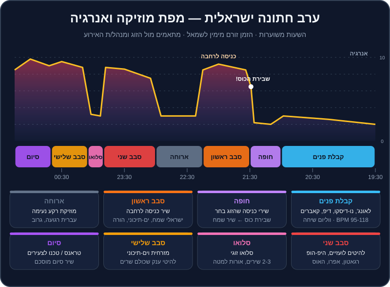

# אירועים וחתונות

במועדון, הקהל בא בשבילכם. בחתונה — הקהל בא בשביל הזוג, והוא כולל ילדים בני 8, חברים מהצבא, דודה מאופקים וסבא בן 90. ואתם צריכים שכולם ירקדו. זה עולם אחר: פחות "הסט שלי", יותר שירות, ניהול זמן ורגישות. ובישראל זו גם הדרך העיקרית שבה DJs מתפרנסים.

החדשות הטובות: כל מה שלמדתם עד עכשיו — ביטמאצ'ינג, EQ, הרמוניה, אפקטים, ניהול אנרגיה — עובד גם כאן. רק המשקל של כל כלי משתנה. בפרק הזה נבנה את התמונה המלאה: איך נראה ערב חתונה ישראלית, איך מתכוננים עם הזוג, מה לומר במיקרופון, ומה לעשות כשהמחשב קורס חמש דקות לפני החופה.

## מה תלמדו בפרק

- את המבנה של ערב חתונה ישראלית, שלב אחר שלב — ומה המוזיקה עושה בכל שלב.
- מה זה Open Format, ואיך משנים את הטכניקה לאירועים.
- את קטגוריות החובה שצריכות להיות בספרייה של DJ אירועים בישראל.
- איך עובדים עם הזוג: פגישת תיאום, רשימות "חובה" ו"אסור", ובקשות שירים בזמן אמת.
- יסודות MC: מיקרופון, הכרזות, ומה לא להגיד.
- ריידר טכני, צ'קליסט ציוד ותוכניות גיבוי.

## מבנה ערב חתונה ישראלית

השעות בתרשים משוערות — לכל זוג, לכל אולם ולכל קהילה יש סדר משלו. אבל השלד חוזר על עצמו כמעט בכל חתונה:

### 1. קבלת פנים (כשעה עד שעה וחצי)

**המטרה:** אווירה טובה, אנשים מדברים, אוכלים, מצטלמים. המוזיקה ברקע — אבל היא קובעת את הרושם הראשון.

- **מה מנגנים:** לאונג', נו-דיסקו, דיפ ואפרו האוס עדינים, קאברים אקוסטיים, סול, ג'אז, ישראלי רגוע. טווח של בערך 95-118 BPM.
- **ווליום:** ברמת שיחה. אם אנשים צריכים לצעוק כדי לדבר — זה חזק מדי.
- **אנרגיה:** 2-4, עם עלייה קלה לקראת החופה.
- **מהרפו:** `house-13`, `house-12`, `house-02`, `house-01`, `breadth-10` (לו-פיי) — כולם במנעד הנכון.

> 💡 טיפ: קבלת הפנים היא הזדמנות לבדוק את הקהל: מי הגיע, באיזה גיל, אילו שירים גורמים לאנשים לזמזם. רשמו לעצמכם — זה ישמש אתכם בסבב הראשון.

### 2. חופה (כחצי שעה)

**המטרה:** הרגע הרגשי של הערב. כאן אין מקום לטעויות.

- **שירי כניסה:** בדרך כלל הזוג בוחר מראש — שיר לכניסת החתן, שיר לכניסת הכלה (לפעמים גם להורים ולילדי השושבינים). סמנו Hot Cue בדיוק בנקודה שבה השיר צריך להתחיל — לפעמים לא מתחילת הקובץ.
- **מיקרופון לעורך הטקס:** ברוב החתונות ה-DJ אחראי לכך שלרב או לעורך הטקס יש מיקרופון אלחוטי עובד, עם סוללות מלאות.
- **שבירת הכוס:** זה הסימן. ברגע שהכוס נשברת — שיר שמח מתפוצץ (רבים משתמשים ב"סימן טוב ומזל טוב" או בשיר אחר שהזוג בחר). תהיו עם האצבע על הכפתור ועם העיניים על החתן.
- **אחרי החופה:** מוזיקה שמחה בזמן שהאורחים ניגשים לברך ולהצטלם.

> ⚠️ זהירות: בזמן הטקס עצמו — אל תשאירו שום דבר מתנגן בטעות, ואל תעזבו את העמדה. תאמו מראש עם מנהל/ת האירוע מי נותן לכם את הסימן לכל שלב.

### 3. כניסה לרחבה וסבב ריקודים ראשון (כ-45 דקות)

**המטרה:** הרגע הכי חשוב שלכם בערב. הרחבה חייבת להתמלא — ומהר.

- **שיר כניסה לרחבה:** הזוג נכנס עם שיר שבחרו (לרוב שיר אנרגטי ומוכר), לעיתים עם עשן, אורות ותשואות. ההכרזה שלכם במיקרופון מתחילה את המסיבה.
- **מה מנגנים:** ישראלי שמח, ים-תיכוני, להיטים שכולם מכירים, ובחתונות רבות גם מעגלים — "הבה נגילה", "עוד ישמע", מחרוזות חסידיות. הרמות של הזוג על כיסאות.
- **קצב:** שירים קצרים (1.5-3 דקות כל אחד), מעברים מהירים, אנרגיה 8-9.
- **מהרפו לתרגול:** `mainstream-13` → `mainstream-14` (`transition-09`), `mainstream-15`, `mainstream-16`.

### 4. ארוחה (כ-45 דקות)

**המטרה:** לתת לאנשים לאכול ולדבר. המוזיקה יורדת לרקע.

- **מה מנגנים:** עברית רגועה, גרוב, להיטים שקטים, לפעמים בקשות מיוחדות של המשפחה.
- **ווליום:** נמוך. המלצרים מגישים, האנשים מדברים.
- **זה גם הזמן** לשתות מים, לבדוק את הסבב הבא, ולאכול משהו (סכמו מראש על ארוחת ספקים).

### 5. סבב שני (כשעה)

**המטרה:** המסיבה של הצעירים — ושל כל מי שרוצה לרקוד.

- **מה מנגנים:** להיטים לועזיים, היפ-הופ ו-R&B, רגאטון ולטיני, אפרוביטס, פופ דאנס, EDM, והאוס/טק האוס לקהל שאוהב אלקטרוני.
- **מבנה:** בלוקים של 10-20 דקות לפי סגנון, עם מעברי טמפו וז'אנר (ראו [פרק 15](15-tempo-genre-switching.md)).
- **מהרפו לתרגול:** `mainstream-08`, `mainstream-10`, `mainstream-11`, `mainstream-03`, `mainstream-04`, `mainstream-01`, `mainstream-02`.

### 6. סלואו (רבע שעה בערך)

רגע זוגי: 2-3 שירים איטיים, אורות למטה. לפעמים זה הריקוד הראשון של הזוג, ולפעמים הוא מגיע מוקדם יותר בערב. **אל תשכחו לצאת ממנו** — אחרי הסלואו מגיע להיט ענק שמחזיר את כולם לרחבה.

### 7. סבב שלישי

ברוב החתונות בישראל: **מזרחית וים-תיכוני** — להיטי ענק שכולם שרים, מחרוזות, רמיקסים. אנרגיה 9 ומעלה. זה המקום לרמיקסים ים-תיכוניים ב-124-140.

### 8. סיום

הצעירים נשארים. בחתונות רבות בישראל הערב נגמר ב**סט טראנס** (או טכנו, לפי הקהל) — ואחריו שיר סיום שהוסכם עם הזוג. צאו מהערב בשיא, לא בדעיכה.

> 💡 טיפ: בחתונות דתיות וחרדיות המבנה שונה: לעיתים רחבות נפרדות לגברים ולנשים (עם מחיצה), מוזיקה חסידית ומזרחית בעיקר, ובחלק מהקהילות — הקפדה על שירים בלי קול נשי. שאלו על כך מראש, בפשטות ובכבוד. זו חלק מהמקצועיות.

### אירועים אחרים בקצרה

| אירוע | מה מיוחד בו |
|---|---|
| **בר/בת מצווה** | קהל צעיר מאוד + הורים וסבים. לרוב יש "הדלקת נרות": בני משפחה וחברים נקראים להדליק נר, ולכל אחד מתנגן קטע שיר קצר שנבחר מראש — הכינו פלייליסט מסודר עם Hot Cues. בלוקים של להיטי נוער, EDM, פופ ומשחקים. |
| **חינה** | מוזיקה מסורתית לפי מוצא המשפחה (מרוקאי, תימני ועוד) + ים-תיכוני. שאלו בדיוק מה המשפחה מצפה לשמוע. |
| **אירוע חברה** | הרבה רקע ו-networking, נאומים (מיקרופון!), ואולי מסיבה בסוף. חשוב: לוח זמנים מדויק מהמפיק. |
| **יום הולדת / מסיבה פרטית** | יותר חופש, קהל הומוגני יותר — אבל עדיין: שאלו מה המארח רוצה. |

## הטכניקה של אירועים — Open Format

ב-Open Format מנגנים הכול: ים-תיכוני, היפ-הופ, האוס, רגאטון, פופ, טראנס — לפעמים בתוך חצי שעה. זה משנה את הטכניקה:

| | סט קלאב | Open Format באירוע |
|---|---|---|
| אורך שיר | 4-7 דקות | 1.5-3 דקות |
| מעבר טיפוסי | בלנד של 32-64 תיבות | קאט על ה-1, Echo Out, בלנד של 8 תיבות |
| BPM | זז לאט, 2-3 לכל מעבר | קופץ בין עולמות: 90, 100, 124, 128, 140 |
| הרמוניה | חשובה מאוד | חשובה בבלנדים, פחות בקאטים |
| מה הכי חשוב | זרימה ואווירה | **השיר הנכון ברגע הנכון** |
| ווקאל | לסירוגין | כמעט כל שיר ווקאלי — אסור לערבב שני ווקאלים |

### כללי זהב של Open Format

1. **נגנו את החלק הכי טוב.** לא צריך לנגן שיר מתחילתו ועד סופו. בית אחד + פזמון + פזמון — ומעבר.
2. **הכינו נקודות כניסה.** Hot Cue על הפזמון, על הדרופ ועל "אינטרו DJ" לכל שיר חשוב.
3. **בלוקים, לא סלט.** 10-20 דקות בסגנון אחד, ואז מעבר מתוכנן לסגנון הבא. קפיצה בכל שיר מבלבלת את הרחבה.
4. **גרסאות מתאימות.** "Clean" (בלי קללות) לאירועים משפחתיים, ואדיטים עם אינטרו ל-DJ מספריות DJ חוקיות (`DJ pools`).
5. **הקשיבו לרחבה, לא לפלייליסט.** אם בלוק לא עובד אחרי שניים-שלושה שירים — עוברים.

## קטגוריות חובה בספרייה

מי שעובד כ-DJ אירועים בישראל צריך ספרייה רחבה ומסודרת. הנה הקטגוריות — כדאי שכל אחת תהיה פלייליסט נפרד ב-Rekordbox:

| קטגוריה | למה | מתי |
|---|---|---|
| קבלת פנים: לאונג', דיפ, נו-דיסקו, אקוסטי | אווירה ורושם ראשון | תחילת הערב |
| שירי חופה פופולריים | הזוג יבקש, לפעמים ברגע האחרון | חופה |
| שירי "שבירת כוס" ושמחה | הרגע אחרי החופה | סוף החופה |
| כניסות לרחבה | אנרגיה מיידית | כניסת הזוג |
| ישראלי שמח וקלאסיקות | מאחד את כל הגילאים | סבב ראשון |
| מעגלים / חסידי / הורה | מסורת, רגעי שיא קבוצתיים | סבב ראשון |
| ים-תיכוני ומזרחית: שירים ורמיקסים | הלב של רוב האירועים | סבב ראשון ושלישי |
| להיטים לועזיים (פופ, דאנס) | צעירים ומבוגרים מכירים | סבב שני |
| היפ-הופ ו-R&B | קהל צעיר | סבב שני |
| לטיני ורגאטון | ממלא רחבות | סבב שני |
| אפרוביטס ואפרו האוס | טרנדי, אנרגטי | סבב שני |
| EDM וקלאסיקות פסטיבלים | בר מצוות, צעירים | סבב שני / סיום |
| נוסטלגיה (שנות ה-80, 90, 2000) | ההורים על הרחבה | בכל סבב, במנות קטנות |
| סלואו | רגע זוגי | אמצע/סוף |
| טראנס וטכנו לסוף | הצעירים שנשארו | סיום |
| "מצילים" | שירים שתמיד עובדים כשהרחבה מתרוקנת | בכל רגע |

> 💡 טיפ: בתיקייה `crates/` תמצאו ארגזים מוכנים בדיוק לזה: `crates/wedding-essentials.md`, `crates/israeli-party.md`, `crates/mediterranean.md`, `crates/latin-reggaeton.md`, `crates/hip-hop-rnb.md`, `crates/throwbacks.md` ועוד — עם BPM, סולם ותפקיד לכל שיר. הם מכילים מידע וקישורים בלבד; את השירים עצמם קונים או מזרימים ממקורות חוקיים.

## עבודה עם הזוג (והלקוח)

### פגישת תיאום — הצ'קליסט

כחודש עד שבועיים לפני האירוע, שבו עם הזוג (פגישה או שיחת וידאו) ועברו על:

1. **לוח זמנים:** שעת הגעה שלכם, קבלת פנים, חופה, כניסה לרחבה, ארוחה, סיום. ומי מנהל/ת האירוע מטעם האולם — שם וטלפון.
2. **שירי חופה:** כניסת חתן, כניסת כלה, אחרים (הורים, ילדים), שבירת כוס. **גרסה מדויקת** (קישור), ומאיפה בשיר להתחיל.
3. **כניסה לרחבה:** השיר, והאם יש עשן/זיקוקים/אורות.
4. **ריקוד ראשון / סלואו** — האם יש, ומתי.
5. **רשימת "חובה"** — 10-20 שירים שחייבים להתנגן.
6. **רשימת "אסור"** — לא פחות חשובה! שירים שמזכירים אקסים, שירים שהזוג שונא, סגנונות שלא מתאימים.
7. **חלוקת סגנונות** — כמה ים-תיכוני, כמה לועזי, כמה אלקטרוני. מה הקהל (גילאים, מוצא, דתיות)?
8. **בקשות משפחתיות** — "השיר של סבתא", שיר מיוחד לאמא.
9. **הנחיה (MC)** — מה להכריז, איך מבטאים את השמות, האם יש נאומים או ברכות.
10. **רישיון אקו"ם** — מי מסדיר. לפי אקו"ם, החובה חלה על בעל השמחה (ולעיתים האולם או ה-DJ מסדירים בשבילו) — כתבו בחוזה מי אחראי. באתר אקו"ם מופיע תעריף לאירוע משפחתי (בסביבות 400 ₪, נכון ל-2025), ויש להסדיר אותו מראש. בדקו את התעריף העדכני.
11. **ציוד** — מה האולם מספק (הגברה, תאורה, מסכים) ומה אתם מביאים.

> 💡 טיפ: שלחו לזוג טופס מקוון עם כל השאלות האלה לפני הפגישה. הם ימלאו בנחת, ואתם תגיעו לפגישה מוכנים. אחרי הפגישה — שלחו סיכום כתוב. זה מונע 90% מאי-ההבנות.

### בקשות שירים בזמן אמת

- **הקשיבו, תמיד.** גם אם לא תנגנו בדיוק את הבקשה — היא מידע על מה שהקהל רוצה.
- **"בטח, תכף"** — אם השיר מתאים, שבצו אותו בבלוק הנכון. אל תקפצו מיד באמצע בלוק אחר.
- **סירוב מנומס** — אם השיר ברשימת ה"אסור" של הזוג, או ממש לא מתאים: "הזוג ביקש שלא, סליחה!" עובד כמעט תמיד.
- **בעדיפות לזוג ולהורים.** בקשה של אמא של הכלה גוברת על בקשה של חבר שיכור.
- **אל תתנו לאף אחד לגעת בציוד.** "תן לי רגע לשים משהו מהטלפון" — לא.

## יסודות MC — לדבר במיקרופון

בישראל, DJ אירועים הוא כמעט תמיד גם ה-MC. זה לא אומר להיות מנחה של תוכנית בידור — רק להוביל את הערב בביטחון.

### טכניקה

1. **אחזו במיקרופון** 2-5 ס"מ מהפה, מכוון ישר לפה. אל תכסו את הראש של המיקרופון ביד (זה גורם לשריקות).
2. **הנמיכו את המוזיקה** בערך ב-10 dB לפני שמדברים — או עשו את ההכרזה על אינטרו בלי ווקאל.
3. **אל תעמדו מול הרמקולים** עם המיקרופון — זה מתכון לשריקה (`feedback`).
4. **דברו לאט, קצר וברור.** משפט-שניים. עדיף לשתוק מאשר למלמל.
5. **בדקו את המיקרופון בסאונד צ'ק**, וגם סוללה רזרבית בכיס.

### הכרזות לדוגמה

- "ערב טוב לכולם, ברוכים הבאים! בעוד כרבע שעה נתחיל את החופה — נבקש מכולם להתקרב לאזור החופה."
- "גבירותיי ורבותיי… קבלו בתשואות סוערות את החתן והכלה!" — ואז הדרופ.
- "זה הזמן לרקוד — כולם לרחבה!"
- "אנחנו מזמינים את המשפחה לרחבה לריקוד משפחתי."
- "תודה רבה לכולם, היה ערב מושלם — מזל טוב!"

> ⚠️ זהירות: אל תספרו בדיחות פנימיות שלא אישרו לכם, אל תזכירו אקסים, פוליטיקה או דת, ותמיד בדקו מראש איך מבטאים את השמות. טעות בשם של הכלה במיקרופון זה רגע שלא שוכחים.

## ריידר טכני וציוד

**ריידר** (`rider`) הוא מסמך שמפרט מה אתם צריכים כדי לעבוד: ציוד, חשמל, שטח, זמנים. גם אם האולם מספק את רוב הדברים — שלחו ריידר. הוא חוסך הפתעות.

| פריט | אירוע קטן (50-150) | חתונה (300-600) |
|---|---|---|
| רמקולים | שני רמקולים פעילים + סאב אחד | מערכת גדולה (רמקולים + 2 סאבים או יותר), לרוב של ספק הגברה |
| עמדת DJ | שולחן יציב, כ-1.5-2 מ' | עמדה מסודרת עם מקום לשני מחשבים |
| קונטרולר / מיקסר | שלכם | שלכם או של האולם (CDJs + מיקסר) |
| מחשב | ראשי + גיבוי (טלפון/טאבלט עם פלייליסט חירום) | ראשי + מחשב גיבוי או USB לנגני CDJ |
| מיקרופונים | 1 אלחוטי + 1 חוטי | 2 אלחוטיים (DJ + חופה) + 1 חוטי |
| מוניטור | רצוי | חובה |
| חשמל | שקע נפרד ליד העמדה | מעגל חשמל נפרד, רחוק מהמטבח והתאורה |
| אל-פסק (UPS) | מומלץ | חובה |
| כבלים | XLR, RCA, USB, מתאמים, מפצלים | כפול מכל דבר |
| תאורה ואפקטים | לפי הצורך | לרוב חברת הפקה |
| זמן הקמה | שעה לפני קבלת הפנים | שעתיים לפחות, כולל סאונד צ'ק |

> 💡 טיפ: בהרבה אולמות בישראל יש ספק הגברה ותאורה קבוע, ולפעמים יש כללים לגבי מה מותר להביא. תבררו מראש עם האולם — לא ביום האירוע.

## תוכניות גיבוי — כי זה יקרה

בחתונה אין "בואו נתחיל מחדש". הנה מה ש-DJs מנוסים עושים:

1. **שני מקורות מוזיקה.** אם המחשב קורס — טלפון או טאבלט עם פלייליסט של 30 דקות, מחובר לערוץ פנוי במיקסר, מוכן.
2. **שני USB** עם ספרייה מיוצאת מ-Rekordbox (אם יש באולם נגני CDJ).
3. **הספרייה כולה מקומית.** אל תסתמכו על סטרימינג או על ה-Wi-Fi של האולם.
4. **טראק חירום ארוך** טעון בדק השני — שיר של 6-7 דקות שאפשר להפעיל ברגע.
5. **אל-פסק** למחשב ולקונטרולר. הפסקת חשמל של שנייה לא תפיל לכם את המערכת.
6. **כבלים ומתאמים כפולים**, אוזניות רזרביות, סוללות למיקרופונים, מפצל חשמל.
7. **לוח זמנים מודפס** עם הטלפונים של מנהל/ת האירוע, הזוג (או נציג), וספק ההגברה.
8. **שירי החופה בשלושה מקומות:** בפלייליסט, על USB, ובטלפון.

> ⚠️ זהירות: אל תעדכנו את Rekordbox, את מערכת ההפעלה או את הדרייברים בשבוע של אירוע. עדכנו אחרי, כשיש זמן לבדוק שהכול עובד.

## תרגילים

> 🎧 תרגיל 1 — הסבב הראשון (30 דקות)
> בנו "סבב ראשון" של 15 דקות מהרפו בסגנון Open Format: `mainstream-13` → `mainstream-14` (החלפת דרופים, כמו `transition-09`) → Echo Out → `mainstream-15` → `mainstream-16`. כל טראק לא יותר מ-3 דקות. התחילו בהכרזה במיקרופון (או בקול רם אם אין מיקרופון): "קבלו בתשואות את החתן והכלה!", ואז הדרופ על ה-1.

> 🎧 תרגיל 2 — שבירת כוס (10 דקות)
> טענו טראק "חופה" רגוע (למשל `house-02`) ובדק השני את `mainstream-16` עם Hot Cue על הדרופ (D). בקשו מחבר להגיד "עכשיו!" ברגע אקראי. כמה מהר אתם עוברים — נקי, בלי שקט מביך? המטרה: פחות משנייה.

> 🎧 תרגיל 3 — טופס לזוג (30 דקות)
> כתבו טופס תיאום לפי הצ'קליסט בפרק. שלחו אותו לחבר/ה שמתחתן/ת (או דמיינו זוג), ובנו מהתשובות פלייליסטים ב-Rekordbox לפי הקטגוריות.

> 🎧 תרגיל 4 — תרגיל גיבוי (15 דקות)
> באמצע מיקס, בקשו ממישהו לנתק לכם את ה-USB של הקונטרולר. כמה זמן לוקח לכם להחזיר מוזיקה לרחבה — מהטלפון, מהדק השני, או בחיבור מחדש? המטרה: פחות מ-10 שניות.

> 🎧 תרגיל 5 — ריידר אישי (20 דקות)
> כתבו ריידר של עמוד אחד לאירוע קטן: ציוד שאתם מביאים, מה אתם צריכים מהאולם, זמני הקמה, איש קשר. שמרו אותו כ-PDF — תשתמשו בו בפרק 18.

## סיכום

- חתונה ישראלית: קבלת פנים, חופה, כניסה לרחבה וסבב ראשון, ארוחה, סבב שני, סלואו, סבב שלישי וסיום (לרוב בטראנס).
- ב-Open Format: שירים קצרים, נקודות כניסה מוכנות, בלוקים לפי סגנון, וקאטים ו-Echo Out מדויקים.
- ספרייה מסודרת לפי קטגוריות, כולל "מצילים", גרסאות Clean, ושירי חופה בכמה גיבויים.
- פגישת תיאום, רשימות "חובה" ו"אסור", וסיכום כתוב — מונעים כמעט כל בעיה.
- הנחיה (MC) טובה: קצרה, ברורה, מוזיקה מונמכת, שמות מבוטאים נכון.
- ריידר, ציוד כפול, אל-פסק, ותוכנית חירום — כי משהו תמיד משתבש.

בפרק הבא נלמד את הכלי שהכי חשוב באירועים: לעבור בין עולמות — מרגאטון ב-95 להאוס ב-124 — בלי שהרחבה תרגיש "בור". ← [פרק 15: מעברי טמפו וז'אנר](15-tempo-genre-switching.md)
