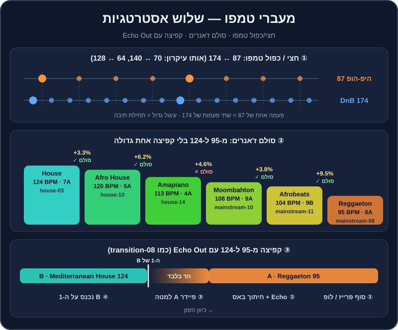

# מעברי טמפו וז'אנר

אתם באמצע סבב שני בחתונה. בלוק רגאטון עובד מעולה — הרחבה מלאה, ב-95 BPM. עכשיו אתם רוצים להעלות הילוך: האוס ים-תיכוני ב-124. אם תנסו "לבטמאץ'" — תצטרכו להאיץ את הרגאטון ב-30%, והזמר יישמע כמו סנאי. אם פשוט תעצרו ותתחילו שיר חדש — יהיה "בור" של שנייה, והרחבה תתפזר.

יש דרכים טובות יותר. בפרק הזה נלמד את ארגז הכלים המלא של מעברי טמפו וז'אנר: מתי מספיק להזיז את הפיידר, מתי קופצים, ואיך בונים "סולם" של ז'אנרים שמעלה את הטמפו בלי שאף אחד ירגיש.

## מה תלמדו בפרק

- לחשב אחוזי שינוי טמפו, ולדעת מה "מורגש" ומה לא.
- חמש אסטרטגיות: רמפה הדרגתית, Echo Out וקאט, חצי/כפול טמפו, סולם ז'אנרים, ושבירת אקפלה ותופים.
- זוגות ז'אנרים נפוצים: היפ-הופ/רגאטון/ים-תיכוני ↔ האוס, טראפ ↔ דאבסטפ, טכנו ↔ הארד טכנו.
- לנתח ולשחזר את `transition-08`, ולתרגל עם `practice-15`.

## החשבון: כמה זה "הרבה"?

**אחוז השינוי = (BPM חדש ÷ BPM נוכחי − 1) × 100.** מ-124 ל-128: ‏128 ÷ 124 = 1.032, כלומר ‎+3.2%.

| מ- | אל | שינוי | מה עושים |
|---|---|---|---|
| 120 | 124 | ‎+3.3% | בלנד רגיל — אף אחד לא ישמע |
| 124 | 128 | ‎+3.2% | בלנד רגיל, או רמפה לאורך טראק |
| 95 | 100 | ‎+5.3% | בלנד קצר; בווקאל כבר מורגש |
| 113 | 120 | ‎+6.2% | גבולי — עדיף Echo Out או בלנד קצר מאוד |
| 100 | 108 | ‎+8% | קפיצה (Echo Out / קאט) |
| 104 | 124 | ‎+19% | קפיצה |
| 95 | 124 | ‎+30.5% | קפיצה — או סולם ז'אנרים |
| 87 | 174 | פי 2 | חצי/כפול טמפו — אותו גריד! |

**כלל אצבע** (עם `MASTER TEMPO` דולק):

- **עד 3%** — בלתי מורגש כמעט בכל ז'אנר.
- **3%-6%** — מורגש על ווקאל וכלים "טבעיים" (פסנתר, גיטרה). בטראקי תופים ובאס — בסדר.
- **מעל 6%-8%** — מתחילים לשמוע "שאריות" דיגיטליות, וה"אופי" של השיר משתנה. כאן כבר לא מזיזים — קופצים.

> 🎚️ ב-Rekordbox: טווח פיידר הטמפו של כל דק ניתן לשינוי — בדרך כלל ‎±6%, ‎±10%, ‎±16% או `WIDE` (טווח רחב מאוד). בטווח ‎±6% הפיידר מדויק מאוד, אבל לא תוכלו להגיע ל-‎+8%. לרמפות גדולות — עברו ל-‎±16%. שימו לב שבטווח רחב, תזוזה קטנה של הפיידר = שינוי גדול.

## אסטרטגיה 1: רמפה — "לרכוב" על הטמפו

השינוי הכי חלק הוא זה שאף אחד לא שם לב אליו. במקום לקפוץ מ-124 ל-130, מעלים את הטמפו של המאסטר בהדרגה, לאורך כמה טראקים.

1. ודאו ש-`MASTER TEMPO` דולק בשני הדקים.
2. בזמן שטראק מתנגן לבד (אחרי מעבר), הזיזו את הטמפו שלו בכחצי BPM כל 16 תיבות.
3. כשהגעתם ליעד, הכניסו את הטראק הבא, מותאם לטמפו החדש.
4. חזרו על זה לאורך 2-3 טראקים.

**סוד המקצוענים — רמפה בברייקדאון:** כשאין תופים (בברייקדאון, Hot Cue **C** בטראקים שלנו), אין לאוזן "עוגן" קצבי. אפשר להעלות שם 2-3% בתוך 8 תיבות, והדרופ חוזר בטמפו החדש — בלי שאיש ירגיש.

> 🎧 בסט לדוגמה ב[פרק 12](12-set-building.md), הטמפו עולה מ-121 ל-130 בתוך 40 דקות — כולו ברמפות כאלה.

## אסטרטגיה 2: Echo Out וקאט — הקפיצה

כשהפער גדול מדי לרמפה, קופצים. הקפיצה הטובה מרגישה **מתוכננת**: היא קורית בסוף משפט מוזיקלי, עם "זנב" שמחבר בין העולמות, והטראק החדש נוחת על ה-1 עם אנרגיה.

### הקפיצה צעד אחר צעד (מ-95 ל-124)

1. **הכינו את B.** טענו את הטראק החדש, וסמנו Hot Cue בנקודה שבה הוא צריך להיכנס. בקפיצה למעלה — לרוב **הדרופ** (D) או תחילת הגרוב (B), לא אינטרו של 32 תיבות תופים.
2. **בחרו את רגע היציאה מ-A:** סוף פזמון, סוף משפט ווקאלי, או סוף פרייז של 8/16 תיבות.
3. **בפעמה האחרונה של המשפט** — הדליקו `Echo` של 1/2 או פעמה אחת, Level בסביבות 50%. אפשר להוסיף גם חיתוך Low ב-EQ.
4. **על ה-1 הבא** — הורידו את הפיידר של A. ההד ממשיך לבד.
5. **על אותו 1 (או פעמה-שתיים אחרי)** — הפעילו את B מה-Hot Cue. הוא נכנס בטמפו המקורי שלו, 124, בלי שום ביטמאצ'ינג.
6. **כבו את ה-Echo** והחזירו Level לאפס.

**וריאציות:**
- **קאט "יבש"** — בלי Echo, B על ה-1 מיד אחרי ש-A נגמר. דורש תזמון מושלם, ועובד מצוין בהיפ-הופ ורגאטון.
- **`Vinyl Brake` / Backspin** — A "נעצר", ו-B מתפוצץ. דרמטי — פעם-פעמיים בערב.
- **אפקט מעבר** — ריזר, נויז או סאונד אפקט קצר שמחבר. לא להגזים.
- **שקט מכוון** — חצי פעמה של שקט מוחלט לפני דרופ עוצמתי. רק כשאתם בטוחים בתזמון.

> 💡 טיפ: בקפיצה **למעלה** בטמפו — היכנסו חזק (דרופ, פזמון). בקפיצה **למטה** — היכנסו עם הלהיט הכי מוכר שיש לכם בטמפו החדש, ומיד מההוק. ירידה בטמפו היא הרגע שבו הכי קל לאבד את הרחבה.

### ניתוח: transition-08

`transition-08` (בתיקייה `music/transitions/`) הוא בדיוק המעבר הזה: מ-mainstream-08 (Dembow Fuego, רגאטון, 95 BPM, 8A) אל mainstream-15 (Mediterranean Sunrise, האוס ים-תיכוני, 124 BPM, 7A). שימו לב לשלושה דברים כשאתם מאזינים:

1. **איפה** A יוצא — בסוף משפט, לא באמצע.
2. **האורך** של זנב ה-Echo — מספיק כדי לגשר, לא כל כך ארוך שהוא "מלכלך" את ההתחלה של B.
3. **הסולמות** — 8A ו-7A שכנים בגלגל, כך שגם הזנב של ההד לא מתנגש עם B.

> 🎧 תרגיל: האזינו ל-`transition-08` שלוש פעמים, ואז שחזרו אותו בעצמכם עם `music/tracks/reggaeton/mainstream-08-dembow-fuego.mp3` ו-`music/tracks/mediterranean/mainstream-15-mediterranean-sunrise.mp3`. נסו Echo של 1/2 ושל 1 — איזה מתאים יותר?

## אסטרטגיה 3: חצי טמפו וכפול טמפו

**64 = חצי מ-128. 70 = חצי מ-140. 87 = חצי מ-174.** כשמספר אחד הוא בדיוק פי 2 מהשני, הגרידים מתיישרים: כל פעמה של הטראק האיטי = שתי פעמות של המהיר. לכן אפשר לערבב אותם כמו שני טראקים באותו טמפו.

הזוגות הנפוצים:

| איטי | מהיר | ז'אנרים | מהרפו |
|---|---|---|---|
| 87 | 174 | היפ-הופ ↔ דראם אנד בייס | breadth-10 (84, להעלות ל-86) ↔ breadth-06 (172) |
| 70 | 140 | "תחושה" של טראפ/דאבסטפ ↔ פסיכדלי, הארד | mainstream-06 (140) ↔ breadth-07 (140) |
| 64 | 128 | היפ-הופ איטי / R&B ↔ האוס וטכנו | — |

1. ודאו שה-BPM של שני הטראקים מוצג נכון (לפעמים התוכנה מזהה טראפ ב-70 ולפעמים ב-140).
2. התאימו את האיטי בדיוק לחצי מהמהיר (למשל 86 מול 172).
3. ישרו את ה-1 של שניהם — ה-1 של האיטי חייב ליפול על ה-1 של המהיר.
4. מכאן — מעבר רגיל: Bass Swap, פילטר, או קאט.

> 💡 טיפ: טראפ (140) ודאבסטפ (140) נשמעים "איטיים" כי הסנר נופל על פעמה 3 — כמו ב-70. לכן מעבר מהם לפסיכדלי טראנס (138-142) או לטכנו מהיר "מכפיל" פתאום את האנרגיה, בלי לשנות כמעט את ה-BPM. זה טריק חזק לסוף הערב.

> ⚠️ זהירות: אם הגריד של אחד הטראקים מוגדר על חצי או כפול מהאמיתי, `Sync` יתאים אותו בצורה שגויה. בדקו את ה-BPM המוצג, ותקנו את הגריד אם צריך (ראו [פרק 4](04-bpm-beatmatching.md)).

## אסטרטגיה 4: סולם ז'אנרים

במקום קפיצה אחת של 30%, עולים במדרגות. כל מדרגה היא ז'אנר שנמצא "בין" הקודם לבא:

| מדרגה | ז'אנר | BPM | אצלנו | שינוי מהקודם | מהלך בגלגל |
|---|---|---|---|---|---|
| 1 | Reggaeton | 95 | mainstream-08 (8A) | — | — |
| 2 | Afrobeats | 104 | mainstream-11 (9B) | ‎+9.5% | 8A→9B (אלכסון) |
| 3 | Moombahton | 108 | mainstream-10 (9A) | ‎+3.8% | 9B→9A ✓ |
| 4 | Amapiano | 113 | house-14 (4A) | ‎+4.6% | 9A→4A ✕ |
| 5 | Afro House | 120 | house-10 (5A) | ‎+6.2% | 4A→5A ✓ |
| 6 | House | 124 | house-03 (7A) | ‎+3.3% | 5A→7A (‎+2) |

**איך עוברים כל מדרגה:**

- **פחות מ-4%** — בלנד רגיל.
- **4%-6%** — "נפגשים באמצע": מעבר מ-108 ל-113? שימו את שניהם על 110.5 במהלך המעבר (‎+2.3% ו-‎−2.2%), ואחרי המעבר "רכבו" עם החדש חזרה ל-113.
- **מעל 6%** — Echo Out או קאט, אבל קצר ומדויק. בין רגאטון לאפרוביטס האוזן כבר מצפה לשינוי.
- **מדרגה עם ✕ בגלגל** — חפיפה של תופים בלבד, או קאט. לא בלנד ארוך עם שני באסים.

> 💡 טיפ: סולם ז'אנרים עובד מצוין בבלוק "אפרו" — אפרוביטס → אמאפיאנו → אפרו האוס — כי הפרקשן מחבר את כולם. זה גם מעבר טבעי מהחלק ה"לועזי" של חתונה לחלק האלקטרוני.

## אסטרטגיה 5: שבירה של אקפלה ותופים

הרבה שירים מסתיימים (או אפשר לגרום להם להסתיים) בקטע של תופים בלבד, או בשירה כמעט בלי ביט. בקטע כזה "הקצב" פחות מוחשי — וזה חלון להחליף טמפו.

1. מצאו בטראק A קטע של תופים בלבד או ווקאל חופשי (באאוטרו, או בברייקדאון).
2. הפעילו לופ של 1-2 תיבות על הקטע הזה.
3. **אופציה א' (קלה):** Echo Out מהלופ, ו-B נכנס על ה-1 בטמפו שלו.
4. **אופציה ב' (מתקדמת):** על לופ של תופים בלבד, העלו את הטמפו בהדרגה לאורך 8-16 תיבות — למשל מ-100 ל-110. על תופים, האוזן מקבלת האצה כ"בילד-אפ". ואז קאט ל-B ב-124.

> 🎧 תרגיל: `music/practice/practice-15-tempo-bridge-100-to-124.mp3` נבנה בדיוק לזה: גרוב ים-תיכוני/רגאטון ב-100 BPM, עם אאוטרו של אקפלה ותופים. נסו את שתי האופציות לכיוון mainstream-15 (124) או house-03 (124).

## מעברי ז'אנר נפוצים — מתכונים

### היפ-הופ / רגאטון / ים-תיכוני ← האוס (עלייה)

- **הכלי העיקרי:** Echo Out + כניסה של האוס **מה-Hot Cue B או D**, לא מאינטרו של תופים בלבד (16 תיבות של קיק אחרי שיר רגאטון — הרחבה "מתקררת").
- **טריק:** הכניסו את התופים של טראק ההאוס **מתחת לאקפלה או לסוף הפזמון** של השיר הקודם — הקיק של ההאוס "מאיץ" את התחושה.
- **ים-תיכוני ← רמיקס ים-תיכוני:** פזמון של שיר ב-100, Echo Out, ורמיקס האוס עם אותו צבע מזרחי. mainstream-14 (Hijaz Fire, 104, 8A) → mainstream-15 (124, 7A) — שכנים בגלגל, אז גם זנב ההד מתאים.

### האוס ← היפ-הופ / רגאטון (ירידה)

- **הבעיה:** ירידה מ-124 ל-95 מרגישה כמו "בלם יד".
- **הפתרון:** סיימו את ההאוס בשיא (לא בברייקדאון), Echo Out קצר או `Vinyl Brake`, וכניסה **מהפזמון** של הלהיט הכי גדול שלכם ב-95. האנרגיה של השיר המוכר "מחפה" על הירידה בטמפו.
- **מהרפו:** house-05 (126) → mainstream-07 (95): Echo Out, ו-mainstream-07 מ-Hot Cue D.

### טראפ ← דאבסטפ ← פסיכדלי / הארד

- **טראפ ↔ דאבסטפ:** אותו 140, ולפעמים אותו סולם (mainstream-06 ו-breadth-07 — שניהם 4A!). בלנד או החלפת דרופים.
- **דאבסטפ ← פסיכדלי (138-142):** הקיק משתנה מחצי-טמפו לארבע על הרצפה — האנרגיה מוכפלת. קאט על הדרופ.

### טכנו ← הארד טכנו

- **מ-130 ל-150** זה ‎+15%. רמפה של 2-3% לכל טראק, או רמפה בברייקדאון ואז קפיצה של Echo Out (ראו את התרגול של techno-03 ← techno-12 ב[פרק 13](13-genre-bible.md)).

### מלודיק טכנו (122-124) ↔ טק האוס (126-128)

- **פער קטן** (‎+3%) — רמפה רגילה. הקושי הוא באופי: מלודיק "רגשי", טק האוס "קופצני". גשר טוב: טראק טק האוס עם קצת אקורדים, או מלודיק עם באסליין קצבי. בסט של פרק 12: house-05 → techno-01 עובד כי שניהם ב-8A.

### דראם אנד בייס ↔ היפ-הופ

- **חצי/כפול טמפו** — 87 ↔ 174. אקפלה של היפ-הופ מעל DnB היא קלאסיקה של סטים בריטיים.

## טעויות נפוצות

| טעות | למה זה קורה | התיקון |
|---|---|---|
| מאיצים שיר ווקאלי ב-10% | "חייב ביטמאץ'" | Echo Out וקפיצה |
| נכנסים לטמפו החדש מאינטרו ארוך של תופים | "ככה עושים בקלאב" | באירוע — נכנסים מהגרוב או מהדרופ |
| יורדים בטמפו לשיר לא מוכר | לא תכננו | ירידה = רק עם להיט |
| Echo של 4 פעמות על שיר מהיר | הזנב ארוך מדי | 1/2 או 1 |
| שוכחים את טווח הפיידר | הפיידר "נתקע" ב-‎+6% | ‎±16% לרמפות |
| מחליפים ז'אנר בכל שיר | התלהבות | בלוקים של 10-20 דקות |

## תרגילים

> 🎧 תרגיל 1 — Echo Out בלי ביטמאץ' (15 דקות)
> טענו את `music/practice/practice-02-drums-120.mp3` ואת `music/practice/practice-05-drums-132.mp3`. קפצו ביניהם עם Echo Out — הלוך וחזור, 10 פעמים. המטרה: ה-1 של הטראק החדש נוחת בדיוק כשהזנב מתחיל לדעוך.

> 🎧 תרגיל 2 — שחזור transition-08 (20 דקות)
> ראו למעלה. הקליטו את הגרסה שלכם והשוו לדמו.

> 🎧 תרגיל 3 — practice-15 (20 דקות)
> אופציה א' (Echo Out מהאאוטרו) ואופציה ב' (לופ תופים + רמפה מ-100 ל-110 + קאט) לכיוון mainstream-15. איזו הרגישה טבעית יותר?

> 🎧 תרגיל 4 — סולם ז'אנרים (30 דקות)
> נגנו את ששת השלבים מהטבלה, 2-3 דקות לכל טראק: mainstream-08 → mainstream-11 → mainstream-10 → house-14 → house-10 → house-03. השתמשו בטכניקה המתאימה לכל מדרגה (בלנד, "נפגשים באמצע", או Echo Out). הקליטו.

> 🎧 תרגיל 5 — חצי טמפו (15 דקות)
> mainstream-06 (טראפ, 140, 4A) ↔ breadth-07 (דאבסטפ, 140, 4A). ואז: breadth-10 (לו-פיי, 84 — העלו ל-86) מעל breadth-06 (DnB, 172). שימו לב שה-1 של שניהם חייב להיפגש.

> 🎧 תרגיל 6 — רמפה בברייקדאון (15 דקות)
> house-03 (124) → house-07 (128). במקום להזיז את house-03 לאט, חכו לברייקדאון שלו (C) והעלו בו את הטמפו ל-128 בתוך 8 תיבות. כשהדרופ חוזר — הכניסו את house-07. האם מישהו היה שם לב?

> 🎧 תרגיל 7 — ירידה (15 דקות)
> house-05 (126) → mainstream-07 (95). Echo Out או `Vinyl Brake`, ו-mainstream-07 מה-Hot Cue של הפזמון/הדרופ. נסו גם כניסה מהאינטרו — ותרגישו למה זה פחות עובד.

## סיכום

- עד 3% — בלנד. 3%-6% — בזהירות. מעל 6%-8% — קופצים.
- הקפיצה הטובה: סוף משפט, Echo Out של 1/2 או פעמה, והטראק החדש על ה-1 — מהדרופ או מהגרוב.
- חצי/כפול טמפו (87/174, 70/140, 64/128) מאפשר לערבב עולמות "רחוקים" כאילו הם באותו טמפו.
- סולם ז'אנרים: רגאטון → אפרוביטס → מומבהטון → אמאפיאנו → אפרו → האוס.
- ירידה בטמפו — רק עם להיט, ישר מהפזמון.
- `transition-08` ו-`practice-15` נבנו בשביל הפרק הזה — השתמשו בהם.

אחרי שאתם יודעים לחבר כל דבר לכל דבר — הגיע הזמן להקליט את זה ולשתף עם העולם. ← [פרק 16: הקלטה ושיתוף](16-recording-sharing.md)
