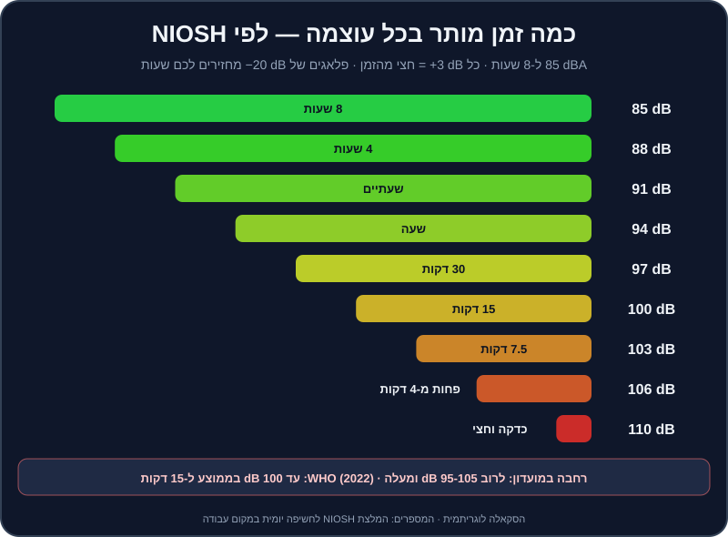

# בריאות האוזניים והופעה

האוזניים הן הכלי היחיד שלכם שאי אפשר לקנות חדש. קונטרולר מחליפים, מחשב משדרגים — אבל תאי השיער באוזן הפנימית לא מתחדשים. נזק לשמיעה מצטבר בשקט, בלי כאב, והוא קבוע. ו-DJs נמצאים בדיוק במקום הכי מסוכן: שעות ליד רמקולים, עם אוזניות צמודות, בחדרים שבנויים להיות רועשים.

החצי השני של הפרק עוסק בהופעה עצמה: איך מתנהגים בבודקה, איך נראים על הבמה, איך מתמודדים עם הלחץ, ומה עושים כשמשהו נשבר באמצע הסט. כי זה יקרה — והשאלה היא רק כמה מהר תחזירו את המוזיקה.

## מה תלמדו בפרק

- מה זה דציבל, ולמה ‎+3 dB זה הרבה יותר ממה שנשמע.
- כמה זמן "מותר" לשמוע בכל עוצמה — לפי NIOSH ו-WHO.
- איזה פלאגים לקנות, וכמה הם מורידים.
- כמה חזק להגדיר מוניטור ואוזניות, ולמה "זחילת ווליום" היא האויב.
- נימוסי בודקה, החלפת DJs, ונוכחות על הבמה.
- איך להתמודד עם פרפרים בבטן.
- צ'קליסט של תקלות נפוצות — ומה עושים בכל אחת.

## המספרים

### דציבלים בקצרה

**דציבל (dB)** הוא סקאלה לוגריתמית:
- **עוד 3 dB** = פי 2 אנרגיה של צליל. לאוזן זה נשמע "קצת יותר חזק", אבל לנזק — זה פי 2.
- **עוד 10 dB** = נשמע בערך פי 2 חזק יותר, אבל זו פי 10 אנרגיה.
- **יחידת dBA** — מדידה "משוקללת" לפי הרגישות של האוזן האנושית. זו היחידה בהמלצות הבריאות.

### כמה זמן מותר?

המכון האמריקאי לבטיחות ובריאות תעסוקתית (**NIOSH**) ממליץ על **85 dBA לאורך 8 שעות** כגבול יומי, ובכל תוספת של 3 dB — **חצי מהזמן**:

| עוצמה | זמן חשיפה יומי מומלץ (NIOSH) | דוגמה (משוערת) |
|---|---|---|
| 85 dBA | 8 שעות | רחוב עמוס מאוד |
| 88 dBA | 4 שעות | — |
| 91 dBA | שעתיים | אוזניות בווליום גבוה |
| 94 dBA | שעה | — |
| 97 dBA | 30 דקות | מוניטור חזק בבודקה |
| 100 dBA | 15 דקות | רחבה במועדון |
| 103 dBA | כ-7.5 דקות | — |
| 106 dBA | פחות מ-4 דקות | קרוב לרמקולים |

**ארגון הבריאות העולמי (WHO)** פרסם ב-2022 תקן גלובלי למקומות בילוי ואירועים עם מוזיקה מוגברת. ההמלצה המרכזית: **עד 100 dB בממוצע לאורך 15 דקות** (`LAeq,15min`) — לצד ניטור רמות, אזורים שקטים, ופלאגים זמינים לקהל. לשמיעה אישית (אוזניות), WHO ממליץ למבוגרים על חשיפה שבועית של עד כ-**80 dB לאורך 40 שעות**.

שימו לב לחשבון: סט של 4 שעות במועדון שבו העוצמה בבודקה היא 100 dB = פי 16 מהמנה היומית המומלצת. בלי הגנה.

> ⚠️ זהירות: **צפצוף או זמזום באוזניים אחרי הופעה** (טנטון) הוא סימן אזהרה. אם הוא לא נעלם תוך יום-יומיים, או אם אתם מרגישים שהשמיעה "עמומה" — פנו לבדיקה (רופא אף-אוזן-גרון או בדיקת שמיעה דרך קופת החולים). ככל שמגיעים מוקדם יותר — כך טוב יותר.

## פלאגים — הכלי הכי חשוב בתיק

| סוג | כמה מוריד | צליל | מחיר משוער בישראל | למי |
|---|---|---|---|---|
| ספוג חד-פעמי | הרבה (מדורג לרוב ב-25-33 dB) | עמום מאוד — "מתחת לשמיכה" | שקלים בודדים לזוג | גיבוי, נסיעות, הופעות של אחרים |
| פלאגים מוזיקליים אוניברסליים (עם פילטר) | בערך 15-25 dB, יחסית "שטוח" | טבעי יחסית — שומעים את המיקס | כ-60-250 ₪ | כל DJ, מהיום הראשון |
| פלאגים מותאמים אישית (יציקה) עם פילטר | לפי פילטר — בדרך כלל 9, 15 או 25 dB | הכי טבעי ונוח לשעות | כ-600-1,500 ₪ | מי שמופיע באופן קבוע |

**מה זה "שטוח"?** פלאג ספוג מוריד הרבה גבוהים ומעט נמוכים — לכן הכול נשמע עמום, וה-DJ מסובב את ה-High למעלה. פלאג מוזיקלי מנסה להוריד את כל התדרים באופן שווה — המיקס נשמע אותו דבר, רק שקט יותר.

**על הדירוגים:** `NRR` (אמריקאי) ו-`SNR` (אירופאי) הם דירוגי מעבדה. בפועל, ההגנה תלויה בכמה טוב הפלאג יושב. תרגלו להכניס אותם נכון.

> 💡 טיפ: פלאג של ‎−20 dB הופך 105 dB ל-85 dB — כלומר משעות מעטות של דקות, למנה של יום שלם. זה ההבדל בין קריירה של 30 שנה לטנטון בגיל 30.

### איך מנגנים עם פלאגים

1. **מתחילים בבית** — תרגלו עם פלאגים כדי שהאוזן תתרגל.
2. **שתי האוזניים, כל הזמן.** לא "פלאג אחד ואוזן אחת לאוזניות".
3. **אוזניות מעל הפלאגים** — לקיואינג. תצטרכו קצת יותר ווליום באוזניות, אבל הרבה פחות ממה שאתם חושבים.
4. **תסמכו על המטרים**, לא על התחושה שהכול "שקט מדי".
5. **אל תוציאו אותם "רק לרגע"** כדי לבדוק את המיקס — העדיפו להסתובב לרחבה ולהקשיב משם עם הפלאגים.

## מוניטור, אוזניות וזחילת ווליום

### מוניטור (Booth Monitor)

המוניטור קיים כדי שתשמעו את מה שמתנגן בזמן אמת, בלי ההשהיה של הצליל שחוזר מהאולם. הוא **לא** אמור להיות חזק יותר מהרחבה.

- **ווליום:** מספיק כדי לשמוע את הקיק בבירור — לא יותר.
- **כיוון:** המוניטור מכוון אליכם, בגובה הראש אם אפשר.
- **ערוץ נפרד:** ב-Rekordbox ובקונטרולרים רבים יש יציאת `Booth` נפרדת עם ידית ווליום משלה. השתמשו בה ולא ב-Master.

### אוזניות

- **ווליום נמוך ככל האפשר.** אם אתם צריכים להגביר — זה סימן שהמוניטור חזק מדי, או שהאוזניות לא אוטמות.
- **טכניקת אוזן אחת** — החליפו מדי פעם את האוזן שמקשיבה.
- **הורידו את האוזניות** כשאתם לא צריכים לשמוע את הדק הבא.

### זחילת ווליום

לאורך ערב, האוזן מתעייפת והמוח "מבקש" עוד. ה-DJ מעלה ווליום, ואז עוד קצת, ובסוף הערב המטרים באדום והמוזיקה מעוותת. הסימנים: אתם מסובבים את ה-High למעלה (האוזן מאבדת קודם את הגבוהים), והרחבה מתחילה לצאת החוצה לדבר.

**התיקון:** קבעו "תקרה" בתחילת הערב יחד עם איש הסאונד, והסתכלו על המטרים — לא על התחושה.

> 💡 טיפ: אפליקציות מד דציבלים לטלפון לא מדויקות כמו מכשיר מקצועי, אבל הן נותנות מושג. מדדו את הבודקה ואת חדר התרגול שלכם — תופתעו.

## אחרי ההופעה

- **שקט** — תנו לאוזניים כמה שעות של שקט. בלי אוזניות בדרך הביתה.
- **אל תתרגלו למחרת בווליום גבוה.**
- **בדיקת שמיעה** פעם בשנה-שנתיים, כדי שתהיה לכם נקודת השוואה.

## נימוסי בודקה

הבודקה היא מקום עבודה משותף. דברים שכל DJ מנוסה מצפה מכם:

1. **הגיעו מוקדם.** לפחות 30 דקות לפני הסט. תגידו שלום לאיש הסאונד ולמי שמנגן לפניכם.
2. **אל תיגעו בציוד של מי שמנגן**, ואל תשנו הגדרות במיקסר בזמן הסט שלו. שאלו לפני שאתם מחברים משהו.
3. **תאמו את ההחלפה מראש:** מי מנגן את הטראק האחרון? באיזה ערוץ אתם מתחברים? האם הוא ייתן לכם לעשות את המעבר?
4. **לעולם אל תעצרו את המוזיקה.** החלפת DJ צריכה להיות מעבר, לא שקט.
5. **שתייה רחוק מהציוד.** כוס הפוכה על מיקסר היא סוף הערב (ולפעמים סוף המיקסר).
6. **אם אתם בחימום** — אל תנגנו את הלהיטים הגדולים ואל תעלו לאנרגיה של שיא. אל "תגנבו" למי שבא אחריכם.
7. **השאירו מקום מסודר** — כבלים, USB, אוזניות. אל תשאירו את ה-USB שלכם בנגן.
8. **כבדו את איש הסאונד.** אם הוא מבקש להוריד ווליום — מורידים. הוא שומר על המערכת, על המקום ועל האוזניים של כולם.
9. **בק-טו-בק (B2B)** — שני DJs לסירוגין: — תקשורת לפני: כמה טראקים כל אחד, ומה הכיוון.

### מה להביא בתיק

אוזניות (וגם מתאם `6.35 מ"מ` ↔ `3.5 מ"מ`), פלאגים, שני USB עם ספרייה מיוצאת, מחשב ומטען, קונטרולר וכבל USB (ועוד אחד רזרבי), מפצל חשמל, פנס קטן, בקבוק מים.

## נוכחות על הבמה

הקהל לא רק שומע אתכם — הוא גם רואה אתכם.

- **הרימו את הראש.** המטרה: לפחות חצי מהזמן מסתכלים על הרחבה, לא על המסך. זה קשה בהתחלה — וזו בדיוק הסיבה להכין Hot Cues ופלייליסטים מראש.
- **זוזו עם המוזיקה.** אתם לא צריכים לרקוד כמו בקליפ, אבל DJ קפוא מעביר אנרגיה קפואה.
- **חייכו.** כשאתם נהנים — רואים את זה.
- **מגע עין** עם אנשים ברחבה, הנהון, ידיים למעלה בדרופ גדול — במידה.
- **לבוש מתאים** — חולצה מכופתרת בחתונה, משהו שמתאים לסצנה במועדון. שאלו את המזמין.
- **הטלפון בכיס.** לא מסמסים באמצע סט.

> 💡 טיפ: צלמו את עצמכם בזמן סט ביתי. רוב המתחילים מגלים שהם 90% מהזמן עם הראש במסך. תרגלו "להרים את הראש" בכל מעבר.

## פרפרים בבטן

כולם מתרגשים — גם DJs שמופיעים כבר 20 שנה. ההבדל הוא שהם יודעים מה לעשות עם זה.

1. **הכנה מורידה לחץ.** שלושת הטראקים הראשונים מתוכננים, הפלייליסט מסודר, ה-Hot Cues מוכנים. כשהידיים יודעות מה לעשות, הראש נרגע.
2. **הגיעו מוקדם** ובדקו הכול: חיבורים, סאונד, מוניטור. הפתעות טכניות הן מקור הלחץ הכי גדול.
3. **נשימת קופסה** — 4 שניות שאיפה, 4 עצירה, 4 נשיפה, 4 עצירה. שלוש-ארבע פעמים לפני שעולים.
4. **הטראק הראשון — "בטוח".** טראק שאתם מכירים בעל-פה, עם אינטרו ארוך ונוח.
5. **טעות היא לא סוף העולם.** רוב הקהל בכלל לא שם לב לטעויות שאתם שומעים. מתקנים (Echo Out הוא חבר), ממשיכים, ומחייכים.
6. **"התרגלו להופיע"** — נגנו מול חברים, בבית, בלייב ברשתות. כל הופעה קטנה הופכת את הבאה לקלה יותר.

## צ'קליסט תקלות בזמן אמת

התקלה הכי נפוצה היא "אין סאונד" — והסיבה הכי נפוצה היא פיידר או כפתור. לכו לפי הסדר, מהמקור אל הרמקול:

| תקלה | בדקו לפי הסדר | פתרון מהיר |
|---|---|---|
| **אין סאונד ברחבה** | 1. הטראק מתנגן? 2. פיידר הערוץ למעלה? 3. הקרוספיידר בצד הנכון? 4. Trim/Gain? 5. Master? 6. כבלים מהקונטרולר/מיקסר למערכת? 7. הרמקולים דולקים, בכניסה הנכונה? 8. הגדרות האודיו ב-Rekordbox (התקן הפלט)? | טראק חירום מהטלפון לערוץ פנוי, ובינתיים — לפי הרשימה |
| **אין סאונד באוזניות** | כפתורי `CUE` של הערוץ, ידית ווליום האוזניות, ידית `Cue/Master Mix`, השקע מחובר עד הסוף, מתאם | אוזניות רזרביות |
| **המחשב קפא / Rekordbox קרס** | — | 1. טראק חירום מהטלפון/טאבלט. 2. הפעלה מחדש של Rekordbox. 3. אם יש CDJ — USB גיבוי |
| **עיוות / "רעש" בצליל** | מטרים באדום? Gain גבוה? EQ מוגבר? | הורידו Master ו-Trim, והחזירו EQ למרכז |
| **קפיצות / גמגומים בסאונד** | מעבד עמוס? תוכנות פתוחות? כבל USB רופף? | סגרו תוכנות, הגדילו `Buffer Size` בהגדרות האודיו, החליפו כבל או שקע USB |
| **שריקה במיקרופון** (`feedback`) | המיקרופון מול רמקול? Gain של המיקרופון גבוה? | התרחקו מהרמקול, הנמיכו את המיקרופון |
| **הקונטרולר לא מזוהה** | כבל, שקע, מתאם, האם Rekordbox פתוח בגרסה שתומכת בו | חיבור מחדש, שקע אחר, הפעלה מחדש של התוכנה |
| **הגריד/הסנכרון "בורחים"** | הגריד של הטראק שגוי? | כבו `Sync`, ותעשו ביטמאץ' באוזן — בשביל זה תרגלתם |
| **הטראק הלא נכון התחיל** | — | Echo Out מהיר, או קאט לטראק הנכון על ה-1 |
| **הפסקת חשמל** | — | אל-פסק למחשב ולקונטרולר; התחלה מחדש רגועה עם טראק בטוח |

> 💡 טיפ: הכינו בטלפון פלייליסט "חירום" של 30 דקות, וכבל שמחבר את הטלפון לכניסה פנויה במיקסר או בקונטרולר. בדקו לפני כל אירוע שהוא עובד. רוב ה-DJs המנוסים השתמשו בו לפחות פעם אחת.

> ⚠️ זהירות: אל תעדכנו תוכנה, מערכת הפעלה או דרייברים בשבוע של הופעה. ואל תפתחו טראקים חדשים שלא נותחו ונבדקו לפני הסט.

## תרגילים

> 🎧 תרגיל 1 — מדידה (10 דקות)
> מדדו עם אפליקציית דציבלים את עוצמת התרגול הרגילה שלכם, בעמדה ובאוזניות (בערך — לפי מה שהאפליקציה מאפשרת). אם אתם מעל 85 — הורידו. תרגול ארוך צריך להיות בעוצמה שאפשר לדבר מעליה.

> 🎧 תרגיל 2 — סט עם פלאגים (30 דקות)
> נגנו 30 דקות מהסט לדוגמה של [פרק 12](12-set-building.md) עם פלאגים בשתי האוזניים. רשמו מה היה קשה (בדרך כלל: לשמוע את ההיי-האטים בקיואינג), ותרגלו את זה שוב בשבוע הבא.

> 🎧 תרגיל 3 — תרגיל תקלה (15 דקות)
> בקשו ממישהו "לעשות לכם תקלה" באמצע סט, בלי להגיד מה: להוריד פיידר, להזיז את הקרוספיידר, לנתק אוזניות, לנתק את ה-USB. המטרה: מוזיקה חוזרת לרחבה תוך 10 שניות.

> 🎧 תרגיל 4 — "ראש למעלה" (20 דקות)
> צלמו את עצמכם מנגנים 20 דקות. ספרו בווידאו כמה זמן הראש היה במסך. בפעם הבאה — המטרה לחצות את הזמן.

> 🎧 תרגיל 5 — החלפת DJs (20 דקות)
> עם חבר/ה: אחד מנגן, השני "נכנס" — מתחבר לערוץ פנוי ועושה מעבר מהטראק האחרון של הראשון. תרגלו בשני הכיוונים, כולל שיחת התיאום לפני.

## סיכום

- הכלל: 85 dBA ל-8 שעות, וכל ‎+3 dB חוצה את הזמן. ב-100 dB — רבע שעה. WHO: עד 100 dB בממוצע ל-15 דקות במקומות בילוי.
- פלאגים מוזיקליים (15-25 dB) — מהיום הראשון, בשתי האוזניים. ותרגלו איתם בבית.
- מוניטור ואוזניות — כמה שפחות. זחילת ווליום היא האויב; המטרים הם החבר.
- בודקה: מגיעים מוקדם, לא נוגעים, מתאמים החלפה, ולעולם לא עוצרים את המוזיקה.
- ראש למעלה, חיוך, ותזוזה עם המוזיקה.
- תקלות: לכו מהמקור לרמקול, ותמיד — טראק חירום מוכן.

בפרק הבא — איך הופכים את כל זה לעבודה: הופעות ראשונות, קיט פרומו, רשתות חברתיות בישראל, ותמחור. ← [פרק 18: קריירה והופעות](18-career-gigs.md)
