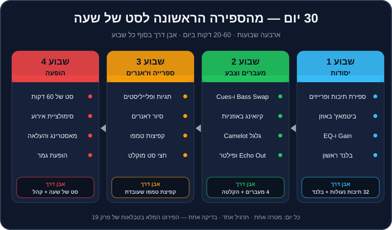

# תוכנית 30 יום

קראתם פרקים, הבנתם עקרונות, אולי אפילו ניסיתם כמה מעברים. עכשיו מגיע החלק שמפריד בין מי ש"יודע איך עושים" לבין מי ש**עושה**: תרגול קבוע. DJing היא מיומנות של ידיים ואוזניים, והן לומדות מחזרות — לא מקריאה.

התוכנית הזו לוקחת את כל המדריך והופכת אותו לחודש אחד מובנה. כל יום יש מטרה אחת, תרגיל אחד, קבצים מדויקים מהרפו, ומבחן קטן שאומר לכם אם הצלחתם. בסוף החודש — סט של שעה, מוקלט, ונגינה ראשונה מול אנשים.

## מה תלמדו בפרק

- איך לתרגל נכון: קצר, ממוקד, כל יום.
- תוכנית של 30 ימים, עם קבצים ובדיקה לכל יום.
- אבני דרך שבועיות.
- רשימת הערכה עצמית לסוף החודש.

## לפני שמתחילים

### איך לתרגל נכון

1. **כל יום, גם אם קצר.** 25 דקות כל יום עדיפות על 3 שעות פעם בשבוע. המוח מקבע מיומנויות בזמן השינה בין האימונים.
2. **מטרה אחת לאימון.** לא "לנגן קצת" — אלא "20 החלפות באס על ה-1".
3. **חימום של 5 דקות** — ביטמאץ' של שני לופי תופים (`practice-03`), לפני כל אימון.
4. **מדדו.** כל יום יש "בדיקה". רשמו ביומן: הצלחתי / חלקית / לא, ומשפט אחד.
5. **ווליום שפוי ופלאגים** (ראו [פרק 17](17-ear-health-performance.md)).
6. **פספסתם יום?** לא נורא. ממשיכים מהיום שבו עצרתם — לא "משלימים" שני ימים ביחד.
7. **יום שלא הצליח?** חזרו עליו מחר. התוכנית היא 30 אימונים, לא בהכרח 30 ימים ברצף.

> 💡 טיפ: אם אתם עובדים עם Claude Code ברפו, אפשר פשוט לשאול "מה התרגיל של היום?" — הסקיל `practice-coach` נותן תרגיל לפי ההתקדמות שלכם ורושם אימונים בתיקייה `progress/`. ואחרי אימון: "סיימתי 30 דקות של Bass Swap, היה קשה" — והוא יתאים את ההמשך.

### מקרא קבצים

- **`practice-NN`** — קובצי תרגול בתיקייה `music/practice/` (למשל `music/practice/practice-03-drums-124.mp3`).
- **`transition-NN`** — דמואים של מעברים בתיקייה `music/transitions/`.
- **`house-05`, `techno-08`, `mainstream-15`…** — טראקים בתיקייה `music/tracks/<ז'אנר>/` (למשל `music/tracks/tech_house/house-05-groove-machine.mp3`). כל הנתונים של כל טראק — בקובץ ה-`.json` שלידו.

## שבוע 1 — יסודות: אוזן, תוכנה, קצב

| יום | מטרה | תרגיל | קבצים | זמן | בדיקה |
|---|---|---|---|---|---|
| 1 | ספרייה מוכנה | ייבוא DJ Lab ל-Rekordbox, ניתוח, הוספת עמודות BPM, Key (במצב `Alphanumeric`) ו-Comments ([פרקים 2](02-rekordbox-basics.md), [9](09-library-prep.md)) | `music/rekordbox/`, `music/tracks/` | 40 | רואים את כל הטראקים עם BPM, קוד Camelot ו-Hot Cues A-H |
| 2 | לספור תיבות ופרייזים | ספירה בקול 1-2-3-4, סימון תיבה 1 של כל פרייז ([פרק 3](03-music-structure.md)) | `practice-01` | 20 | בעיניים עצומות, מנחשים מתי יבוא הקראש הבא — 4 מתוך 5 |
| 3 | להבין מבנה טראק | מעבר על כל ה-Hot Cues וה-`sections` בקובץ ה-JSON; לזהות אינטרו, ברייקדאון, דרופ, אאוטרו | `house-05` | 30 | מצביעים על כל קטע **לפני** שהוא מתחיל |
| 4 | ביטמאץ' באוזן 1 | אותו לופ בשני דקים, `Sync` כבוי, תיקון עם ה-Jog וה-Tempo ([פרק 4](04-bpm-beatmatching.md)) | `practice-03` | 30 | 32 תיבות בלי "דהרה" |
| 5 | ביטמאץ' באוזן 2 | להביא 120 ל-128 ולהפך; טמפו "עקום" 125.5 מול 124 | `practice-02`, `practice-04`, `practice-06`, `practice-03` | 40 | התאמה תוך 30 שניות, 3 פעמים ברצף |
| 6 | Gain ו-EQ | אימון אוזן לתחומי תדר; כיוון Trim לפי המטרים ([פרק 5](05-mixer-gain-eq.md)) | `practice-14` | 30 | 8 מתוך 10 ניחושים נכונים; אף ערוץ לא באדום |
| 7 | הבלנד הראשון | האזנה ל-`transition-01` ושחזור שלו ([פרק 6](06-first-transitions.md)) | `transition-01`, `house-01`, `house-02` | 45 | מעבר שלם בלי רגע של "שני באסים" |

**🏁 אבן דרך שבוע 1:** ביטמאץ' באוזן שמחזיק 32 תיבות, ובלנד ארוך אחד נקי ומוקלט (גם בטלפון זה בסדר).

## שבוע 2 — מעברים, קיואינג, הרמוניה ואפקטים

| יום | מטרה | תרגיל | קבצים | זמן | בדיקה |
|---|---|---|---|---|---|
| 8 | Bass Swap | 20 החלפות באס על ה-1, ואז שחזור `transition-02` | `practice-08`, `practice-09`, `house-05`, `house-06` | 40 | 20 החלפות בלי "חור" ובלי "כפול" |
| 9 | Hot Cues ולופים | ציד Hot Cues בתיבות 1, 17, 33, 49, 65; לופ של 4 תיבות ויציאה ממנו על ה-1 ([פרק 7](07-hot-cues-loops.md)) | `practice-13` | 30 | 5 Hot Cues מדויקים לגריד |
| 10 | קיואינג | ביטמאץ' באוזניות בלבד, עם Cue/Master Mix ([פרק 8](08-headphones-cueing.md)) | `practice-07`, `practice-03` | 30 | המעבר נשמע נכון ברמקולים כבר ברגע שמעלים את הפיידר |
| 11 | לשמוע הרמוניה | 8A+9A מול 8A+3A, בעיניים עצומות ([פרק 10](10-harmonic-mixing.md)) | `practice-10`, `practice-11`, `practice-12` | 30 | מזהים "התנגשות" 8 מתוך 10 |
| 12 | מהלכים בגלגל | ‎+1: house-05 → house-08 · ‎+2: techno-08 → techno-05 · A↔B: mainstream-04 → mainstream-03 | הטראקים שבתרגיל | 45 | שלושה מעברים מוקלטים, ובכל אחד אתם יודעים להגיד איזה מהלך זה |
| 13 | אפקטים 1 | סיור Beat FX; Echo Out בין שני לופים בטמפו שונה ([פרק 11](11-effects.md)) | `practice-03`, `practice-04` | 40 | Echo Out נוחת על ה-1 — 10 פעמים |
| 14 | אפקטים 2 + הקלטה | שחזור מעבר פילטר ו-Loop Roll; הקלטת מיקס של 10 דקות ([פרק 16](16-recording-sharing.md)) | `transition-03`, `transition-06`, `techno-05`, `techno-08`, `techno-02`, `techno-03` | 60 | הקלטה של 10 דקות בלי אדום במטרים |

**🏁 אבן דרך שבוע 2:** ארבעה סוגי מעברים (בלנד, Bass Swap, Echo Out, פילטר), הבנה של גלגל Camelot, והקלטה ראשונה שאתם מקשיבים לה עד הסוף.

## שבוע 3 — ספרייה, ז'אנרים, טמפו וסט

| יום | מטרה | תרגיל | קבצים | זמן | בדיקה |
|---|---|---|---|---|---|
| 15 | ספרייה של DJ | `My Tag` לתפקיד ולאנרגיה, פלייליסטים "חימום / בנייה / שיא / סגירה", `Intelligent Playlist` אחד ([פרק 12](12-set-building.md)) | `music/tracklist.plan.json` | 40 | 4 פלייליסטים מוכנים, כל טראק מתויג |
| 16 | משפחת ההאוס | house-12 → house-01 (A↔B); house-04 → house-11 (ליירים); house-07 → house-06 → house-05 → house-08 (‎+1 שלוש פעמים) ([פרק 13](13-genre-bible.md)) | הטראקים שבתרגיל | 45 | כל מעבר בסגנון ה"אופייני" של הז'אנר |
| 17 | משפחת הטכנו | techno-08 → techno-05 → techno-06 → techno-07 (כניסה בברייקדאון); techno-10 מתחת ל-techno-09, 64 תיבות | הטראקים שבתרגיל | 45 | ליירים של 64 תיבות בלי "בוץ" בנמוכים |
| 18 | מיינסטרים ו-Open Format | mainstream-09 → mainstream-08 (קאט); mainstream-13 → mainstream-14 (`transition-09`); mainstream-01 → mainstream-02 (`transition-05`) | הטראקים שבתרגיל | 45 | קאטים על ה-1, בלי שנייה של שקט |
| 19 | קפיצת טמפו | שחזור `transition-08`; ואז מ-`practice-15` אל mainstream-15 ([פרק 15](15-tempo-genre-switching.md)) | `transition-08`, `mainstream-08`, `mainstream-15`, `practice-15` | 40 | מ-95 ל-124 בלי "בור" — 3 פעמים ברצף |
| 20 | סולם ז'אנרים וחצי טמפו | 6 המדרגות מ-mainstream-08 עד house-03; mainstream-06 ↔ breadth-07 | הטראקים שבתרגיל | 45 | 6 מדרגות מוקלטות; טראפ ודאבסטפ "נעולים" |
| 21 | הסט, חלק א' | טראקים 1-8 של הסט לדוגמה, עם הוראות המעבר ([פרק 12](12-set-building.md)) | פלייליסט "DJ Lab — 60 Min Journey" | 60 | 32 דקות מוקלטות בלי עצירה |

**🏁 אבן דרך שבוע 3:** ספרייה מאורגנת לפי תפקיד ואנרגיה, מעבר טמפו גדול שעובד, וחצי סט מוקלט.

## שבוע 4 — הופעה

| יום | מטרה | תרגיל | קבצים | זמן | בדיקה |
|---|---|---|---|---|---|
| 22 | הסט, חלק ב' | טראקים 8-15, כולל רמפות הטמפו וה-Echo Out של הסגירה | אותו פלייליסט | 60 | 32 דקות מוקלטות בלי עצירה |
| 23 | ריצה מלאה | הסט כולו, 60 דקות, מוקלט — כמו הופעה: בלי לעצור, בלי להתחיל מחדש | אותו פלייליסט | 60 | שעה שלמה, רציפה |
| 24 | ביקורת ותיקון | האזנה להקלטה של אתמול; בחירת 3 המעברים החלשים ותרגול של כל אחד 5 פעמים | ההקלטה שלכם | 45 | 3 המעברים נשמעים טוב יותר בהקלטה חוזרת |
| 25 | סימולציית אירוע | "סבב ראשון" של 15 דקות בסגנון Open Format, עם הכרזה ו"שבירת כוס" ([פרק 14](14-events-weddings.md)) | `house-02`, `mainstream-13` עד `mainstream-16` | 45 | מעבר "שבירת כוס" בפחות משנייה; הכרזה ברורה |
| 26 | מאסטרינג והעלאה | חיתוך, פייד, נרמול, לימיטר, Tracklist; העלאה פרטית ([פרק 16](16-recording-sharing.md)) | ההקלטה של יום 23 | 45 | קובץ MP3 של 320 עם Tracklist, מועלה כפרטי |
| 27 | קריאת קהל | חבר/ה מרימים "כרטיסי קהל" (משועממים / בשיא / יוצאים לבר); אתם בוחרים דלת למעלה/ישר/למטה | כל הספרייה | 40 | תגובה נכונה ל-5 כרטיסים ברצף |
| 28 | תקלות ואוזניים | תרגיל תקלה מפתיע; 20 דקות סט עם פלאגים ([פרק 17](17-ear-health-performance.md)) | כל הספרייה | 30 | מוזיקה חוזרת תוך 10 שניות |
| 29 | פרומו | ביוגרפיה של 150 מילה, רילס של 30 שניות ממעבר (CC0!), טיוטת EPK ([פרק 18](18-career-gigs.md)) | ההקלטות שלכם | 45 | חבר קורא את הביו ומתאר אתכם במשפט — והוא צודק |
| 30 | הופעת גמר | 45-60 דקות מול חברים או משפחה (או בשידור חי), מוקלט; מילוי רשימת ההערכה העצמית | הכול | 60 | סיימתם סט מול אנשים. 🎉 |

**🏁 אבן דרך שבוע 4:** סט שלם של שעה, מוקלט ומאוסטר, והופעה ראשונה מול קהל — גם אם הקהל הוא שלושה חברים בסלון.

## רשימת הערכה עצמית

בסוף החודש, סמנו כל שורה: ✅ בטוח · 🟡 לפעמים · ❌ עדיין לא. כל ❌ ו-🟡 הוא האימון של החודש הבא.

### טכני

- [ ] מתאים טמפו באוזן, בלי Sync, תוך 30 שניות.
- [ ] שומר על ביטמאץ' 32 תיבות ומתקן "דהרה" עם ה-Jog.
- [ ] סופר פרייזים ונכנס עם טראק חדש על ה-1 של פרייז.
- [ ] מבצע Bass Swap בלי רגע של שני באסים או אף באס.
- [ ] משתמש ב-Hot Cues ובלופים בלי להסתכל יותר מדי על המסך.
- [ ] שומר על מטרים מחוץ לאדום לאורך סט שלם.
- [ ] מבצע Echo Out שנוחת בדיוק על ה-1.

### מוזיקלי

- [ ] קורא גלגל Camelot ויודע מה המהלכים הבטוחים מכל סולם.
- [ ] שומע התנגשות סולמות ויודע לחלץ ממנה.
- [ ] מזהה את רוב 24 הז'אנרים ויודע בערך את טווח ה-BPM שלהם.
- [ ] עובר בין טמפואים רחוקים (מ-95 ל-124) בלי "בור".
- [ ] בונה סט עם עקומת אנרגיה בגלים — חימום, בנייה, שיא, סגירה.
- [ ] יודע בכל רגע שלוש "דלתות" לשיר הבא.

### הופעה ומקצוע

- [ ] מקליט, מאזין, ומוצא 3 דברים לשפר.
- [ ] מנגן עם פלאגים, וווליום המוניטור והאוזניות סביר.
- [ ] מחזיר מוזיקה לרחבה תוך 10 שניות מתקלה.
- [ ] מרים את הראש מהמסך לפחות חצי מהזמן.
- [ ] יודע מה עושים בכל שלב של ערב חתונה.
- [ ] יש לי מיקס של 30-60 דקות שאני גאה לשלוח.
- [ ] יש לי ביוגרפיה קצרה וטיוטת EPK.

> 💡 טיפ: שמרו את הרשימה הזו, ומלאו אותה שוב בעוד חודש. לראות ❌ שהפכו ל-✅ זה אחד הרגעים הכי מספקים בדרך.

## ומה אחרי 30 הימים?

- **חזרו על התוכנית** עם הספרייה שלכם (מהארגזים ב-`crates/` ומקניות חוקיות) במקום הטראקים של הרפו.
- **סט חדש כל שבועיים** — בכל פעם ז'אנר או אירוע אחר: חימום לבר, סט טכנו, סבב ים-תיכוני.
- **הופעה קטנה כל חודש** — מסיבה של חברים, Open Decks, שידור חי.
- **חזרו לפרקים** שבהם הרגשתם הכי פחות בטוחים. עכשיו הם ייקראו אחרת.

## סיכום

- תרגול קבוע, קצר וממוקד — עם מטרה ובדיקה לכל אימון.
- שבוע 1: אוזן וקצב. שבוע 2: מעברים, הרמוניה ואפקטים. שבוע 3: ספרייה, ז'אנרים, טמפו וסט. שבוע 4: הופעה.
- בסוף החודש — סט של שעה מוקלט, והופעה ראשונה.
- רשימת ההערכה העצמית היא תוכנית האימונים של החודש הבא.

זה הפרק האחרון של המדריך — אבל לא הסוף. נתקלתם במונח לא מוכר? הוא מחכה לכם ב[מילון המונחים](glossary.md). משהו לא עובד? ב[שאלות הנפוצות](faq.md) יש פתרונות לתקלות הכי נפוצות. ובהצלחה בהופעה הראשונה! 🎧
